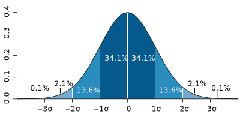

```{r code-brewing-opts, echo=FALSE}
knitr::opts_chunk$set(
  comment = "R>", 
  warning = FALSE, 
  message = FALSE,
  fig.asp = NULL, # control via width/height
  fig.align = "center",
  fig.retina = 2,
  dpi = 300
)

ggplot2::theme_set(
  ggplot2::theme_grey(base_size = 8)
)
```

{fig-align="center" width="300"}

```{r code-repro-seed, echo=FALSE}
# Reproducibility seed for stochastic examples in this chapter
set.seed(74402)
```

> *"I think it is much more interesting to live with uncertainty than to live with answers that might be wrong."*
>
> - --- Richard Feynman

```{r code-knitr-opts-chunk-set, echo=FALSE}
library(tidyverse)
library(ggpubr)
```

::: {.callout-note appearance="simple"}
## In This Chapter

-   Data summaries
-   Measures of central tendency
-   Measures of dispersal
-   Descriptive statistics by group
:::

::: {.callout-important appearance="simple"}
## Tasks to Complete in This Chapter

* Task E
:::

# Introduction

Exploratory data analysis (EDA) establishes what kind of data we actually have before we test hypotheses or fit models. It tells us how many observations we have, what variables were measured, how much variation is present, whether missing values or outliers need attention, and whether the data contain obvious grouping structure. Poor summaries at this stage usually lead to poor inference later.

In this chapter, I introduce the numerical summaries used at the start of that process. I focus on measures of centre, measures of spread, and a small set of tools for inspecting the structure of a dataset. These summaries work alongside the figures in [Chapter 3](03-visualise.qmd) and the treatment of distributions and uncertainty in [Chapter 4](04-distributions-sampling-uncertainty.qmd).

# Key Concepts

The ideas that organise the rest of the chapter are:

- **EDA:** The first analytical pass through a dataset. Its job is to reveal structure, variation, missingness, and potential problems before formal inference begins.
- **Centre and spread:** Most numerical summaries describe either where the data cluster or how widely they vary. They form part of summary (descriptive) statistics.
- **Distribution:** The shape of a distribution determines which summaries describe it well. Symmetric data and skewed data are not best summarised in the same way, and they will be analysed using different tests or models.
- **Grouped summaries:** Biological datasets often contain treatments, species, sites, or times. Summaries by group may reveal structure hidden in pooled data.

# Foundational Definitions

A few definitions that recur throughout the module are presented next.

## Variables and Parameters

A **parameter** is a fixed but usually unknown quantity that describes a population or probability distribution. Examples include the true population mean, variance, or regression slope. A **variable** is the measured characteristic itself: body mass, bill length, temperature, salinity, presence or absence, and so on. We observe variables in a sample and use them to estimate parameters.

## Samples and Populations

The **population** is the full set of units about which we want to make a claim: all trees in a forest, all quadrats in a marsh, all fish in an estuary, or all patients in a trial. A **sample** is the subset we actually measure. Because we rarely have access to the whole population, we rely on a **random** sample to estimate population-level quantities. The question is therefore whether the sample is informative about the population we care about. As sample size increases, and as the sample better represents the population, the sample mean becomes a more stable estimate of the population mean (@fig-simul).

```{r fig-simul}
#| echo: false
#| fig-cap: "Drawing increasingly larger sample sizes from a population with a true mean of 13 and an SD of 1."
#| fig-width: 5.5
#| fig-height: 4

set.seed(666)

# pre-allocate the tibble
normal_takes_shape <- tibble(number_draws = c(), draws = c())

# simulate increasingly larger samples
for (i in c(2, 5, 10, 50, 100, 500, 1000, 10000, 100000)) {
  draws_i <-
    tibble(
      number_draws = c(rep.int(
        x = paste(as.integer(i), " draws"),
        times = i
      )),
      draws = c(rnorm(
        n = i,
        mean = 13,
        sd = 1
      ))
    )

  normal_takes_shape <- rbind(normal_takes_shape, draws_i)
  rm(draws_i)
}

normal_takes_shape |>
  mutate(number_draws = as_factor(number_draws)) |>
  ggplot(aes(x = draws)) +
  geom_density(colour = "indianred3") +
  theme_grey() +
  facet_wrap(
    vars(number_draws),
    scales = "free_y"
  ) +
  labs(
    x = "Mean",
    y = "Density"
  )
```

## When Is Something Random?

In statistics, **random** means that outcomes cannot be predicted exactly in advance, even when the process generating them is understood. Random sampling and random assignment use this idea to reduce bias and to justify probability-based inference.

The term **stochastic** is closely related but usually refers to a process rather than to a single outcome. Population growth under fluctuating weather, disease transmission, and dispersal all have deterministic components, but they also include variation that is modelled probabilistically. In practice, both terms point us to the same issue: biological systems often contain uncertainty that must be described rather than ignored.

# Descriptive Statistics

Now to the summaries used most often in EDA. These summaries answer three basic questions: where is the centre of the data, how much do the values vary, and which summaries remain sensible when the data are skewed or contain outliers.

## The Core Equations

The sample mean is:

$$\bar{x} = \frac{1}{n}\sum_{i=1}^{n}x_{i} = \frac{x_{1} + x_{2} + \cdots + x_{n}}{n}$$ {#eq-mean}

In @eq-mean, $x_{1}, x_{2}, \ldots, x_{n}$ are the observations and $n$ is the sample size. The mean is therefore the total of the observations divided by the number of observations.

The sample variance is:

$$S^{2} = \frac{1}{n-1}\sum_{i=1}^{n}(x_{i}-\bar{x})^{2}$$ {#eq-var}

Equation @eq-var measures the average squared deviation from the sample mean. The divisor is $n - 1$ rather than $n$ because we are estimating population variance from a sample.

The sample standard deviation is the square root of the variance:

$$S = \sqrt{S^{2}}$$ {#eq-sd}

The standard deviation is usually easier to interpret than the variance because it is expressed on the original measurement scale of the data.

For robust summaries, the interquartile range is:

$$\text{IQR} = Q_{3} - Q_{1}$$ {#eq-iqr}

In @eq-iqr, $Q_{1}$ is the first quartile and $Q_{3}$ is the third quartile, so the IQR measures the spread of the middle 50% of the data.

## Measures of Central Tendency

| Statistic | Function     | Package   |
|:----------|:-------------|:----------|
| Mean      | `mean()`     | **base**  |
| Median    | `median()`   | **base**  |
| Mode      | **Do it!**   |           |
| Skewness  | `skewness()` | **e1071** |
| Kurtosis  | `kurtosis()` | **e1071** |

Measures of central tendency describe where the data cluster. The mean and standard deviation work well when the data are roughly symmetric and not dominated by extreme values. The median and IQR are usually better when the data are skewed or contain outliers.

Before discussing each statistic, I will generate several simple datasets with different shapes. These give us a controlled way to compare the summaries.

```{r code-set-seed}
# Generate random data from a normal distribution
set.seed(666)
n <- 5000 # Number of data points
mean <- 0
sd <- 1
normal_data <- rnorm(n, mean, sd)

# Generate random data from a slightly
# right-skewed beta distribution
alpha <- 2
beta <- 5
right_skewed_data <- rbeta(n, alpha, beta)

# Generate random data from a slightly
# left-skewed beta distribution
alpha <- 5
beta <- 2
left_skewed_data <- rbeta(n, alpha, beta)

# Generate random data with a bimodal distribution
mean1 <- 0
mean2 <- 10
sd1 <- 3
sd2 <- 4

# Generate data from two normal distributions
data1 <- rnorm(n, mean1, sd1)
data2 <- rnorm(n, mean2, sd2)

# Combine the data from both distributions to
# create a bimodal distribution
bimodal_data <- c(data1, data2)
```

```{r fig-histos}
#| fig-cap: "Generated normal, right-skewed, left-skewed, and bimodal distributions, shown in panels A-D, with the mean and median indicated in each panel."
#| fig-width: 5.5
#| fig-height: 4

make_hist_plot <- function(x, title, fill_col) {
  stat_lines <- tibble(
    statistic = c("Mean", "Median"),
    xint = c(mean(x), median(x))
  )

  ggplot(tibble(value = x), aes(x = value)) +
    geom_histogram(bins = 30, fill = fill_col, colour = "black", linewidth = 0.3) +
    geom_vline(
      data = stat_lines,
      aes(xintercept = xint, colour = statistic, linetype = statistic),
      linewidth = 0.5,
      show.legend = TRUE
    ) +
    scale_colour_manual(values = c("Mean" = "red", "Median" = "blue")) +
    scale_linetype_manual(values = c("Mean" = "solid", "Median" = "dashed")) +
    labs(
      title = title,
      x = "Value",
      y = "Frequency"
    ) +
    theme_grey() +
    theme(
      legend.position = "bottom",
      plot.title = element_text(size = 9)
    )
}

plt_normal <- make_hist_plot(normal_data, "Normal Distribution", "grey80")
plt_right <- make_hist_plot(right_skewed_data, "Right-Skewed Distribution", "grey80")
plt_left  <- make_hist_plot(left_skewed_data, "Left-Skewed Distribution", "grey80")
plt_bimodal <- make_hist_plot(bimodal_data, "Bimodal Distribution", "grey80")

ggpubr::ggarrange(
  plt_normal, plt_right, plt_left, plt_bimodal,
  ncol = 2, nrow = 2,
  labels = c("A", "B", "C", "D"),
  common.legend = TRUE,
  legend = "bottom"
)
```

### The Sample Mean

The mean is the arithmetic average of the data. As shown in @eq-mean, it is calculated by summing the observations and dividing by the sample size.

We calculate it with `mean()`:

```{r code-round-mean-normal-data}
round(mean(normal_data), 3)
```

::: callout-important
## Do It Now!
How would you manually calculate the mean value for the `normal_data`?
:::

```{r code-round-sum-normal-data-length}
#| eval: false
#| echo: false
round(sum(normal_data) / length(normal_data), 3)
```

The mean uses all observed values, which makes it informative but also sensitive to skew and outliers. That sensitivity does not make it invalid for non-normal data, but it does make it a poor summary when a few extreme values dominate the result.

In panel A of @fig-histos, the normal distribution is centred cleanly around its mean. In panels B and C, tail asymmetry pulls the mean away from the bulk of the data.

### The Median

The median is the middle value after the data have been ordered. With an odd number of observations, it is the single central value. With an even number, it is the mean of the two central values.

The median divides the ordered data into two equal halves. In a symmetric distribution it will often be close to the mean. In skewed data it usually gives a more stable description of the centre because extreme values have little influence on it.

That contrast is visible in panels B and C of @fig-histos where the median sits closer to the main cluster of values than the mean does.

We calculate the median with `median()`:

```{r code-round-median-normal-data}
round(median(normal_data), 3)
```

It is easier to see the calculation on a small dataset:

```{r code-small-normal-data-round-rnorm}
set.seed(123) # for reproducibility
small_normal_data <- round(rnorm(11, 13, 3), 1)
sort(small_normal_data)
median(small_normal_data)
```

:::{.callout-note appearance="simple"}
## What Is the Relationship Between the Median and Quantiles?
The median is the 50th percentile, or second quartile ($Q_{2}$). More generally, quantiles divide the ordered data into specified proportions. Quartiles split them into four parts, deciles into ten, and percentiles into one hundred.
:::

### The Mode

The mode is the most frequent value or values in a dataset. It is useful for categorical data and for identifying whether a distribution is unimodal, bimodal, or multimodal. For continuous numerical data, exact repeated values are often less informative, so the mode is usually assessed visually from a histogram or density plot rather than calculated directly.

Panel D of @fig-histos shows why visual inspection is useful here: one mean can be calculated, but the figure shows two clear peaks.

Base R does not provide a standard `mode()` function for this purpose. In practice, visual inspection is often the more useful route.

### Skewness

Skewness describes asymmetry in a distribution. A symmetric distribution has skewness close to zero. Positive skewness means the right tail is longer; negative skewness means the left tail is longer.

Skewness is often easiest to understand by comparing the mean and median. In a right-skewed distribution the mean is usually greater than the median. In a left-skewed distribution the mean is usually smaller.

You can see both patterns in @fig-histos, where panel B has a longer right tail, and panel C has a longer left tail.

```{r code-library-e1071}
library(e1071)
# Positive skewness
skewness(right_skewed_data)

# Is the mean larger than the median?
mean(right_skewed_data) > median(right_skewed_data)

# Negative skewness
skewness(left_skewed_data)

# Is the mean less than the median?
mean(left_skewed_data) < median(left_skewed_data)
```

### Kurtosis

Kurtosis describes tail heaviness relative to a normal distribution. A normal distribution has close to zero kurtosis (called mesokurtic). Negative kurtosis indicates data with a thin-tailed (platykurtic) distribution and positive kurtosis indicates a fat-tailed distribution (leptokurtic).

```{r code-kurtosis-normal-data}
kurtosis(normal_data)
kurtosis(right_skewed_data)
kurtosis(left_skewed_data)
```

Skewness and kurtosis can be informative, but they do not replace visual inspection or later assumption checks. They give a first numerical impression of distribution shape.

## Measures of Variance or Dispersion Around the Centre

| Statistic            | Function     |
|:---------------------|:-------------|
| Variance             | `var()`      |
| Standard deviation   | `sd()`       |
| Minimum              | `min()`      |
| Maximum              | `max()`      |
| Range                | `range()`    |
| Quantile             | `quantile()` |
| Inter Quartile Range | `IQR()`      |

Measures of dispersion describe how widely the values are spread. Two samples can have the same mean but very different biological interpretations if one is tightly clustered and the other highly variable.

### Variance and Standard Deviation

Variance and standard deviation are measures of dispersion. The sample variance is given in @eq-var, and the standard deviation in @eq-sd. We can calculate them with `var()` and `sd()`:

```{r code-var-normal-data}
var(normal_data)
sd(normal_data)
```

::: callout-important
## Do It Now!
Manually calculate the variance and SD for the `normal_data`. Make sure your answer is the same as those reported above.
:::

The standard deviation is easier to interpret than the variance because it is measured on the same scale as the data. If temperature is measured in degrees Celsius, the standard deviation is also measured in degrees Celsius.

For roughly normal data, the 68-95-99.7 rule gives a useful approximation: about 68% of observations lie within 1 SD of the mean, about 95% within 2 SD, and about 99.7% within 3 SD (@fig-expectednormal).

::: {.column-margin}
{#fig-expectednormal}
:::

Like the mean, the standard deviation is sensitive to extreme values. For skewed data or data with strong outliers, the IQR is often more informative.

### The Minimum, Maximum, and Range

`min()`, `max()`, and `range()` give the extremes of the data:

```{r code-min-normal-data}
min(normal_data)
max(normal_data)
range(normal_data)
```

`range()` returns the minimum and maximum as a pair. If we want the numerical width of the range, we subtract the minimum from the maximum:

```{r code-range-normal-data-range-normal-data}
range(normal_data)[2] - range(normal_data)[1]
```

These are simple summaries, but they are often the first place to look for impossible values, obvious outliers, or coding errors.

### Quartiles and the Interquartile Range

Quartiles divide the ordered data into quarters. The first quartile ($Q_{1}$) marks the point below which 25% of the data fall, the second quartile ($Q_{2}$) is the median, and the third quartile ($Q_{3}$) marks the point below which 75% fall.

The IQR measures the spread of the middle 50% of the data. Because it ignores the tails, it is much less sensitive to outliers than the standard deviation. It is often the better description of spread for skewed data.

We obtain quartiles with `quantile()`:

```{r code-quantile-normal-data-p}
# Look at the normal data
quantile(normal_data, p = 0.25)
quantile(normal_data, p = 0.75)

# Look at skewed data
quantile(left_skewed_data, p = 0.25)
quantile(left_skewed_data, p = 0.75)
```

We calculate the IQR with `IQR()`:

```{r code-iqr-normal-data}
IQR(normal_data)
```

The choice between mean and SD on the one hand, and median and IQR on the other, depends on the data. Symmetric distributions are often well described by the first pair. Skewed distributions or data with strong extremes are usually better described by the second.

The contrast among panels A-D in @fig-histos shows why that choice depends on the distribution rather than on habit.

# The Palmer Penguin Dataset

The [Palmer penguin dataset](https://apreshill.github.io/palmerpenguins-useR-2022/#/title-slide) in the **palmerpenguins** package is a widely used teaching dataset for data exploration, visualisation, and modelling. It contains measurements from three penguin species in the Palmer Archipelago: Adélie, Chinstrap, and Gentoo.

The variables include bill length (`bill_length_mm`), bill depth (`bill_depth_mm`), flipper length (`flipper_length_mm`), body mass (`body_mass_g`), species, island, and sex. The dataset is rich enough to illustrate grouping structure, missingness, and both numerical and categorical variables without being unnecessarily large.

Let us start by loading the data:

```{r code-library-palmerpenguins}
library(palmerpenguins)
```

# Exploring the Data Structure

Now we go from statistical definitions to implementation. These functions answer three practical questions: what variables exist, how large the dataset is, and whether the data contain missing values or unexpected structure.

## Inspecting Type and Layout

Several functions give a quick overview of the dataset itself rather than of the values inside it:

| Purpose                   | Function      |
|:--------------------------|:--------------|
| The class of the dataset  | `class()`     |
| The head of the dataframe | `head()`      |
| The tail of the dataframe | `tail()`      |
| Printing the data         | `print()`     |
| Glimpse the data          | `glimpse()`   |
| Show number of rows       | `nrow()`      |
| Show number of columns    | `ncol()`      |
| The column names          | `colnames()`  |
| The row names             | `row.names()` |
| The dimensions            | `dim()`       |
| The dimension names       | `dimnames()`  |
| The data structure        | `str()`       |

First, check the class of the object. The `penguins` dataset is a tibble, which is the tidyverse version of a data frame:

```{r code-class-penguins}
class(penguins)
```

We can convert between tibbles and data frames with `as.data.frame()` and `as_tibble()`:

```{r code-penguins-df-as-data-frame}
penguins_df <- as.data.frame(penguins)
class(penguins_df)
```

```{r code-penguins-tbl-as-tibble-penguins-df}
penguins_tbl <- as_tibble(penguins_df)
class(penguins_tbl)
```

The print methods differ. Data frames print more bluntly; tibbles are more compact and readable:

```{r code-print-penguins-df-i-limit}
print(penguins_df[1:5,])
print(penguins_tbl)
```

`glimpse()` gives similar information in a horizontal layout:

```{r code-glimpse-penguins}
glimpse(penguins)
```

## Inspecting Size and Names

Use `nrow()`, `ncol()`, and `dim()` to check dataset size:

```{r code-nrow-penguins}
nrow(penguins)
ncol(penguins)
dim(penguins)
```

Use `colnames()` to inspect variable names:

```{r code-colnames-penguins}
colnames(penguins)
```

Tibbles do not use row names in the same way as traditional data frames, but `row.names()` and `dimnames()` are still worth recognising:

::: callout-important
## Do It Now!
Explain the output of `dimnames()` when applied to the `penguins` dataset.
:::

## Previewing the Data

`head()` and `tail()` let us inspect the first and last rows:

```{r code-head-penguins}
head(penguins)
tail(penguins, n = 3)
```

You can wrap them in `print()` if you want more control over display:

```{r code-print-head-penguins}
print(head(penguins))
print(tail(penguins, n = 3))
```

`str()` is often the most compact first inspection because it shows object type, variable classes, and a preview of values:

```{r code-str-penguins}
str(penguins)
```

::: callout-important
## Do It Now!
Explain the output of `str()` when applied to the `penguins` dataset.
:::

# Data Summaries

Once we understand the structure of the dataset, we summarise the values it contains. The tools in this section automate the numerical descriptions introduced above.

Use them for slightly different purposes:

- `summary()` for a quick overview of variable types and basic summaries.
- `skim()` for a broader inspection that includes missingness and type-specific summaries.
- `describe()` for more detailed descriptive statistics on numerical variables.
- `descriptives()` and `dfSummary()` when you want more elaborate tabular output.

| Purpose                        | Function          | Package          |
|:-------------------------------|:------------------|:-----------------|
| Summary of the data properties | `summary()`       | **base**         |
|                                | `describe()`      | **psych**        |
|                                | `skim()`          | **skimr**        |
|                                | `descriptives()`  | **jmv**          |
|                                | `dfSummary()`     | **summarytools** |

## `summary()`

`summary()` is the standard quick overview in base R. For data frames and tibbles, it reports variable classes and a small set of numerical summaries:

```{r code-summary-penguins}
summary(penguins)
```

## `psych::describe()`

`psych::describe()` provides a more detailed numerical summary:

```{r code-psych-describe-penguins}
psych::describe(penguins)
```

## `skimr::skim()`

`skim()` adds type-specific summaries and a clearer account of missingness:

```{r code-library-skimr}
library(skimr)
skim(penguins)
```

## `jmv::descriptives()`

`descriptives()` from **jmv** gives another formatted summary view:

```{r code-library-jmv}
library(jmv)
descriptives(penguins, freq = TRUE)
```

## `summarytools::dfSummary()`

`dfSummary()` from **summarytools** produces a richer tabular report:

```{r code-library-summarytools}
library(summarytools)
print(dfSummary(penguins, 
                varnumbers   = FALSE, 
                valid.col    = FALSE, 
                graph.magnif = 0.76),
      method = "render")
```

No single tool is best in every situation. The important point is to know what each one is for and to use it deliberately rather than mechanically.


<!-- include the equation -->

<!-- ### Correlation

The correlation coefficient of two matched (paired) variables is equal to their covariance divided by the product of their individual standard deviations. It is a normalised measurement of how linearly related the two variables are.
-->

<!-- include example here -->

# Descriptive Statistics by Group

Whole-dataset summaries are only a starting point. Biological data are often structured by species, treatment, site, sex, season, or year, and those groupings are often more informative than the overall mean. Once we acknowledge that structure, the descriptive question changes from "What is the average?" to "Average for whom, under what condition, and with what spread?"

The `ChickWeight` data make the point clearly. A single mean across all chicks, all diets, and all sampling days hides the fact that the birds were measured repeatedly and assigned to different diets. It is much more informative to summarise weight within diet groups and at specific time points, for example at the start and end of the experiment. That lets us compare means with standard deviations, medians with interquartile ranges, and then relate those numerical summaries to figures that make the group differences visible.

An analysis of the `ChickWeights` dataset that recognises the effect of diet and time (start and end of experiment) might reveal something like this:

```{r code-grp-stat-chickweight}
#| echo: false
grp_stat <- ChickWeight |> 
  filter(Time %in% c(0, 21)) |> 
  group_by(Diet, Time) |> 
  summarise(mean_wt = round(mean(weight, na.rm = TRUE), 1),
            sd_wt = round(sd(weight, na.rm = TRUE), 1),
            min_wt = min(weight),
            qrt1_wt = quantile(weight, p = 0.25),
            med_wt = median(weight),
            qrt3_wt = quantile(weight, p = 0.75),
            max_wt = max(weight),
            n_wt = n(),
            .groups = "drop") |> 
  as_tibble()
  
print(grp_stat)
```

We typically report the measure of central tendency together with the associated variation. So, in a table we would want to include the mean ± SD. For example, this table is almost ready for including in a publication:

```{r tbl-library-knitr}
#| echo: false
#| tbl-cap: "Mean ± SD for the `ChickWeight` dataset as a function of Diet and Time."

grp_stat2 <- grp_stat |> 
  mutate(Diet = as.numeric(Diet)) |> 
  select(Diet, Time, mean_wt, sd_wt) |> 
  unite(mean_wt, sd_wt, col = `Mean ± SD`, sep = " ± ") |> 
  as_tibble()

grp_stat2 |> 
  gt::gt() |>
  gt::cols_label(
    Diet = "Diet",
    Time = "Time",
    `Mean ± SD` = "Mean ± SD"
  )
```


Further, we want to supplement this EDA with some figures that visually show the effects. Here I show a few options for displaying the effects in different ways: @fig-chicks shows the spread of the raw data, the mean, median or as well as the appropriate accompanying indicators of variation around the mean or median. I will say much more about using figures in EDA in [Chapter 3](../basic_stats/03-visualise.qmd).

```{r fig-chicks}
#| echo: false
#| fig-cap: "The figures represent A) a scatterplot of the mean and raw chicken mass values; B) a bar graph of the chicken mass values, showing whiskers indicating 1 ±SD; C) a box and whisker plot of the chicken mass data; and D) chicken mass as a function of both `Diet` and `Time` (10 and 21 days)."
#| fig-width: 5.5
#| fig-height: 4

library(ggpubr) # needed for arranging multi-panel plots
plt1 <- ChickWeight %>%
  filter(Time == 21) %>% 
  ggplot(aes(x = Diet, y = weight)) +
  geom_jitter(width = 0.05) + # geom_point() if jitter not required
  geom_point(data = filter(grp_stat, Time == 21), aes(x = Diet, y = mean_wt),
             col = "black", fill = "red", shape = 23, size = 3) +
  labs(y = "Mass (g)")

plt2 <- ggplot(data = filter(grp_stat, Time == 21), aes(x = Diet, y = mean_wt)) +
  geom_bar(position = position_dodge(), stat = "identity", 
           col = NA, fill = "salmon") +
  geom_errorbar(aes(ymin = mean_wt - sd_wt, ymax = mean_wt + sd_wt),
                width = .2) +
  labs(y = "Mass (g)")
# position_dodge() places bars side-by-side
# stat = "identity" prevents the default count from being plotted

# a description of the components of a boxplot is provided in the help file
# geom_boxplot()
plt3 <- ChickWeight %>%
  filter(Time == 21) %>% 
  ggplot(aes(x = Diet, y = weight)) +
  geom_boxplot(fill = "salmon") +
  geom_jitter(width = 0.05, fill = "white", col = "blue", shape = 21) +
  labs(y = "Mass (g)")

plt4 <- ChickWeight %>%
  filter(Time %in% c(10, 21)) %>% 
  ggplot(aes(x = Diet, y = weight, fill = as.factor(Time))) +
  geom_boxplot() +
  geom_jitter(shape = 21, width = 0.1) +
  labs(y = "Mass (g)", fill = "Time")

ggarrange(plt1, plt2, plt3, plt4, ncol = 2, nrow = 2, labels = "AUTO")
```

# Reporting

We want to communicate our EDA in a report or publication. Here is how we would typically do it:

::: {.callout-note appearance="simple"}
## Write-Up

**Methods**

Chicken body mass was summarised descriptively by diet group at the start of the experiment (`Time = 0`) and again at day 21. Group means, standard deviations, and sample sizes were calculated, and complementary figures were used to visualise the spread of raw observations within each diet.

**Results**

At the start of the experiment, mean body mass was similar across diets (about 41 g in all four groups). By day 21, mean mass had increased in every diet group, but the increase differed among diets: Diet 3 had the highest mean final mass (270.3 ± 71.6 g SD, `n = 10`), followed by Diet 4 (238.6 ± 43.3 g, `n = 9`), Diet 2 (214.7 ± 78.1 g, `n = 10`), and Diet 1 (177.8 ± 58.7 g, `n = 16`). The grouped summaries and figures therefore suggest a strong diet-related difference in final body mass, with Diet 3 producing the heaviest chicks in this descriptive comparison.

**Discussion**

This is still a descriptive result rather than a formal inferential test, but it shows what grouped summaries reveal. Once the data are split by diet and time, biologically important differences become visible that would be hidden in a single overall mean.
:::
