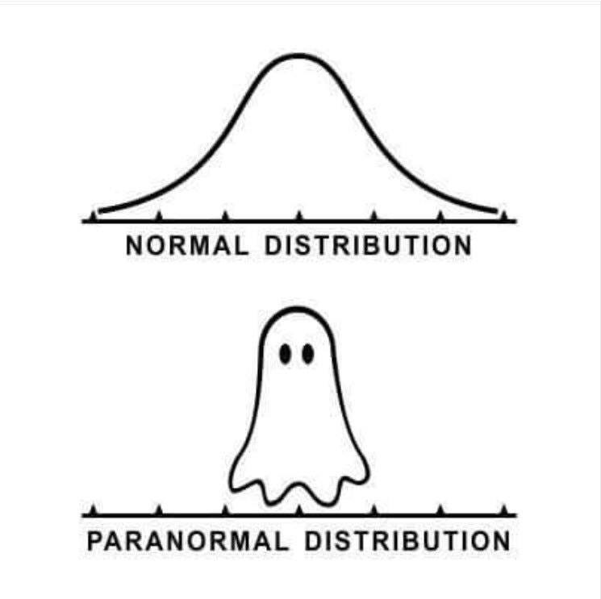

```{r code-brewing-opts}
#| echo: false

knitr::opts_chunk$set(
  comment = "R>",
  warning = FALSE,
  message = FALSE,
  fig.width = 6.5,
  fig.height = 4.5,
  out.width = "88%",
  fig.asp = NULL,
  fig.align = "center",
  fig.retina = 2,
  dpi = 300
)

ggplot2::theme_set(
  ggplot2::theme_grey(base_size = 8)
)
```

```{r code-libraries}
#| echo: false

library(tidyverse)
library(car)
library(ggpubr)
```

::: {.callout-note appearance="simple"}
## In This Chapter

-   Why assumptions matter
-   Normality, homoscedasticity, and independence
-   Graphical and formal assumption checks
-   Non-parametric options when assumptions fail
-   Common data transformations
-   Why transformed data must also be checked
:::

::: {.callout-important appearance="simple"}
## Tasks to Complete in This Chapter

-   None
:::

{fig-align="center" width="600"}

# Introduction

Parametric statistical tests such as *t*-tests, ANOVAs, regressions, and correlations are built on some assumptions about the nature of our data. In life, however, sometimes things get messy, and the assumptions go unmet. In this chapter we look in more detail at testing the assumptions and what to do when the assumptions are violated.

The first challenge involves assessing whether our data satisfy the necessary assumptions preceding the main inferential statistical procedure. The second challenge can be more tricky, depending on the chosen solution. Suppose the data fail to meet one or more of the necessary assumptions: we now have to decide on the next course of action. First prize is to select a suitable non-parametric alternative to the inferential statistical method required to test our hypotheses. Non-parametric tests do not require assumptions about the underlying population distribution and are often a robust alternative. However, if a suitable non-parametric alternative is not available, the only feasible way forward may be to apply some form of data transformation to the original dataset to force the data to meet the necessary assumptions, thus permitting us to use a parametric statistical test.

Because assumptions and transformations are inseparable in practice, this chapter treats them together.

# Key Concepts

-   **Parametric assumptions** are the conditions under which familiar methods such as *t*-tests, ANOVA, correlation, and linear regression are intended to work well.
-   **Normality** concerns whether the residuals or sample values are plausibly drawn from a normal distribution.
-   **Homoscedasticity** means that the variance is similar across groups or along the range of fitted values.
-   **Independence** is usually a design issue and cannot be rescued statistically after the fact.
-   **Graphical diagnostics** are usually more informative than a single assumption test.
-   **Formal tests** support, but do not replace, visual inspection and biological judgement.
-   **Transformations** can improve symmetry, stabilise variance, or linearise relationships, but they are not a universal fix.

# Nature of the Data and Assumptions

The parametric statistical tests that we are frequently required to perform demand that our data fulfil a few important assumptions that are not guaranteed to hold. These assumptions are frequently violated because real-world data, particularly biological data, are typically complex and often contain measurement error or other sources of variability.

Across the methods covered in the surrounding chapters, we usually need to ensure that:

-   the data are approximately **normally distributed**, meaning that the sample or residuals follow a Gaussian distribution;
-   the data are **homoscedastic**, *i.e.* the variance is similar across all levels of the independent variable;
-   the dependent variable is **continuous**, where the method requires it;
-   the observations are **independent** of each other;
-   and, in regression settings, the functional form is appropriate for the relationship being modelled.

I view the last two points as expectations more than assumptions, because these aspects of our data are largely under our control. No amount of transformation can make data independent or continuous if the study design did not produce them that way in the first place.

::: {.callout-note appearance="simple"}
## *i.i.d.*

Sometimes we see the term *i.i.d.*, which stands for "independent and identically distributed". It is a general way of stating the assumptions, particularly those involving independence and a common underlying probability structure.

**Independent** means that the occurrence of one event does not affect the occurrence of any other event in the sample.

**Identically distributed** means that each observation is drawn from the same underlying probability distribution, so the statistical properties of the observations are the same.
:::

# How to Check Assumptions

Assumptions should be checked using both:

-   **graphs**, such as histograms, Q-Q plots, and residual plots, and
-   **formal tests**, such as Shapiro-Wilk, Levene's test, or other variance tests.

Graphical assessment is often more informative than a single *p*-value, especially in large datasets where trivial deviations can appear statistically significant. The correct sequence is therefore:

1. look at the data;
2. fit the model or identify the samples being compared;
3. inspect assumptions graphically;
4. use formal tests to support, not replace, your judgement.

# Worked Example Setup

To illustrate the assumption checks, let us generate two samples of normally distributed data:

```{r fig-assump-histo}
#| fig-cap: "Histograms showing two randomly generated normal distributions."

set.seed(666)
r_dat <- data.frame(
  dat = c(
    rnorm(n = 1000, mean = 5.53, sd = 0.3),
    rnorm(n = 1000, mean = 0.325, sd = 0.1)
  ),
  sample = c(rep("Giraffes", 1000), rep("Chickens", 1000))
)

ggplot(data = r_dat, aes(x = dat, fill = sample)) +
  geom_histogram(
    position = "dodge",
    binwidth = 0.05,
    alpha = 0.8,
    aes(colour = sample, fill = sample)
  ) +
  labs(x = "Height (m)") +
  theme_grey()
```

Remember from [Chapter 4](04-distributions-sampling-uncertainty.qmd) what a normal distribution looks like. Histograms give a first visual impression, but they are not enough on their own. We should always visualise our data before performing any statistics on them, and then support that visual judgement with formal tests.

# Tests for Normality

::: {.callout-note}
## Hypothesis for Normality

$H_{0}$: The distribution of our data is not different from normal.
:::

The **Shapiro-Wilk** test is frequently used to assess the normality of a dataset. It is known to have good power and accuracy for detecting departures from normality, even for small sample sizes, and it is robust to many common departures from ideal data.

It tests the *H*~0~ that the population from which the sample, $x_{1},..., x_{n}$, was drawn is not significantly different from normal. The test does so by sorting the data from lowest to highest, and a test statistic, $W$, is calculated based on the deviations of the observed values from the expected values under a normal distribution, as shown in @eq-shapiro:

$$W = \frac{(\sum_{i=1}^n a_i x_{(i)})^2}{\sum_{i=1}^n (x_i - \overline{x})^2}$$ {#eq-shapiro}

Here, $W$ represents the Shapiro-Wilk test statistic, $a_i$ are coefficients that depend on the sample size and distribution of the data, $x_{(i)}$ is the $i$-th order statistic, and $\overline{x}$ is the sample mean.

The Shapiro-Wilk test is available within base R as `shapiro.test()`. If the *p*-value is above 0.05, we may assume the data to be approximately normally distributed.

## Apply the Test

If we run the Shapiro-Wilk test on all observations simultaneously, we get a misleading result because we have combined two different samples:

```{r code-shapiro-bad}
shapiro.test(r_dat$dat)
```

To perform the test correctly, we need to respect the grouping structure and apply the test within each sample:

```{r code-shapiro-good}
r_dat |>
  group_by(sample) |>
  summarise(norm_dat = as.numeric(shapiro.test(dat)[2]))
```

Now we see that our two sample sets are indeed normally distributed.

## Other Tests for Normality

Several other tests are available to test whether our data are consistent with a normal distribution:

-   **Kolmogorov-Smirnov test** compares the empirical distribution of a sample with a hypothesised distribution. In R use `ks.test()`.
-   **Anderson-Darling test** is another goodness-of-fit approach, available as `ad.test()` in packages such as **nortest** and **kSamples**.
-   **Lilliefors test** is a modification of the Kolmogorov-Smirnov test for small samples. See `lillie.test()` or `LillieTest()`.
-   **Jarque-Bera test** is based on skewness and kurtosis. See `jarque.bera.test()` in **DescTools** or **tseries**.
-   **Cramer-Von Mises test** assesses the goodness of fit of a distribution to a sample of data. See `cvm.test()` in **goftest**.

Take your pick, but do your homework. These tests are not all equally robust to the various surprises data can throw at them.

# Tests for Homogeneity of Variance

Besides requiring that our data are normally distributed, many familiar tests also assume that they are **homoscedastic**. This means that the variance of the samples we are comparing should not be dramatically different. In practical terms, a useful first rule of thumb is that the variance of one group should not be more than about two to four times larger than that of another.

In R, we can compare sample variances directly:

```{r code-r-dat-var}
r_dat |>
  group_by(sample) |>
  summarise(sample_var = var(dat))
```

Above we see that the variance of our two samples is heteroscedastic because one variance is more than two to four times greater than the other. There are, however, formal tests for equality of variances.

::: {.callout-note}
## Hypotheses for Equality of Variances

The two-sided and one-sided formulations are:

$$H_{0}: \sigma^{2}_{A} = \sigma^{2}_{B}$$
$$H_{a}: \sigma^{2}_{A} \ne \sigma^{2}_{B}$$

$$H_{0}: \sigma^{2}_{A} \le \sigma^{2}_{B}$$
$$H_{a}: \sigma^{2}_{A} > \sigma^{2}_{B}$$

$$H_{0}: \sigma^{2}_{A} \ge \sigma^{2}_{B}$$
$$H_{a}: \sigma^{2}_{A} < \sigma^{2}_{B}$$

where $\sigma^{2}_{A}$ and $\sigma^{2}_{B}$ are the variances for samples $A$ and $B$, respectively.
:::

The most commonly used test for equality of variances is **Levene's test**, `car::leveneTest()`. Levene's test assesses the equality of variances between two or more groups in a dataset. The *H*~0~ is that the variances of the groups are equal.

In Levene's test, the absolute deviations of the observations from their group centres are calculated, and the test statistic is computed as in @eq-levene:

$$W = \frac{(N-k)}{(k-1)} \cdot \frac{\sum_{i=1}^k n_i (\bar{z}_i - \bar{z})^2}{\sum_{i=1}^k \sum_{j=1}^{n_i} (z_{ij} - \bar{z}_i)^2}$$ {#eq-levene}

where $W$ represents the Levene test statistic, $N$ is the total sample size, $k$ is the number of groups being compared, $n_i$ is the sample size of the $i$-th group, $z_{ij}$ is the $j$-th observation in the $i$-th group, $\bar{z}_i$ is the mean or median-based group centre, and $\bar{z}$ is the overall mean of the transformed deviations.

Levene's test is considered robust to non-normality and outliers, making it a useful tool for analysing data that do not meet the assumptions of normality.

## Apply the Test

```{r code-levene}
car::leveneTest(dat ~ sample, data = r_dat)
```

Above, we see that *p* < 0.05, causing us to reject the null hypothesis of equal variances.

## Other Tests for Homogeneity

Several other statistical tests are available to assess homogeneity of variances:

-   **F-test** or variance ratio test. Use `var.test()`. It assumes normality and is designed for comparing two populations.
-   **Bartlett's test** assesses equality of variances across multiple groups and assumes normality. Use `bartlett.test()`.
-   **Brown-Forsythe test** is a modification of Levene's test based on medians. See `bf.test()` in **onewaytests**.
-   **Fligner-Killeen test** is a robust non-parametric test available in base R as `fligner.test()`.

As always, supplement the formal tests with diagnostic plots and with simple comparison of the observed variances.

## Reporting Assumption Checks

::: {.callout-note appearance="simple"}
## Marine Biology Write-Up

**Methods**

> Approximate normality was assessed graphically and with the Shapiro-Wilk test, and equality of variances among groups was assessed with Levene's test before formal inference.

**Results**

> The grouped example data were broadly consistent with normality when the samples were assessed separately, but the variance differed substantially between groups. The assumption checks therefore showed that the data were not uniformly problematic: normality was acceptable, whereas homogeneity of variance required more caution in later model choice.

**Discussion**

> In a journal article, assumption checks are reported to justify the inferential method used. Their role is to show that the chosen analysis was defensible, or that an alternative was required where assumptions were not met.
:::

# Independence

Independence is different from normality and homoscedasticity because it is usually determined by design. If repeated measurements are taken on the same individual, or if samples are nested within a site, tank, plot, or transect, then the observations are not independent. No transformation will fix this.

This is why independence should be considered before data collection, not only after analysis. If the design creates dependence, then the solution is usually a different model, such as a paired test, repeated-measures analysis, mixed model, or other structure that acknowledges the dependence.

# Epic Fail... Now What?

Tests for assumptions fail often with real data. Once we have evaluated our data against the critical assumptions and discovered that one or more are not met, we are usually presented with two options:

1. choose an appropriate **non-parametric test**, or
2. apply a **transformation** and then re-check the assumptions.

It is preferable to avoid transformation when a more suitable statistical method is available.

::: {.callout-note appearance="simple"}
## Parametric and Non-parametric Tests

**Parametric tests** assume that the data follow a specific distribution, such as the normal distribution, and that the population parameters are known or can be estimated from the sample data.

**Non-parametric tests** make fewer assumptions about the underlying distribution of the data and are used when the data do not meet the assumptions of parametric tests.

In general, parametric tests are more powerful than non-parametric tests when the assumptions are met, but non-parametric tests are more robust and can be used in a wider range of situations.
:::

The non-parametric substitutes for the parametric tests we often use are discussed in [Chapter 10](10-test-selection.qmd). Transformations are the other major response, and we consider them in the rest of this chapter.

# Why Transform Data?

Data transformation is used to change the scale of the data in a way that makes it conform more closely to the assumptions of normality and homoscedasticity so that we can proceed with parametric tests in the usual way. Transformations can be used to:

-   change the shape of the distribution,
-   reduce the effects of extreme values,
-   stabilise the variance,
-   and sometimes linearise a relationship.

When transforming data, one does a mathematical operation on the observations and then uses these transformed numbers in the statistical tests. After the analysis, quantities such as means and confidence intervals should be back-transformed to the original scale before being reported. Note that in back-transformed data the uncertainty is not necessarily symmetrical, so one cannot simply compute one limit and assume the other is equally far from the mean.

> “Torture numbers and they will confess to anything” — Gregg Easterbrook

When transforming data, it is a good idea to know a bit about how data within your field of study are usually transformed and to use the same approach in your own work. Do not try all the various transformations until you find one that works, otherwise it may seem as if you are massaging the data into an acceptable outcome.

# Common Transformations

## Log Transformation

Log transformation is often applied to positively skewed data. It consists of taking the log of each observation. You can use either base-10 logs, `log10(x)`, or natural logs, `log(x)`. It makes no difference for the statistical test whether you use base-10 logs or natural logs, because they differ only by a constant factor.

The back-transformation is to raise 10 or $e$ to the power of the transformed number. If you have zeros or negative numbers, you cannot take the log directly; you must add a constant first, for example `log10(x + 1)`. If you have count data and some counts are zero, the common convention is to add 0.5 to each number.

Many variables in biology have log-normal distributions, meaning that after log transformation the values are normally distributed. This often happens when several independent multiplicative processes combine to determine the final value.

## Square-root Transformation

The square-root transformation, `sqrt(x)`, is often used to stabilise the variance of data that have a non-linear relationship between mean and variance. It is effective for reducing right-skewness and is frequently useful for count or frequency data.

The square-root transformation does not work with negative values, but one could add a constant first to make them positive.

## Arcsine Transformation

Arcsine transformation is commonly used for proportions, which range from 0 to 1, or percentages that can be scaled to that range. Specifically, it has historically been used when the data follow a binomial distribution and have extreme proportions close to 0 or 1.

This transformation involves taking the arcsine of the square root of a number:

$$y' = \arcsin(\sqrt{y})$$ {#eq-arcsine}

The back-transformation is:

$$y = \sin(y')^2$$ {#eq-arcsine-back}

The numbers to be arcsine transformed must be in the range 0 to 1.

## Reciprocal Transformation

The reciprocal transformation, `1/x`, is another variance-stabilising transformation and is used with severely positively skewed data. It can be effective, but it often makes the scale difficult to interpret biologically.

## Square and Cube Transformations

Square and cube transformations are sometimes used for negatively skewed data:

-   square transformation: $y' = y^2$
-   cube transformation: $y' = y^3$

These transformations magnify differences among larger values and can make outliers more influential, so they should be used with caution.

## Anscombe Transformation

Another variance-stabilising transformation is the Anscombe transformation:

$$y' = \sqrt{\max(x + 1) - x}$$ {#eq-anscombe}

It is applied to negatively skewed data and can be useful when dealing with count or frequency data that have a non-linear relationship between mean and variance.

# Worked Example with Transformations

Suppose we have strongly right-skewed count-like data:

```{r fig-transform-demo}
#| fig-cap: "A simulated example showing how a log transformation can reduce right-skewness."

set.seed(123)
skew_dat <- tibble(
  raw = rgamma(300, shape = 1.5, scale = 6),
  log10_dat = log10(raw + 1)
)

ggarrange(
  ggplot(skew_dat, aes(raw)) +
    geom_histogram(bins = 25, fill = "grey70", colour = "grey30") +
    labs(x = "Raw data", y = "Frequency") +
    theme_grey(),
  ggplot(skew_dat, aes(log10_dat)) +
    geom_histogram(bins = 25, fill = "grey70", colour = "grey30") +
    labs(x = "log10(x + 1)", y = "Frequency") +
    theme_grey(),
  ncol = 2
)
```

The transformed data are not automatically guaranteed to be suitable, but the log transformation reduces the long right tail and makes the distribution more symmetric. The key point is that transformations are diagnostic tools for improving the match between data and model, not magical procedures that guarantee success.

## Reporting

::: {.callout-note appearance="simple"}
## Marine Biology Write-Up

**Methods**

> Because the response variable was strongly right-skewed, a log-transformation was applied before further modelling. Histograms of the raw and transformed values were compared to assess whether the transformation improved distributional symmetry and reduced the influence of extreme observations.

**Results**

> The raw data showed marked right-skewness, whereas the log-transformed values were more symmetric and more compatible with the assumptions of ordinary parametric modelling. The transformation reduced the dominance of the long right tail and improved the overall match between the observed distribution and a Gaussian-style analytical framework.

**Discussion**

> Transformations should not be presented as cosmetic manipulation. In a journal-style account, the important point is that the transformation was motivated by the structure of the data and that the transformed scale provided a more defensible basis for inference than the raw scale.
:::

# Transformations and Regression

Regression models do not necessarily require data transformations to deal with heteroscedasticity. Generalised linear models can be used with a variety of variance and error structures via suitable link functions. Likewise, the linearity requirement applies specifically to linear regression. Some degree of curvature can be accommodated by polynomial regression or additive models, and more complex departures from linearity can be handled by nonlinear models or GAMs.

So, transforming our data is not the only response to curved relationships or non-constant variance. Quite often, the better solution is using a model that matches the biological process more directly.

# Check the Assumptions Again

The assumptions of the transformed data *must* be checked again after applying a transformation. The transformed data may still not meet the assumptions, so applying tests for normality, homoscedasticity, and independence remains necessary before proceeding with formal inference.

A a common mistake is that analysts transform the data and then assume that the problem is solved. It may be, but it often is not.

# When Transformation Is Not the Right Solution

Transformation is not the right solution when:

-   the response is fundamentally a count, proportion, presence-absence variable, or survival time with its own natural error structure;
-   the observations are not independent;
-   the biological interpretation becomes less clear than the original problem;
-   a more appropriate model is already available.

In those cases it is usually better to choose a method that matches the data structure, such as a non-parametric test, a GLM, a mixed model, or another extension.

# Summary

1. Assumption checking is part of the analysis, not an optional afterthought.
2. Use graphs first, then formal tests to support your judgement.
3. Independence is usually a design issue and cannot be repaired by transformation.
4. When assumptions fail, first ask whether a different model is more appropriate.
5. If you transform data, do so for a defensible biological reason and then check the assumptions again.
