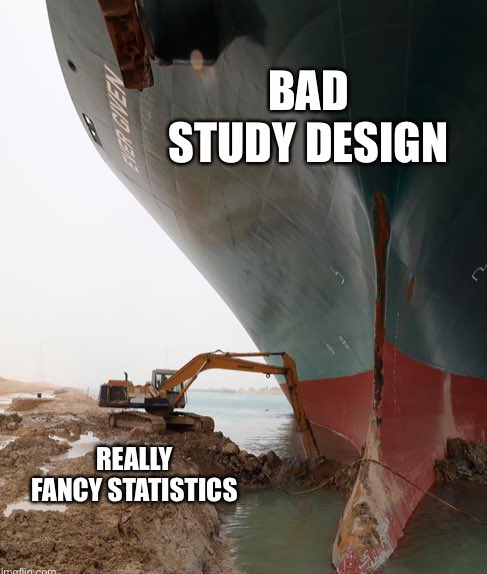

```{r code-brewing-opts, echo=FALSE}
knitr::opts_chunk$set(
  comment = "R>", 
  warning = FALSE, 
  message = FALSE,
  fig.asp = NULL, # control via width/height
  fig.align = "center",
  fig.retina = 2,
  dpi = 300
)

ggplot2::theme_set(
  ggplot2::theme_grey(base_size = 8)
)
```

{fig-align="center" width="250"}

> *"He uses statistics as a drunken man uses lamp posts --- for support rather than for illumination."*
>
> --- Marissa Mayer

```{r code-knitr-opts-chunk-set, echo=FALSE}
library(tidyverse)
library(ggpubr)
library(ggthemes)
library(gt)
```

::: {.callout-note appearance="simple"}
## In This Chapter

-   Single factor ANOVA
-   Multiple factor ANOVA
-   Tukey HSD test
-   Wilcoxon rank sum test
-   Kruskal-Wallis rank sum test
:::

::: {.callout-note appearance="simple"}
## Cheatsheet
Find here a [Cheatsheet](../../docs/Methods_cheatsheet_v1.pdf) on statistical methods.
:::

::: {.callout-important appearance="simple"}
## Tasks to Complete in This Chapter

-   Task G
:::

# Introduction

In [Chapter 7](07-t_tests.qmd) we compared the means of one sample, two independent groups, and paired measurements. The natural next question is this: what do we do when we want to compare the means of **more than two groups**? The answer is not to run many separate *t*-tests. The answer is **analysis of variance**, or **ANOVA**.[^1]

ANOVA extends the same inferential logic you have already learned. We still ask whether observed differences among group means are large relative to the variation within groups. What changes is the scale of the question. Instead of asking whether two means differ, we ask whether at least one mean among several groups differs from the others.

This chapter therefore follows directly from the *t*-test chapter. It begins with the reason we should not perform many pairwise *t*-tests, introduces the assumptions and functions used for ANOVA, works through a one-way example, and then extends the discussion to factorial ANOVA and the main non-parametric alternatives.

[^1]: Variations of the basic ANOVA include an analysis of covariance (ANCOVA) when, in addition to the categorical variable, your data also contains a **continuous covariate** (*e.g.*, age, mass) that you want to control. Or, if your study involves multiple dependent variables, you may need to consider using **multivariate analysis of variance (MANOVA)** instead. ANOVAs that have multiple independent variables are called **factorial ANOVAs** (*e.g.* 2-way ANOVA, 3-way ANOVA).

# Key Concepts

These points separate the core ANOVA ideas from the practical sections that follow.

-   **ANOVA (Analysis of Variance):** A statistical test used to compare the means of three or more groups to determine if at least one group mean differs from the others.
-   **One-way versus factorial ANOVA:** One-way ANOVA analyzes one categorical independent variable (factor), while factorial ANOVA analyzes two or more factors and their interactions.
-   **Problem of multiple comparisons:** Repeatedly using *t*-tests on many pairs of groups inflates the probability of a Type I error. ANOVA avoids this by testing all groups simultaneously.
-   **Post-hoc tests (Tukey HSD):** After a significant ANOVA result, a post-hoc test is needed to identify exactly which group means differ.
-   **Non-parametric alternative (Kruskal-Wallis):** If the assumptions for ANOVA are not met, the Kruskal-Wallis test is a common rank-based alternative.

# Nature of the Data and Assumptions

As with the *t*-test, ANOVAs have expectations on the nature of the response variables and assumptions stemming from the study design. 

-   **Continuous dependent variable** The dependent variable should be measured on a *continuous scale* (*e.g.*, height, weight, test scores).

-   **Categorical independent variable** The independent variable should be *categorical with at least three levels* or groups (*e.g.*, different treatments, age groups).

    - **Independent groups** The groups being compared should be independent of each other, meaning that the observations within each group should not affect the other group's observations. In the case of repeated measures ANOVA, the groups are related (*e.g.*, before-and-after measurements, multiple measurements on the same subjects).

Other assumptions to be aware of with regards to the dependent variable:

-   Independence of data
-   Normally distributed data
-   Homogeneity of variances
-   We also encourage that the data are balanced

# R Functions

The main functions used in this chapter are:

-   `aov()` for classical ANOVA;
-   `summary()` to inspect the ANOVA table;
-   `TukeyHSD()` for post-hoc pairwise comparisons;
-   `oneway.test()` for Welch's ANOVA when variances differ;
-   `kruskal.test()` for the Kruskal-Wallis rank-sum test.

# The Core Equation

ANOVA is built on a simple decomposition of variation. Suppose there are $k$ groups, $Y_{ij}$ is the $j$-th observation in group $i$, $\bar{Y}_i$ is the mean of group $i$, and $\bar{Y}$ is the overall grand mean.

$$SS_{\text{total}} = SS_{\text{among}} + SS_{\text{within}}$$ {#eq-anova-ss}

Equation @eq-anova-ss states that the total variation in the response can be split into variation among the group means and variation among observations within groups.

The total sum of squares is:

$$SS_{\text{total}} = \sum_{i=1}^{k}\sum_{j=1}^{n_i}(Y_{ij} - \bar{Y})^2$$ {#eq-anova-sstotal}

This measures how far all observations lie from the grand mean. The among-groups sum of squares is:

$$SS_{\text{among}} = \sum_{i=1}^{k} n_i(\bar{Y}_i - \bar{Y})^2$$ {#eq-anova-ssamong}

This measures how far the group means lie from the grand mean, weighted by group size. The within-groups sum of squares is:

$$SS_{\text{within}} = \sum_{i=1}^{k}\sum_{j=1}^{n_i}(Y_{ij} - \bar{Y}_i)^2$$ {#eq-anova-sswithin}

This measures how much variation remains among observations after the group means have been taken into account.

ANOVA then converts sums of squares to mean squares by dividing by their degrees of freedom:

$$MS_{\text{among}} = \frac{SS_{\text{among}}}{k - 1}, \qquad MS_{\text{within}} = \frac{SS_{\text{within}}}{N - k}$$ {#eq-anova-ms}

Here $N$ is the total sample size across all groups. The mean squares are therefore variance estimates: one based on differences among the group means, and one based on residual variation within groups.

ANOVA finally compares these two sources of variation through the *F*-ratio:

$$F = \frac{MS_{\text{among}}}{MS_{\text{within}}}$$ {#eq-anova-f}

When the null hypothesis is true and the assumptions are reasonably met, the ratio in @eq-anova-f follows an *F* distribution. Large values therefore indicate that the group means differ more than we would expect from within-group variation alone.

# Why ANOVA Follows from the *t*-Test

Whole big books have been written about analysis of variance (ANOVA). Although there are many experimental designs that may be analysed with ANOVAs, biologists are taught to pay special attention to the design of experiments, and generally make sure that the experiments are fully *factorial* (in the case of two-way, higher ANOVAs) and balanced. For this reason we will focus in this introductory statistics module on one-way and factorial ANOVAs only.

::: {.callout-note appearance="simple"}
## Factorial Designs
A factorial experimental design involves studying the effects of two or more factors (also known as independent variables) on a response variable (dependent variable) simultaneously. The term 'factorial' comes from the fact that each level of one factor is combined with each level of the other factor(s), resulting in all possible combinations of factor levels.

In a factorial design, the *main effects* of each factor, the *interaction effects* between factors can be analysed. When we have two factors and this is typically done by applying a 2-way ANOVA, but higher-order ANOVAs are also available. The main effect of a factor is its individual effect on the response variable (ignoring the effect due to the other(s)), while the interaction effect occurs when the effect of one factor depends on the level of another factor. 

The simplest factorial design is the 2 $\times$ 2 design, which involves two factors, each with two levels. For example, if you are studying the effect of temperature (high vs. low), fertiliser concentration (high vs. low) on the yield of a crop and a 2 $\times$ 2 factorial design would involve four experimental conditions:

* high temperature and high fertiliser concentration
* high temperature and low fertiliser concentration
* low temperature and high fertiliser concentration
* low temperature and low fertiliser concentration

In the above example there are 4 possible combinations. Factorial designs can involve more than two factors and/or more than two levels per factor, leading to more complex experimental setups. For example, in a 3 $\times$ 4 there will be 12 combinations of the two factor levels, and in a 2 $\times$ 3 $\times$ 5 factorial experiment the three factors with their respective levels will result in 30 combinations.     
:::

As we have seen in [Chapter 7](07-t_tests.qmd) about *t*-tests, ANOVAs also require that some assumptions are met:

-   **Normal distribution** The data in each group should follow a normal distribution or be approximately normally distributed. If the assumption of normality is not met, as, for example, determined with the `shapiro.test()`, you may consider using a non-parametric alternative such as Kruskal-Wallis rank sum test, `kruskal.test()`. This assumption can be relaxed for large sample sizes due to the central limit theorem discussed in [Chapter 4](04-distributions-sampling-uncertainty.qmd).

-   **Homoscedasticity** The variances of the groups should be approximately equal. This assumption can be tested using Levene's test, `car::leveneTest()`, or Bartlett's test, `bartlett.test()`. When the variances are different but the data are normally distributed, consider the 'Welch ANOVA,' `oneway.test()`, instead of `aov()`.

-   **Random sampling** The data should be obtained through random sampling or random assignment, ensuring that each observation has an equal chance of being included in the sample.

-   **Independent observations** The observations within each group should be independent of each other.

If some of the above assumptions are violated, then your module of action is to either use a [non-parametric test](#sec-alt) (and [here](../../docs/Methods_cheatsheet_v1.pdf)), transform the data (as in [Chapter 6](06-assumptions-and-transformations.qmd)), use a generalised linear model if non-normal or use a linear mixed model when non-independence of data cannot be guaranteed. As I have already indicated, ANOVAs are also sensitive to the presence of outliers, so we need to ensure that outliers are not present. Outliers can be removed but if they are an important feature of the data, then a non-parametric test can be used.

Rather than talking about *t*-tests and ANOVAs as if they do different things, let us acknowledge that they ask a similar question. That question being, "are the means of these two, more things we want to compare different or are they the same?" At this stage it is important to note that, as with *t*-tests, the independent variable is expected to be categorical (*i.e.* a factor denoting two, more different treatments or sampling conditions) and that the dependent variable must be continuous. You may perhaps be more familiar with this question when it is presented as a set of hypotheses as we saw in a *t*-test:

$$H_{0}: \mu_A = \mu_B$$
$$H_{a}: \mu_A \ne \mu_B$$

In an ANOVA, hypotheses will be more similar to these:

$$H_{0}: \mu_A = \mu_B = \mu_C$$
$$H_{a}: \text{not all group means are equal}$$

This is a scientific question in the simplest sense. Often, for basic inquiries such as that posed above, we need to see if one group differs significantly from another. The way in which we accomplish this is by looking at the mean variation among groups relative to the variation within groups. Formally, ANOVA does this through the decomposition in @eq-anova-ss and the *F*-ratio in @eq-anova-f.

## Remember the *t*-test

As you already know, a *t*-test is used when we want to compare two different sample sets against one another. This is also known as a two-factor, two level test. When one wants to compare multiple (more than two) sample sets against one another an ANOVA is required (I will get there shortly). Remember how to perform a *t*-test in R: we will revisit this test using the`chicks` data, but only for Diets 1, 2 from day 21.

```{r code-chicks-as-tibble-chickweight}
# First grab the data
chicks <- as_tibble(ChickWeight)

# Then subset out only the sample sets to be compared
chicks_sub <- chicks %>% 
  filter(Diet %in% c(1, 2), Time == 21)
```

Once we have filtered our data we may now perform the *t*-test. 

```{r code-t-test-weight-diet}
t.test(weight ~ Diet, data = chicks_sub)
```

As one may recall from [Chapter 7](07-t_tests.qmd), whenever we want to give a formula to a function in R, we use the `~`. The formula used above, `weight ~ Diet`, reads in plain English as "weight as a function of diet". This is perhaps easier to understand as "*Y* as a function of *X*." This means that we are assuming whatever is to the left of the `~` is the dependent variable, and whatever is to the right is the independent variable. Did the Diet 1, 2 produce significantly fatter birds?

One could also supplement the output by producing a graph (@fig-boxwhisker1).

```{r fig-boxwhisker1}
#| fig-cap: "Box-and-whisker plot showing the differences in means between chicks reared to 21 days old and fed Diets 1 and 2"

library(ggstatsplot)

## since the confidence intervals for the effect sizes are computed using
## bootstrapping, important to set a seed for reproducibility
set.seed(13)

## parametric t-test and box plot
ggbetweenstats(
  data = chicks_sub,
  x = Diet,
  y = weight,
  xlab = "Diet",
  ylab = "Chick mass (g)",
  plot.type = "box",
  p.adjust.method = "bonferroni",
  pairwise.display = "ns",
  type = "p",
  results.subtitle = FALSE,
  conf.level = 0.95,
  title = "t-test",
  ggtheme = ggthemes::theme_fivethirtyeight(),
  package = "basetheme",
  palette = "ink"
)
```

Notice above that we did not need to specify to use a *t*-test. The `ggbetweenstats()` function automatically determines if an independent samples *t*-test or a 1-way ANOVA is required based on whether there are two groups or three or more groups within the grouping (factor) variable.

That was a nice revision. But applied to the `chicks` data it seemed a bit silly, because you may ask, "What if I wanted to know if there are differences among the means computed at Day 1, Day 6, Day 10, and Day 21?" We should not use *t*-tests to do this (although we can). So now we can move on to the ANOVA.

:::: {.callout-important}
## Task G.1: Do It Now!
- Why should we not just apply *t*-tests once per each of the pairs of comparisons we want to make?
::::

## Why Not Do Multiple *t*-tests?

In the `chicks` data we have four diets, not only two as in the *t*-test example just performed. Why not then simply do a *t*-test multiple times, once for each pair of diets given to the chickens? That would amount to six separate null hypotheses:

$$H_{0}: \mu_1 = \mu_2$$
$$H_{0}: \mu_1 = \mu_3$$
$$H_{0}: \mu_1 = \mu_4$$
$$H_{0}: \mu_2 = \mu_3$$
$$H_{0}: \mu_2 = \mu_4$$
$$H_{0}: \mu_3 = \mu_4$$

This would be invalid. The problem is that the chance of committing a Type I error increases as more multiple comparisons are done. So, the overall chance of rejecting the *H*~0~ increases. Why? If one sets $\alpha=0.05$ (the significance level below which the *H*~0~ is no longer accepted), one will still reject the *H*~0~ 5% of the time when it is in fact true (*i.e.* when there is no difference between the groups). When many pairwise comparisons are made, the probability of rejecting the *H*~0~ at least once is higher because we take this 5% risk each time we repeat a *t*-test. In the case of the chicken diets, we would have to perform six *t*-tests, and the error rate would increase to slightly less than $6\times5\%$. See @tbl-kbl-results-long-digits. 

```{r fn-type-one-error-probability-function-k-alpha}
#| echo: false
# Function to calculate the probability of Type I error
type_one_error_probability <- function(k, alpha) {
  pairwise_comparisons <- k * (k - 1) / 2
  return(1 - (1 - alpha)^pairwise_comparisons)
}

# Set the values of k and significance levels
k_values <- c(2, 3, 4, 5, 10, 20, 100)
alpha_values <- c(0.20, 0.10, 0.05, 0.02, 0.01, 0.001)

# Create an empty data frame to store the results
results <- data.frame(K = integer(),
                      Alpha = numeric(),
                      Type1ErrorProbability = numeric())

# Calculate the probabilities and store them in the data frame
for (k in k_values) {
  for (alpha in alpha_values) {
    type1_error_prob <- type_one_error_probability(k, alpha)
    results <- rbind(
      results, data.frame(K = k,
                          Alpha = alpha,
                          Type1ErrorProbability = type1_error_prob))
  }
}

results_long <- results |> 
  pivot_wider(names_from = Alpha, values_from = Type1ErrorProbability)
```

```{r tbl-kbl-results-long-digits}
#| tbl-cap: "Probability of committing a Type I error due to applying multiple *t*-tests to test for differences between *K* means. *α* from `0.2` to `0.0001` are shown."
#| echo: false

results_long |>
  gt() |>
  fmt_number(columns = -K, decimals = 2) |>
  cols_label(K = "K") |>
  tab_style(
    style = cell_text(weight = "bold"),
    locations = cells_column_labels(everything())
  )
```

If you insist in creating more work for yourself and do *t*-tests many times, one way to overcome the problem of committing Type I errors that stem from multiple comparisons is to apply a Bonferroni correction.

::: {.callout-note appearance="simple"}
## Bonferonni Correction
The Bonferroni correction is used to adjust the significance level of multiple hypothesis tests, such as multiple paired *t*-tests among many groups, in order to reduce the risk of false positives, Type I errors. It is named after the Italian mathematician Carlo Emilio Bonferroni.

The Bonferroni correction is based on the principle that when multiple hypothesis tests are performed, the probability of observing at least one significant result due to random chance increases. To correct for this, the significance level (usually 0.05) is divided by the number of tests being performed. This results in a more stringent significance level for each individual test, it so reduces the risk of committing a Type I error.

For example, if we conduct ten hypothesis tests, the significance level for each test after Bonferonni correction would become 0.05/10 = 0.005. The implication is that each individual test would need to have a *p*-value less than 0.005 to be considered significant at the overall significance level of 0.05.

On the downside, this method can be overly conservative, we may then increase the risk of Type II errors and which are false negatives. If you really cannot avoid multiple tests, then also assess one of the alternatives to Bonferonni's method, viz: the false discovery rate (FDR) correction, the Holm-Bonferroni correction, Benjamini-Hochberg's procedure, the Sidak correction, or some of the Bayesian approaches.
:::

Or better still, we do an ANOVA that controls for these Type I errors so that it remains at 5%.

# Example 1: Chick masses under four diets

If we have four groups whose means we want to compare, the hypotheses should be stated in the same explicit way used elsewhere in the course:

$$H_{0}: \mu_1 = \mu_2 = \mu_3 = \mu_4$$
$$H_{a}: \text{not all group means are equal}$$

Here, $\mu_1$, $\mu_2$, $\mu_3$,$\mu_4$ are four population means. For the *H*~0~ to be rejected, all that is required is for one of the pairs of means to be different, not all of them.

## The one-way design

We continue with the chicken data. The *t*-test showed that Diets 1 and 2 resulted in similar chicken mass at Day 21. What about the other two diets? Our *H*~0~ is that, at Day 21, $\mu_{1}=\mu_{2}=\mu_{3}=\mu_{4}$. Is there a statistical difference between chickens fed these four diets, or do we retain the *H*~0~?

### Do an exploratory data analysis (EDA)

Before fitting the ANOVA, inspect the distributions graphically and keep the group means in mind. We already began this process in the *t*-test revision, but here we must consider all four diets together.

### Apply the test

The R function for a classical one-way ANOVA is `aov()`. To look for significant differences between all four diets on the last day of sampling we use this one line of code:

```{r code-chicks-aov1-aov-weight}
chicks.aov1 <- aov(weight ~ Diet, data = filter(chicks, Time == 21))
summary(chicks.aov1)
```

The ANOVA table tells us whether there is overall evidence that the group means differ. In this example the result is significant, which means that at least one diet differs from at least one other diet in terms of mean chick mass at Day 21.

:::: {.callout-important}
## Task G.2: Do It Now!
a. What does the outcome say about the chicken masses? Which ones are different from each other?
b. Devise a graphical display of this outcome.
::::

### Identify which groups differ

If this seems too easy to be true, it is because we are not quite done yet. ANOVA tells us that at least one mean differs, but not which ones. You could use your graphical display to eyeball where the significant differences are, or we can turn to a more precise approach. The next step is to run a Tukey HSD test on the results of the ANOVA:

```{r code-tukeyhsd-chicks-aov1}
TukeyHSD(chicks.aov1)
```

The output of `tukeyHSD()` shows us that pairwise comparisons of all of the groups we are comparing. We can also display this as a very rough figure (@fig-tukeydiff):

```{r fig-tukeydiff}
#| fig-cap: "A plot of the Tukey-HSD test showing the differences in means between chicks reared to 21 days old and fed four diets."

plot(TukeyHSD(chicks.aov1))
```

We may also produce a nicer looking graphical summary in the form of a box-and-whisker plot and/or a violin plot. Here I combine both (@fig-boxwhisker2):

```{r fig-boxwhisker2}
#| fig-cap: "Box-and-whisker plot showing the differences in means between chicks reared to 21 days old and fed four diets. Shown is a notched box plot where the extent of the notches is approximately $1.58 \\times \\mathrm{IQR} / \\sqrt{n}$. This is approximately equivalent to a 95% confidence interval and may be used for comparing medians."

set.seed(666)

## parametric t-test and box plot
ggbetweenstats(
  data = filter(chicks, Time == 21),
  x = Diet,
  y = weight,
  xlab = "Diet",
  ylab = "Chick mass (g)",
  plot.type = "box",
  boxplot.args = list(notch = TRUE),
  type = "parametric",
  results.subtitle = FALSE,
  pairwise.comparisons = TRUE,
  pairwise.display = "s",
  p.adjust.method = "bonferroni",
  conf.level = 0.95,
  title = "ANOVA",
  ggtheme = ggthemes::theme_fivethirtyeight(),
  package = "basetheme",
  palette = "ink"
)
```

### Interpret the results

Taken together, the ANOVA and Tukey outputs show that the global effect of diet is statistically significant, but not every pair of diets differs. In these data the clearest pairwise difference is between Diet 1 and Diet 3. This is a useful reminder that a significant ANOVA is a global result: it establishes that there is structure among the means, not that every pairwise contrast is significant.

### Reporting

::: {.callout-note appearance="simple"}
## Write-Up

**Methods**

Chick mass at Day 21 was compared among four diet treatments with a one-way ANOVA. Because the global ANOVA does not identify which groups differ, Tukey's HSD procedure was then used for post hoc pairwise comparisons.

**Results**

At Day 21, mean chick mass differed among diets (one-way ANOVA: $F_{3,41} = 4.66$, $p < 0.01$). Chicks fed Diet 1 had a mean mass of $177.8 \pm 58.7$ g (SD), compared with $214.7 \pm 78.1$ g for Diet 2, $270.3 \pm 71.6$ g for Diet 3, and $238.6 \pm 43.3$ g for Diet 4. Tukey's HSD test showed that the clearest pairwise difference was between Diet 1 and Diet 3 ($p < 0.01$), indicating that chicks on Diet 3 were heavier than those on Diet 1 by Day 21.

**Discussion**

The important point is not simply that the ANOVA was significant. The post hoc structure shows that diet-related differences in mass were selective rather than universal across all diet pairs.
:::

:::: {.callout-important}
## Task G.3: Do It Now!
Look at the help file for the `TukeyHSD()` function to better understand what the output means.

a. How does one interpret the results? What does this tell us about the effect that that different diets has on the chicken weights at Day 21?
b. Figure out a way to plot the Tukey HSD outcomes in **ggplot**.
c. Why does the ANOVA return a significant result, but the Tukey test shows that not all of the groups are significantly different from one another?
::::

<!-- ```{r} -->

<!-- # plot(TukeyHSD(chicks.aov)) -->

<!-- ``` -->

## Factorial ANOVA

What if we have multiple grouping variables, and not just one? We would encounter this kind of situation in factorial designs. In the case of the chicken data, there is also time that seems to be having an effect.

:::: {.callout-important}
## Task G.4: Do It Now!
a. How is time having an effect? **(/3)**
b. What hypotheses can we construct around time? **(/2)**
::::

Let us look at some variations around questions concerning time. We might ask, at a particular time step, are there differences amongst the effect due to diet on chicken mass? Let us see when diets are starting to have an effect by examining the outcomes at times 0, 2, 10, and 21:

```{r code-summary-aov-weight-diet}
# effect at time = 0
summary(aov(weight ~ Diet, data = filter(chicks, Time == 0)))

# effect at time = 2
summary(aov(weight ~ Diet, data = filter(chicks, Time == 2)))

# effect at time = 10
summary(aov(weight ~ Diet, data = filter(chicks, Time == 10)))

# effect at time = 21
summary(aov(weight ~ Diet, data = filter(chicks, Time == 21)))
```

:::: {.callout-important}
## Task G.5: Do It Now!
a. What do you conclude from the above series of ANOVAs? **(/3)**
b. What problem is associated with running multiple tests in the way that we have done here? **(/2)**
::::

Or we may ask, regardless of diet (*i.e.* disregarding the effect of diet by clumping all chickens together), is time having an effect?

```{r code-chicks-aov2-aov-weight}
chicks.aov2 <- aov(weight ~ as.factor(Time),
                   data = filter(chicks, Time %in% c(0, 2, 10, 21)))
summary(chicks.aov2)
```

:::: {.callout-important}
## Task G.6: Do It Now!
a. Write out the hypotheses for this ANOVA. **(/2)**
b. What do you conclude from the above ANOVA. **(/3)**
::::

Or, to save ourselves a lot of time, reduce the coding effort and we may simply run a two-way ANOVA and look at the effects of `Diet` and `Time` simultaneously. To specify the different factors we put them in our formula and separate them with a `+`:

```{r code-summary-aov-weight-diet-2}
summary(aov(weight ~ Diet + as.factor(Time),
            data = filter(chicks, Time %in% c(0, 21))))
```

:::: {.callout-important}
## Task G.7: Do It Now!
a. What question are we asking with the above line of code? **(/3)**
b. What is the answer? **(/2)**
c. Why did we wrap `Time` in `as.factor()`? **(/2)**
::::

It is also possible to look at what the interaction effect between grouping variables (*i.e.* in this case the effect of time on diet --- does the effect of time depend on which diet we are looking at?), and not just within the individual grouping variables. To do this we replace the `+` in our formula with `*`:

```{r code-summary-aov-weight-diet-3}
summary(aov(weight ~ Diet * as.factor(Time),
            data = filter(chicks, Time %in% c(4, 21))))
```

:::: {.callout-important}
## Task G.8: Do It Now!
How do these results differ from the previous set? **(/3)**
::::

One may also run a post-hoc Tukey test on these results the same as for a single factor ANOVA:

```{r code-tukeyhsd-aov-weight-diet}
TukeyHSD(aov(weight ~ Diet * as.factor(Time),
             data = filter(chicks, Time %in% c(20, 21))))
```

:::: {.callout-important}
## Task G.9: Do It Now!
Yikes! That is a massive amount of results. What does all of this mean, and why is it so verbose? **(/5)**
::::

<!-- #### About interaction terms -->

<!-- AJS to insert stuff here -->

::: {.callout-note appearance="simple"}

## Summary
To summarise *t*-tests, single-factor (1-way), multifactor (2- or 3-way and etc.) ANOVAs:

1. A *t*-test is applied to situations where one wants to compare the means of only **two** groups of a response variable within **one categorical independent variable** (we say a factor with two levels).

2. A 1-way ANOVA also looks at the means of a response variable belonging to **one categorical independent variable**, but the categorical response variable has **more than two** levels in it.

3. Following on from there, a 2-way ANOVA compares the means of response variables belonging to all the levels within **two categorical independent variables** (*e.g.* Factor 1 might have three levels, and Factor 2 five levels). In the simplest formulation, it does so by looking at the **main effects**, which is the group differences between the three levels of Factor 1, disregarding the contribution due to the group membership to Factor 2 and also the group differences amongst the levels of Factor 2 but disregarding the group membership of Factor 1. In addition to looking at the main effects, a 2-way ANOVA can also consider the **interaction** (or combined effect) of Factors 1, 2 in influencing the means.
:::

# If Assumptions Fail {#sec-alt}

In the first main section of this chapter we learned how to test hypotheses based on the comparisons of means between sets of data when we were able to meet the core assumptions. These parametric tests are usually preferred because they are more informative and more powerful. However, when we are not able to meet those assumptions, alternatives are available.

The main choices are:

-   use **Welch's ANOVA** with `oneway.test()` when the data are roughly normal but the variances differ;
-   use a **Kruskal-Wallis rank-sum test** when a one-way non-parametric alternative is more appropriate;
-   move later in the course to more flexible models when the response structure or design demands it.

To start, let us load our libraries and the `chicks` data if we have not already.

```{r code-library-tidyverse}
# First activate libraries
library(tidyverse)
library(ggpubr)

# Then load data
chicks <- as_tibble(ChickWeight)
```

With our libraries and data loaded, let us find a day in which at least one of our assumptions are violated.

```{r code-chicks}
# Then check for failing assumptions
chicks %>% 
  filter(Time == 0) %>% 
  group_by(Diet) %>% 
  summarise(norm_wt = as.numeric(shapiro.test(weight)[2]),
            var_wt = var(weight))
```

## Wilcoxon Rank-Sum Test

The non-parametric version of a two-sample *t*-test is a Wilcoxon rank-sum test. To perform this test in R we may again use `compare_means()` and specify the test we want:

```{r code-compare-means-weight-diet}
compare_means(weight ~ Diet,
              data = filter(chicks, Time == 0,
                            Diet %in% c(1, 2)),
              method = "wilcox.test")
```

What do our results show?

## Kruskal-Wallis Rank-Sum Test

### One-way alternative

The non-parametric version of an ANOVA is a Kruskall-Wallis rank sum test. As you may have by now surmised, this may be done with `compare_means()` as seen below:

```{r code-compare-means-weight-diet-2}
compare_means(weight ~ Diet,
              data = filter(chicks, Time == 0),
              method = "kruskal.test")
```

As with the ANOVA, this first step with the Kruskall-Wallis test is not the last. We must again run a post-hoc test on our results. This time we will need to use `pgirmess::kruskalmc()`, which means we will need to load a new library.

```{r code-library-pgirmess}
library(pgirmess)

kruskalmc(weight ~ Diet, data = filter(chicks, Time == 0))
```

Let us consult the help file for `kruskalmc()` to understand what this print-out means.

### Multiple factors

The water becomes murky quickly when one wants to perform multiple factor non-parametric comparison of means tests. To that end, we will not cover the few existing methods here. Rather, one should avoid the necessity for these types of tests when designing an experiment.

## The SA Time Data

```{r code-anova-plot6}
#| fig-cap: "Time is not a limited resource in South Africa."

sa_time <- as_tibble(read_csv(file.path("..", "..", "data", "BCB744", "snakes.csv"),
                              col_types = list(col_double(),
                                               col_double(),
                                               col_double())))
sa_time_long <- sa_time %>% 
  gather(key = "term", value = "minutes") %>% 
  filter(minutes < 300) %>% 
  mutate(term = as.factor(term))

my_comparisons <- list( c("now", "now_now"),
                        c("now_now", "just_now"),
                        c("now", "just_now") )

ggboxplot(sa_time_long, x = "term", y = "minutes",
          colour = "term", palette = c("#00AFBB", "#E7B800", "#FC4E07"),
          add = "jitter", shape = "term")
```

# Example 2: Snake habituation across repeated days

These data could be analysed by a two-way ANOVA without replication, or a repeated measures ANOVA. Here I will analyse it by using a two-way ANOVA without replication.

Place and Abramson (2008) placed diamondback rattlesnakes (*Crotalus atrox*) in a 'rattlebox, ' a box with a lid that would slide open, shut every 5 minutes. At first and the snake would rattle its tail each time the box opened. After a while, the snake would become habituated to the box opening, stop rattling its tail. They counted the number of box openings until a snake stopped rattling; fewer box openings means the snake was more quickly habituated. They repeated this experiment on each snake on four successive days and which is treated as an influential variable here. Place and Abramson (2008) used 10 snakes, but some of them never became habituated; to simplify this example, data from the six snakes that did become habituated on each day are used.

This second example follows the same appraoch as the first, but in a more interesting design where both day and snake identity matter. First, we read in the data and make sure to convert the column named `day` to a factor. Why? Because ANOVAs work with factor independent variables, while `day` as it is encoded by default is in fact a continuous variable.

```{r code-snakes-read-csv-here-here}
snakes <- read_csv(file.path("..", "..", "data", "BCB744", "snakes.csv"))
snakes$day = as.factor(snakes$day)
```

The first thing we do is to create some summaries of the data. Refer to the summary statistics chapter [Chapter 2](02-summarise-and-describe.qmd).

```{r code-snakes-summary-snakes}
snakes.summary <- snakes %>% 
  group_by(day, snake) %>% 
  summarise(mean_openings = mean(openings),
            sd_openings = sd(openings)) %>% 
  ungroup()
snakes.summary
```

:::: {.callout-important}
## Task G.9: Do It Now!
- Something seems... off. What is going on here? Please explain this outcome.
::::

To fix this problem, let us ignore the grouping by both `snake` and `day`.

```{r code-snakes-summary-snakes-2}
snakes.summary <- snakes %>% 
  group_by(day) %>% 
  summarise(mean_openings = mean(openings),
            sd_openings = sd(openings)) %>% 
  ungroup()
snakes.summary
```

`Rmisc::summarySE()` offers a convenience function if your feeling less frisky about calculating the summary statistics yourself:

```{r code-library-rmisc}
library(Rmisc)
snakes.summary2 <- summarySE(data = snakes,
                             measurevar = "openings",
                             groupvars = c("day"))
snakes.summary2
```

Now we turn to some visual data summaries (@fig-anova-plot).

```{r fig-anova-plot}
#| fig-cap: "Boxplots showing the change in the snakes' habituation to box opening over time."

ggplot(data = snakes, aes(x = day, y = openings)) +
  geom_segment(data = snakes.summary2, aes(x = day, xend = day,
                                           y = openings - ci,
                                           yend = openings + ci,
                                           colour = day),
              size = 2.0, linetype = "solid", show.legend = FALSE) +
  geom_boxplot(aes(fill = day), alpha = 0.3, show.legend = FALSE) + 
  geom_jitter(width = 0.05) +
  theme_pubclean()
```

The two-factor design now requires one hypothesis pair for the snake effect and one for the day effect:

$$H_{0}: \text{there is no difference among snakes in the number of openings required for habituation}$$
$$H_{a}: \text{there is a difference among snakes in the number of openings required for habituation}$$

$$H_{0}: \text{there is no difference among days in the number of openings required for habituation}$$
$$H_{a}: \text{there is a difference among days in the number of openings required for habituation}$$

Fit the ANOVA model to test these hypotheses:

```{r code-snakes-aov-aov-openings}
snakes.aov <- aov(openings ~ day + snake, data = snakes)
summary(snakes.aov)
```

Now we need to test of the assumptions hold true (*i.e.* errors are normally distributed and heteroscedastic) (@fig-anova-plot5). Also, where are the differences (@fig-tukey)?

```{r fig-anova-plot5}
#| fig-cap: "Exploring the assumptions visually."

par(mfrow = c(1, 2))
# Checking assumptions...
# make a histogram of the residuals;
# they must be normal
snakes.res <- residuals(snakes.aov)
hist(snakes.res, col = "red")

# make a plot of residuals and the fitted values;
# # they must be normal and homoscedastic
plot(fitted(snakes.aov), residuals(snakes.aov), col = "red")
```

```{r fig-tukey}
#| fig-cap: "Exploring the differences between days."

snakes.tukey <- TukeyHSD(snakes.aov, which = "day", conf.level = 0.90)
plot(snakes.tukey, las = 1, col = "red")
```

## Interpret the results

Taken together, the ANOVA and Tukey results indicate that habituation changed across days. The main effect of day is statistically significant, which means that the mean number of box openings required for habituation was not constant through time. The effect of snake identity, however, is not statistically significant in this additive model.

The pattern in the means is biologically sensible. On Day 1 the snakes required, on average, about 63 openings before habituating, whereas by Day 4 this had dropped to about 25 openings. The clearest post hoc contrast is between Day 1 and Day 4, which indicates that habituation became more rapid over repeated exposure to the apparatus.

## Reporting

::: {.callout-note appearance="simple"}
## Write-Up

**Methods**

The number of box openings required for rattlesnakes to habituate was analysed with a two-factor ANOVA without replication, using day and snake identity as explanatory factors. Day was treated as a categorical factor in order to test whether habituation changed across repeated trials, and a Tukey post hoc test was applied to the day effect to identify which days differed.

**Results**

The number of box openings required for habituation differed among days (ANOVA: $F_{3,15} = 3.32$, $p < 0.05$), but did not differ significantly among snakes ($F_{5,15} = 1.24$, $p > 0.05$). Mean openings declined from $63.3 \pm 30.5$ (SD) on Day 1 to $47.0 \pm 12.2$ on Day 2, $34.5 \pm 26.0$ on Day 3, and $25.3 \pm 18.1$ on Day 4. Tukey's post hoc test indicated that the clearest difference was between Day 1 and Day 4 ($p < 0.05$), showing that snakes habituated after fewer box openings as the trials progressed.

**Discussion**

The main biological message is that repeated exposure reduced the number of box openings needed before habituation occurred. In a journal Discussion, the emphasis would therefore fall on temporal habituation to the repeated disturbance rather than on persistent differences among individual snakes.
:::
