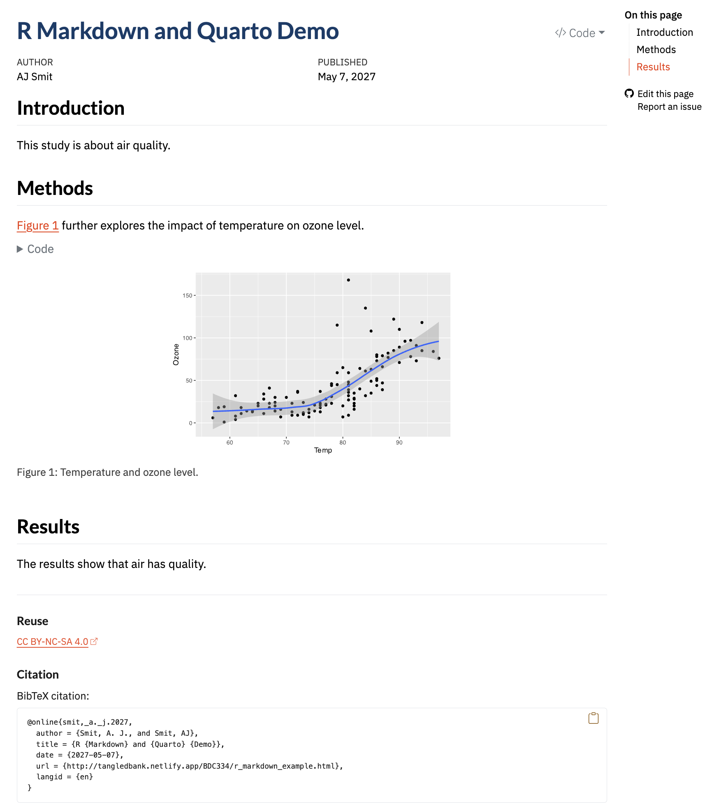

```{r code-brewing-opts, echo=FALSE}
knitr::opts_chunk$set(
  comment = "R>", 
  warning = FALSE, 
  message = FALSE,
  fig.width = 4.5,
  fig.height = 2.625,
  out.width = "75%",
  fig.asp = NULL, # control via width/height
  dpi = 300
)

ggplot2::theme_set(
  ggplot2::theme_minimal(base_size = 8)
)
ggplot2::theme_set(
  ggplot2::theme_bw(base_size = 8)
)
```

## Introduction to R Markdown in Quarto

### What Is Markdown?

Markdown is a plain-text way of marking document structure. A line that starts with `#` becomes a heading, text wrapped in `*...*` becomes italic, and text in backticks becomes code. The source file stays readable even before it is rendered.

#### Basic Markdown Formatting (Quick Reference)

The table below summarises the main Markdown formatting options used throughout this module, but you can find a more compelte overview [here](https://quarto.org/docs/authoring/markdown-basics.html). The middle column shows the literal Markdown syntax as it would appear in your Quarto source file, while the final column shows how that syntax is rendered in the output document.

| Purpose                    | Markdown source                     | Rendered output                 |
| :------------------------- | :---------------------------------- | :------------------------------ |
| Section heading (level 1)  | `# Introduction`                    | **Introduction**                |
| Section heading (level 2)  | `## Methods`                        | **Methods**                     |
| Emphasis (italic)          | `*italic text*`                     | *italic text*                   |
| Emphasis (bold)            | `**bold text**`                     | **bold text**                   |
| Inline code                | `` `mean(x)` ``                     | `mean(x)`                       |
| Bullet list                | `- first item`<br>`- second item`   | • first item<br>• second item   |
| Numbered list              | `1. first step`<br>`2. second step` | 1. first step<br>2. second step |
| Inline mathematical symbol | `$\alpha$`                          | α                               |
| Hyperlink                  | `[Quarto](https://quarto.org)`      | [Quarto](https://quarto.org)                          |
| Figure reference           | `@fig-airquality`                   | Figure reference in text        |
| Superscript                | `X^2^`                              | X^2^                            |
| Subrscript                 | `H~2~O^`                            | H~2~O                           |

Markdown is deliberately minimal. That is the point. You spend less time fighting a word processor and more time writing a document whose structure is obvious in the source.


## R Markdown: Integrating Code and Text

R Markdown extends Markdown by allowing executable code chunks inside the document. In one file you can write the explanation, run the analysis, and print the resulting table or figure exactly where it is discussed.

That is useful because it lets you:

- Write content in a human-readable format using Markdown
- Prepare transparent, reproducible reports
- Embed statistically detailed analyses directly alongside your commentary
- Easily incorporate tables, graphics, and other output generated by R into your document
- Write entire books or theses
- Even this website, Tangled Bank, was written entirely in R Markdown (in Quarto--see below)

## Using R Markdown in Quarto

Quarto is the current publishing system we will use for this work. It is the successor to classic R Markdown and it supports several languages, including R.

Its main strength is simple: one source document can generate HTML, PDF, or Word output while re-running the analysis from top to bottom. That strictness about YAML, chunk options, and file paths is not bureaucracy. It is what makes the document portable and reproducible.

A basic R Markdown (as implemented in Quarto) document has three main elements:

1. **YAML Header:** YAML stands for "Yet Another Markdown Language". It is at the very top of every Quarto document, enclosed by three dashes ` --- `, specifying basic document metadata (such as title, author, output format). The YAML header is deliberately strict because it is a whitespace-sensitive language. Its structure is inferred from indentation and line position rather than from explicit delimiters, which means that seemingly minor formatting changes can alter how the header is parsed. In practice, this has several consequences that are worth keeping in mind when you are writing or modifying a YAML block:
    - [the opening and closing dashes are part of the syntax and must be present]{.my-highlight};
    - [entries must follow the expected key --- value structure]{.my-highlight};
    - [indentation marks hierarchical relationships between options --- each deeper level in the hierarchy is accomplished by an additional two spaces]{.my-highlight}; and
    - [blank lines or inconsistent spacing are not inherently “wrong”, but they can change how the parser interprets the document and may therefore lead to errors that are difficult to diagnose]{.my-highlight}.
2. **Narrative Text:** Written in Markdown, supporting headings, lists, emphasis, tables, and more
3. **Code Chunks:** Segments of code embedded in the narrative and enclosed using triple back ticks with curly braces indicating the language --- *e.g.*, ```` ```{r} ```` at the start and ```` ``` ```` at the end of the chunk for R to insert tables, figures, and other outputs from an R analysis directly into your document

Do not treat a Quarto document as a storage box for results produced elsewhere. It is the analysis. The code should generate the table or figure where the text needs it.

The example below introduces several Quarto features at once. This reflects how experienced users tend to work, but it can obscure the learning sequence for newcomers. To make the structure of a Quarto document easier to grasp, think of the document as something that is built up in layers, with each layer adding a new capability.

1. At its simplest, a Quarto document requires only three components to render successfully: a **minimal YAML header** that specifies the document type, plain **Markdown text** to provide structure and explanation, and at least one **executable code chunk**. If this stripped-down document renders without error, you have established that your environment is correctly configured and that the basic relationship between text, code, and output is working as intended.

2. Once this foundation is secure, additional structure can be introduced. Figure labels, captions, and chunk options extend the document from a sequence of outputs into a navigable analytical narrative (or even a full-blown scientific paper of a thesis). Labels allow figures to be referenced explicitly from the text, captions situate outputs interpretively, and chunk options control how results are displayed. These additions do not change the logic of the analysis; they refine how that logic is communicated.

3. Only after this framework is in place does it make sense to introduce citations and bibliographic metadata. Citations depend on external files and additional YAML configuration, and they presuppose that the document itself already renders cleanly. Introducing them last reflects how they function in practice: as an overlay that connects your analysis to the scholarly record, rather than as a prerequisite for computation.

Read the example in that order. First get a minimal document to render. Then add labels and captions. Add citations only after the basic document works.


```` markdown
---
title: "R Markdown and Quarto Demo"
author: "AJ Smit"
date: "29/07/2025"
bibliography: ../references.bib
citation: true
csl: styles/marine-biology.csl
format: 
  html:
    code-fold: false
    embed-resources: true
    number-depth: 3
    number-sections: true
---

## Introduction

This study is about air quality.

## Methods

### Data

The dataset used in this study is the `airquality` dataset from R, which contains daily
air quality measurements in New York from May to September 1973. The dataset includes
variables such as ozone levels, solar radiation, wind speed, and temperature.

### Analysis

The R script in the code chunk further explores the impact of temperature on ozone level.
All analyses were done in R [@R2025].

This is **bold** text. This is *italicised* text.

```{{r}}
#| label: fig-airquality
#| fig-width: 6
#| fig-height: 4
#| fig-cap-location: bottom
#| fig-cap: "Temperature and ozone level."
#| warning: false

library(**ggplot2**)

ggplot(airquality, aes(Temp, Ozone)) + 
  geom_point() + 
  geom_smooth(method = "loess")
```

## Results

The results show that air has quality (@fig-airquality).

## Discussion

We used R for the analyses [@R2017]. The results confirm that of Schlegel [-@Schlegel2017].

````
Notes:

1. Lines 1-14: YAML header
2. Line 16: A level 2 header
3. Line 22: A level 3 header
4. Line 35-48: An R code chunk

In the above example, Lines 1-14 are called the YAML header, which contains metadata about the document. Initially, you'll not want to include the YAML lines `bibliography: ../references.bib` and `citation: true` since you will not have a bibliography file set up yet. The `citation: true` option is used to enable citations in the document, and you may read more about it elsewhere. [A very important part of the YAML header is the statement `embed-resources: true` which ensures that any images or other resources such as the theming styles etc. used in the document are embedded directly into the HTML output, making it self-contained and portable --- this is essential when you want to share your document with others, publish it online, or submit it for grading.]{.my-highlight}

Lines 16-33 are the first two sections (two level one headings, "Introduction" and "Methods", the latter with two level three headings beneath is, *i.e.*, "Data" and "Analysis") of the document.

Lines 35-48 make the code chunk, which is where we embed our R code. The `#| fig-cap` option in the code chunk specifies the caption for the figure that will be generated, and you can cross reference this from the body (see Line 52) text using `@fig-airquality` --- this references the name specified by `#| label: fig-airquality`. The code chunk itself generates a figure that shows the relationship between temperature and ozone level in the `airquality` dataset. Notice also how I have cited a reference, `@R2025`, which is a reference to the R software itself, which is specified in the bibliography file `references.bib` (which you will need to create in your own time). 

::: callout-important
## Do This Now

1. Go to the RStudio menu and find 'File' > 'New File' > 'Quarto Document' and create your own Quarto file.
2. Save it using a descriptive name inside of your R Project directory.
3. Copy and paste the example skeleton into your own, fresh Quarto file.
4. Make a few edits to your taste, such as at least changing the author's name.
5. Render it (via the 'Render' button above the Code Editor).
:::

After you've rendered this file, you'll see the following output (the HTML output shown):

{width="100%"}

### Supported output formats

By changing the `format` option in the YAML header, you can export your report to different types including:

- PDF documents (provided you have LaTeX installed)
- HTML web pages
- Word (.docx) documents

For example:
```yaml
format: pdf
```
or
```yaml
format: docx
```

### Rendering the document

- In RStudio or Positron, you can click the **'Render'** or **'Preview'** button, respectively, to produce your desired output.
- You can also use the command line: `$ quarto render my_file.qmd$`

Each time a document is rendered, Quarto re-executes the *entire analysis* from top to bottom in a clean session. This process tests:

1. whether objects are created in the order you assume,
2. whether variables exist where you think they do, and
3. whether your results really follow from the code as written rather than from residual state in the interactive environment.

So, rendering early and often is a useful and time-saving habit. Errors encountered during rendering are signs that direct you to hidden dependencies, misplaced assumptions about object scope, or inconsistencies between narrative and computation. A plot that appears correctly in the console but fails during rendering may reveal that it relies on objects created interactively rather than within the document itself. Similarly, warnings or failures triggered only at render time frequently indicate that code chunks are implicitly dependent on earlier chunks in ways that are not yet explicit.

Rendering is therefore part of the analysis, not an afterthought. Do it often. A document that only works because of objects left behind in your Console is not reproducible.

[You will thank me later for my insistence to perform frequent rendering when it comes to tests and exams!]{.my-highlight}

::: {.callout-note appearance="simple"}
## **What went wrong?**
A common early error occurs when a document that previously rendered successfully begins to fail after a small, seemingly innocent edit to the YAML header. For example, placing a blank line between two entries, or misaligning an option such as `format:` by a single space, can cause Quarto to misinterpret the document structure. The resulting error messages may be indirect, such as complaints about missing formats, unknown options, or failures later in the render process. This is because the problem does not sit with the analysis, but with how the YAML metadata was parsed.

When this happens, the most effective response is to compare the YAML carefully against a known working example and restore its structural alignment. In practice, many YAML issues are resolved by undoing well-intentioned formatting “tidy-ups” that the parser does not understand.
:::

The restrictions you encounter here (minimal YAML headers, limited citation use, and carefully staged document structure) are not endpoints. The are the framework. In later sections of the module, these same elements are revisited and extended: bibliographies and cross-referencing become central to statistical reporting, YAML options expand document capabilities and format, and Quarto documents evolve from simple reports into modular, project-level artefacts.

## More Detailed Information

Use the official Quarto pages for details:

- [Markdown Basics](https://quarto.org/docs/authoring/markdown-basics.html)
- [Citations](https://quarto.org/docs/authoring/citations.html)
- [HTML format options](https://quarto.org/docs/reference/formats/html.html)

YAML deserves special care. One misplaced space can change how the document is parsed, so when something odd happens, check the YAML before blaming the code chunk.

## Reproducibility as Practice

Reproducibility, in the context of Quarto and R Markdown, is a disciplined workflow. Quarto supports reproducible analysis by requiring that code, narrative, and outputs be generated together from a single source document, and so reduces the scope for undocumented intermediate steps or *post hoc* modification of results. When a document is rendered, all analyses are re-executed in sequence, forcing dependencies, object creation, and analytical order to be made explicit. This makes hidden assumptions (*e.g.*, about data preparation, parameter choices, or plotting defaults) visible in a way that conventional copy-and-paste workflows do not.

At the same time, reproducibility remains contingent. It depends on stable input data, explicit control of randomness, and awareness of the computer system on which the document is rendered. Quarto does not freeze package versions, manage software dependencies, or archive external data sources on your behalf (but you can make it do so with some know-how). It provides instead a structured setting in which such practices can be adopted consistently. So, Quarto should be seen as an enabling infrastructure... it makes reproducible work tractable, inspectable, and shareable, but it does not absolve the user from methodological responsibility. Treating reproducibility as an active practice (one that must be maintained rather than assumed) is implicit to using Quarto well.

We will cover reproducibility in some more detail under section  [2. Working with Data & Code](02-working-with-data.qmd#sec-reproducibility).

## Why Use R Markdown?

Using R Markdown within Quarto allows your analysis to be conducted, documented, and communicated within a single, coherent structure. Data preparation, statistical analysis, figures, and interpretation are written together, rather than assembled after the fact from disconnected sources or from memory. This integration makes analytical decisions visible and obvious, both to others and to yourself when you return to the work weeks or months later. Because results are regenerated directly from code at render time, documents remain reusable: the same analysis can be re-run on updated data, revised parameters, or alternative subsets without reconstructing the surrounding narrative. These properties will become increasingly important in the next chapter, where we shift from individual scripts to project-based workflows and begin treating analyses as evolving objects rather than one-off tasks.

The value of this approach becomes clearer when compared to a more *ad-hoc* way of working. Think about an analysis in which data are cleaned interactively in the console (or, shock-horror, in a spreadsheet!), figures are produced through incremental trial-and-error, and only the final plots are copied into a word processor alongside earlier descriptions of what was done. In such cases, the analytical pathway exists mostly in the user's memory. Intermediate decisions are discarded and reproducing the analysis (even by the original author) requires reconstruction rather than execution. Small changes in data or software can change results without leaving an obvious trace and make it difficult to diagnose differences or defend analytical choices.

The table below summarises these contrasts schematically:

| Aspect                        | Quarto-based workflow                        | Ad-hoc workflow                                   |
| :---------------------------- | :------------------------------------------- | :------------------------------------------------ |
| Code and narrative            | Written together in a single source document | Separated across scripts, consoles, and documents |
| Generation of results         | Re-executed automatically on render          | Manually copied and pasted                        |
| Analytical order              | Explicit and enforced                        | Implicit and often undocumented                   |
| Reuse with new data           | Straightforward re-rendering                 | Requires partial or full reconstruction           |
| Transparency                  | Decisions visible in code                    | Decisions inferred after the fact                 |
| Suitability for collaboration | High                                         | Limited                                           |

Quarto-oriented workflows are also designed to align smoothly with the material introduced later on workflow management and version control. When analyses live inside a structured project directory and are written as executable documents, they can be tracked over time using tools such as Git, which record how files change rather than just storing their older versions and their final state. You do not need to master version control immediately for this to be useful. Even a basic awareness that your analysis has a history (that it can be inspected, compared, and, if necessary, revisited) reinforces good analytical habits. Reproducibility now extends beyond the moment of rendering a document. It becomes a property of the entire analytical lifecycle, linking day-to-day coding practice with longer-term standards of transparency and accountability that underpin credible quantitative work.
