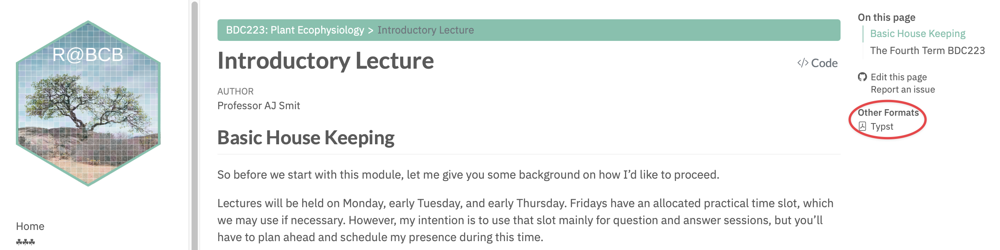

## Basic Housekeeping

Before we start this module, let me give you some background on how I would like to proceed.

We will hold lectures on Mondays, early Tuesdays, and early Thursdays. We have an allocated practical time slot on Fridays, which we may use if necessary. However, I intend to use that slot mainly for question-and-answer sessions, but you will need to plan ahead and schedule my presence during this time.

On Mondays, Tuesdays, and Thursdays, we will have in-person lectures in class. I will base all the lecture material I present in class on the content of various lecture slides, which I will display as I talk.

In total, you have access to in-person lectures (in class), pre-recorded lectures (accessible from iKamva) that correspond more or less to what I say in class, and textual transcripts (here on The Tangled Bank) of all the material. All of this should help you understand the content of BDC223.

::: callout-note
-   You may download the web material in the links on the left as PDF documents, which you may print out or use locally on your computers. Simply click on the "Typst" link, which appears on each lecture topic's webpage, as shown below:

:::

## Consultation

If there is something you do not understand, please make an appointment (as a class) to see me on Friday after 2 pm. This will give you a chance to discuss any issues that came up during the week's lectures. This set-up will allow us to revisit earlier material if there are any unresolved questions.

It is largely in your hands how you want to use the Friday afternoon allocation. By default, I will not interact unless you make an appointment, and when you do so, please make sure that you are with a group of at least four or five people. I will not hold individual meetings, since questions are often shared and it is more efficient to address them together. That is why the WhatsApp group exists. Use it to coordinate which topics are unclear, post your questions there, and I can respond either as a voice note or, if needed, we can use Friday afternoons for more detailed explanations.

I hope this format works for everyone. If not, let me know and we can look at alternatives. I will be available as much as possible on WhatsApp (less so during weekends), so please use that. I will definitely be available during the three lecture periods each week and, by appointment, on Friday afternoons.

## The Fourth Term BDC223

This term we focus on plants and algae as photosynthetic organisms. The module asks what allows them to function, what constrains them, and what happens when environmental conditions shift.

My own research background is marine, so many of my examples come from seaweeds and ocean processes. That is a bias in examples, not in principle. The same ecophysiological logic carries across terrestrial and marine systems.

## Expectations

My main expectation is that you read beyond the slides. The slides are scaffolding, not the whole module. Some of the detail you will need for tests and the exam sits in the transcripts, readings, and the connections you make between topics.

If you only memorise the slide bullets, you will hit a ceiling quickly. To do well, you need to connect mechanisms, examples, and definitions across lectures.

Science advances by questioning claims, including mine. Do not accept something as true merely because it was said confidently in a lecture, on social media, or by a person in authority.

Knowing a list is not the same as understanding a process. I am interested in whether you can explain why something happens, not only whether you can repeat the vocabulary.

[Having said this, I place strong emphasis in my assessments on knowing the meanings of the words we use in the module. Know your definitions.]{.my-highlight}

## Class Attendance and Participation

I make all of my lecture material available upfront. Everything is already accessible, and you can find it in the links provided. However, please note that although I expect you to attend my lectures, there is very little I can do to compel you to be present.

There will be random quizzes during the week. of course, you will not know when these will occur. If you miss one, the consequence is that you will lose marks that contribute towards your continuous assessment. In an ideal world, we as lecturers should not have to be concerned about whether or not you attend lectures. Many of my colleagues only release their lecture materials after they have actually presented in the class. They believe this practice encourages students to take notes in real time and creates an incentive to attend, as otherwise, students miss out on the discussions that may take place.

I take a somewhat different view. You are adults, and you need to decide how serious you are about your own training. [A serious student attends, prepares, and asks questions before confusion accumulates.]{.my-highlight}

I am not going to police you constantly. I am going to assume that you are capable of acting like responsible adults.

In the end, I am here to guide you through the various lectures, but it is your own responsibility to learn. Teaching and learning are different in a very important way. Teaching is, essentially, the process of guiding you through all the content you are expected to know. Teaching also involves exploring some topics along the way, perhaps engaging with material or ideas that you may find interesting. Teaching cannot happen without an audience.

Learning happens only if you engage with the material yourself. A teacher can organise, explain, and point, but cannot do the learning on your behalf. [A committed student can learn a great deal independently if they read carefully, test their understanding, and keep working when things become difficult.]{.my-highlight}

Indeed, everything I know now, today, as I am speaking to you, I have learnt post-PhD. I would venture to say that $90\%$, perhaps $95\%$, of the knowledge I hold today I have acquired myself, in the absence of any formal teaching. Learning is a lifelong process. I sincerely hope you are serious about this journey.

## My Research and Teaching Bias

As I said, I am a marine biologist. I work in the ocean, especially around South Africa (but also elsewhere), and my research is often ocean-centric. That does not mean it is irrelevant to land-based biology. I encourage you to draw general conclusions and connections across different contexts — integrate everything you learn.

## Assessments

Tests and assessments will focus on integration and synthesis, rather than regurgitation. You will need to demonstrate that you can apply what you have learned to new problems.

### Practical work

There will be three (maybe four) practical labs dealing mainly with data analysis and calculations about plant ecophysiology: surface area/volume ratios, nutrient uptake, and light measurements. You will get lab assignments on Mondays, due the following Monday at midnight, with calculations to be shown in spreadsheets and conclusions in a MS Word document. I am also exploring the idea of introducing you to R coding (the very *very* basics) during one or two of the labs. No promises yet, but I will let you know.

### Essay

You will also write a short personal essay, due roughly two weeks from now.

### Mark allocation

The mark allocation is the same (or very similar) to Prof Maritz's section. This allocation covers random quizzes, two class tests (typically on Thursdays or Fridays), and all work up to those points.

## Lecture Content

Content for this module includes:

1.  Planetary boundaries (tomorrow's topic) — about the limits to life.
2.  Climate change (starting Thursday) — its relevance to this module and biology as a whole.
3.  Plant stress — how plants experience and respond to stress.
4.  The role of light in the environment, critical to plant life.
5.  Heat stress and plant adaptation.
6.  Plant nutrition — their uptake of inorganic nitrogen and phosphorus, tying into global biogeochemical cycles and the carbon cycle.

## Learning Outcomes

-   Understand how environmental conditions (light, temperature, nutrients, etc.) affect plant distribution and interactions.
-   Learn physiological mechanisms for water, nutrient, and carbon uptake in plants.
-   Grasp the role of plants in the Earth system, integrating their function across contexts.
-   Discuss ecophysiological processes involved in nutrient and water transport and loss.
-   Examine the implications of global change and the limits of life on Earth.

Tomorrow we will focus on planetary boundaries, starting with people and their impact as the most destructive organism on the planet, then look at how plants adapt to environmental changes.

Good luck. Let us get started.
