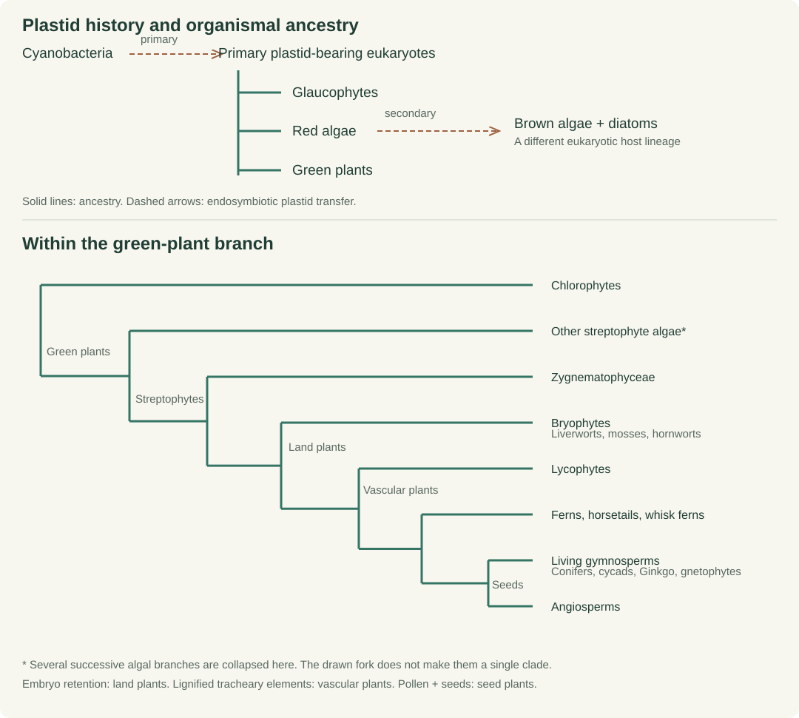
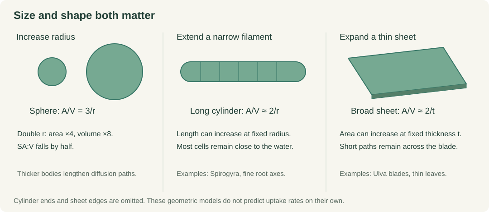
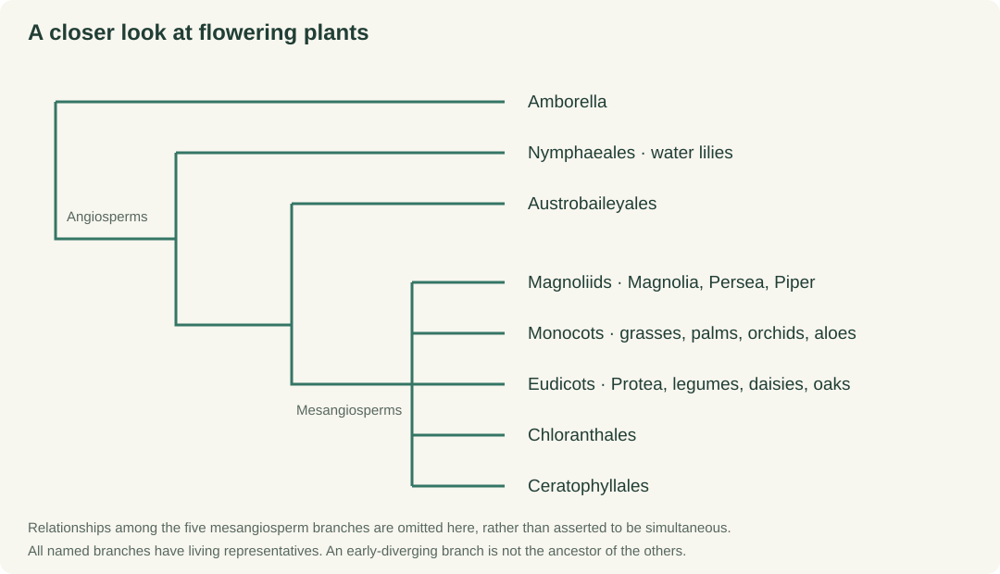

::: {.callout-note appearance="simple"}
## Lecture 3: From cells to canopies

**BDC223: Plant Ecophysiology.** This lecture takes place on Tuesday, 13 October 2026. A 45-minute teaching route is suggested at the end. The photographs and comparison tables also support revision outside class.
:::

A cyanobacterial cell, a sheet of sea lettuce and a forest tree all need light, inorganic carbon, water and mineral nutrients. Their bodies acquire these resources in very different ways. A tree must move water from soil to leaves many metres above the ground, while keeping most of its photosynthetic cells close to an air space. A moss can absorb water across much of its surface. A kelp blade exchanges with moving seawater.

For BDC223, the evolutionary history helps explain these differences in **form and function**. We will follow the main branches from oxygenic bacteria to algae and land plants, then compare how those branches obtain resources, support their bodies and tolerate environmental stress. Terrestrial plants occupy most of the second half of the lecture, including forms that look nothing like a conventional leafy tree.

By the end, you should be able to:

1. Place cyanobacteria, major algal groups and the principal land-plant lineages on a simplified phylogeny.
2. Explain how body size, shape and diffusion distance affect exchange, while distinguishing whole-organism SA:V from leaf, root and cell SA:V.
3. Relate the origins of embryos, vascular tissues, roots, leaves, wood, pollen and seeds to specific physiological or reproductive problems.
4. Compare support, water and nutrient acquisition, light capture and gas exchange across terrestrial plant growth forms.
5. Use an extant organism as a functional comparison with an extinct form, stating where that comparison breaks down.

## Read the history as a branching tree

**Oxygenic photosynthesis** is the usual term for photosynthesis that releases oxygen, also called photo-oxygenic photosynthesis in this module. Cyanobacteria are bacteria. Other bacterial groups also photosynthesise, but their photosynthesis does not release oxygen. Photosynthetic eukaryotes inherited oxygenic photosynthesis through endosymbiosis, when a cyanobacterium became a plastid inside another cell.

The tree below distinguishes organismal ancestry from the transfer of a plastid between organisms. Follow the green-plant branch to land plants, then keep following both sides of each split.

{#fig-evo-tree fig-alt="Cyanobacterial endosymbiosis gives rise to primary plastids in glaucophytes, red algae and green plants. Green plants divide into chlorophytes and streptophytes. Within streptophytes, Zygnematophyceae are sister to land plants. Land plants divide into bryophytes and vascular plants, with lycophytes, ferns and seed plants branching within vascular plants. Seed plants comprise living gymnosperms and angiosperms. Brown algae acquired a red-algal plastid through secondary endosymbiosis."}

A **clade** contains a common ancestor and all its descendants. Green plants, vascular plants and angiosperms are clades. The word **algae** groups organisms from several branches, united largely by an ecological and morphological description. The traditional **pteridophytes** comprise the seed-free vascular plants: lycophytes and ferns, including horsetails. They form a grade because the common ancestor they share also gave rise to seed plants.

Several consequences follow. Brown kelps belong on a different eukaryotic branch from green algae and land plants. Their large bodies evolved independently. Among green algae, Zygnematophyceae, including *Zygnema* and *Spirogyra*, are the closest living algal relatives of land plants. The conspicuously branched *Chara* is useful for examining algal architecture, but complexity of appearance does not make it the closest relative. Phylogenomic evidence also supports a bryophyte clade comprising liverworts, mosses and hornworts. Living mosses did not turn into living ferns. Both have their own evolutionary histories. [Hess et al. (2022)](https://pmc.ncbi.nlm.nih.gov/articles/PMC9632326/), [Li et al. (2020)](https://www.nature.com/articles/s41477-020-0618-2).

::: {.evo-key}
**Use two questions throughout:** Where does this organism belong on the tree? How does its body meet the physical demands of its environment? Similar answers to the second question can evolve on distant branches.
:::

### A few dates to orient the tree

These are approximate evidence points, rather than dates at which a modern group suddenly appeared. Fossils provide minimum ages and preserve some structures much better than others. Molecular estimates can extend further back and depend on calibration and analytical assumptions.

| Evidence point | Approximate age | What the evidence establishes |
|---|---:|---|
| First major atmospheric oxygenation | About 2.4 billion years ago | Oxygenic photosynthesis was operating by this interval. Atmospheric accumulation also depended on oxygen consumption and burial of reduced material. |
| Thylakoids in *Navifusa majensis* | About 1.75 billion years ago | Direct cellular evidence for an ancient oxygenic phototroph. This is younger than the origin of oxygenic photosynthesis. |
| Early land-plant cryptospores | About 470 million years ago | Evidence of early terrestrial plant reproduction, with uncertainty about the precise producers and their position on the tree. |
| Small branching axes such as *Cooksonia* | Silurian, roughly 430–420 million years ago | Early experiments in branched sporophytes bearing sporangia. Anatomical evidence differs among species. |
| Rhynie chert plants, including *Rhynia* and *Asteroxylon* | About 407 million years ago | Exceptional preservation of early land-plant anatomy and rooting structures. |
| Early seeds, including *Elkinsia* | Late Devonian, roughly 365 million years ago | Reproduction through ovules and seeds was established before modern conifer or flowering-plant communities. |
| Clear angiosperm fossil radiation | Early Cretaceous, roughly 135–125 million years ago | An expanding record of flowering plants. Their exact origin remains debated. |

Evidence and dating discussions: [Demoulin et al. (2024)](https://www.nature.com/articles/s41586-023-06896-7), [Rubinstein et al. (2010)](https://orbi.uliege.be/handle/2268/72757), [Hetherington and Dolan (2018)](https://www.nature.com/articles/s41586-018-0445-z), [Rothwell et al. (1992)](https://www.journals.uchicago.edu/doi/10.1086/297083), and [Smith et al. (2010)](https://pmc.ncbi.nlm.nih.gov/articles/PMC2851901/).

## Geometry sets the problem

In [Lecture 2](L02-SA_V.qmd) and [Lab 1](Lab1_SA_V.qmd), SA:V describes the surface available relative to the material that surface must supply. For a sphere,

$$
A=4\pi r^2,\qquad V=\frac{4}{3}\pi r^3,\qquad \frac{A}{V}=\frac{3}{r}.
$$

Doubling the radius gives four times the area and eight times the volume. SA:V halves. **This result assumes the same shape.** A filament that becomes longer without becoming thicker can remain close to its surroundings. A broad blade can increase area while retaining a short path through its thickness.

For a long cylinder, ignoring its ends, $A/V\approx2/r$. For a broad, thin sheet, ignoring its edges, $A/V\approx2/t$, where $t$ is thickness. These approximations explain why filaments, finely divided roots and thin leaves recur across the tree.

{#fig-evo-geometry fig-alt="A sphere has SA:V of 3 divided by radius, a long filament approximately 2 divided by radius, and a thin sheet approximately 2 divided by thickness. Increasing filament length or blade area does not require the large decline in SA:V caused by increasing thickness."}

A large tree contains many thin leaves and fine roots. Its trunk has low external SA:V and much of its wood consists of dead cell walls. Its absorbing roots and photosynthetic tissues retain high exchange area relative to their living volume. Consequently, ranking a tree, a moss and a kelp by one whole-body SA:V number can obscure the physiology we want to explain. Specify the surface and volume being measured.

### Diffusion works over short distances

An approximate diffusive flux density is

$$
J\approx D\frac{\Delta C}{L},
$$

where $D$ is diffusivity, $\Delta C$ is the concentration difference and $L$ is path length. Increasing exchange area can increase total transfer, but it does not remove a long diffusion path. Membrane permeability, boundary layers and the maintenance of a concentration gradient also matter.

The characteristic diffusion time scales with $L^2/D$. Using the one-dimensional estimate $t\approx L^2/(2D)$ and an illustrative $D=10^{-9}$ m² s⁻¹ gives about 0.05 s across 10 µm, eight minutes across 1 mm, and fourteen hours across 1 cm. These are idealised calculations for a small dissolved molecule, not measured transport times through a plant. They explain why bulk transport becomes useful before a body reaches tree size.

On land, increasing height adds mechanical loading and a water-potential cost. In water, buoyancy reduces the effective weight, but drag, shading and nutrient delivery remain. Environmental conditions therefore determine which consequences of size matter most.

## Bacteria: oxygenic photosynthesis before roots or leaves

Photosynthetic bacteria include anoxygenic forms such as purple bacteria, represented by *Rhodobacter sphaeroides*, and green sulfur bacteria such as *Chlorobaculum tepidum*. These organisms illustrate photosynthesis using electron donors other than water. Their living representatives are specialised modern organisms, so they cannot simply be arranged as successive ancestors of cyanobacteria.

Cyanobacteria combine two photosystems in a pathway that extracts electrons from water. The released O₂ comes from that water. Carbon fixation uses the resulting reducing power and chemical energy. Water splitting and carbon fixation are coupled processes, but the carbon in CO₂ is not the source of photosynthetic oxygen. This distinction will recur in [Pigments and Photosynthesis](L07-pigments_photosynthesis.qmd).

A small *Synechococcus* cell has short internal transport distances and takes up dissolved substances across its membrane. Light-harvesting membranes provide a large internal working surface. Cyanobacterial carbon-concentrating mechanisms can accumulate inorganic carbon around Rubisco, demonstrating that a small body still needs physiological control of resource supply.

Filamentous cyanobacteria add another level of organisation. In *Nostoc*, connected cells occur within a mucilaginous matrix, and some cells can differentiate into heterocysts that protect nitrogen fixation from oxygen. Nitrogen fixation supplies reduced nitrogen from N₂. It is a different process from oxygenic photosynthesis, and many cyanobacteria cannot fix nitrogen. [Gas-exchange experiments in *Nostoc punctiforme*](https://pmc.ncbi.nlm.nih.gov/articles/PMC383079/) illustrate how the two processes interact.

::: {.evo-photo}
.](images/evolution/nostoc.jpg){#fig-evo-nostoc fig-alt="A gelatinous Nostoc colony photographed against a white background."}
:::

Dense mats illustrate the limits of a high cellular SA:V. Neighbouring cells shade one another, and water movement across the mat controls delivery and removal. Interior conditions can differ sharply from those at the exposed surface. In BDC223 terms, morphology, light attenuation and boundary-layer transport already interact in a microbial community.

## Algae: several ways to become large

Primary endosymbiosis established the plastids of glaucophytes, red algae and green plants. Later endosymbioses spread plastids into other eukaryotic lineages. Brown algae and diatoms have plastids derived from a red-algal ancestor. This history explains part of the pigment diversity discussed in [Chromatic Adaptation](L08-chromatic_adaptation.qmd). The organisms carrying these plastids have distinct host ancestries. [Sánchez-Baracaldo et al. (2017)](https://pmc.ncbi.nlm.nih.gov/articles/PMC5603991/).

Among green algae, *Chlamydomonas reinhardtii* illustrates a motile unicell, while *Volvox carteri* has an organised spherical colony with reproductive and somatic differentiation. These are useful comparisons of organisation within chlorophytes. They are outside the streptophyte branch that contains land plants. The filamentous *Spirogyra* belongs within that latter branch, close to land plants, despite its relatively simple outline.

::: {.evo-pair}
.](images/evolution/spirogyra.jpg){fig-alt="Microscopic Spirogyra filaments showing cell boundaries and spiral green chloroplasts."}

.](images/evolution/ulva.jpg){fig-alt="Bright green sea lettuce sheets spread across intertidal rock."}
:::

Sheet-forming *Ulva* species distribute photosynthetic cells across thin blades. Water, dissolved inorganic carbon and mineral nutrients reach the thallus directly. There is little need for a root-to-shoot supply system. However, a broad blade can still have a thick diffusive boundary layer in slow water, and overlapping blades shade each other. High SA:V alone cannot predict uptake or productivity.

Red algae provide further contrasts. A *Pyropia* blade is thin, whereas *Gracilaria* has thicker branching axes and coralline reds add calcification. Their colours, body plans and investment in support vary within the red-algal branch. Algal diversity extends well beyond a sequence from a cell to a green sheet.

Large brown kelps partition their bodies into holdfast, stipe and blades. The holdfast mainly anchors the organism. Most acquisition of dissolved nutrients occurs across the thallus, so comparing a holdfast with a terrestrial root requires care. Flexible stipes, buoyancy and, in some kelps, gas-filled structures position blades in the light while allowing movement with waves.

::: {.evo-photo}
.](images/evolution/kelp.jpg){#fig-evo-kelp fig-alt="Underwater giant-kelp forest with blades and long stipes reaching towards surface light."}
:::

Kelps can also transport photosynthate over long distances through specialised conducting cells. Experiments in *Macrocystis* traced movement from source blades towards growing sinks. This is functional convergence with transport in vascular plants. Kelp conducting tissues are not plant xylem and phloem inherited from a recent common ancestor. [Schmitz and Srivastava (1979)](https://academic.oup.com/plphys/article/63/6/995/6076930).

The Cape kelps *Ecklonia maxima* and *Laminaria pallida* are familiar comparisons for the same physical problems: reaching light, remaining attached and exchanging with seawater. Their morphology links this lecture to nutrient uptake and to the functional-form comparisons in Lab 1.

## Living on land separates the resource supplies

On land, most light and CO₂ arrive from above, while water and mineral nutrients are concentrated in the substrate. Air provides little buoyant support. Exposed tissues can dry, and ultraviolet radiation and temperature fluctuations create additional stresses. Moving onto land therefore changed several selective pressures at once.

A cuticle reduces uncontrolled water loss across the epidermis. It also restricts gas diffusion. An aerial photosynthetic body benefits from openings that admit CO₂, while tissues and whole plants differ in how those openings are regulated. Staying upright requires turgor, wall strength and suitable architecture. Supplying the elevated surface requires a route from water source to evaporating tissue.

Early land plants also retained a multicellular embryo within parental tissue, the defining feature of embryophytes. Resistant spores, protected reproductive structures and associations with microbes contributed to terrestrial life. These traits cannot all be explained as consequences of declining SA:V. Reproduction and protection from desiccation imposed their own demands.

### Bryophytes: small stature, varied internal organisation

Liverworts, mosses and hornworts are three distinct bryophyte lineages. Their conspicuous plant body is usually the haploid **gametophyte**. The diploid **sporophyte** develops on it and remains attached, with varying degrees of nutritional dependence. In vascular plants, the large independent body is the sporophyte. Identifying the generation avoids comparing structures as if they were developmentally equivalent.

The liverwort *Marchantia polymorpha* forms a flattened, branching thallus. Rhizoids anchor it, and water can move across surfaces and through capillary spaces. Air chambers expose photosynthetic tissue to gases. The surface pores lack the opening and closing guard-cell mechanism of stomata, so a pore in *Marchantia* should not be labelled a stoma.

::: {.evo-pair}
_9842.jpg).](images/evolution/marchantia.jpg){fig-alt="Green branching thalli of the liverwort Marchantia polymorpha."}

_7502.JPG).](images/evolution/marchantia-pores.jpg){fig-alt="Microscopic view of polygonal areas and air pores on a Marchantia thallus."}
:::

Mosses include creeping mats, upright turfs and dense cushions. In *Polytrichum*, photosynthetic lamellae on the leaves increase tissue surface, while specialised conducting cells permit internal movement. Some mosses have water-conducting hydroids and food-conducting leptoids. These illustrate differentiation without the lignified xylem system of tracheophytes. A moss cushion can retain capillary water and reduce exposure, although densely packed shoots may shade one another.

::: {.evo-photo}
.](images/evolution/moss.jpg){#fig-evo-moss fig-alt="A colony of haircap moss with leafy shoots and stalked sporophytes."}
:::

Hornworts such as *Anthoceros* have a thalloid gametophyte and elongated sporophytes. Some host *Nostoc*, linking the cyanobacterial and land-plant branches through symbiosis. Many hornworts also have pyrenoid-based carbon-concentrating mechanisms. Mosses and hornworts can possess stomata on their sporophytes, but liverworts lack stomata. Bryophyte stomatal roles and responses should not be assumed to match those of a flowering-plant leaf. [Li et al. (2020)](https://www.nature.com/articles/s41477-020-0618-2).

Small stature is successful in wet microsites, on bark and in exposed habitats occupied by desiccation-tolerant species. A dry moss may suspend much of its metabolism and resume activity after wetting. That strategy differs from maintaining a continuous water supply to a transpiring canopy. Both incur costs, and both remain widespread.

### Early branching sporophytes: a fossil comparison

*Cooksonia* had small, branching axes bearing terminal sporangia. It gives us a concrete fossil form for discussing elevation, branching and spore dispersal before broad leaves. Its species differ in size and preserved anatomy. Some of the smallest forms may have depended strongly on the gametophyte because little space remained for photosynthetic tissue after allowance for other tissues. [Boyce (2008)](https://doi.org/10.1666/0094-8373(2008)034%5B0179:HGWCTI%5D2.0.CO;2).

The living whisk fern *Psilotum nudum* has green, dichotomously branching axes and lacks true roots. It offers a visual comparison for photosynthetic axes with very small appendages. **Its simple appearance is secondarily derived within ferns.** It is neither a surviving *Cooksonia* nor a reconstruction of the ancestor of vascular plants. Fossils such as *Rhynia* supply the historical anatomical evidence.

::: {.evo-photo}
.](images/evolution/psilotum.jpg){#fig-evo-psilotum fig-alt="Green repeatedly forked axes of the whisk fern Psilotum nudum."}
:::

## Vascular plants connect fine surfaces to a supported body

**Tracheophytes**, the vascular plants, possess lignified water-conducting tracheary elements. Xylem links the water supply to aerial tissues and contributes to support. Phloem transports organic compounds between sources and sinks. Their evolution allowed a much greater spatial separation between resource acquisition and use.

In a transpiring plant, evaporation from leaves helps maintain a water-potential gradient from soil through roots and xylem to the atmosphere. Cohesion permits tension to be transmitted through water columns. Root cells expend energy on selective ion transport, but they do not normally pump the transpiration stream up a tall tree. As height and hydraulic path length increase, resistance and the risk of embolism become ecophysiologically important.

Fine roots, root hairs and fungal hyphae explore substrate at a much smaller scale than the trunk. They renew a large absorbing surface outside the supporting axis. Mycorrhizal associations can extend nutrient acquisition beyond root surfaces in exchange for plant carbon, although their benefits depend on conditions and many plants use other nutrient-acquisition strategies. Roots themselves evolved in stages and on more than one vascular-plant branch. The rooting axes of the fossil lycophyte relative *Asteroxylon mackiei* lacked a root cap. [Hetherington and Dolan (2018)](https://www.nature.com/articles/s41586-018-0445-z).

### Lycophytes and ferns represent different branches

Lycophytes include clubmosses such as *Lycopodium*, spikemosses such as *Selaginella*, and quillworts such as *Isoetes*. Despite the common names, they are vascular plants. Their small leaves, or **lycophylls**, usually have a single unbranched vein. *Selaginella* and *Isoetes* produce separate microspores and megaspores, a condition called heterospory. Heterospory also occurs in water ferns and seed plants, illustrating repeated evolution of a reproductive feature.

::: {.evo-pair}
.](images/evolution/selaginella.jpg){fig-alt="Branching Selaginella shoots covered with small overlapping leaves."}

.](images/evolution/fern.jpg){fig-alt="Large divided green fronds of a royal fern."}
:::

The fern clade includes familiar frond-bearing ferns, horsetails such as *Equisetum*, and whisk ferns. Broad or divided leaves supply a large photosynthetic surface connected to veins. Roots and rhizomes acquire and store resources. In most familiar ferns, a small independent gametophyte still requires a film of water for sperm to reach an egg. A vascular adult can therefore occupy a broader physical space while reproduction remains constrained by wet conditions.

Ferns range from thin filmy ferns in humid shade to drought-tolerant rock ferns, floating *Azolla* and tall tree ferns. A tree fern such as *Alsophila dregei* stands upright using a stem with strengthening tissues and a surrounding root mantle. Its trunk is constructed differently from a woody conifer trunk. Carboniferous tree-sized lycophytes such as *Lepidodendron* provide another extinct solution to height, whereas today's small clubmosses reveal only part of that branch's former architectural diversity.

### What a leaf, a stem and a root contribute

A leaf combines a broad light-intercepting surface with short internal diffusion paths, air spaces and a vein supply. Stomata connect those air spaces to the atmosphere. Opening them admits CO₂ and permits water loss. Both photosynthesis and respiration contribute to net gas exchange: illuminated tissue may release O₂ overall, while roots and other respiring tissues require O₂ uptake. Root-zone oxygen can become limiting in waterlogged soil.

Stems place leaves in the light and transmit loads towards the ground. Turgor supports young tissues, collenchyma provides flexible strengthening, and lignified walls provide stiffness. Secondary growth in many seed plants adds wood and increases conducting and supporting capacity. Growing taller also requires investment in tissues that contribute little direct carbon gain and exposes the crown to wind and hydraulic stress.

Roots anchor the body and acquire water and nutrients. Root branching, root hairs, selective membrane transport and associations with microbes all influence access. These functions connect directly to [Nutrient Uptake](L09a-nutrient_uptake.qmd). Root surface area, nutrient availability and uptake kinetics must be considered together.

## Seed plants: reproduction and terrestrial diversification

A pollen grain is the dispersal stage of the male gametophyte. The ovule retains the female gametophyte, and the seed protects and provisions the embryo. Fertilisation can occur without a continuous external film of water between two free-living gametophytes. This expanded reproductive possibilities in seasonally dry environments. Cycads and *Ginkgo* retain motile sperm, but pollen delivery and internal fluid provide the route to fertilisation.

The Late Devonian *Elkinsia polymorpha* is an early seed-plant example with fern-like foliage and ovules. “Seed fern” describes several extinct combinations of characters, not a single living fern group that merely acquired seeds. Fern-like leaf shape alone is inadequate evidence of ancestry. [Rothwell et al. (1992)](https://www.journals.uchicago.edu/doi/10.1086/297083).

### Gymnosperm diversity

Living gymnosperms include conifers, cycads, *Ginkgo* and gnetophytes. The precise relationships among some of these branches have required genomic evidence. All belong on the seed-plant side of the tree, separate from living angiosperms. Their ovules are not enclosed within an angiosperm ovary.

| Lineage and extant example | Form to recognise | Ecophysiological connection |
|---|---|---|
| Conifers: *Pinus pinea*, *Podocarpus latifolius* | A pine has needle leaves, while yellowwoods have broad, flattened leaves. Many conifers form large woody trees. | Tracheids provide both conduction and support. Leaf form and hydraulic traits vary with climate and shade. Needles are one conifer strategy, not the definition of a gymnosperm. |
| Cycads: *Encephalartos* species | A stout axis with a crown of large divided leaves and reproductive cones. | Tough, persistent foliage, stored resources and specialised coralloid roots occur in this lineage. Cyanobacterial partners can fix nitrogen in the roots. The palm-like habit evolved independently of palms. |
| *Ginkgo biloba* | A deciduous tree with fan-shaped leaves and branching veins. | Seasonal leaf shedding limits exposure during unfavourable periods. Broad leaves and deciduousness occur outside angiosperms. |
| Gnetophytes: *Welwitschia*, *Ephedra*, *Gnetum* | Two persistent strap leaves in *Welwitschia*, green jointed shoots in *Ephedra*, and broad leaves in many *Gnetum*. | Contrasting solutions to aridity and forest life occur within one gymnosperm branch. Gnetophyte vessel elements also caution against treating vessels as uniquely angiosperm structures. |

::: {.evo-pair}
.](images/evolution/pine.jpg){fig-alt="A tall stone pine with a narrow trunk and spreading umbrella-shaped crown."}

.](images/evolution/cycad.jpg){fig-alt="Cones and stiff divided leaves of the South African cycad Encephalartos villosus."}
:::

*Welwitschia mirabilis*, native to the Namib Desert, is especially useful for breaking an assumed progression towards increasingly branched crowns. Two foliage leaves grow continuously from their bases and split as they age. A mature individual can consequently appear to have many leaves. Its low, persistent architecture is highly specialised. Its specialised form evolved within the gnetophyte branch. [SANBI: *Welwitschia mirabilis*](https://pza.sanbi.org/welwitschia-mirabilis).

::: {.evo-photo}
.](images/evolution/welwitschia.jpg){fig-alt="Low Welwitschia plant with persistent strap-like leaves extending across the ground."}
:::

### Angiosperm phylogeny contains many different body plans

Angiosperms have flowers and ovules enclosed within carpels. Fruits develop from the ovary, sometimes with contributions from other tissues. Pollination and dispersal interact with animal behaviour, wind and water, but these are additional dimensions of the body-plan story. A flower does not solve a low-SA:V transport problem.

The earliest-diverging living branches include *Amborella*, Nymphaeales, with water lilies, and Austrobaileyales. The much larger mesangiosperm radiation includes magnoliids, monocots and eudicots, as well as Chloranthales and Ceratophyllales. The old category “dicots” excludes monocots from a larger ancestral group and is therefore not equivalent to a clade. **Eudicots** is the appropriate clade name for the large branch containing proteas, legumes, daisies and many familiar trees. [APG IV (2016)](https://doi.org/10.1111/boj.12385).

{#fig-evo-angiosperms fig-alt="Amborella, water lilies and Austrobaileyales branch successively before the mesangiosperms, which include magnoliids, monocots, eudicots, Chloranthales and Ceratophyllales."}

| Branch | Examples for recognising diversity | Form and function to compare |
|---|---|---|
| Early-diverging angiosperm branches | *Amborella trichopoda*; water lilies such as *Nymphaea* | A terrestrial shrub and floating aquatic leaves occur on distinct early branches. The upper surface of a floating leaf has a very different gas-exchange environment from a submerged leaf. |
| Magnoliids | *Magnolia*, avocado (*Persea americana*), *Piper* | Trees, shrubs and climbing forms. Broad leaves and woody construction also occur outside eudicots. |
| Monocots | Grasses, sedges, restios, palms, orchids, aloes and seagrasses | Narrow blades, persistent sheaths, storage organs, succulent leaves and epiphytic roots. Palms attain tree stature without the ordinary vascular-cambium construction of an oak. |
| Eudicots | *Protea*, *Erica*, legumes, daisies, oaks, cacti and many mangroves | Woody and herbaceous forms, compound leaves, succulence, climbing stems and specialised nutrient-acquisition systems. No single leaf shape or growth form defines the clade. |

Many angiosperms combine dense leaf venation with efficient water supply to photosynthetic tissue. Boyce and colleagues measured substantially higher vein densities in their angiosperm sample than in the other vascular-plant groups sampled, linking this anatomy to potential water flux. That association helps explain high rates of carbon gain in some flowering plants. It does not mean every angiosperm outperforms every fern or gymnosperm. Vessel dimensions, stomatal regulation, leaf lifespan and environment still matter. Some angiosperms, including *Amborella*, lack ordinary vessels. [Boyce et al. (2009)](https://pmc.ncbi.nlm.nih.gov/articles/PMC2674498/).

::: {.evo-photo}
.](images/evolution/protea.jpg){#fig-evo-protea fig-alt="A king protea shrub at Kirstenbosch with broad leaves and large flower heads."}
:::

## Terrestrial diversity: compare strategies within and across branches

A useful BDC223 comparison starts with the environment and the resource pathway. “Large” or “complex” gives only part of the explanation. The following forms show how much variation exists within vascular plants.

### Trees, shrubs, grasses and climbers

An indigenous yellowwood, *Podocarpus latifolius*, and an oak, *Quercus robur*, both build woody trunks and elevated crowns, although one is a conifer and the other a eudicot. Branching distributes leaves through a three-dimensional light field. Crowding, self-shading and hydraulic path length constrain the return on that investment. A smaller *Protea* or *Erica* shrub may retain tough foliage and a crown closer to the ground, with different exposure to wind, drought and fire.

Grasses such as *Themeda triandra* produce narrow blades supported by sheaths and culms. Basal growth regions permit regrowth after defoliation. Parallel venation supplies a long, relatively narrow surface. A grass can build a tall canopy with little conventional wood, and some bamboos reach tree height using a very different stem construction. C₄ photosynthesis in *Themeda* is a biochemical carbon-concentrating mechanism suited to particular conditions. Many other grasses use C₃ photosynthesis. Neither pathway follows automatically from narrow leaves or membership of the monocots.

A climbing grapevine, *Vitis vinifera*, uses external supports to reach light. It still invests in a vascular connection to the soil, but the supporting load is partly transferred to another structure. Climbers demonstrate that height and self-support can evolve partly independently. A palm, by contrast, constructs a self-supporting stem through dense fibrous tissues and distinctive developmental growth, without the usual ring-forming vascular cambium of many woody eudicots.

### Succulents and plants in dry habitats

Thick leaves in aloes and thick stems in cacti store water. Their lower SA:V can reduce the exposed area relative to stored volume, but it also increases diffusion distances and changes heat exchange. Spines, waxes, sunken stomata, leaf shedding and altered leaf orientation occur in various combinations across dryland plants. Similar-looking succulent forms occur in distant branches, including monocot aloes and eudicot cacti or euphorbias.

In CAM plants, stomata open mainly at night and incoming carbon is stored in organic acids for use during the following day. This temporal separation can reduce water loss under suitable conditions. CAM is a physiological trait with repeated origins. Succulence alone is insufficient evidence to assign a pathway. The southern African quiver tree, *Aloidendron dichotomum*, provides a recognisable example of a succulent monocot with a branching, tree-like habit. [SANBI: *Aloidendron dichotomum*](https://pza.sanbi.org/aloidendron-dichotomum).

::: {.evo-photo}
.](images/evolution/quiver-tree.jpg){fig-alt="A small cultivated quiver tree with a thickened stem and a rosette of fleshy leaves."}
:::

### Epiphytes and specialised nutrient acquisition

An epiphytic orchid grows on another plant and intercepts light without maintaining its own connection to the soil. Its roots must obtain water and nutrients from intermittent wetting, trapped debris and associated organisms. Absorbent root coverings, storage tissues and CAM occur in many epiphytic orchids, but vary among species. Epiphytic ferns solve related problems on a distant branch. Attachment to a host does not by itself imply parasitism.

In phosphorus-poor soils, cluster-root systems in many Proteaceae combine densely packed short rootlets with chemical mobilisation of nutrients. Mycorrhizal plants use fungal exploration, while carnivorous *Drosera* supplements mineral nutrition by digesting animals. A sundew still fixes carbon through photosynthesis. Legumes provide another strategy by housing nitrogen-fixing bacteria in nodules, whose activity carries a carbon cost. These are different mechanisms of access to nutrients, rather than successive steps towards a single superior plant. [Experiments in *Hakea*](https://research-repository.uwa.edu.au/en/publications/developmental-physiology-of-cluster-root-carboxylate-synthesis-an) connect cluster-root development with carboxylate release and phosphorus mobilisation.

### Flooded ground and the return to water

Waterlogged soil contains water but can supply too little oxygen for root respiration. Wetland plants may develop internal air spaces, and mangroves such as *Avicennia marina* have aerial roots that assist exchange with the atmosphere. Saline conditions additionally lower the water potential of the external medium. Salt tolerance therefore involves osmotic and ion-regulation problems as well as visible root architecture.

::: {.evo-photo}
.](images/evolution/mangrove.jpg){fig-alt="Upward-projecting roots along the edge of a black-mangrove stand beside shallow water."}
:::

Floating water lilies expose their upper leaf surfaces to air. Submerged flowering plants exchange within water, and seagrasses such as *Zostera capensis* retain roots and rhizomes while living fully submerged. Seagrasses are monocot angiosperms that returned to the sea. Comparing a seagrass blade with an *Ulva* blade tests whether we can distinguish similar environmental demands from very different ancestry.

These comparisons connect the phylogeny to [Plant Stress](L10-plant_stress.qmd). Drought, flooding, salt, heat and excess light act on different parts of the same resource network. A structure that helps under one stress can impose a cost under another.

## Comparing the major transitions

| Body plan | Staying upright | Water and mineral nutrients | Light and gas exchange | Limitation to keep in view |
|---|---|---|---|---|
| Cyanobacterial cell or narrow filament | Cell walls, turgor, attachment or suspension | Membrane uptake over short distances | Pigmented membranes and carbon concentration | Boundary layers, nutrient supply and self-shading in colonies |
| Thin algal blade | Flexible walls, attachment and buoyant support | Direct uptake across thallus | High exposed area, short paths through blade | Water motion, desiccation at low tide, drag and overlap |
| Kelp | Holdfast, stipe, buoyancy and flexible architecture | Thallus uptake plus internal redistribution | Blades distributed vertically | Storm loading and delivery across water boundary layers |
| Bryophyte mat, turf or thallus | Small stature, turgor and walls | Surface wetting, capillarity and some internal conduction | Thin tissues, chambers or lamellae | Dependence on hydration, with desiccation tolerance in some species |
| Lycophyte or fern sporophyte | Lignified tissues and supported axes | Roots and vascular transport | Veined leaves or green axes, stomata | Hydraulic constraints and water-dependent fertilisation in many species |
| Gymnosperm | Diverse woody or compact supporting bodies | Roots, symbioses and xylem, mainly tracheids in conifers | Needles, scales or broad leaves with regulated exchange | Costs of long-lived tissues and hydraulic safety |
| Angiosperm | Herbs, wood, culms, climbing or aquatic support | Highly diverse roots, symbioses and vascular systems | Diverse leaves, venation and carbon-fixation pathways | Trade-offs depend on growth form, ancestry and habitat |

The same general response recurs: **retain fine exchange surfaces, position them in useful environments and connect them to the rest of the body**. Evolution has produced many combinations of those functions. It has also repeatedly reduced or lost structures when a different way of life made them unnecessary.

## Reading living examples alongside fossils

An extant organism can demonstrate a possible function of an old architecture. Its appearance cannot establish that it is an ancestor, or that the ancient organism had the same physiology. Use these comparisons with that distinction in place.

| Historical question | Fossil or ancestral feature | Extant comparison | What the comparison cannot establish |
|---|---|---|---|
| How could oxygenic cells organise into larger bodies? | Ancient cyanobacterial cells and mats | *Nostoc* colonies and *Synechococcus* cells | The exact physiology or identity of the first oxygenic bacterium |
| What traits preceded land plants? | The shared ancestor of land plants and their closest algal relatives | *Zygnema*, *Spirogyra* and other streptophyte algae | A direct ancestor chosen from a modern genus |
| How could a low terrestrial body exchange with air? | Early terrestrial thalli and reproductive structures | Liverwort thalli, moss turfs and hornworts | The precise body plan of the cryptospore producers |
| How could branching axes function before broad leaves? | *Cooksonia* and *Rhynia* | Green axes of *Psilotum* | That whisk ferns preserved the ancestral vascular-plant condition unchanged |
| How did vascular plants explore soil? | Rooting structures of *Asteroxylon* | Lycophyte roots and shoots | That all living roots evolved once or have identical developmental histories |
| How did seed reproduction combine with foliage? | *Elkinsia* and other extinct seed plants | Cycads, conifers and other seed plants | That a cycad or conifer is an unchanged seed fern |
| What might early angiosperm diversity include? | Cretaceous flowers, pollen, leaves and whole-plant fossils | *Amborella*, water lilies and magnoliids | A single modern “first flowering plant” or one ancestral growth form |

## Questions for BDC223

1. An *Ulva* blade becomes twice as broad but keeps the same thickness. Predict the change in SA:V when edge area is negligible. Explain why its actual nutrient uptake per unit biomass might nevertheless change.
2. A *Nostoc* colony and a moss cushion are each 2 cm across. Why does that measurement tell us little about the SA:V of their metabolically active cells or their internal diffusion distances?
3. Compare a kelp, a tree fern and a yellowwood of similar height. Identify the supporting structure, the main water source, and the path by which carbon reaches a growing part.
4. Place a cycad, a palm and a tree fern on the phylogeny. Their crowns can look similar. Which features would you inspect to distinguish shared ancestry from convergence?
5. Compare a fynbos shrub, a CAM succulent and a wetland angiosperm. Explain how each manages the connection between CO₂ uptake, water supply and oxygen availability.
6. Why would it be misleading to describe an oak as having “low SA:V” without specifying whether you measured its trunk, whole crown, leaves, fine roots or mesophyll cells?

::: {.callout-tip collapse="true"}
## Discussion guide

For question 1, $A/V\approx2/t$ remains approximately constant. Uptake can still change with flow, folding, boundary-layer thickness, self-shading and nutrient demand. For question 2, distinguish the collective body from the dimensions and arrangement of its cells. A water-filled matrix or capillary space changes transport too.

For question 3, compare buoyancy and flexible algal axes with a tree-fern stem and root mantle, then with secondary wood. Carbon transport occurs in all three, but the tissues and evolutionary origins differ. In question 4, look for cones, flowers or sporangia as well as leaf and stem anatomy.

For question 5, trace a complete resource pathway and identify the limiting step. A CAM plant changes the timing of carbon uptake, while a wetland plant may struggle to aerate its roots. Question 6 requires an explicit measurement scale and recognition that dead supporting tissue and metabolically active tissue make different demands on exchange surfaces.
:::

<!-- ### Suggested teaching route

Allow about eight minutes for the tree and its interpretation, six for geometry and diffusion, seven for cyanobacteria and algal body plans, ten for bryophytes and vascular plants, and ten for seed-plant diversity. Use the remaining four minutes for the cycad–palm–tree-fern comparison. The dates, extended terrestrial comparisons and photograph register can be read before or after class.

This lecture connects directly to SA:V and Lab 1, then provides a common set of organisms for later work on light, pigments, photosynthesis, nutrient uptake and environmental stress. It introduces no additional assessment or submission deadline. -->

## Sources and photographs

The links beside specific claims lead to research papers or, for the named southern African species, SANBI accounts. The phylogeny is simplified for teaching from the One Thousand Plant Transcriptomes Initiative ([2019](https://doi.org/10.1038/s41586-019-1693-2)), Hess et al. (2022), Li et al. (2020) and APG IV (2016). The geometry diagrams and diffusion calculations were prepared for this lecture and are explanatory models.

All photographs below are public domain or carry a CC0 public-domain dedication on their source pages. They are stored with the lecture, so viewing does not depend on remote image embedding. Local copies retain the source composition. Wikimedia thumbnailing may reduce resolution. Photograph identifications follow the source records, and captions distinguish genus-level identifications, cultivated specimens and illustrative comparisons from fossil evidence.

| Local photograph | Creator or source credit | Status | Original record |
|---|---|---|---|
| nostoc.jpg | Victor M. Vicente Selvas | Public domain | [Photograph and rights statement](https://commons.wikimedia.org/wiki/File:Nostoc_communis003.JPG) |
| spirogyra.jpg | en:User:Spicywalnut | Public domain | [Photograph and rights statement](https://commons.wikimedia.org/wiki/File:Spirogyra.JPG) |
| ulva.jpg | Pseudopanax at English Wikipedia | Public domain | [Photograph and rights statement](https://commons.wikimedia.org/wiki/File:Sea_lettuce_at_Curio_Bay.jpg) |
| kelp.jpg | Robert Schwemmer, NOAA | Public domain | [Photograph and rights statement](https://commons.wikimedia.org/wiki/File:Macrocystis_pyrifera_kelp_forest_Cojo_Anchorage.jpg) |
| marchantia.jpg | HermannSchachner | CC0 | [Photograph and rights statement](https://commons.wikimedia.org/wiki/File:Marchantia_polymorpha_(a,_144712-474823)_9842.jpg) |
| marchantia-pores.jpg | HermannSchachner | CC0 | [Photograph and rights statement](https://commons.wikimedia.org/wiki/File:Marchantia_polymorpha_(d,_144722-474816)_7502.JPG) |
| moss.jpg | Loup-Anne | CC0 | [Photograph and rights statement](https://commons.wikimedia.org/wiki/File:Polytrichum_piliferum_female_colony.jpg) |
| selaginella.jpg | Suzanne ujen | CC0 | [Photograph and rights statement](https://commons.wikimedia.org/wiki/File:Peacock_fern_Selaginella_willdenowii.jpg) |
| psilotum.jpg | Daderot | CC0 | [Photograph and rights statement](https://commons.wikimedia.org/wiki/File:Psilotum_nudum_-_Longwood_Gardens_-_DSC01149.JPG) |
| fern.jpg | Jim Kingdon | Public domain | [Photograph and rights statement](https://commons.wikimedia.org/wiki/File:Royal_fern_closeup.jpg) |
| pine.jpg | Jebulon | CC0 | [Photograph and rights statement](https://commons.wikimedia.org/wiki/File:Pinus_pinea_Pompeii.jpg) |
| cycad.jpg | Rotational | Public domain | [Photograph and rights statement](https://commons.wikimedia.org/wiki/File:Encephalartos_villosus07.jpg) |
| protea.jpg | Andrew Massyn | Public domain | [Photograph and rights statement](https://commons.wikimedia.org/wiki/File:Protea_cynaroides.jpg) |
| welwitschia.jpg | Awinch1001 | CC0 | [Photograph and rights statement](https://commons.wikimedia.org/wiki/File:Welwitschia_mirabilis_3.jpg) |
| quiver-tree.jpg | The Fun Chronicles | CC0 | [Photograph and rights statement](https://commons.wikimedia.org/wiki/File:105_Aloidendron_Dichotomum,_AKA_Quiver_Tree,_Kokerboom.jpg) |
| mangrove.jpg | USDA NRCS Plant Materials Center | Public domain | [Photograph and rights statement](https://commons.wikimedia.org/wiki/File:Avicennia_germinans.jpg) |

The [machine-readable photograph register](images/evolution/photo-sources.json) records the original and downloaded image URLs, rights information, retrieval date and file checksums.
