::: callout-note
## Reading

-   [Worrell, J. et al. (2001). The Nitrogen Bomb](../docs/The_Nitrogen_Bomb_(2001).pdf)
-   [Gruber, N. and Galloway, J.N. (2008). An Earth-system perspective of the global nitrogen cycle.](../docs/Gruber_Galloway_(2008).pdf)
:::

::: callout-tip
## Follow the process in nine visualisations

[Watch the films and work through the practice questions](L08c-nutrients_visualised.qmd). Start with nutrient delivery and membrane transport, then connect uptake to internal reserves, growth and coastal nutrient cycling.

Read the slide figures alongside the explanations. Uptake is not the same measurement as growth; curve shape alone does not establish a transport mechanism; and nutrient ratios and temperature responses depend on context. Where a slide uses broad shorthand, use the qualified explanation in these notes.
:::

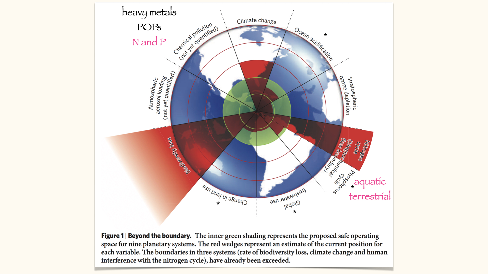

## Introduction: the Centrality of Nitrogen

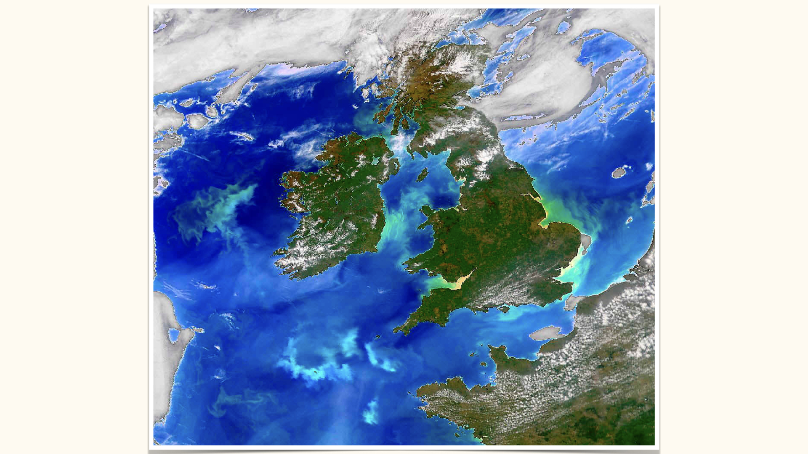

Today's lecture is centred on the topic of nutrient uptake. We are using nitrogen as our principal example, given its status as a ubiquitous nutrient, essential to all plants for successful growth. Additionally, we will be considering the environmental consequences of there being excessive nitrogen in the environment. This is tied directly to the planetary boundaries concept expounded by Johan Rockström, specifically the quadrant concerning the nitrogen and phosphorus cycles — two key global biogeochemical cycles involving the transportation and transformation of these elements between the biosphere, geosphere, atmosphere, and oceans.

Nitrogen is a particular concern, as it is one of the major thresholds humanity has already exceeded globally. This excess results in numerous environmental problems, especially where processes involve plants — primarily aquatic and marine plants, although to a lesser extent, it does impact certain terrestrial plants as well.

### Nitrogen in the environment

Nitrogen's importance is clear when you consider its abundant presence. Approximately $78\%$ of the air we breathe is composed of nitrogen, and it is found in soils, sand, and oceans, where it is accessed by plant roots or available in dissolved form for algae and marine plants. Available N can support production where N restricts growth, but light, other nutrients and losses also determine how much biomass accumulates. Abundant atmospheric N₂ does not mean abundant nitrate or ammonium.

For this module, whilst terrestrial plants will feature in our discussions, our focus throughout the examples will be on aquatic environments, with particular attention to nitrogen dissolved in seawater and its role in triggering phytoplankton blooms. These can be so prolific that they are visible from space — swirls and green patches near the UK, Ireland, or east of the Falkland Islands, all testify to high concentrations of phytoplankton supported by nitrogen availability.

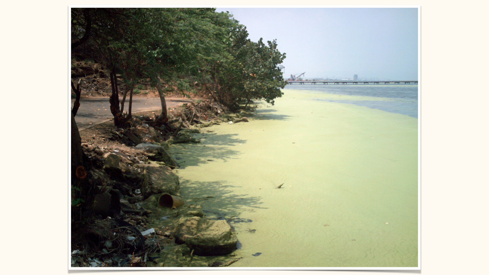

The twirling and swirling patterns you observe in satellite imagery arise from physical ocean mixing processes — currents, eddies — distributing dissolved nitrogen, which in turn supports phytoplankton blooms.

### Environmental consequences of excess nitrogen

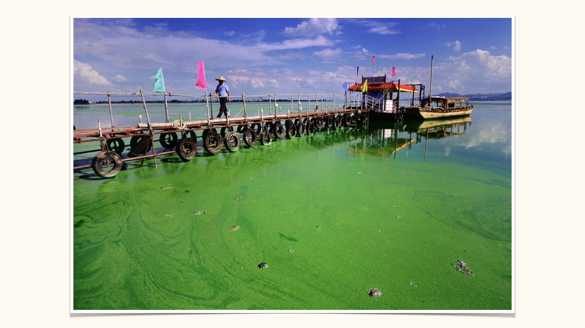

Excess nutrient inputs from wastewater, fertiliser runoff and other sources can support nuisance blooms where nutrients restrict production. Accumulated biomass may shade other organisms, alter habitats and affect water quality and livelihoods. The response depends on the receiving system, not on nutrient input alone.

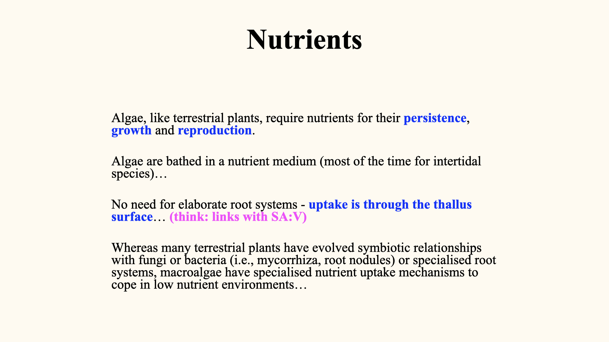

Photosynthetic organisms, including some cyanobacteria, can contribute to blooms. Living organisms respire, and microbes also decompose organic matter. Low oxygen develops when total consumption exceeds supply by photosynthesis and physical renewal. Darkness removes photosynthetic supply, but neither a bloom nor nightfall inevitably produces anoxia. Later we separate nutrient supply, biomass accumulation and oxygen renewal in the final visualisation.

## Understanding Nutrients and Their Uptake

### What makes a nutrient essential?

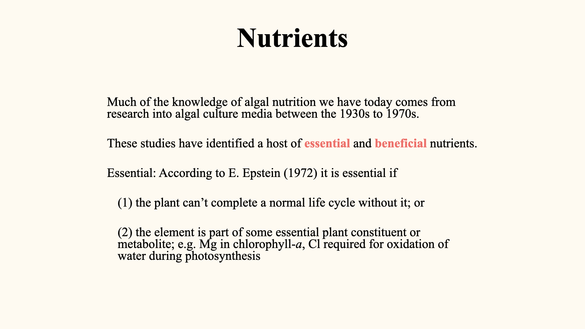

Nutrients, alongside light, oxygen, and carbon dioxide, are required for plant and algal growth. In aquatic environments, algae absorb dissolved nutrients directly from the surrounding water. Terrestrial plants usually acquire them through roots in the soil.

Algae, because of their immersion, do not require roots. Their entire body (the "thallus") is bathed in nutrients. By contrast, plants depend on root systems both for nutrient uptake and for transport to other parts of the organism. You should recall from previous modules how the surface area to volume ratio becomes decisive for nutrient uptake efficiency, particularly in aquatic environments where mixing is driven by environmental processes.

#### Symbiotic relationships

Terrestrial plants often benefit from symbiotic relationships with fungi and bacteria — mycorrhizae and root nodules — helping them acquire and process nutrients from the soil. Aquatic algae generally do not require such associations, although bacteria in the marine environment do help make nitrogen available for algal uptake.

Bacteria, in terms of both biomass and individual numbers, are among the planet's most abundant organisms; without them, no form of life would exist.

## "Taxonomies" of Nutrients

Nutrients can be classified in various ways.

### Essential vs beneficial

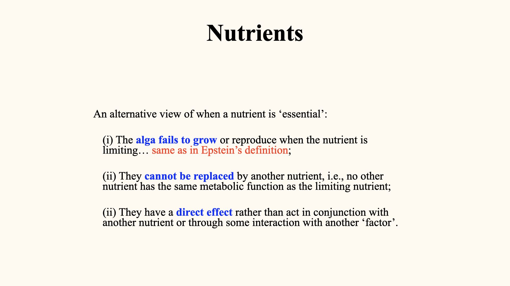

Our current understanding of plant nutrient uptake is largely indebted to studies conducted between the 1930s and 1970s. Algae, because of their direct exposure to dissolved nutrients, provided a simple and convenient model to study the principles of nutrient uptake, eventually informing our understanding of the entire plant kingdom.

### A classification based on physiological effect

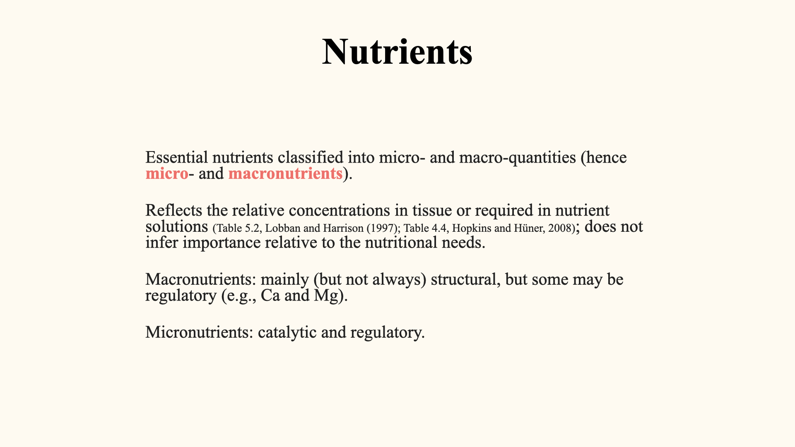

### Classification informed by nutrient quantities

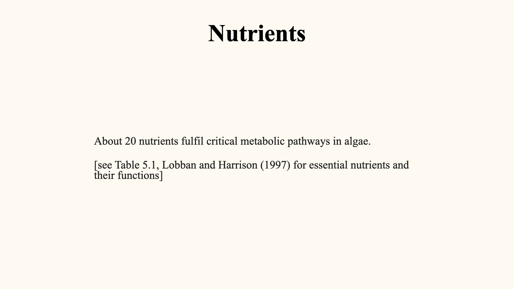

-   **Essential versus beneficial nutrients**: Essential nutrients are those without which a plant cannot survive or complete its life cycle. Even the absence of a single essential nutrient will halt growth, productivity, or reproduction. Beneficial nutrients enhance or facilitate physiological processes, but are not strictly required for survival or completion of the life cycle.

    -   By Epstein's (1972) definition, a nutrient is essential if the plant cannot complete a normal life cycle without it, and the element forms part of an essential plant constituent (e.g., magnesium in chlorophyll a).
    -   An essential element cannot be replaced by another element and has a necessary role in metabolism or structure; that role can include acting as an enzyme cofactor.

-   **Macronutrients versus micronutrients**: This classification reflects the relative quantity needed by the plant. Macronutrients are present and required in much higher concentrations; their roles are often structural, contributing to the biomass of the plant (e.g., carbon, nitrogen, phosphorus, oxygen, potassium). Micronutrients, though required in far smaller amounts, function mainly as catalysts or regulators (e.g., iron in nitrate reductase).

## So, Which Nutrients Are There?

Higher plants and algae share many (most) of the same nutrients, but their concentrations differ. Also, they differ extensively in the types of macromolecules they possess (e.g., secondary metabolites and so on), which causes the list of nutrients and their abundances to differ somewhat between these taxa.

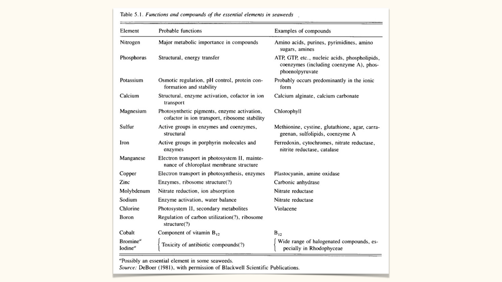

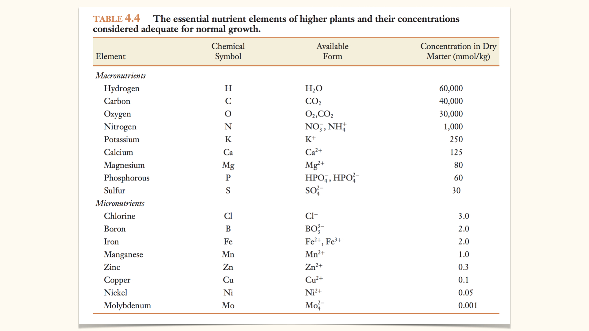

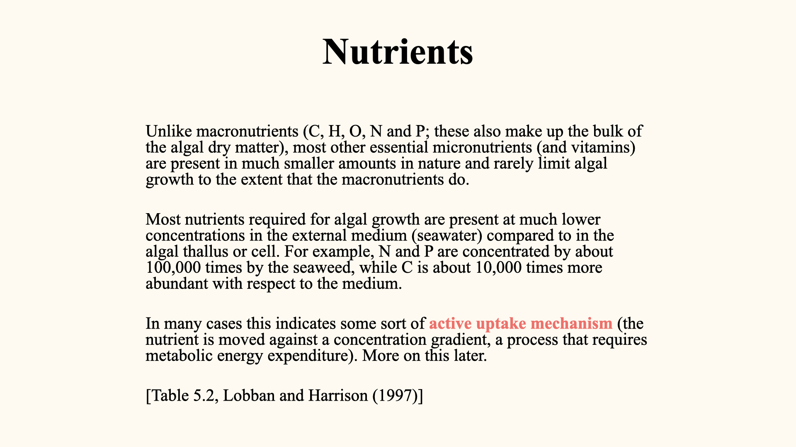

To reiterate: macronutrients contribute substantially to plant structure and biomass, whereas micronutrients are required in small amounts but are still essential because they act in catalytic and regulatory roles.

Algae (seaweeds) require around $20$ varieties of nutrients, including:

-   **Nitrogen**
-   **Phosphorus**
-   **Potassium**
-   **Calcium**, among others.

Nitrogen is central because it sits in amino acids, proteins, and nucleic acids. Phosphorus is equally important in nucleic acids, membrane phospholipids, and ATP. Potassium and other nutrients have their own structural and physiological roles.

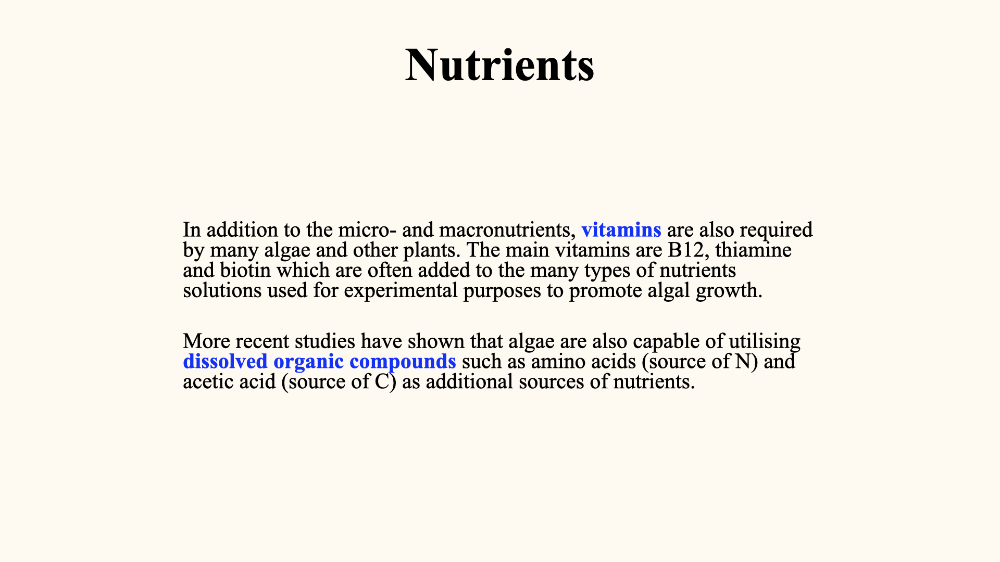

While the precise list of essential nutrients varies modestly between algae and higher plants (the latter require $17$ essential elements), the principle remains the same: the majority of biomass is composed of macronutrients.

::: callout-tip
## **Assessment Relevance**

I will not set examination questions that require simple regurgitation of lists (such as "List five essential elements in seaweeds"). Focus, rather, is on understanding the processes and underlying principles.
:::

Besides inorganic nutrients (the "bare elements," not bound in organic molecules), plants can, through mixotrophy, also absorb dissolved organic compounds, though this is much less common and less of a focus for today's discussion.

## Concentration Gradients and Uptake Mechanisms

Tables commonly show, per $\mathrm{kg}$ of dry plant material, that macronutrient concentrations are several orders of magnitude greater than those of micronutrients.

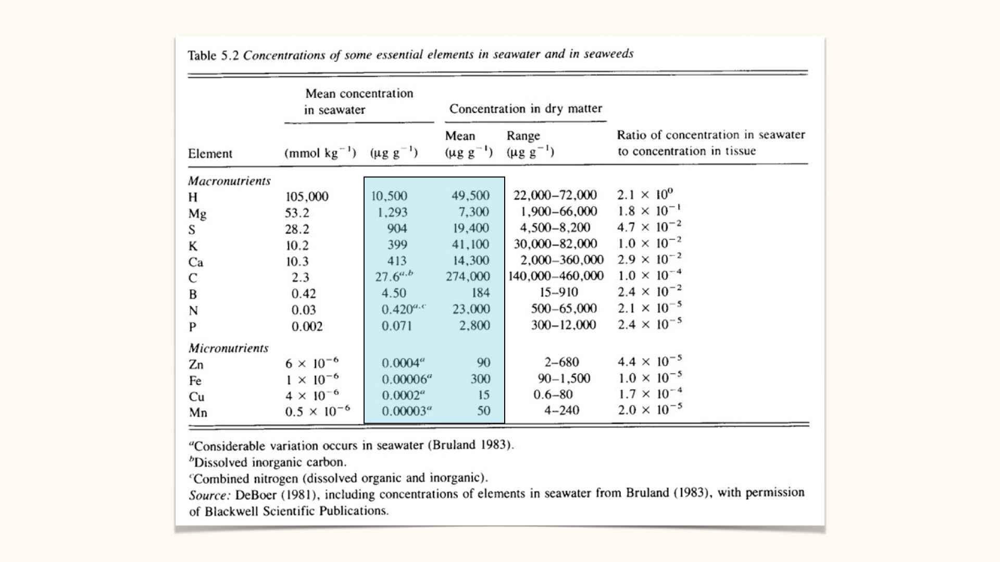](images/BDC223_L08a_slide16.jpeg)

Keep the dissolved nutrient outside the cell distinct from the total nutrient stored in its tissues. Much of the nitrogen inside a seaweed is incorporated into organic compounds, so a tissue N measurement is not directly comparable to the dissolved nitrate concentration in seawater.

Across a membrane, the direction of passive ion transport depends on the **electrochemical gradient**: both the concentration difference and the electrical potential matter. Active transport uses energy, directly or through coupling to another gradient, to move a substance against its electrochemical gradient. Osmosis describes the movement of water, rather than the uptake of dissolved nitrate.

Before reaching the membrane, nitrate must also travel through the surrounding water. The [first Blender visualisation](L08c-nutrients_visualised.qmd#sec-surface-gradient) isolates this external delivery step. It is important to distinguish diffusion towards the seaweed surface from transport across the membrane. The [third visualisation](L08c-nutrients_visualised.qmd#sec-crossing-membrane) then follows membrane permeability, electrochemical gradients and energy coupling.

## Limiting Nutrients: the Concept and Experiments

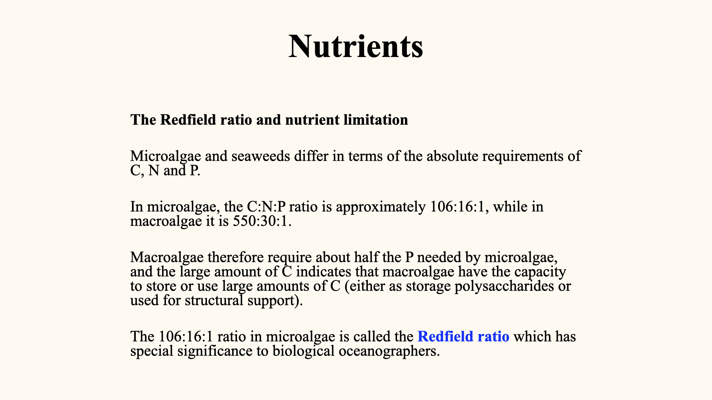

A nutrient restricts growth when its supply, relative to the organism's requirements and internal reserves, constrains the response under the conditions being considered. A nutrient-addition experiment can test this: compare a control with +N, +P and +N+P treatments while matching the other conditions.

An increase after adding N supports N limitation of the measured response. However, no response to one nutrient alone does not exclude its involvement: another nutrient, light or some other condition may also restrict growth. The response can change with experimental duration as reserves are used or a second nutrient becomes limiting. Marine N limitation is common, but N and P limitation are not divided neatly between marine and freshwater systems. [Elser et al. (2007)](https://doi.org/10.1111/j.1461-0248.2007.01113.x).

Use the [four-treatment experiment in concept 9](L08c-nutrients_visualised.qmd#sec-enrichment-oxygen) to distinguish an initial restriction from the additional restriction exposed after enrichment.

## The Redfield Ratio and Nutrient Limitation

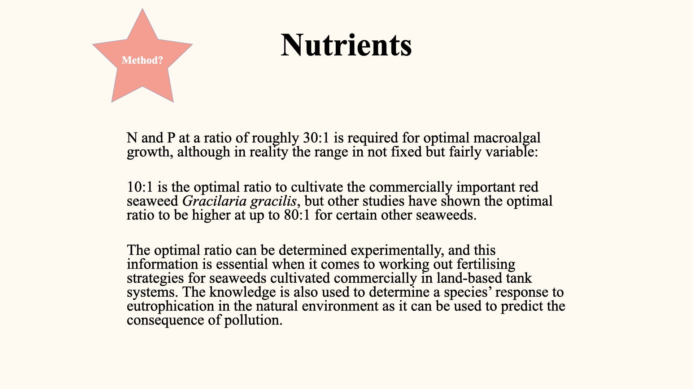

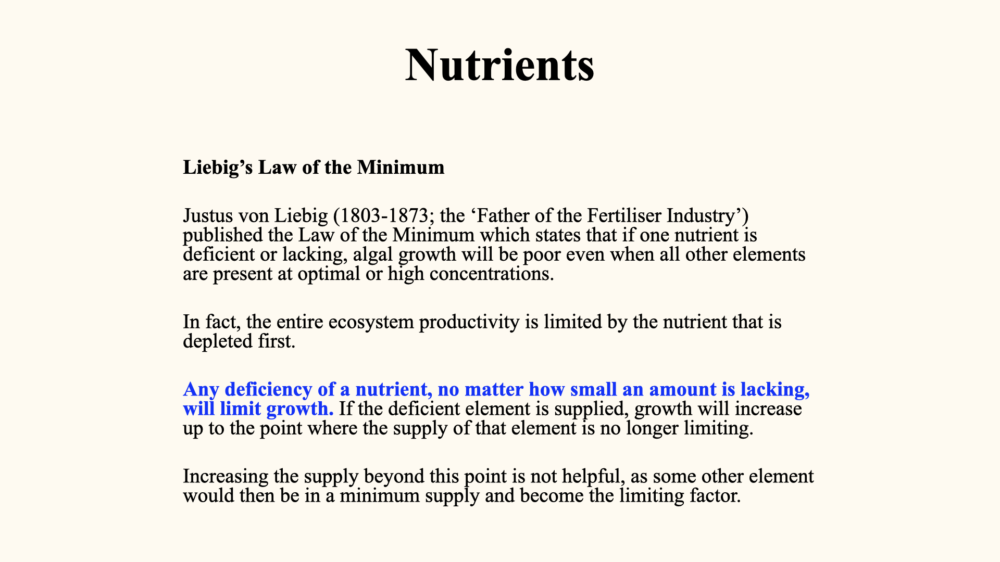

The Redfield ratio, $106\mathrm{C}:16\mathrm{N}:1\mathrm{P}$, is an empirical summary associated with marine plankton and nutrient cycling. It is not a requirement that every cell must maintain exactly this composition for optimal growth.

The often-cited $550\mathrm{C}:30\mathrm{N}:1\mathrm{P}$ for benthic marine plants is likewise a summary across variable material, including seaweeds and seagrasses. Structural carbon, species, growth conditions and nutrient storage contribute to variation. [Atkinson and Smith (1983)](https://doi.org/10.4319/lo.1983.28.3.0568).

Keep **tissue composition**, **dissolved nutrient concentration** and **nutrient supply rate** separate. Their ratios answer different questions. A deviation from a reference ratio can suggest a hypothesis about nutrient status; it does not, by itself, diagnose the limiting nutrient. Test the hypothesis using additions, tissue measurements and the growth response.

## Liebig's Law of the Minimum

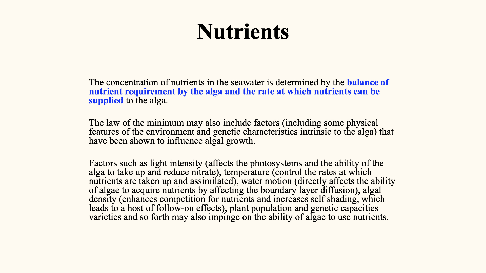

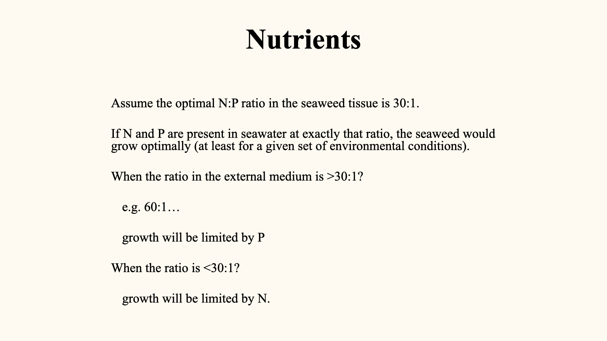

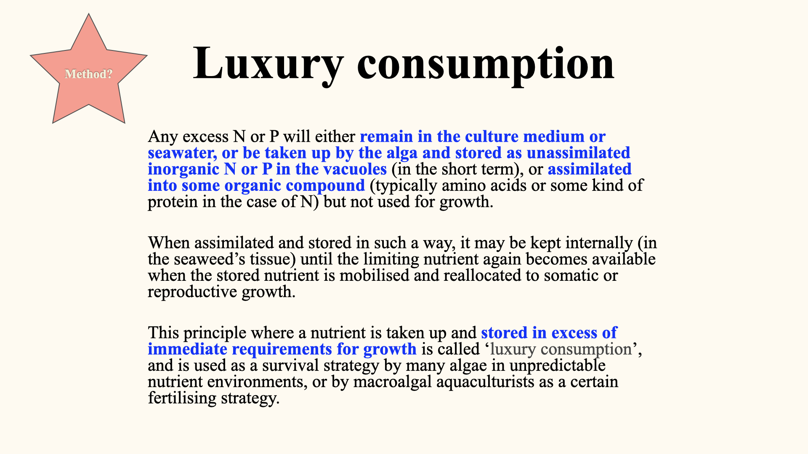

Liebig's law expresses a useful limiting case: an abundant resource cannot compensate for an insufficient essential resource. In a model with fixed requirements, attainable yield is set by whichever nutrient can support the least additional biomass.

For example, suppose each new biomass unit requires 10 µmol N and 1 µmol P. With 20 µmol N but only 1 µmol P available, P permits one additional unit and 10 µmol N remains unused. Add another µmol P and the same N inventory can support two units. These chosen requirements illustrate the accounting; they are not a universal seaweed ratio.

Real responses can involve simultaneous or sequential restrictions, variable tissue composition, internal reserves and environmental constraints. Use the minimum model to make a prediction, then examine whether the experimental pattern supports its assumptions.

## Luxury Consumption

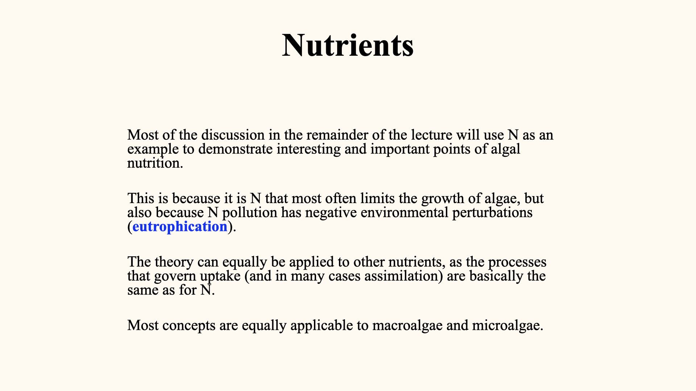

Luxury consumption means taking up more of a nutrient than is immediately required for growth and retaining the excess for later use. When external supply declines, these reserves may continue to support assimilation and growth, provided the other requirements are available.

This is useful in environments where nutrient supply fluctuates. Uptake and growth can then occur at different times. Storage capacity and regulation vary among species, tissues and conditions; luxury consumption is not exclusive to slow-growing or low-surface-area forms.

In [concept 7](L08c-nutrients_visualised.qmd#sec-storage-growth), we end a nutrient pulse by replacing the water. Follow the internal reserve and the new tissue separately. That is a direct way to see what a storage explanation predicts.

## Environmental Consequences of Nutrients and Uptake by Seaweeds

Yesterday we spoke about nutrients. I gave you a brief introduction to what nutrients are, and explained that they can be classified into macronutrients and micronutrients, as well as essential and beneficial nutrients. Today, we need to talk about the consequences — the environmental consequences — of nutrients. We will also begin to explore the field of measuring the uptake of nutrients by seaweeds. That is our plan for today.

One of the things we are going to do is to use nitrogen as our example. Nitrogen is convenient and easy to work with. The uptake mechanisms seen in many other nutrients are similar to those for nitrogen, so we can use it as a nice case study. But, of course, nitrogen is also one of the most important nutrients, both in the ocean and on land. It is often a limiting nutrient in the ocean and is important in many environmental problems we face today, such as eutrophication.

This lecture gives the ecophysiological background for eutrophication. We want to understand why some seaweeds respond so rapidly to nutrient enrichment and why certain forms become nuisance algae.

### Case study: the beijing olympics and eutrophication

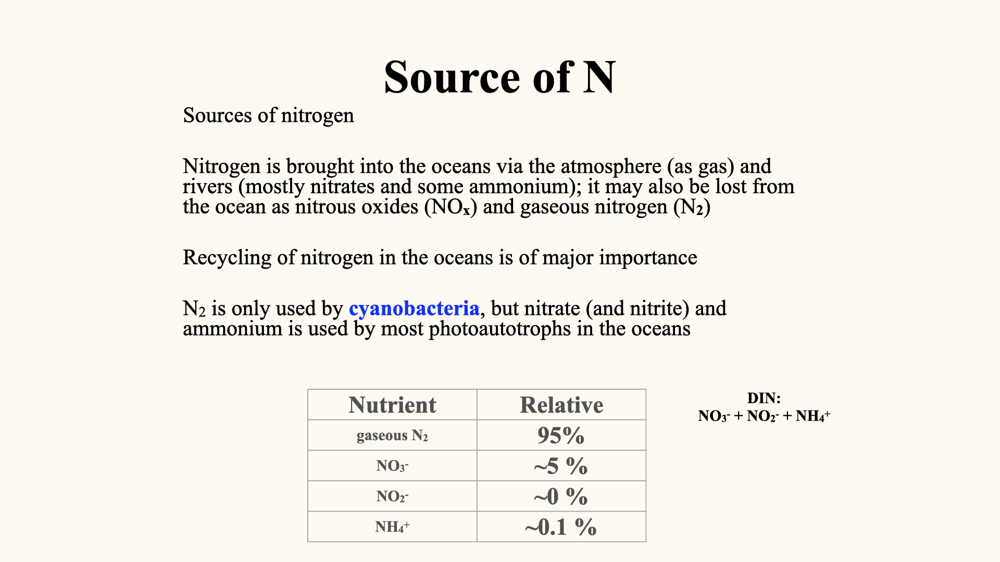

Before the 2008 Olympic sailing events, a large green tide accumulated near Qingdao. It is a useful example of why a bloom needs more than a one-cause explanation. Research linked the floating algae to southern Yellow Sea aquaculture areas and examined the transport and conditions that allowed their accumulation. Nutrient availability supported growth, while origins, wind and currents helped determine where biomass appeared. [Hu et al. (2010)](https://doi.org/10.1029/2009JC005561).

When explaining such an event, distinguish nutrient enrichment, production, transport and local accumulation. A photograph of abundant algae does not identify each of these processes.

### Sources and forms of nitrogen

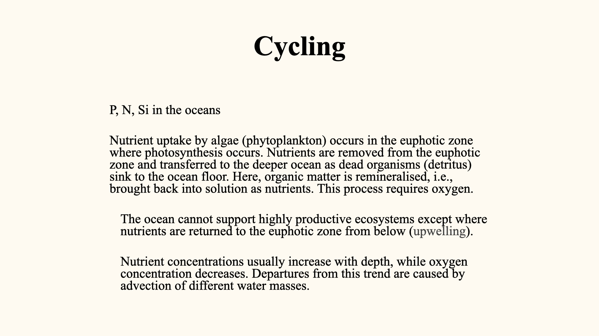

Nitrogen gas, $\mathrm{N_2}$, makes up about 78% of the atmosphere. Dissolving that gas in seawater does not convert it into nitrate or ammonium. Biological nitrogen fixation is one route by which $\mathrm{N_2}$ becomes fixed N available to the food web.

Rivers, wastewater and atmospheric deposition can bring reactive N into coastal waters. Rivers carry dissolved inorganic, dissolved organic and particulate forms; their proportions vary. Combustion-related nitrogen oxides ($\mathrm{NO_x}$) and their atmospheric products should not be confused with nitrous oxide ($\mathrm{N_2O}$).

Within the ocean, organisms repeatedly acquire, transform and release N. Upwelling transports existing nutrient-rich water towards the surface; it does not create nitrogen. The source and the transformation are separate parts of the explanation.

### Nitrogen fixation and cycling

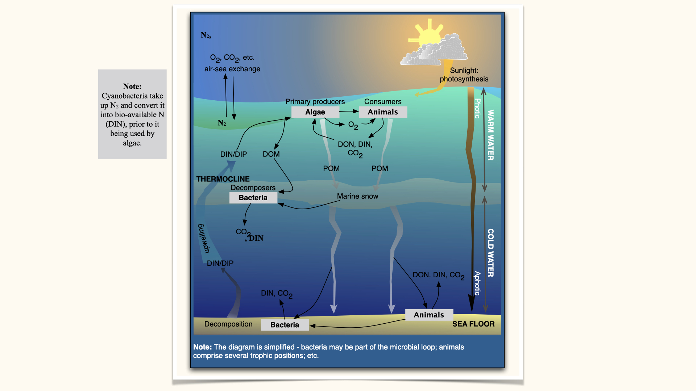

Nitrogen-fixing microorganisms, including some cyanobacteria, reduce $\mathrm{N_2}$ to ammonia, which can be assimilated into organic matter. Not all cyanobacteria fix N. Grazing, excretion and decomposition can subsequently make some of that fixed N available to other organisms.

For this lecture, DIN means nitrate ($\mathrm{NO_3^-}$), nitrite ($\mathrm{NO_2^-}$) and ammonium ($\mathrm{NH_4^+}$), expressed as their N content. The operational DIN sum excludes dissolved $\mathrm{N_2}$. Some organisms also use particular dissolved organic N compounds, so DIN does not encompass every usable N source.

The relative amounts of these pools vary with depth, oxygen conditions, biological activity and location. Do not apply a single percentage partition to every ocean water sample. Nitrite is an intermediate in several transformations and can accumulate where its production exceeds its consumption.

### The marine nitrogen cycle

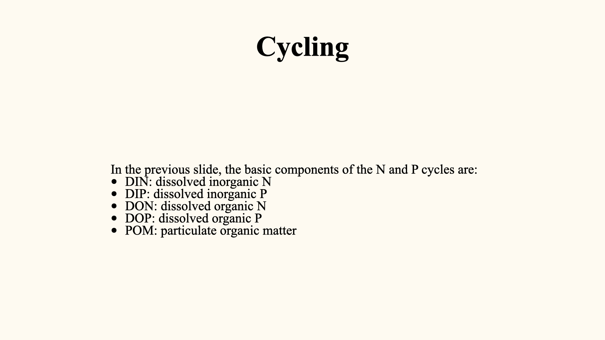

Biogeochemistry studies the movement and transformation of elements among organisms, water, air and sediments. In the marine N cycle, uptake transfers dissolved N into organisms; assimilation incorporates N into organic compounds; feeding transfers it among organisms; and excretion and decomposition return some N to the surrounding water.

Atmospheric gas exchange alone does not produce DIN from $\mathrm{N_2}$. Fixation is needed to make that N biologically available to organisms unable to fix it themselves. Conversely, denitrification and anammox can return fixed N to $\mathrm{N_2}$ under suitable conditions.

Particulate organic matter, including organic N, can settle as marine snow. Settling is export from a surface-water compartment, but may remain within the wider ecosystem. Microbial decomposition releases inorganic nutrients and consumes oxygen when respiration is aerobic. Some organic matter reaches deeper water or sediments; some may be buried.

Dissolved organic N also enters the cycle through release, feeding and decomposition. Its use depends on the compound and the organism. Choose the system boundary before deciding whether a flux represents recycling or removal.

### Remineralisation and upwelling

Remineralisation returns organic N to inorganic form, principally ammonium. Nitrification is a further transformation: ammonium is oxidised through nitrite to nitrate. This distinction matters because aerobic decomposition and nitrification both have oxygen demands, but they are different processes.

Upwelling brings nutrient-rich subsurface water towards illuminated waters, connecting deeper recycling with surface production. Light supports photosynthetic production in the euphotic zone. However, uptake and N transformations are not confined to daylight or surface water: seaweeds can use stored resources in darkness, and heterotrophic and chemotrophic microorganisms transform N at depth.

The final film separates the coastal overview from a dark bottom-water experiment. Its oxygen model includes aerobic decomposition and ammonium regeneration; it does not include nitrification, photosynthesis or anaerobic pathways.

### Definitions: some key terms

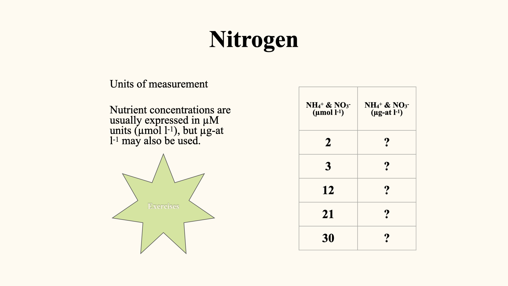

Some important definitions:

-   **DIN:** Dissolved Inorganic Nitrogen; includes ammonium, nitrate, nitrite.
-   **DIP:** Dissolved Inorganic Phosphorus; phosphorus equivalents to DIN.
-   **DON:** Dissolved Organic Nitrogen.
-   **POM:** Particulate Organic Matter; also includes particulate forms of both nitrogen and phosphorus.

The biogeochemical cycle operates similarly on land, but most of the transformations happen within the soil, particularly around plant roots, as well as via aboveground decomposition processes — for example, as leaves fall, decompose, and transfer nitrogen back into the soil.

### Units, concentrations, and oceanographic patterns

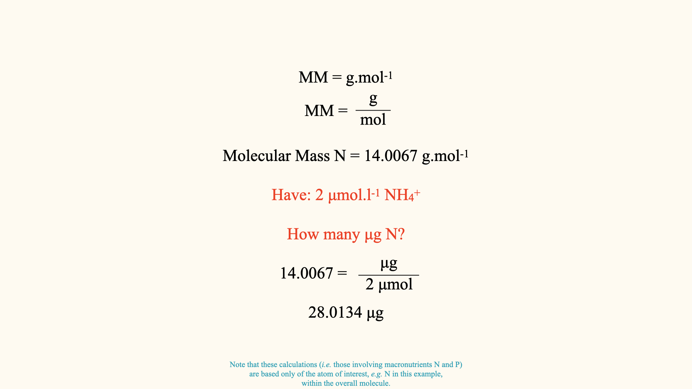

When reading literature about nitrogen as a macronutrient, you will encounter various units: micromolar ($\mu$M), microgram atom per litre, and so on. These all describe the concentration of nitrogen in water or solid solution. You should recall from first-year chemistry how to convert between micromolar and microgram atom per litre ($\mu$M to $\mu$g atom L$^{-1}$), and vice versa. Be familiar with these conversions, as you will encounter them in tests.

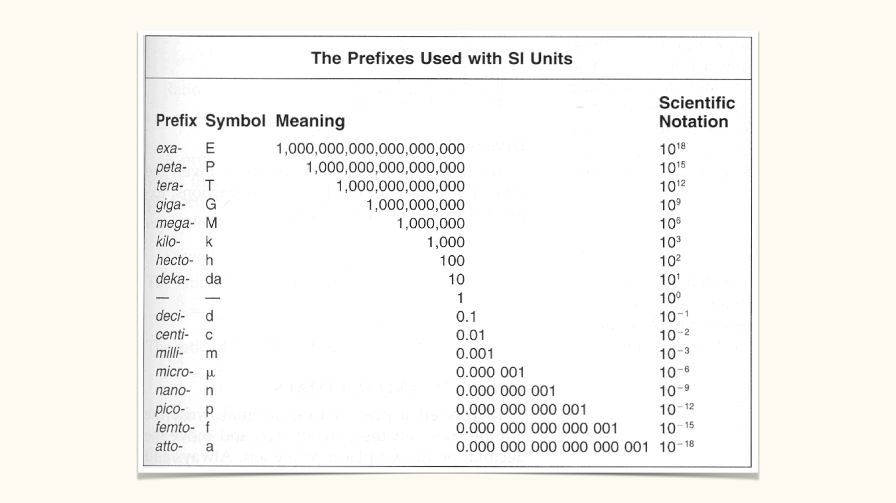

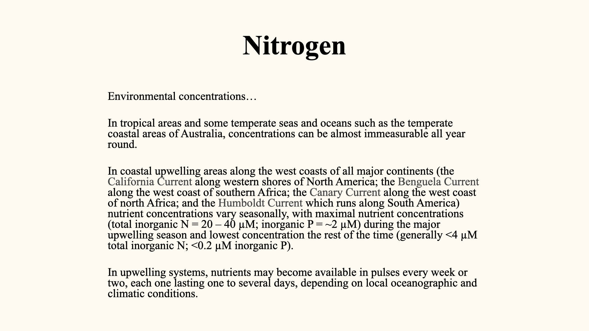

You must also know the SI prefixes and the number of zeros associated with each — grammes, milligrammes, microgrammes, nanogrammes, picogrammes, et cetera. In plant physiology, a basic grasp of chemistry and SI unit prefixes is assumed.

### Typical oceanic nitrogen concentrations

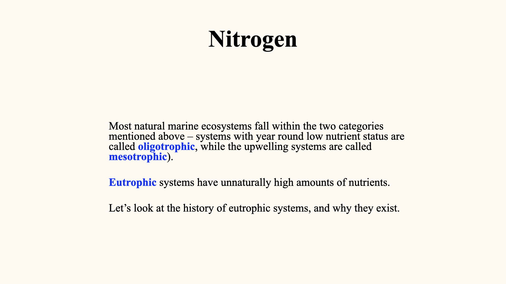

Always specify the N form, depth and units. Surface nitrate may be very low where biological demand has depleted it, while subsurface or recently upwelled water can contain much more. Tropical waters are not uniformly nutrient-poor: equatorial upwelling is an obvious reason to be cautious about a latitude-only description.

In the Saldanha Bay context used in this lecture, nitrate concentrations ranged from undetectable to around 30–40 µmol/L in some areas, while ammonium was often much lower. These are contextual observations, not fixed thresholds for every oceanographic region. [Smit (2002)](../docs/Smit_2002.pdf).

As a units exercise, 40 µmol N/L divided by 2 µmol P/L gives a molar N:P ratio of **20:1**, not 10:1. Neither that ratio nor a single concentration measurement diagnoses nutrient limitation. Supply, uptake, mixing and internal nutrient status all change over time.

### Classification of oceanic systems based on nutrient levels

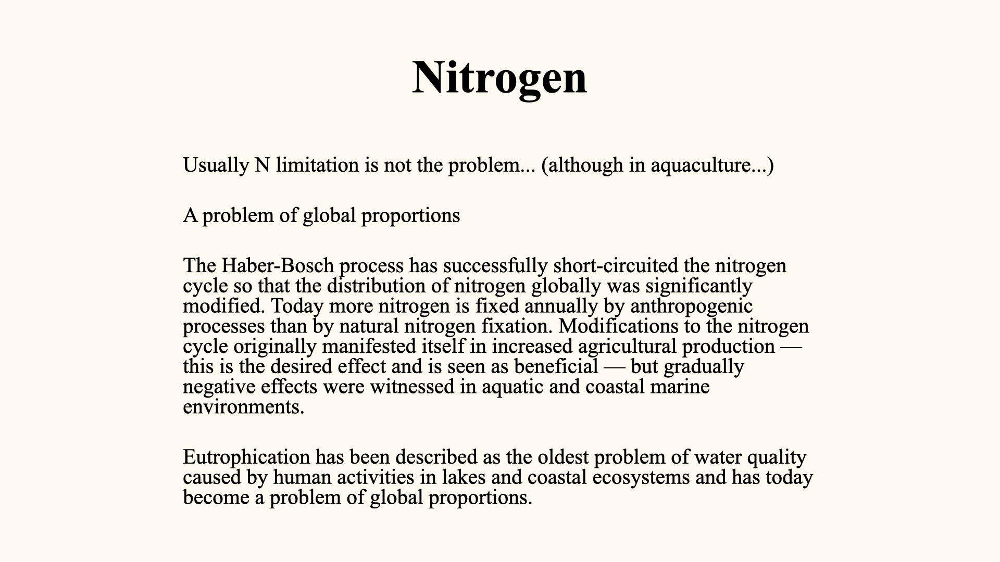

Oligotrophic, mesotrophic and eutrophic describe broadly low, intermediate and high nutrient availability or productivity, depending on the classification being used. State the indicator and context. Low dissolved nutrient concentrations can also occur during active uptake, so they do not always imply low production.

Eutrophic conditions may have natural or human causes. Upwelling regions can be highly productive; they should not automatically be assigned to an intermediate category. Eutrophication concerns nutrient enrichment and its biological consequences, rather than every naturally productive coastal system.

### The nitrogen bomb: human impact

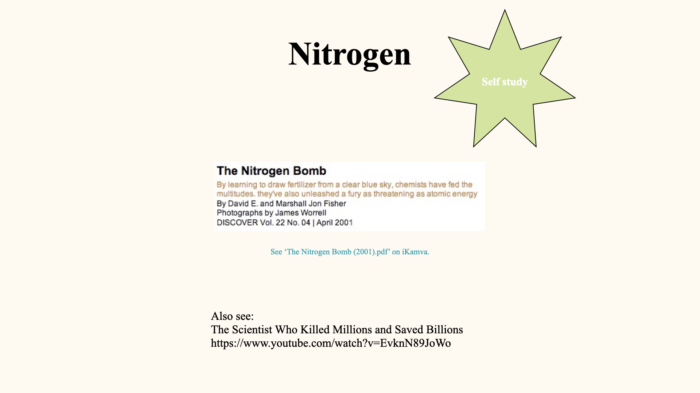

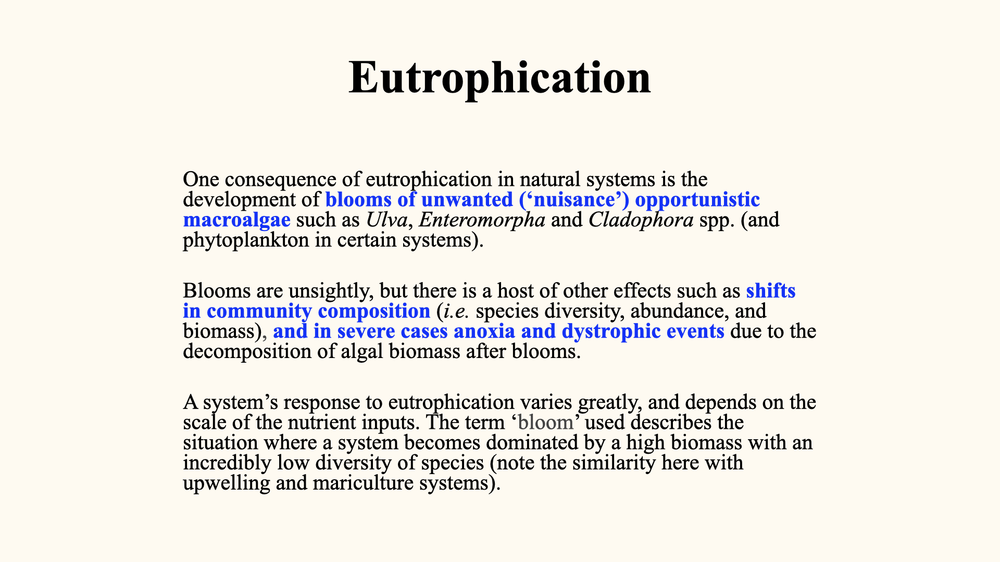

For your self-study: read the article "The Nitrogen Bomb" (available on Ecoma). The Haber-Bosch process has resulted in a huge problem worldwide in both terrestrial and aquatic systems. "Nitrogen bomb" is a metaphor for the disastrous potential of excessive and unwisely applied nitrogen, most sharply observed in eutrophication. This is examinable content.

### What is eutrophication?

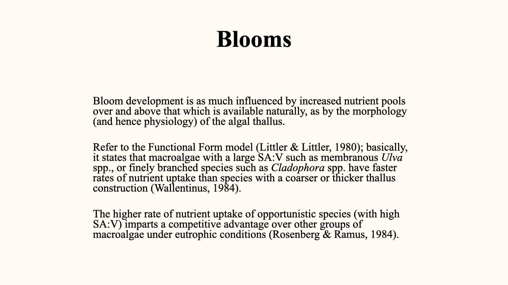

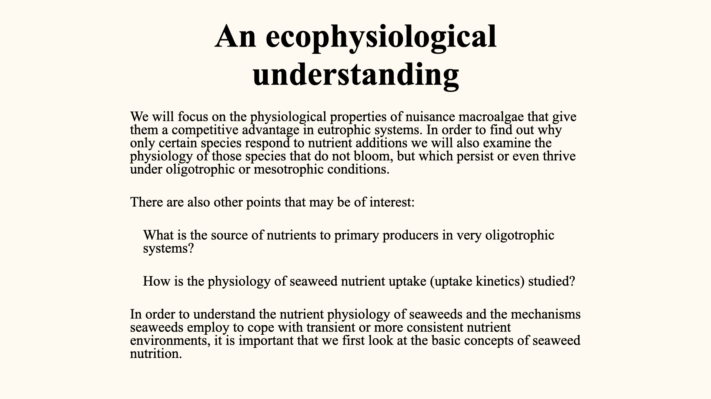

Nutrient enrichment can stimulate production when nutrients restrict growth and the other requirements are available. Biomass accumulates when production exceeds losses through grazing, mortality and export. Fast uptake, internal storage, favourable light and temperature, and water retention can all contribute; surface area alone does not guarantee a bloom.

Accumulated algae can shade other organisms and alter habitats and community composition. The outcome need not be the dominance of exactly one species, and the magnitude of the response varies among systems.

Living organisms respire, and decomposition of organic matter adds an oxygen demand. Oxygen loss occurs when consumption exceeds the oxygen supplied by photosynthesis and physical renewal. At night photosynthetic supply ceases, but respiration continues. In dark bottom water there may be little photosynthetic supply even during the day. Complete depletion is possible under severe conditions, but is not inevitable after every bloom. [Diaz and Rosenberg (2008)](https://doi.org/10.1126/science.1156401).

The [ninth film](L08c-nutrients_visualised.qmd#sec-enrichment-oxygen) first tests N and P additions, then holds initial organic loading constant while changing oxygen renewal. Explain why those are different experiments.

### Mitigating eutrophication

Source control addresses continuing enrichment: wastewater treatment, reduced nutrient losses from agriculture and appropriate waste management can reduce the load reaching receiving waters. Which nutrient sources matter requires evidence from that system.

Harvesting nuisance algae can remove some stored N and P and relieve local impacts, but it does not by itself stop new inputs. Account for the harvested nutrient amount and the disposal destination. Assessing mitigation requires both source and receiving-water measurements, including production, retention and oxygen conditions.

## Linking Form and Function: Surface Area to Volume Ratio

Responses to nutrient enrichment depend on both morphology and physiology. High surface area relative to tissue volume can support rapid uptake when that surface is active and adequately supplied. Littler and Littler's functional form model connects morphology with ecological performance, but form alone does not establish which species will outcompete another.

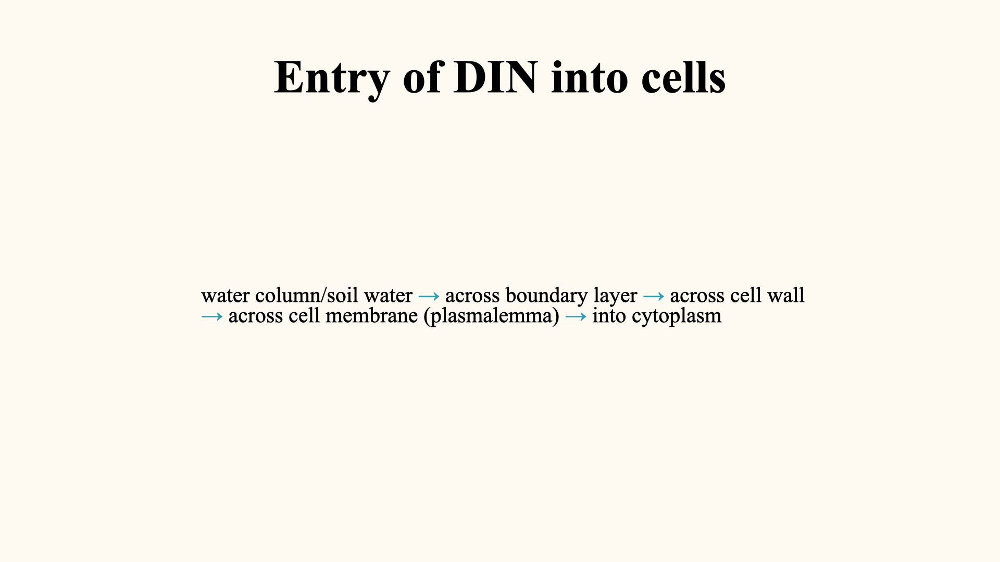

Connect surface area to volume ratio with the units of nutrient uptake. At the same flux per unit active surface, more area per gram gives greater uptake per gram. Water renewal and tissue condition can change that comparison. [Concept 6: Form and nutrient supply](L08c-nutrients_visualised.qmd#sec-form-and-supply) holds tissue volume constant, unfolds the exchange surfaces, and tests a canopy example with unchanged area but restricted nutrient supply.

If you have questions or do not grasp a particular aspect, you are welcome to ask on WhatsApp. Please ensure you read the assigned articles and refresh your knowledge of unit conversions and SI prefixes, as you will be expected to use this knowledge fluently.

Read further on eutrophication. Enrichment can alter production, competition and habitat, but the outcome depends on the organisms, other resources and losses. Test the steps between an input and the ecological response you want to explain.

## Nutrient Uptake

Today, I want to discuss the physiology of plant nutrient uptake, specifically focussing on the processes by which algae — seaweeds, in marine environments — take up nutrients from their surroundings. Throughout this lecture, I will be using the terms 'algae', 'seaweed', and 'plant' interchangeably; for the purposes of our discussion, they all refer to seaweeds, as the experiments we are considering were conducted with seaweeds. The uptake processes in terrestrial plant roots are similar regarding the mechanism of transfer from the environment into the plant, but the main differences lie in the environmental processes within soils.

Our goal is to develop an ecophysiological understanding of how plants (seaweeds) absorb nutrients, which will also help explain how seaweeds thrive in various marine habitats, and why many can become nuisance species under eutrophic conditions.

### Pathways and barriers to nutrient uptake

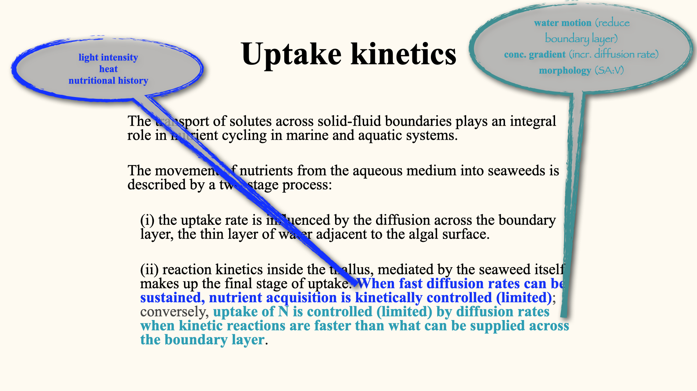

When a dissolved nutrient is taken up, it first travels from the surrounding water towards the thallus surface. It then passes through the cell wall and across the plasma membrane. Transport through the external water and transport across the membrane are separate steps, and either can restrict nutrient acquisition.

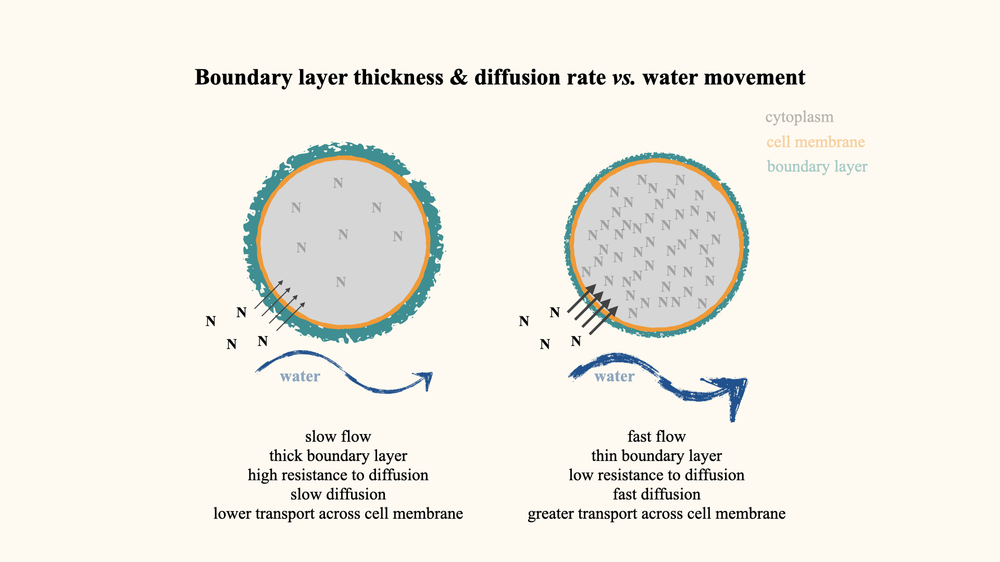

Nutrient uptake can be described as a two-stage process:

1.  **External Phase**: Water movement transports and mixes nutrients outside the thallus. Very close to the surface, molecular diffusion is important for delivery. If uptake depletes this water, its dissolved nutrient concentration is lower than that of the bulk water farther away. The resulting concentration gradient supports a net diffusive flux towards the surface.

2.  **Membrane Transport and Internal Processing**: Membrane transport controls entry into the cell. Nutrients may then be stored or assimilated into organic compounds. These processes have finite capacities and need not occur at the same rate, so uptake is not necessarily followed by immediate growth.

When delivery is sufficient, membrane transport or internal processing may set the rate. When delivery is restricted, the surface concentration can fall and reduce uptake. These controls are coupled, and species need not have identical transport or processing capacities.

### Factors influencing nitrogen uptake

Nitrogen (and other macronutrient) uptake is influenced by many factors:

-   **External Conditions:** The thickness of the boundary layer and the actual concentration of nutrients in the water are crucial. These are influenced by physical conditions outside the plant.
-   **Form of Nutrient:** Nitrate and ammonium can have different uptake rates and transport systems. Neither the nutrient name nor the shape of its uptake curve identifies the mechanism on its own. Distinguish uncharged ammonia from positively charged ammonium.
-   **Nutrient Starvation History:** Nutrient-depleted tissue may show rapid uptake after a pulse; the response depends on reserves, regulation and tissue condition.
-   **Environmental Conditions:** Light and temperature can change uptake and processing within useful ranges; higher values do not always increase capacity or uptake.
-   **Surface Area to Volume Ratio:** As discussed, this has a substantial effect on uptake dynamics.
-   **Mechanisms of Uptake:** The presence of additional mechanisms (such as facilitated diffusion) can also influence overall nutrient uptake.

All of these together influence the rate at which macronutrients such as nitrogen and phosphorus are taken up from the environment.

### The boundary layer concept

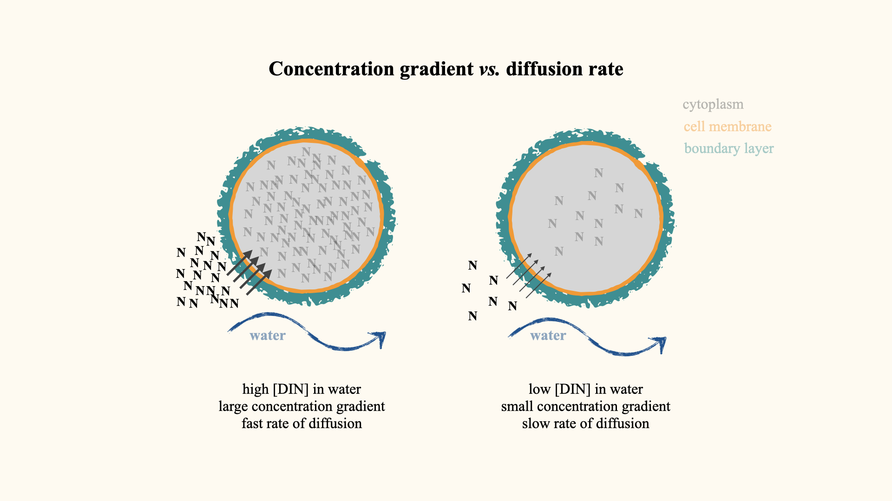

Picture a small region of water beside the thallus. Individual molecules move randomly, including both towards and away from the surface. Uptake removes nutrients at the surface. If replacement is slow, the nearby water becomes depleted and a **concentration boundary layer** develops. This is a region within the water, not a solid skin. Molecular motion continues even when we do not stir the flask.

Let $C_b$ be the dissolved concentration in the bulk water and $C_s$ the dissolved concentration at the thallus surface. For an approximately planar layer of effective thickness $\delta$, with a steady, approximately linear concentration profile, the inward diffusive flux per unit area is

$$J_{\mathrm{in}} \approx D\frac{C_b-C_s}{\delta},$$

where $D$ is the diffusion coefficient. Use consistent units. The flux increases with the concentration difference and decreases with diffusion distance. This external gradient ends at the **surface water concentration**, not at the total nitrogen concentration inside the tissue.

Greater water movement can replenish depleted water and reduce the effective diffusion distance. At the same temperature, this does not mean that stirring makes individual molecules diffuse faster. It changes their delivery by water movement and the concentration field near the surface. The concentration boundary layer is also distinct from the **hydrodynamic boundary layer**, which describes changes in water velocity near the surface.

When external delivery restricts uptake, improved water movement can increase uptake. If membrane transport or internal processing already sets the rate, the same increase in water movement may have little effect.

::: callout-tip
## Watch the gradient develop

[Concept 1: From the flask to the surface](L08c-nutrients_visualised.qmd#sec-surface-gradient) follows a nitrogen pulse towards the thallus, shows random motion and surface depletion, and tests what happens when uptake stops. Watch the profile change while the bulk concentration is held constant.
:::

### Influence of environmental nutrient concentration

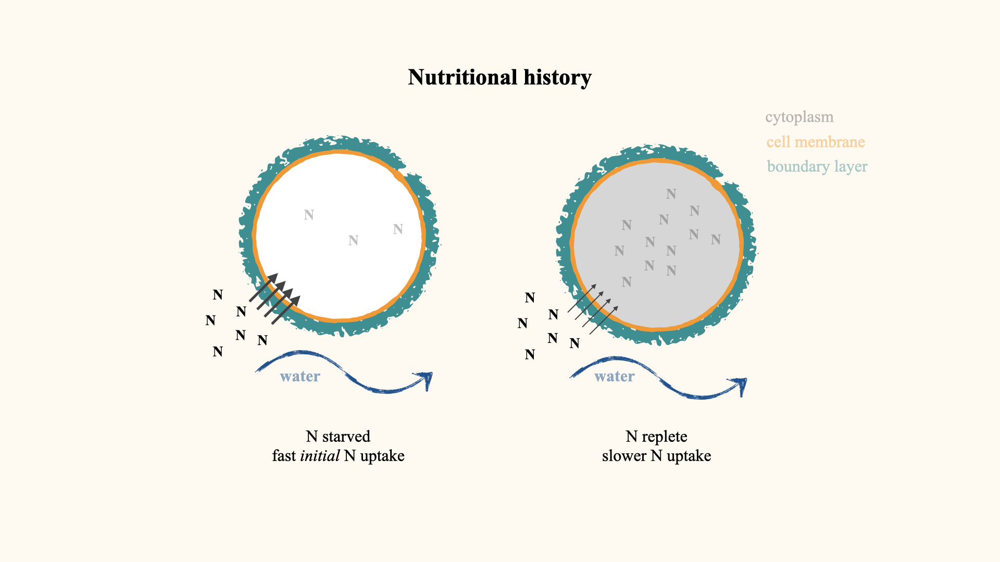

Water movement is not the only factor affecting delivery. Increasing the bulk nutrient concentration can increase the difference between bulk and surface concentrations, supporting greater diffusive supply. The response also depends on how quickly the seaweed removes nutrients at the surface; $C_s$ is an outcome of the balance between delivery and uptake.

In very low-flow conditions, increasing the concentration of external nutrients can compensate somewhat for a thick boundary layer, enhancing uptake despite slow water movement.

These two principles — the thickness of the boundary layer (and thus water movement) and the nutrient concentration gradient — underlie the role of the diffusion step in limiting nutrient uptake.

### Algal nutritional history

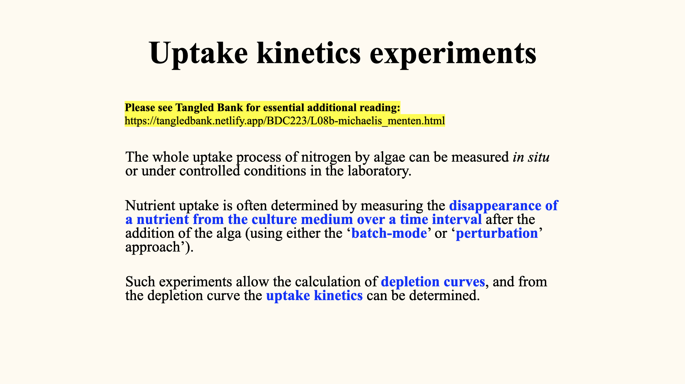

Continued growth during a period of low external N can draw down internal reserves. When functional, nutrient-depleted tissue receives a new pulse, uptake may exceed that of otherwise comparable replete tissue. Internal feedback, demand and changes in uptake machinery are possible explanations.

The response depends on prior conditions and tissue health. It is not an unlimited rule that longer starvation gives faster uptake. In [concept 7](L08c-nutrients_visualised.qmd#sec-storage-growth), compare reserve status while holding starting structural biomass and external concentration constant; then ask what measurements would test the explanation.

## Measuring Nutrient Uptake in the Laboratory

::: callout-tip
## **Supplement Your Study of Nutrient Uptake:**

A highly detailed protocol for conducting nutrient uptake experiments is provided in "[Lecture 8b: Uptake Kinetics — Michaelis-Menten](L08b-nutrients_michaelis_menten.qmd)."
:::

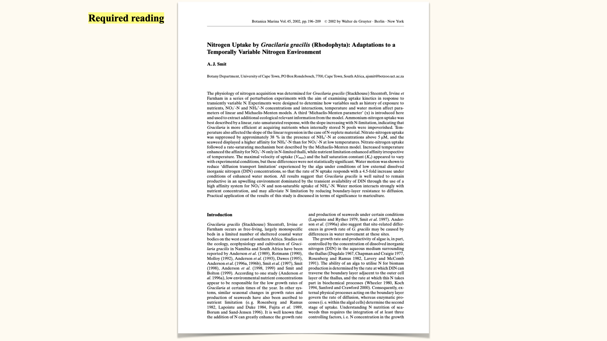

To quantify nutrient uptake in plants, algae, and seaweeds, we perform controlled experiments in laboratory flasks. Here is the protocol I followed for my PhD research:

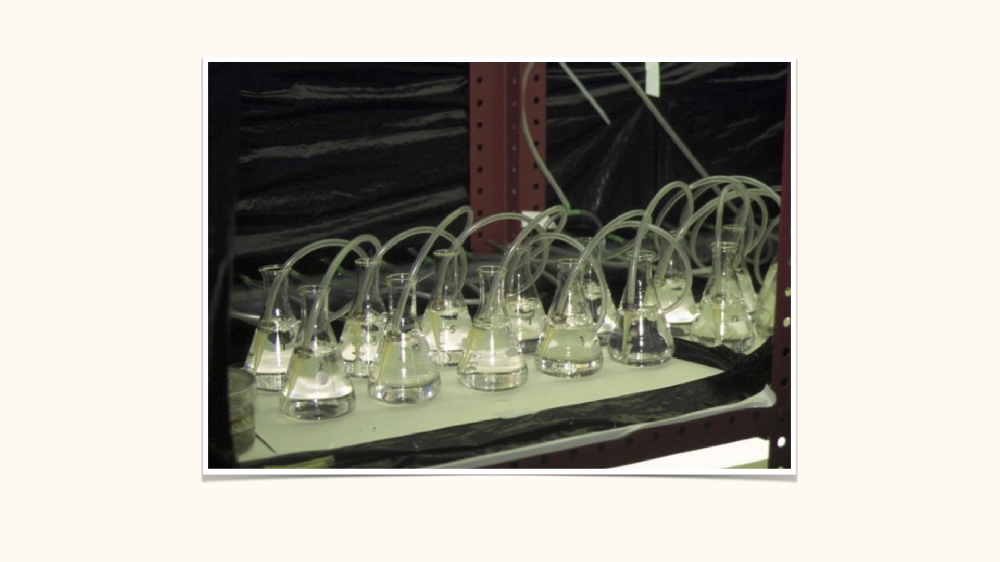

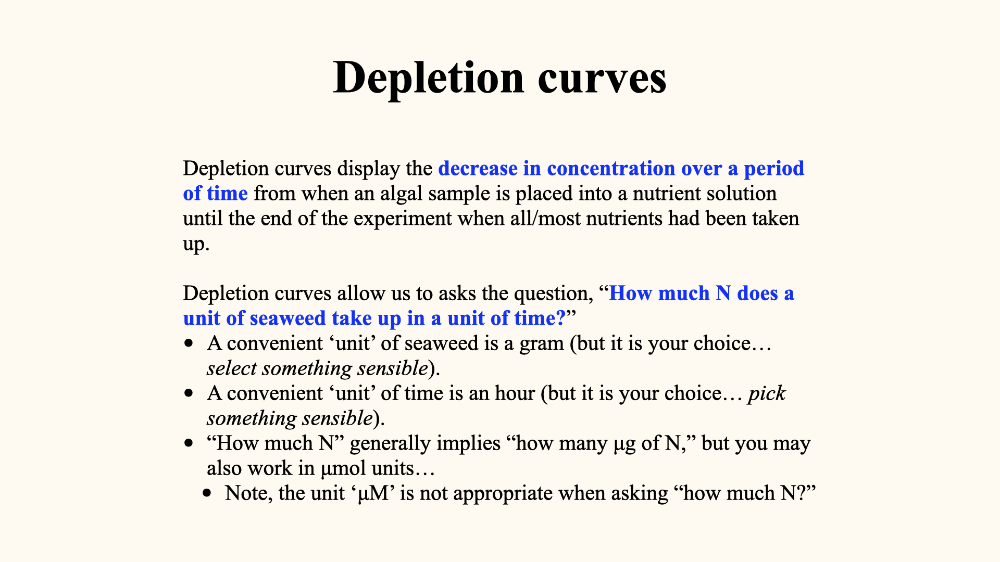

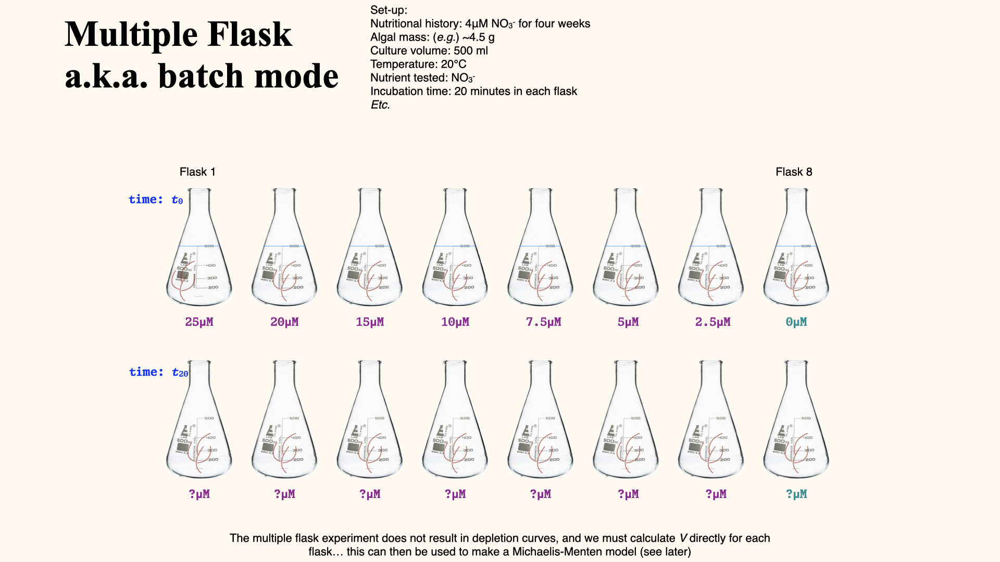

Each flask contains seawater with a known, enriched nutrient concentration and a measured piece of seaweed. At both the start and end of a timed interval (usually 20 minutes), water samples are taken to measure nutrient concentration. The decrease in nutrients reflects uptake by the seaweed.

Bubbling increases water movement and can reduce external transport resistance. Its effect on uptake depends on whether delivery restricts the rate; compare matched conditions and keep this separate from a change in molecular diffusion coefficient.

Something that we need to keep in mind when we design these uptake experiments, and when we calculate depletion curves, is that we need to be very certain of the units of measurement that we use during the conduction of our experiment. Typically, we would want to select a certain amount of seaweed — the mass of seaweed that we are going to place within a certain volume of water — and we are going to measure the rate of disappearance of that nutrient from that water over a certain amount of time. We also have to have an idea of the amount of nutrients present in the water.

Firstly, when we work with seaweeds, a typical mass unit of measurement would be grams. Most of the seaweeds that we can work with are of a size where we can weigh them and represent their mass in a couple of grams to tens of grams. Some of the larger seaweeds would weigh in the order of kilograms, and so on. So, we need to be sure that we use a unit of measurement that is appropriate for the thing being studied.

Nutrient uptake as a process can happen very quickly. It can happen over the space of minutes. Certainly, within a period of less than an hour, we can very easily measure the rate of disappearance of nutrients from the culture medium. So, a convenient unit for time measurement would be per hour. But again, depending on the organism that you are going to study, you will have to pick something sensible and relevant to that organism.

When we talk about the volume of the culture medium (usually dictated by the size of our experimental containers), typically we are going to take a small piece of seaweed, algal tissue excised from the whole plant, and put it into a smaller volume of water. That volume of water is often something that can very easily fit into a flask. So, the units of measurement there would be in the millilitre range. Often, the amount of seawater contained in this experiment is, say, less than a litre. In my experiments, it was $250\;\mathrm{mL}$ or so, if I remember correctly.

Then, concentration units. There are different ways that we can represent chemical concentrations — that is, the concentration of the nutrient in question. We can measure concentrations in micromolar, for example $\,\mu\mathrm{mol\,L}^{-1}$ ($\,\mu\mathrm{M}$), or we can represent concentrations in micrograms per litre, $\,\mu\mathrm{g\,L}^{-1}$. Again, be sensible in terms of what unit you choose to represent your measurements in.

It is very important that we know these units right at the beginning of our experiments, because they are going to carry through multiple stages of calculations, so that we represent an uptake rate in a sensible unit such as for moles of nutrients taken up per gram of seaweed per hour, i.e., $\,\mathrm{mol}\;\mathrm{g}^{-1}\;\mathrm{h}^{-1}$. For example, we normalise data to a 'unit' of seaweed — typically, per gram, since different flasks might contain slightly different masses (e.g., $1.2\,\mathrm{g}$ versus $1.1\,\mathrm{g}$). By dividing the uptake rate by available mass, we standardise uptake on a per-gram basis. Similarly, we standardise to unit of time by converting measurements taken over 20 minutes to an hourly rate by simple multiplication. Remember, from past lectures, conversion between units (micrograms and micromolar, for instance) is sometimes required.

### Types of uptake experiments

#### Multiple flask experiment

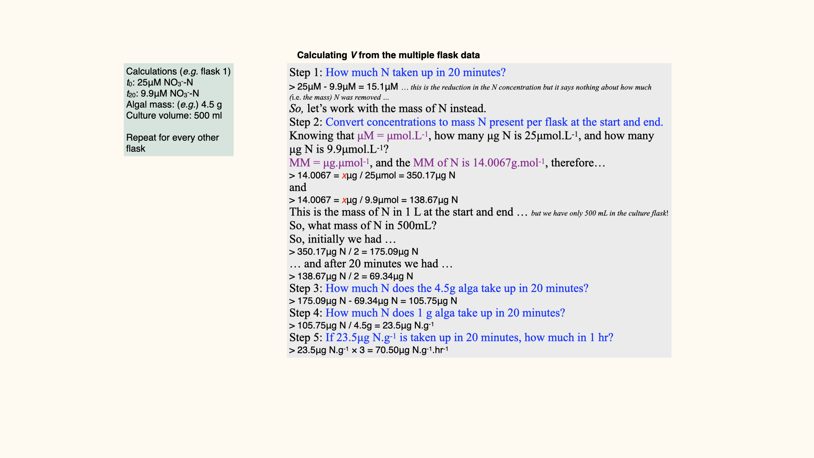

In a multiple flask experiment, each flask begins with a different initial concentration of nutrient (e.g., $25\,\mu\mathrm{mol}\,\mathrm{L}^{-1}$, $20\,\mu\mathrm{mol}\,\mathrm{L}^{-1}$, $15\,\mu\mathrm{mol}\,\mathrm{L}^{-1}$, etc.), the same amount of seaweed, same water volume (e.g., $500\,\mathrm{mL}$), and the same temperature (e.g., $20^\circ\mathrm{C}$). After a set duration, changes in nutrient concentration indicate how much has been taken up. Calculations are carefully outlined for you and involve correcting for flask volume, time, and seaweed mass.

The treatments span a range of nutrient concentrations, including one with no added nutrient. If the measured concentration is initially zero, this treatment can reveal net nutrient release from the seaweed and its associated organisms.

A separate **no-seaweed control** contains nutrient and the same water and apparatus, but no seaweed. It tests for background changes such as removal from the water or adsorption to the container. Under ideal conditions its concentration stays constant. Include suitable controls and replicate flasks when attributing nutrient disappearance to the seaweed.

These controls answer different questions. A zero-added-nutrient treatment does not rule out all release or removal processes at other concentrations. Any correction requires evidence that the measured background process also applies to the treatment concerned.

#### Calculating N uptake in multiple flask experiments

The process of calculating nutrient uptake rates from the depletion curves, which we can establish from the multiple flask experiments, might at first appear complicated. There are indeed many steps involved and multiple points along the way where it is necessary to translate units from one form to another. However, if you understand the process thoroughly, all of these steps become extremely logical and systematic.

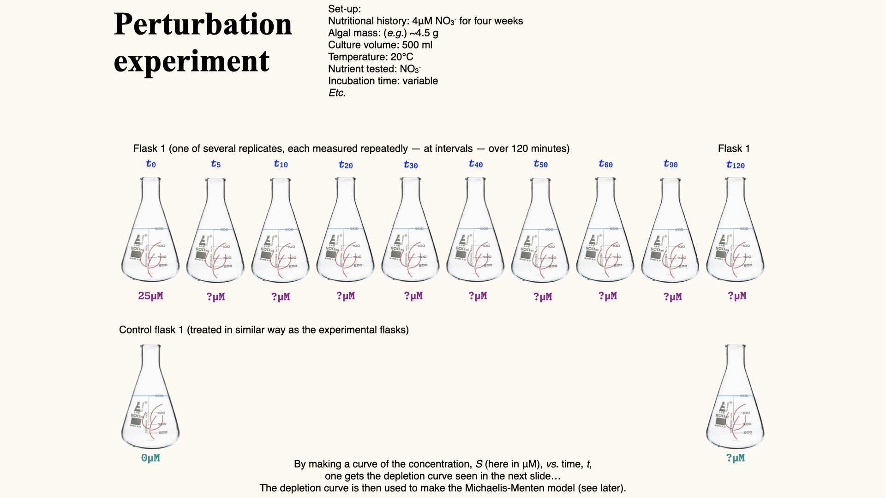

It becomes quite straightforward with sufficient knowledge — of course, practical experience helps tremendously — but at the fundamental level, if I simply provide you with the mass of seaweed used in our experiment, the exact duration for which they are exposed to the experimental conditions, and the concentrations of nutrients in the various flasks both before we begin the experiment and, let us say, after $20$ minutes, you should be able to work things out. If I give you only those values, you can, by applying a logical system of calculations, arrive at the required answer, that is, the rate of nutrient uptake.

The answer to this seemingly complex question is reported in the units you see in the final result: the amount of nutrient taken up per gram of seaweed per hour, or $\left(\frac{\Delta\text{units of nutrient}}{\mathrm{g\, seaweed}\cdot\mathrm{h}}\right)$. Simply by knowing what your final units are — which, in this case, is a rate — you have already laid out all the key steps needed to get from the start of the experiment to your final output.

In fact, the method for calculation can often be deduced just by carefully considering the unit of measurement in which we report the result. If you break it down, the logical operations to get to that unit will show you each calculation required, provided you start with sound, well-measured data.

#### Perturbation experiments

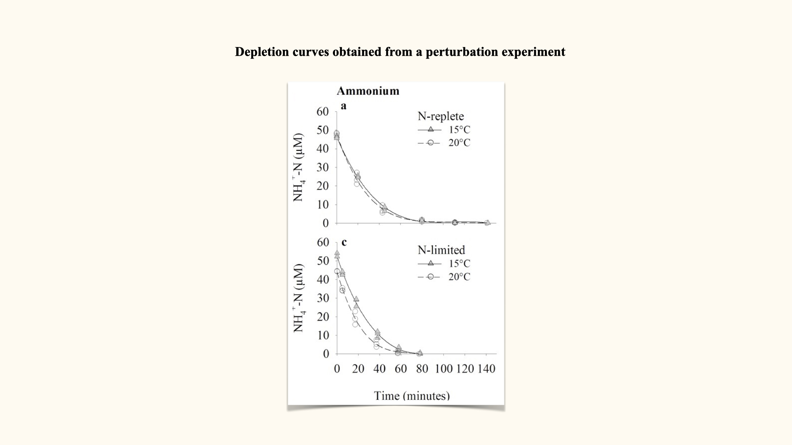

With the perturbation experiment (the approach used in the spreadsheet data for your Lab), a flask starts with, for example, $25\,\mu\mathrm{mol}\,\mathrm{L}^{-1}$ nitrate and a known mass of seaweed. At regular intervals, water samples are removed and nutrient concentration analysed. We follow the same flask as nutrient concentration declines. A stable no-seaweed control supports the absence of a background concentration change under those conditions; it does not establish that every process in the seaweed flask has been isolated.

Record the volume and nutrient concentration of each sample. Removing well-mixed water exports nitrogen but does not, by itself, change the concentration left behind. The [Blender film on measuring uptake](L08c-nutrients_visualised.qmd#sec-measuring-uptake) follows this inventory alongside the depletion curve and the uptake rate.

This generates a depletion curve: plotting nutrient concentration over time, often for several replicate flasks at differing environmental conditions (e.g., high/low temperatures, pre-starved or already nutrient-replete seaweeds).

#### Caclculating depletion curves from perturbation experiments

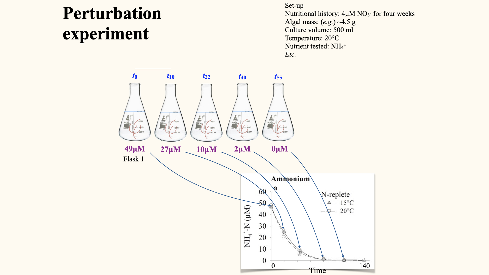

The uptake rate, denoted $V$, is the rate of nutrient uptake per gram per hour (or other unit of time). This is clearly shown in the depletion curves. The concentration slope, $\Delta S/\Delta t$, is negative during depletion. Multiply its negative by water volume $\Omega$ and divide by algal mass $M$ to obtain the positive uptake rate:

$$V = -\frac{\Omega}{M}\frac{\Delta S}{\Delta t}.$$

Use hours for $\Delta t$ when reporting an hourly rate. The [animated walk-through in Lecture 8b](L08b-nutrients_michaelis_menten.qmd#sec-follow-nitrogen) shows each part of this conversion and the progression along the $V$–$S$ curve.

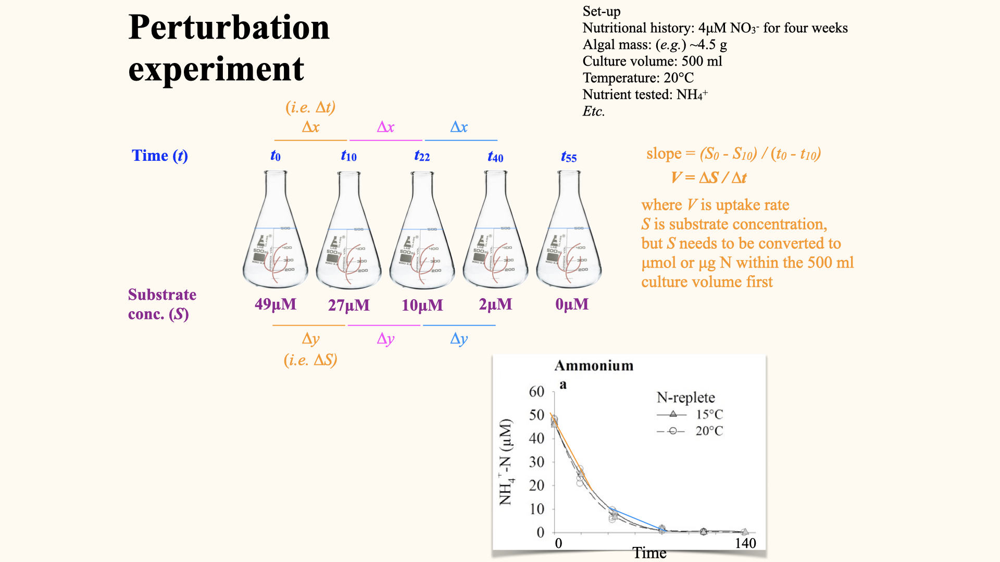

As you can see in the slide above, plotting a depletion curve is very straightforward. All you need to do is recognise that time is the independent variable; that is, it will be plotted on the *x*-axis. The nutrient concentrations remaining in the flasks after each consecutive time interval are plotted on the *y*-axis, which serves as the dependent variable. Once you have constructed the plot as I have just described, you will observe a curve very similar to the one I have shown for ammonium uptake.

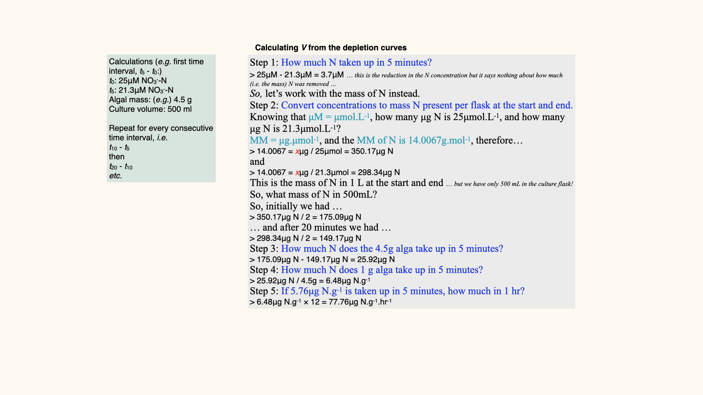

For each interval, calculate a mean uptake rate from the concentration slope, water volume, biomass and elapsed time. The concentration slope itself is not $V$: their units differ. With fixed uptake properties, the initial high concentration supports the fastest uptake, and the depletion curve becomes shallower as concentration falls. Changes in tissue condition during a real incubation can also alter the response.

Here is the sequence of steps, which are as logical and systematic as in the multiple flask experiments:

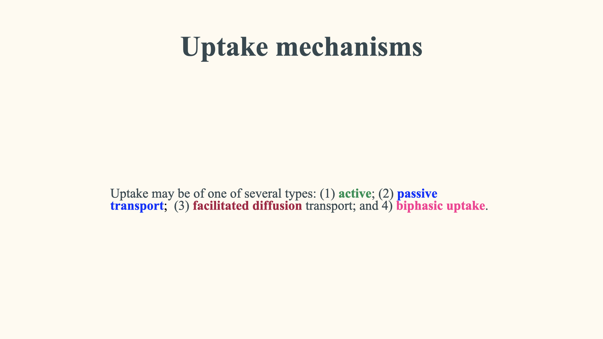

These rates ($V$) are then used for the next phase of analysis.

## Different Uptake Mechanisms

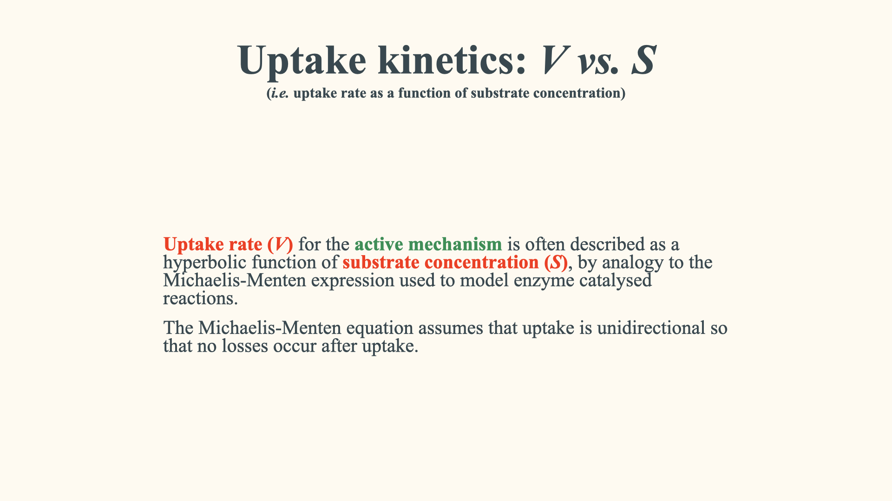

Before interpreting the uptake curves, distinguish the route across the membrane from the energy that drives transport.

**Passive transport** proceeds down a substance's electrochemical gradient without energy coupling. It includes simple diffusion through the lipid and facilitated diffusion through membrane proteins. **Active transport** couples movement against an electrochemical gradient to an energy source, either directly, as in an ATP-driven pump, or indirectly, through another ion's gradient.

Facilitated diffusion is therefore part of passive transport. Biphasic uptake describes a pattern in the concentration response; it is not a separate energy source or a single molecular mechanism.

Multiple-flask and perturbation experiments measure net nutrient removal. They can reveal saturation or other concentration responses, but do not by themselves establish whether membrane transport is active. Keep this distinction in mind as we develop the Michaelis–Menten relationship. The [membrane film](L08c-nutrients_visualised.qmd#sec-crossing-membrane) makes the mechanisms visible.

## Uptake Kinetics: Michaelis-Menten Model

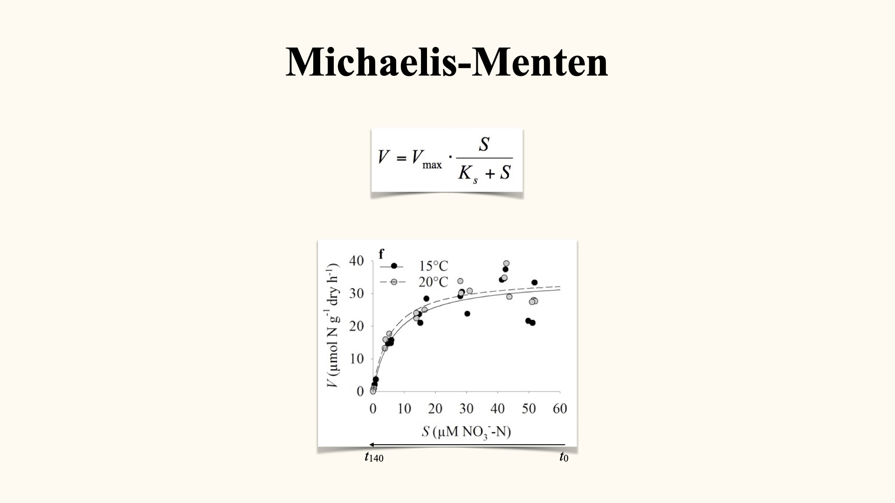

We then plot uptake rate ($V$) against substrate concentration ($S$). A saturable uptake system can follow the Michaelis–Menten equation, familiar from enzyme kinetics. The [capacity and concentration film](L08c-nutrients_visualised.qmd#sec-capacity-concentration) develops this curve from the behaviour of individual uptake sites.

-   At high substrate concentrations, uptake approaches a limiting capacity under the stated conditions.
-   At lower concentrations, uptake sites can spend more time unoccupied. Uptake then falls even if external delivery is unrestricted. A declining rate alone does not demonstrate diffusion limitation.

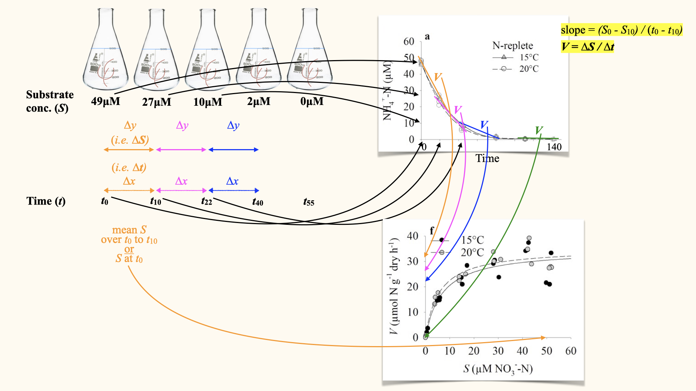

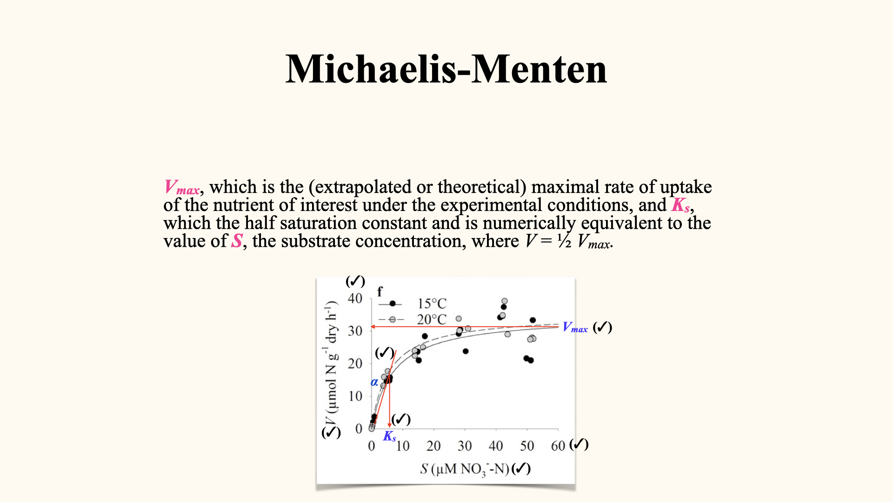

When plotting $V$ against $S$, we see:

-   A plateau approached at high concentrations. Its limiting value is $V_{\text{max}}$. In a perturbation experiment, uptake is **closest to this limit at the start**, provided that the initial concentration is sufficiently high and capacity remains unchanged. In a multiple flask experiment, the highest-concentration flasks come closest. Estimate their rates from the initial depletion slopes, correcting for water volume, algal mass and time units.
-   Lower rates at lower concentrations. In a depletion experiment these occur towards the tail of the concentration–time curve, provided that the organism's uptake properties remain unchanged. The concentration response does not tell us, on its own, whether external delivery also restricts uptake.

$$V = \frac{V_\text{max} \cdot S}{K_s + S}$$

Here, $V_\text{max}$ is the limiting uptake capacity, $K_s$ is the half-saturation concentration, and $S$ is substrate concentration. At $S=K_s$, $V=V_\text{max}/2$. In this equation the rate approaches $V_\text{max}$ asymptotically; it does not reach it at a finite $S$.

In the film's site model, $S$ is the maintained concentration at the membrane. In a flask experiment we usually measure the bulk water. If the surface is depleted relative to the bulk, a curve fitted using bulk concentration can also reflect external delivery. Keep this distinction when interpreting fitted parameters.

A rectangular hyperbola is consistent with a saturable uptake system, including active transport or passive facilitated transport. Curve shape alone does not identify the energy source. Capacity can depend on transporter abundance, turnover and internal processing. Light, temperature and nutritional history can change the response, but higher light or temperature does not invariably increase uptake.

### Reading the Michaelis-Menten graph

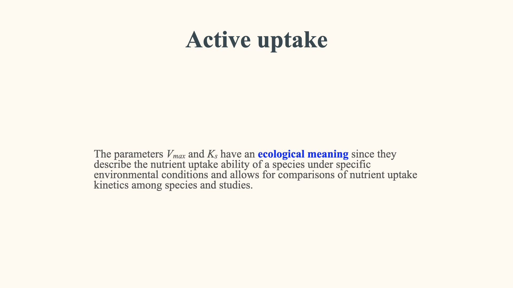

At high $S$, uptake increasingly approaches $V_\text{max}$. Doubling an already high concentration produces a small increase in uptake because the system is operating close to its capacity. At low $S$, changing concentration has a larger proportional effect. This pattern can arise from site occupancy without an external diffusion barrier.

-   $V_\text{max}$: limiting uptake rate, expressed on a stated biomass or area basis.
-   $K_s$: concentration at half of that limiting rate. It is not generally an equilibrium binding constant.
-   $\alpha$ (alpha): the tangent slope at the origin, describing uptake responsiveness when $S$ is small relative to $K_s$.

The initial slope is $\alpha=V_{\max}/K_s$. At the same $V_{\max}$, a lower $K_s$ gives a steeper initial slope and greater uptake at low concentration. When capacities differ, compare $\alpha$ rather than interpreting $K_s$ alone as evidence of better performance under nutrient scarcity.

For example, population A has $V_{\max}=4$ and $K_s=1$, while B has $V_{\max}=12$ and $K_s=2$, using the same units and biomass basis. Their initial slopes are 4 and 6. At $S=0.5$, their uptake rates are 1.33 and 2.40: B takes up more despite its higher $K_s$. Away from the low-concentration limit, use the full equation.

The [IUBMB kinetic recommendations](https://iubmb.qmul.ac.uk/kinetics/ek4t6.html) distinguish half-saturation, limiting rate and the initial slope. Here we retain the lecture's uptake notation $K_s$; the recommendations use $K_m$ for the Michaelis constant.

### Applications and importance

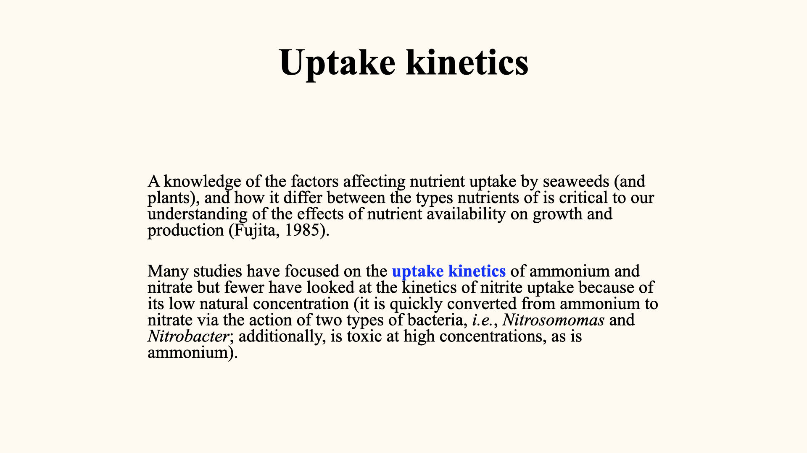

Understanding these parameters helps explain why some seaweeds become opportunistic, blooming in nutrient-rich environments while others persist under nutrient limitation. The values of $V_\text{max}$, $K_s$, and $\alpha$ are affected by species' physiology, surface area to volume ratio, light, temperature, pre-conditioning, and other ecophysiological parameters.

Relate these parameters to external delivery, membrane transport and internal processing. To identify which process restricts uptake, propose a controlled intervention and predict its outcome. For example, vary water movement at matched bulk concentration and physiological state, rather than diagnosing diffusion limitation from a curve's shape alone.

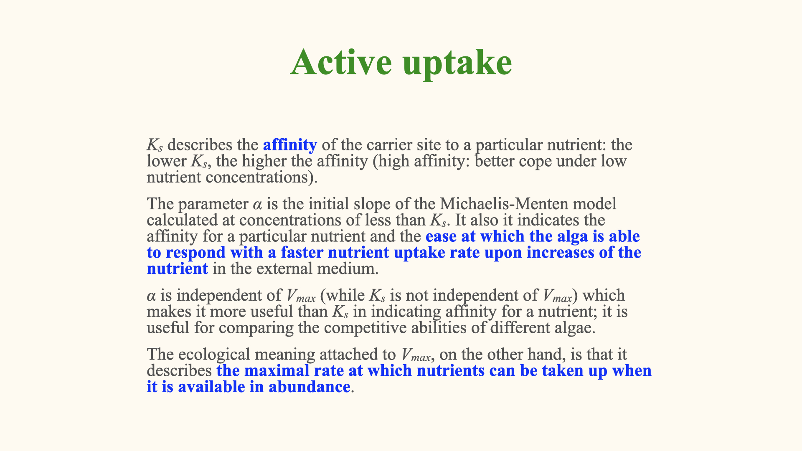

We have followed the depletion curve and used its slopes, with the appropriate volume and biomass corrections, to construct the uptake-rate versus concentration relationship. A rectangular hyperbola is consistent with a saturable system. Both active transport and passive facilitated transport can show this behaviour.

The parameters $V_{max}$, $K_s$ and $\alpha$ describe the concentration response under the experimental conditions. To explain the membrane mechanism, we now need to ask about permeability and energy coupling.

## Active Uptake

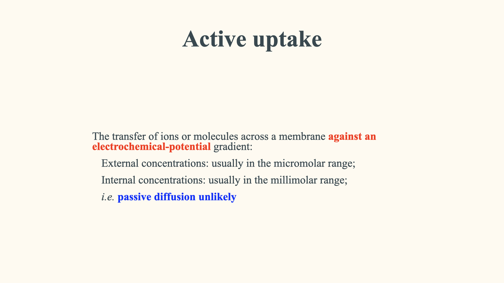

Active transport can move a nutrient against its **electrochemical gradient** by coupling that movement to an energy source. For an ion, both concentration and membrane voltage matter. A concentration difference alone is insufficient to identify uphill transport.

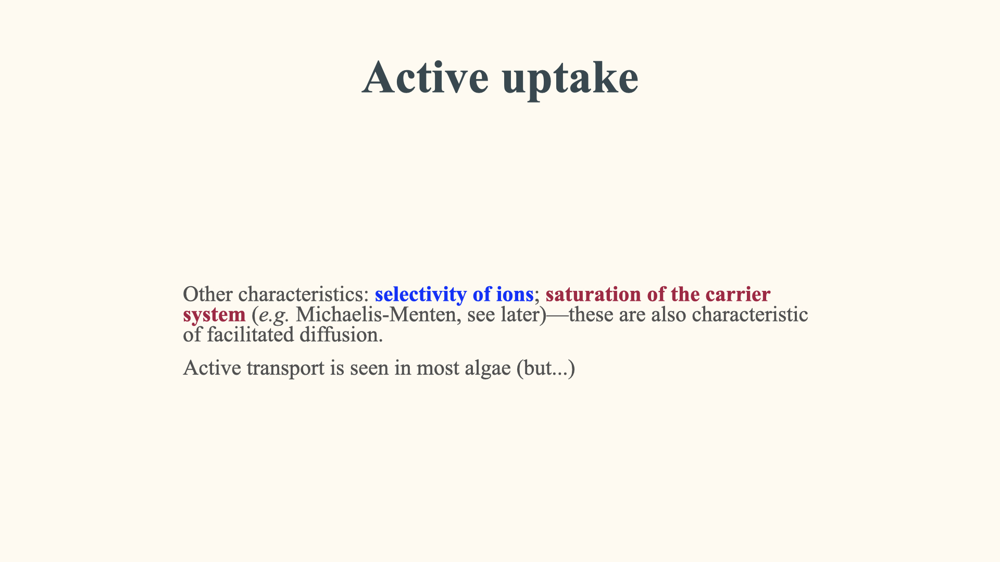

External dissolved concentrations may be in the micromolar range while some internal pools reach millimolar concentrations. Compare the same free dissolved species on the two sides of the membrane. Total tissue nitrogen includes organic compounds and different cellular compartments, so it is not a measure of free cytosolic nitrate.

Passive diffusion supplies nutrients through the external water, and passive transport can also occur across membranes where a suitable route and electrochemical gradient exist. Active transport becomes necessary to sustain movement that is uphill for the transported substance.

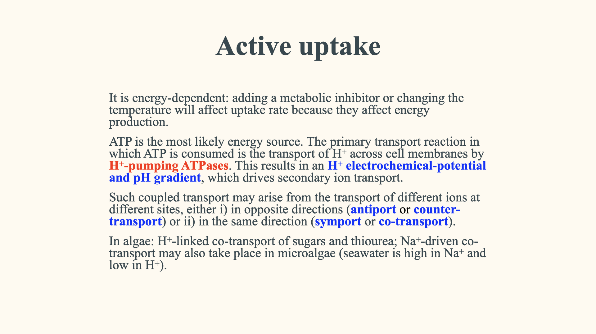

An ATP-driven proton pump provides a useful example of **primary active transport**. It exports hydrogen ions, helping maintain both a membrane voltage and a difference in proton concentration. ATP is supplied by cellular metabolism; this mechanism should not be read as requiring immediate illumination at every transport event.

A separate carrier can couple proton entry to nutrient entry. The returning protons release free energy, allowing the nutrient's own movement to be uphill while the combined movement remains favourable. This is **secondary active transport**. The nutrient carrier need not hydrolyse ATP itself.

**Symport** means that coupled substances pass through the same protein in the same direction. **Antiport** means that coupled substances pass through the same transport system in opposite directions. A proton pump exporting hydrogen ions alongside a separate nitrate symporter is not an antiporter.

The film uses an illustrative proton-coupled nitrate carrier. Proton coupling and alternating access have been studied in the land-plant transporter NRT1.1. The coupling ion and ratio should nevertheless be established for the particular organism and transporter. For example, sodium-dependent nitrate uptake has been demonstrated in the seagrass *Zostera marina*. This is a marine plant example, not evidence that all seaweeds use the same mechanism. [Parker and Newstead (2014)](https://pmc.ncbi.nlm.nih.gov/articles/PMC3982047/), [García-Sánchez et al. (2000)](https://pmc.ncbi.nlm.nih.gov/articles/PMC58924/)

### Key points of active uptake

Follow the energy supply. In the film, ATP hydrolysis drives proton export; the established proton electrochemical gradient then supports nitrate uptake through another protein. If the pump stops, the existing gradient can persist for a time. A brief continuation of uptake therefore does not disprove secondary active transport.

The [worked membrane example](L08c-nutrients_visualised.qmd#sec-crossing-membrane) adds the energy changes and then tests what happens as the driving gradient dissipates. A favourable energy change identifies a possible direction, not the actual uptake rate.

### Characteristics that define active uptake

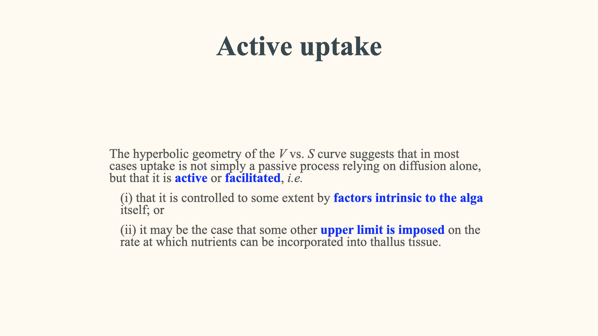

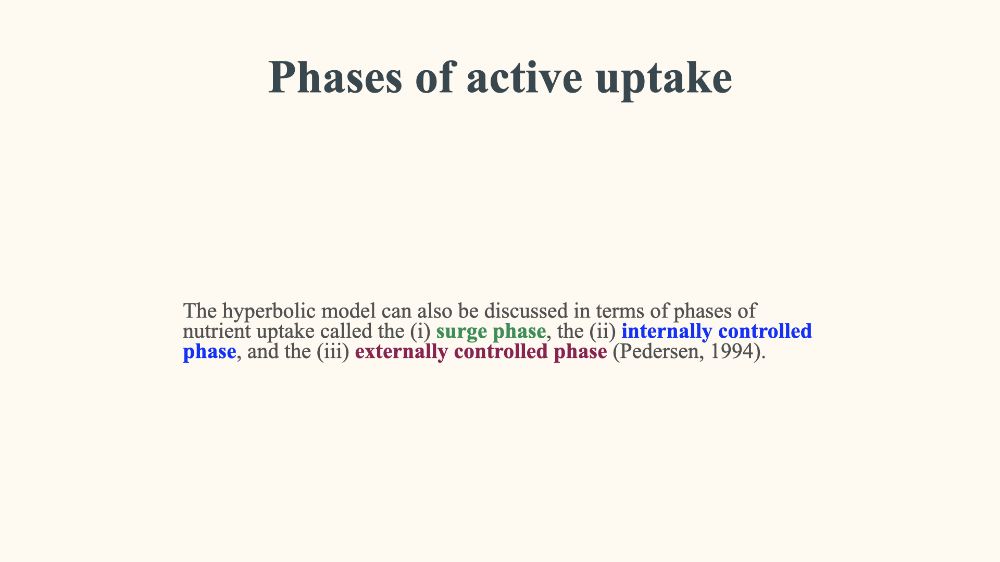

The defining feature is energy coupling that supports movement against the transported substance's electrochemical gradient. Two other useful properties need more careful interpretation:

1. **Selectivity:** A transport protein can favour particular substrates. Passive carriers can also be selective, so selectivity alone is not evidence of active transport.
2. **Saturation:** Finite carrier abundance and turnover can produce a plateau at high substrate concentration. Both passive facilitated and active transport can saturate. A fitted $V_{max}$ describes capacity under the experimental conditions; it does not identify the energy source.

Ammonium should not be excluded from protein-mediated uptake or assigned a universal passive mechanism. Ammonium is charged, and its transport must be considered in relation to the membrane voltage, the transport protein and any coupling. The distinction from uncharged ammonia is developed below.

Environmental changes can alter transport and processing capacity. Light and temperature responses depend on the organism and the range tested; increasing either does not necessarily increase $V_{max}$ indefinitely.

### Surface area to volume ratio and uptake parameters

At matched nutrient concentration and uptake activity per unit surface, more active area per gram gives greater uptake per gram. This is the geometric result demonstrated in [concept 6](L08c-nutrients_visualised.qmd#sec-form-and-supply). It does not require faster transporters.

Comparisons among species may also reveal differences in uptake capacity, apparent affinity, storage and growth. Geometry alone does not set a universal $V_{\max}$ or $K_s$. Match normalisation, local nutrient concentration, water movement and tissue condition before attributing a difference to physiology.

A low-surface-area form can still respond to enrichment if external supply previously restricted it. Whether a species accumulates biomass depends on resource requirements, internal processing and losses as well as nutrient acquisition.

### Three useful descriptions of a changing uptake rate

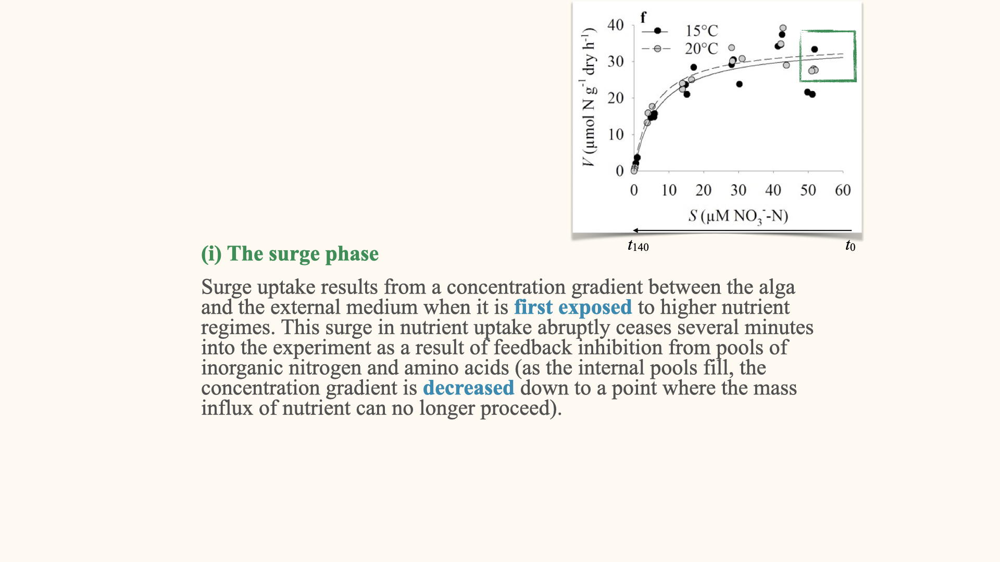

A time course of nutrient uptake is often discussed using three descriptions:

1.  **The Surge Phase**
2.  **The Internally Controlled Phase**
3.  **The Externally Controlled Phase**

These descriptions concern changes in the observed rate; they do not establish that membrane transport is active. Let us examine the possible controls.

#### The surge phase

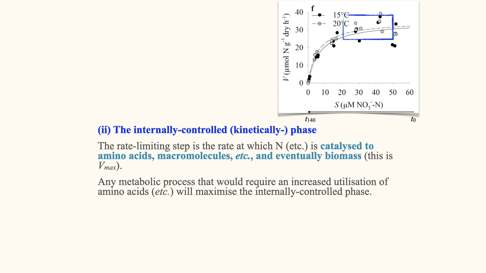

A transient surge is a high initial uptake rate after nutrient exposure, often associated with nutrient-depleted tissue. Uptake may temporarily exceed the rate of assimilation into structural organic matter, allowing internal reserves to accumulate.

Reserve filling and feedback on transport or assimilation are candidate mechanisms. Do not explain the surge simply as nitrate rushing down a gradient until total tissue N equals dissolved nitrate outside. Those quantities are not equivalent, and ion movement across a membrane depends on permeability and the electrochemical gradient.

The surge's occurrence and duration depend on prior conditions and the organism. Time and concentration also change together in a depletion experiment: as time advances, external concentration usually falls. Separate these variables when interpreting the $V$–$S$ relationship.

#### The internally controlled phase

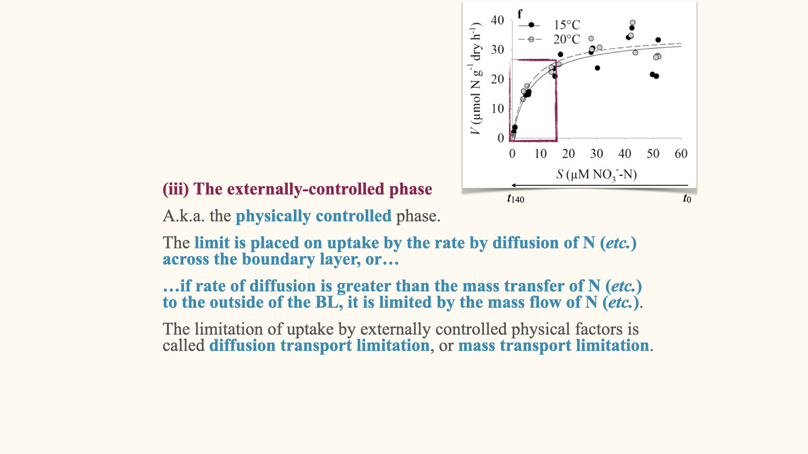

Internal processing and regulation can restrict uptake even when external delivery is sufficient. Assimilation uses acquired N in organic compounds; stored pools and nutrient demand can feed back on further uptake.

A plateau in a concentration-response curve does not uniquely identify nitrate reductase, vacuole filling or another single step. Transport capacity, processing capacity and the measurement interval may contribute. Test internal N fractions and processing rates rather than assigning a mechanism from shape alone.

#### The externally controlled phase

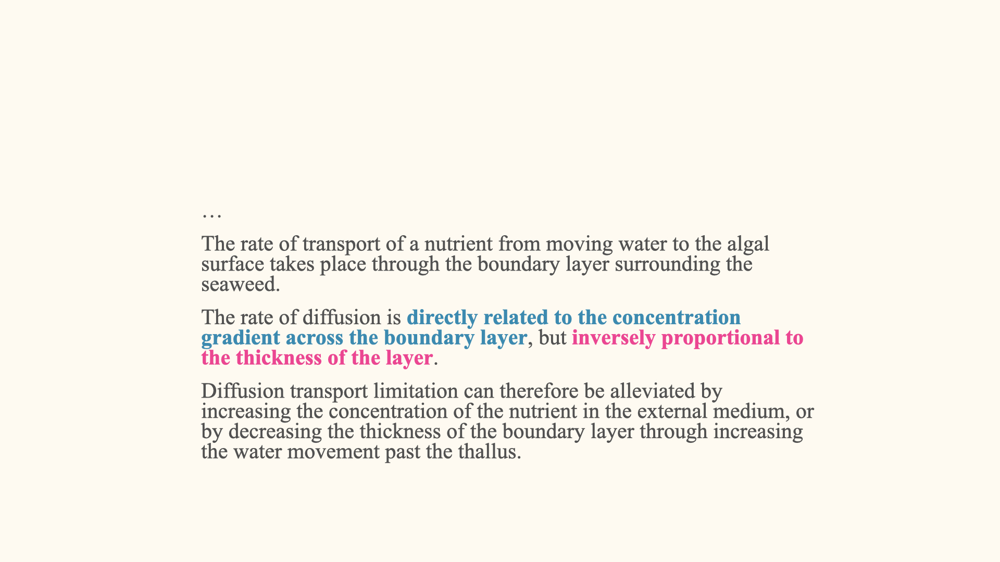

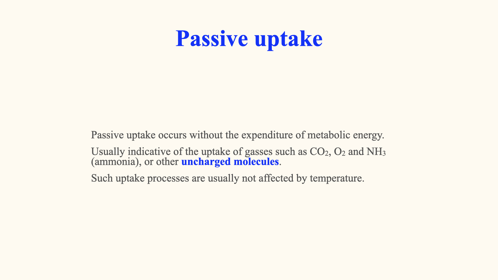

In a closed vessel, uptake reduces external concentration. Lower concentration can restrict uptake through reduced substrate availability at transport sites and through external delivery. A low rate at low concentration does not, by itself, prove diffusion limitation.

For the water layer outside the tissue, the relevant concentration difference is between bulk water and the thallus surface, not between seawater nitrate and total tissue N. The effective diffusion distance and the local gradient matter together. Water movement can replenish the surroundings and reduce transport resistance while molecular diffusion continues.

The three descriptions need not occur as clean, exclusive stages. In [concept 7](L08c-nutrients_visualised.qmd#sec-storage-growth), track uptake, reserves and organic N separately; in concepts 1–2, test delivery by changing water movement.

### Influence of morphology and environmental factors

Thin or finely divided thalli can provide high exchange area per gram, while nutrient storage and uptake properties affect the response to intermittent supply. Uptake can precede growth, and stored nutrients can support growth after external concentrations fall.

A rapid increase in biomass also requires carbon, light, suitable temperature and other essential nutrients, with production exceeding losses. Neither high SA:V nor luxury consumption alone identifies a nuisance species or fixes its growth rate.

### Factors affecting nitrogen (and other nutrient) uptake

### To summarise, several factors determine nutrient uptake rates:

- **Physical environment:** bulk and surface nutrient concentration, water renewal and external transport resistance.
- **Nutrient form:** nitrate and ammonium differ in transport, regulation and assimilation; their interaction must be measured.
- **Nutritional history:** internal reserves, demand and tissue condition can change uptake. Severe deprivation can impair capacity.
- **Light and temperature:** responses vary across useful ranges and stress conditions; greater light or temperature does not always increase uptake.
- **Morphology:** active exchange area per gram and local delivery affect uptake; shape alone does not determine intrinsic affinity.
- **Transport and processing:** membrane permeability, energy coupling, finite capacities and internal regulation contribute to the measured response.

These influences interact. State which one your experiment changes and which measurements would distinguish its effect from alternatives.

## Passive Uptake

Passive transport proceeds down a substance's electrochemical gradient without coupling to an energy source. It includes **simple diffusion** through the lipid bilayer and **facilitated diffusion** through a membrane protein. It is not restricted to movement through the water outside the cell.

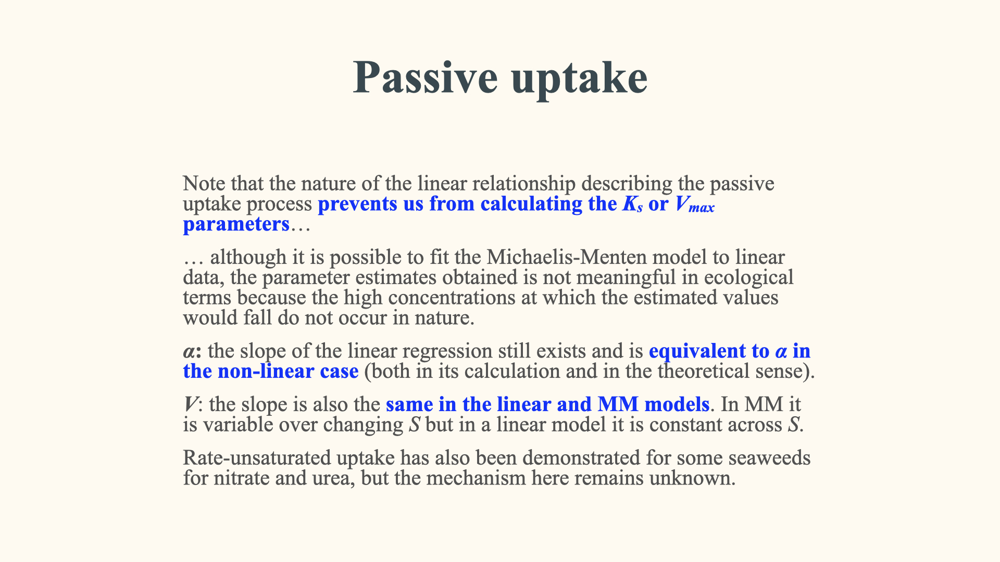

Distinguish ammonia, $\mathrm{NH_3}$, from ammonium, $\mathrm{NH_4^+}$. Ammonia is uncharged, whereas ammonium carries a positive charge. Their proportions depend on pH and solution conditions. Small non-polar molecules such as carbon dioxide can cross the lipid directly; ions generally require membrane proteins. Size and chemical properties also affect permeability, so being uncharged is not enough to establish rapid diffusion through a membrane.

We should not classify all nitrate uptake as active and all ammonium uptake as passive simply from their names. Protein-mediated ammonium uptake is well established. Experiments on a plant AMT1 transporter, for example, show saturating transport, demonstrating why ammonium uptake cannot be assumed to remain linear at all concentrations. This result does not specify the mechanism in every seaweed. [Loqué et al. (2009)](https://pmc.ncbi.nlm.nih.gov/articles/PMC2757203/)

For the seaweed experiments used in this course, read [Smit (2002)](../docs/Smit_2002.pdf). Use the paper to distinguish what was measured for *Gracilaria gracilis* under its experimental conditions from a general claim about all algae.

Ammonium uptake can be measured using the same multiple-flask or perturbation methods used for nitrate. A depletion curve gives interval rates after correcting for water volume, biomass and time. Relating those rates to concentration describes the uptake response, but does not directly identify the membrane pathway.

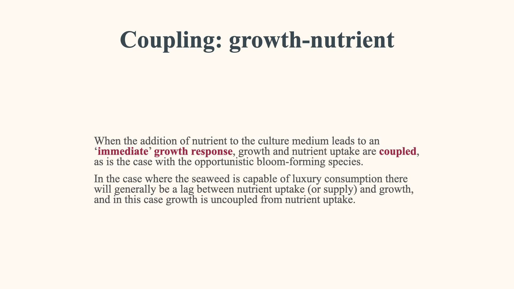

If the measured $V$–$S$ relationship is approximately linear over the tested range, report that range. Do not extend the line indefinitely or interpret it as proof of simple diffusion. A carrier operating well below saturation can also show an approximately linear response. Conversely, a plateau can arise from a passive carrier with finite capacity.

For simple diffusion of an uncharged solute through a membrane with unchanged permeability, net flux is proportional to the concentration difference across that membrane. It is not necessarily proportional to external concentration alone, because internal concentration also matters. For ions, include the electrical contribution. External delivery can further restrict the concentration actually reaching the membrane.

### Uptake kinetics and the affinity coefficient

A linear response allows us to estimate a slope. For the low-concentration portion of a Michaelis–Menten response,

$$V\approx\alpha S,\qquad\alpha=\frac{V_{max}}{K_s}.$$

A linear segment alone generally does not identify $V_{max}$ and $K_s$ separately. That is a limitation of the available concentration range, not evidence that cellular capacity has no influence. If the line has a non-zero intercept or describes another concentration range, state that model explicitly rather than automatically calling its slope the low-concentration affinity.

At a matched low concentration, a higher $\alpha$ predicts a higher uptake rate when the low-concentration approximation applies and rates use the same normalisation. This helps compare nutrient acquisition under scarcity. It does not by itself establish which seaweed will grow faster, win a competition or form a bloom: nutrient demand, storage, losses, other resources and environmental conditions also matter.

### Membrane transport, thallus morphology and growth

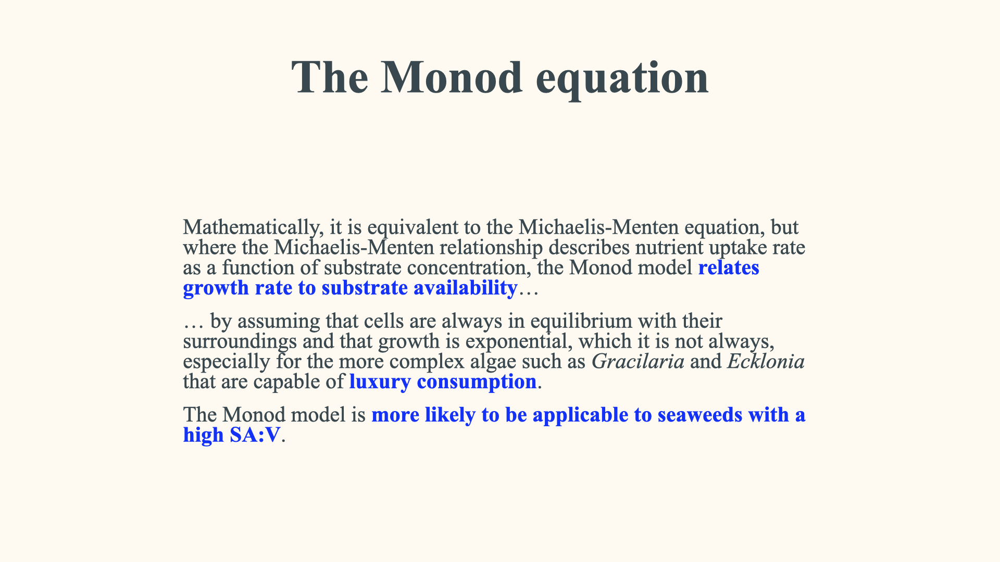

A high surface area to volume ratio can provide more exposed surface per unit tissue volume and shorter internal transport distances. It does not establish whether membrane transport is passive or active. Likewise, simple thallus form does not imply an absence of nutrient storage: cellular pools can occur without specialised storage tissues.

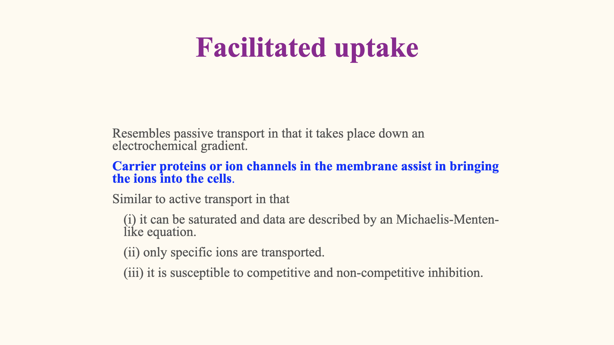

Keep uptake, assimilation and growth separate. Uptake transfers nutrients across a boundary; assimilation incorporates them into organic compounds; growth produces new biomass. Rapid uptake can support rapid growth when other requirements are met, but the two rates need not change simultaneously or remain in a fixed proportion.

Growth can become limited by internal processing or another resource even when nutrient delivery remains abundant. A Monod relationship describes growth rate as a saturating function of external substrate concentration. It resembles the Michaelis–Menten equation mathematically, but its response variable and fitted parameters describe growth rather than uptake. Neither curve shape identifies the membrane mechanism.

Luxury consumption means uptake exceeds immediate growth requirements and adds to internal reserves. Those reserves can later support growth when external supply is low. Storage and its ecological consequences should be established from nutrient pools and growth measurements, rather than inferred solely from active or passive transport. We will return to this distinction in the visualisation on uptake, storage and growth.

## Facilitated Uptake Mechanism

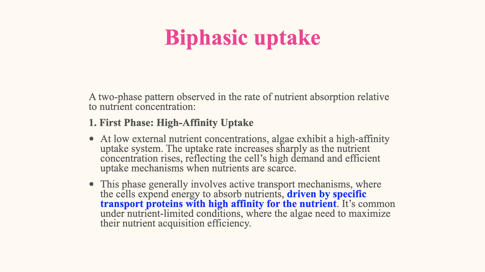

Facilitated diffusion is a form of **passive transport**. A membrane protein provides a route for net movement down the solute's electrochemical gradient. For an uncharged solute, this reduces to its concentration gradient; for an ion, include membrane voltage.

The [membrane film](L08c-nutrients_visualised.qmd#sec-crossing-membrane) shows a generic carrier binding solute outside, closing outside access, then opening towards the cytosol and releasing it. This **alternating access** leaves an enclosed state between the two open states. The protein changes conformation while remaining in the membrane; it does not physically turn over in the bilayer. Passive carriers can support transport in either direction, according to the gradient.

Channels provide another protein-mediated passive route, through a pore. They should not be confused with the carrier cycle shown here. Carriers can be selective, have finite turnover, and show saturation or inhibition. These properties therefore do not establish that a transport process is active.

To distinguish passive from energy-coupled transport, ask whether the nutrient's own movement is downhill and whether it is coupled to another process. A secondary active carrier may not use ATP directly, yet still use an ion gradient to support uphill nutrient transport.

## Biphasic Uptake

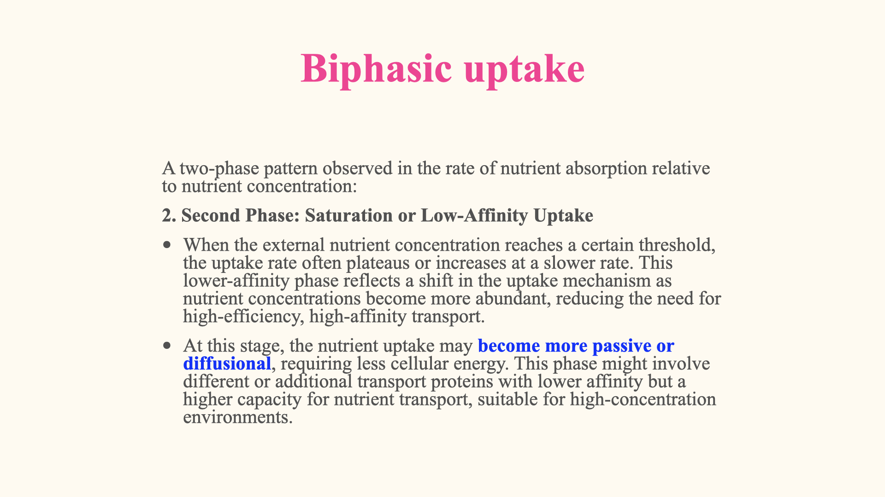

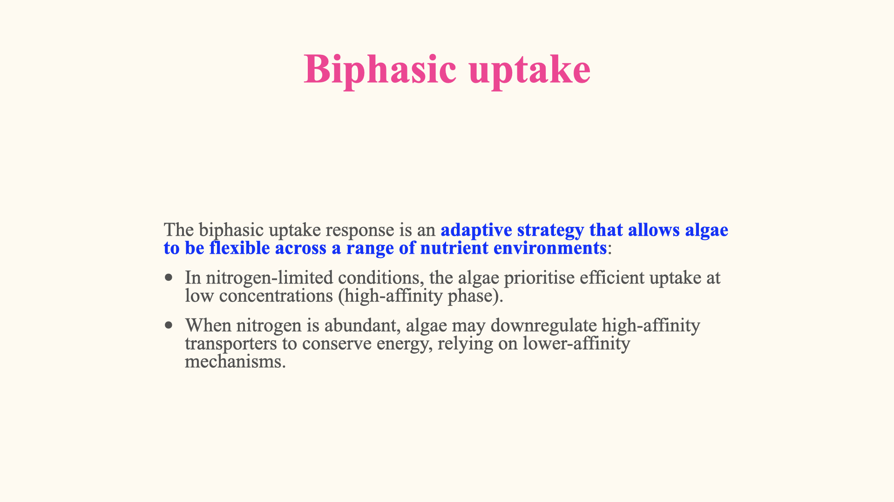

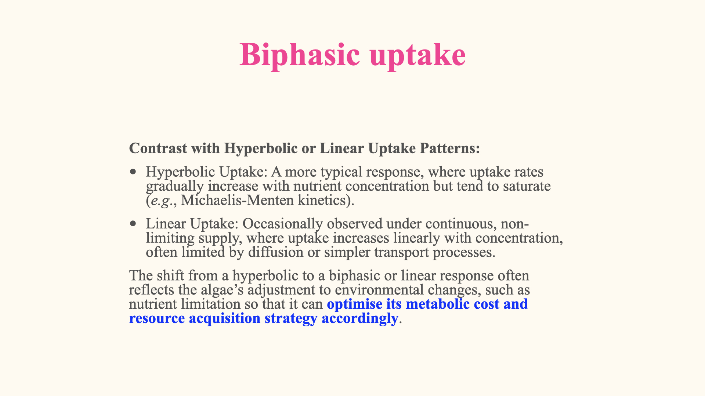

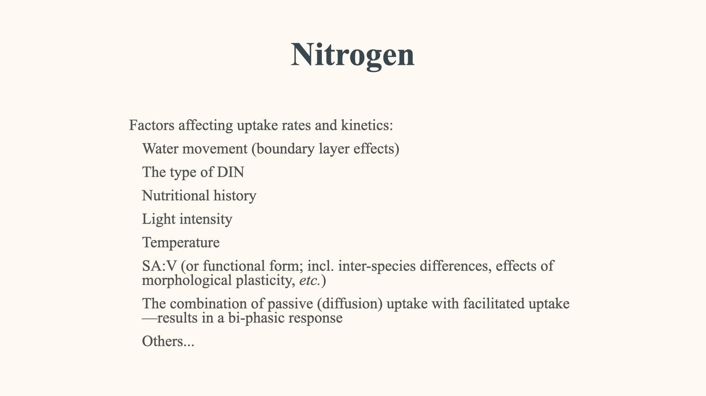

A biphasic concentration response has distinguishable behaviour over different concentration ranges. One possible description is the sum of components with different half-saturation constants and capacities. A saturating component plus an approximately linear component over the tested range is another possibility.

In [concept 8](L08c-nutrients_visualised.qmd#sec-physiological-environment), both model components operate simultaneously. One contributes strongly at low concentration; the second continues increasing over a wider range. This is a numerical illustration, not evidence that a seaweed switches automatically between two identified transporters.

The curve alone does not establish molecular affinity, energy cost or a change from active to passive transport. Nutritional history, delivery, multiple pathways and regulation can alter the measured response. Use the fitted pattern to generate competing predictions, then test them with independent evidence.

## Factors Modifying Uptake Rates

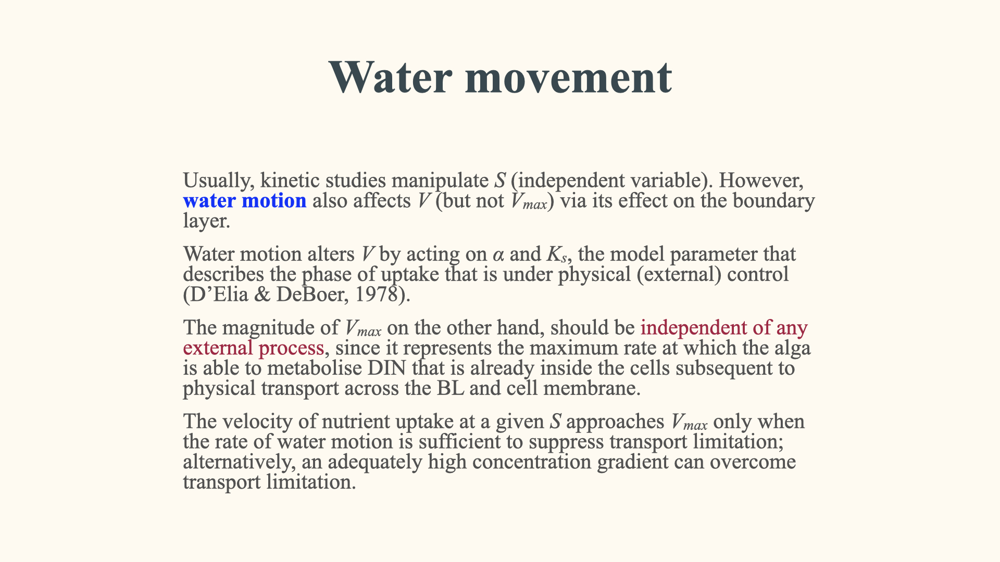

### Water movement

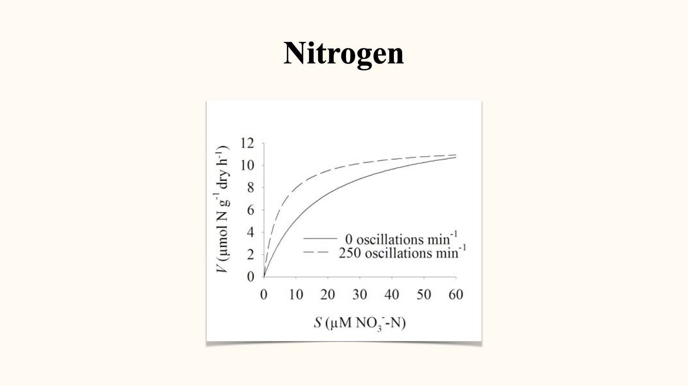

Water movement is a important environmental variable. Consider the ocean: it is highly variable in terms of waviness and the water movement occurring both at the surface and underwater, particularly around seaweeds. Depending on the rate of water movement, there will be a direct effect on the ability of seaweeds to take up nutrients.

In a short comparison where the seaweed's physiology is unchanged, water movement can improve external delivery without changing its intrinsic uptake capacity. The measured uptake rate $V$ and the apparent low-concentration response can nevertheless change. We should distinguish this mechanism from assuming that every fitted $V_{\max}$ must remain unchanged under every flow treatment.

The first mechanism is a reduction in the effective diffusion distance near the surface. Under suitable flow conditions, the concentration boundary layer becomes thinner, reducing resistance to diffusive delivery. The diffusion coefficient itself need not change.

The second mechanism is replenishment of the water around the seaweed. Uptake can deplete this water. Advection and mixing bring nutrients into the region, while molecular diffusion continues to act over the concentration gradients that remain. These are connected parts of the same delivery process.

::: callout-tip
## Test the effect of moving water

[Concept 2: Moving water and diffusion limitation](L08c-nutrients_visualised.qmd#sec-moving-water) compares weak and stronger flow at the same bulk concentration and uptake capacity. It distinguishes velocity from concentration profiles, follows depletion downstream, and then repeats the comparison with lower uptake capacity. Explain why uptake responds strongly in one example and only slightly in the other.
:::

One detail is easy to miss: stronger flow can raise the surface concentration and thereby make $C_b-C_s$ smaller. Uptake can still increase because the effective diffusion distance is shorter and the concentration gradient at the surface is steeper. We must consider the difference and the distance together. These restrictions are coupled; a response to flow does not require uptake to be exclusively diffusion-limited.

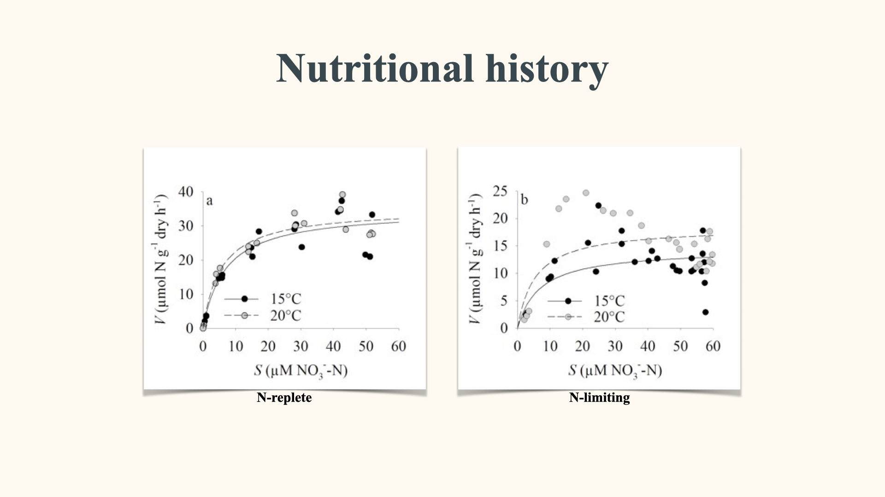

Let us consider the effect of water movement on nutrient uptake. To demonstrate this, examine the graph presented here, which contains two traces — one depicted as a dashed line and the other as a solid line.

The dashed line represents nutrient uptake with the containers on a shaker table operating at $250$ oscillations per minute. The solid line represents zero imposed oscillations. The shaker setting is an experimental treatment, rather than a direct measurement of the water velocity at the thallus. Molecular motion and diffusion continue in the treatment without shaking.

In the illustrated comparison, the curve with greater water movement has a lower apparent $K_s$ and a greater initial slope $\alpha$. This pattern is consistent with improved nutrient delivery at low bulk concentrations. It does not imply that shaking has increased the molecular diffusion coefficient.

Conversely, the zero oscillations per minute trace clearly demonstrates a pronounced boundary layer effect. Due to this strong boundary layer, the value of $K_s$ is increased, and the initial slope of the uptake curve, $\alpha$, is also rather low. Together, these parameters provide clear evidence of the diffusive resistance to nutrient uptake that operates under still water conditions.

### Nutritional history

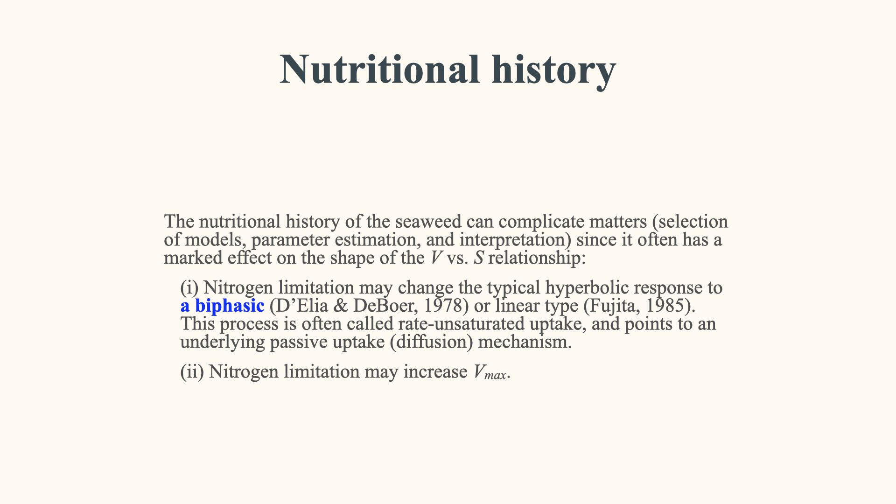

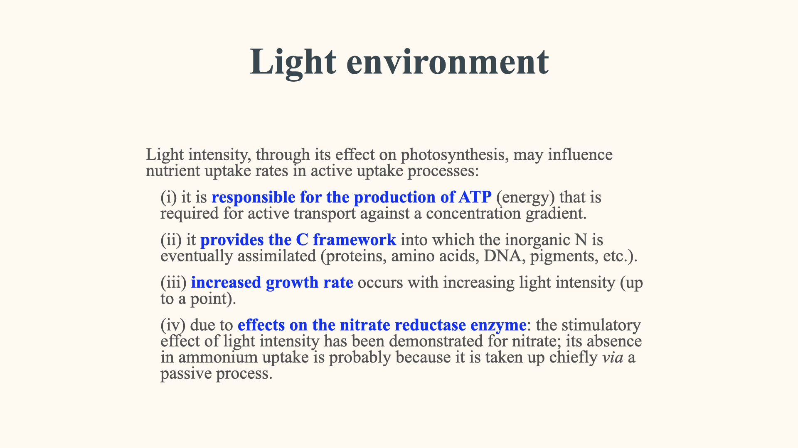

Prior nutrient exposure can change internal reserves, demand and uptake properties. In a controlled comparison, nutrient-depleted but functional tissue may acquire N faster than replete tissue. The response is not an unlimited rule: prolonged deprivation or damage can also reduce capacity.

Smit (2002) found effects of nutritional history on ammonium and nitrate responses in *Gracilaria gracilis*. Do not assume every effect must appear as a significant change in $V_{\max}$: parameters and low-concentration responses need their own statistical evidence. A linear response is not synonymous with passive transport, nor a saturating response with active transport. [Read the experimental results](../docs/Smit_2002.pdf).

The [storage comparison](L08c-nutrients_visualised.qmd#sec-storage-growth) matches initial structural biomass and external concentration while changing reserves. It illustrates one feedback mechanism; it does not reconstruct the paper's physiology or growth data.

### Light intensity and photoperiod

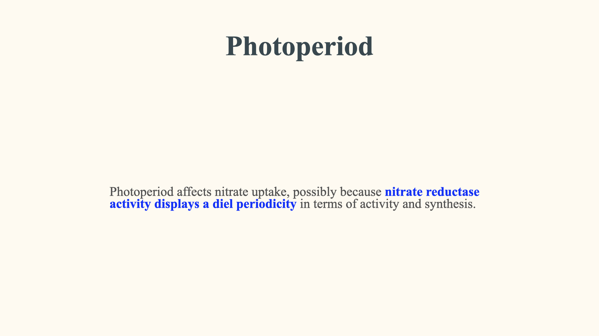

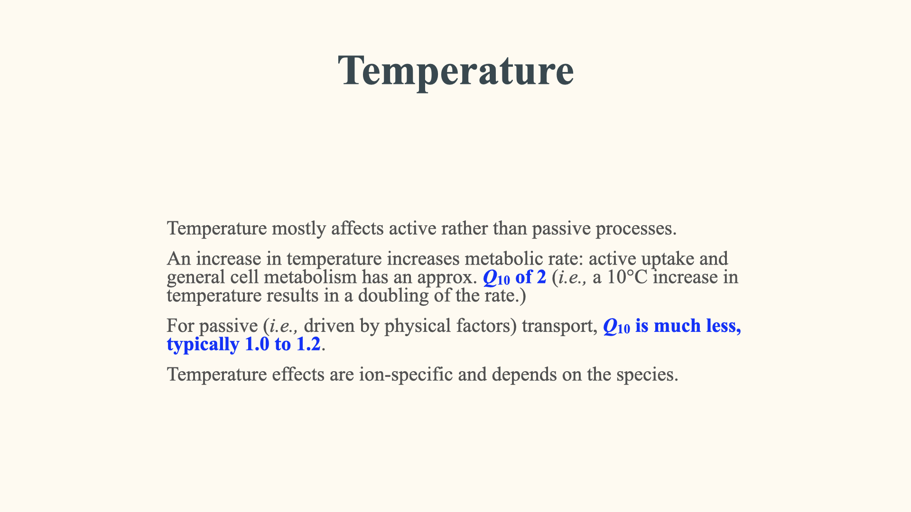

Photosynthesis fixes inorganic carbon and supplies energy and carbon compounds that can support N assimilation and growth. Proteins and nucleic acids require N, and nucleic acids also require P. However, not every organic molecule contains both elements: glucose contains C, H and O, but no N or P.

Light can therefore affect nutrient demand, transport regulation and assimilation. At low irradiance, additional light may enhance these processes. Saturation, photoinhibition or another limiting resource can change the response at higher irradiance. Measure the range rather than assuming a continuous increase.

Nitrate reductase converts nitrate to nitrite. Nitrite reductase then converts nitrite to ammonium, which can enter amino-acid synthesis. Light and photoperiod can influence these processes, but uptake and assimilation are not identical to photosynthesis and need not cease immediately in darkness. Stored carbon and energy can support continued activity.

The [day/night experiment in concept 8](L08c-nutrients_visualised.qmd#sec-physiological-environment) tracks uptake and assimilation separately. Explain why their difference changes the internal reserve.

### Temperature

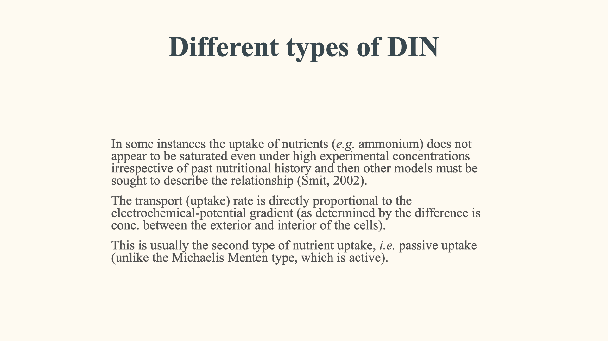

Temperature affects transport, metabolism and growth over process- and species-specific ranges. A rise can increase a rate below its optimum, while further warming can reduce performance or damage tissue. Acclimation, nutritional history and nutrient form also matter.

For measurements ten degrees apart, $Q_{10}=R(T+10)/R(T)$. A value of two describes a doubling across that specified interval; it does not justify indefinite doubling. Two temperatures cannot locate an optimum or describe the full response curve. Control external delivery when interpreting a temperature effect on uptake.

### Nutrient type

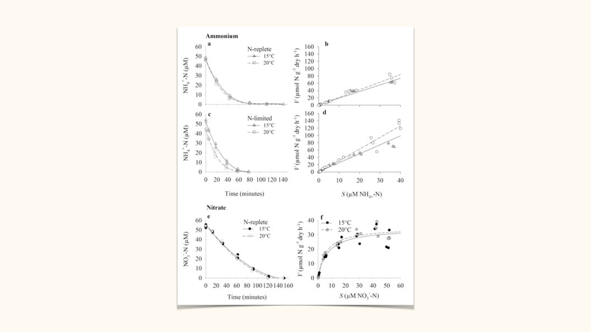

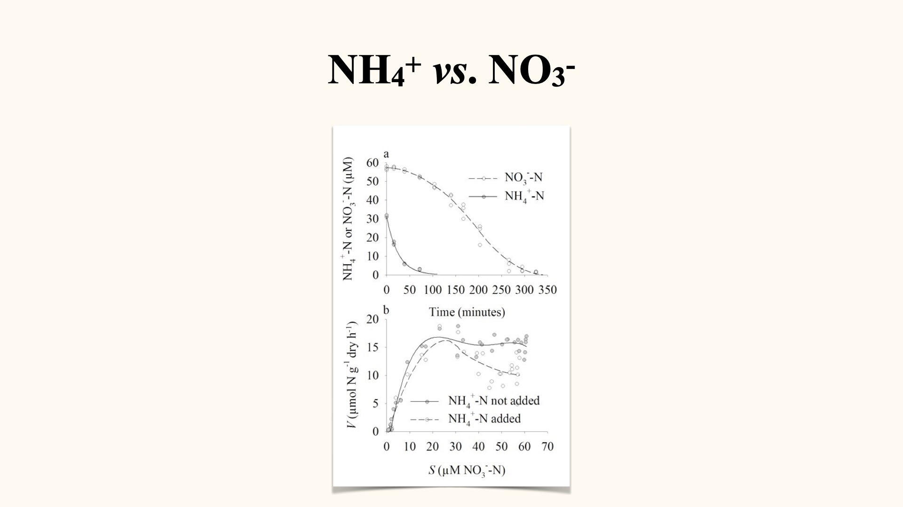

The type and concentration of nutrients also play a role. Ammonium and nitrate can differ in transport, regulation and assimilation. Neither a linear nor a Michaelis–Menten response identifies the mechanism by itself; use the electrochemical gradients and evidence about energy coupling.

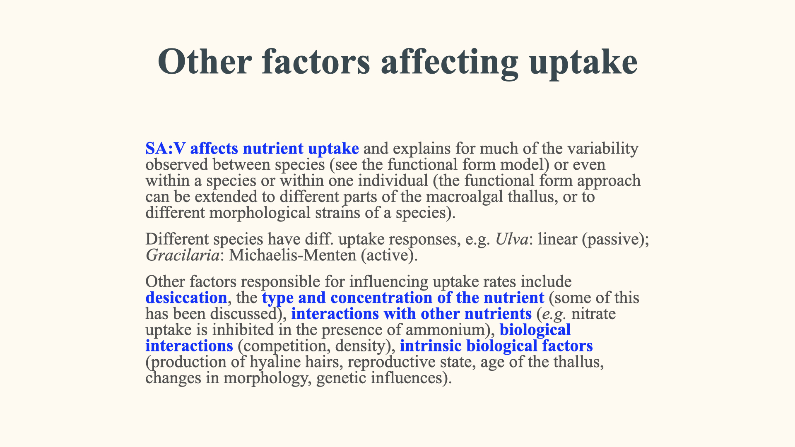

Nutrients can interact. Smit (2002) reported approximately 38% suppression of nitrate uptake in *Gracilaria gracilis* with ammonium-N above 5 µmol/L. This is partial suppression under specified conditions, not a universal rule that nitrate uptake stops until ammonium is exhausted. Read Figures 6–7 and the accompanying results, then compare the evidence summary in [concept 8](L08c-nutrients_visualised.qmd#sec-physiological-environment).

### Other factors

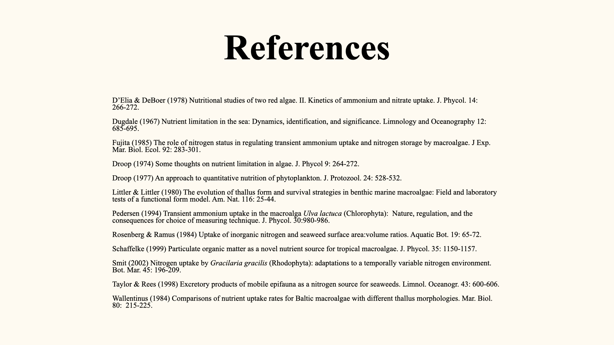

Other influences include surface area to volume ratio. You need to know, in detail, how the surface area to volume ratio modulates different physiological responses in seaweeds.

Some seaweeds produce **hyaline hairs**, pale filamentous structures at the thallus surface. Their effects can involve active area, local chemistry and nutrient delivery. Oxygen profiles around *Fucus vesiculosus* hair tufts revealed locally thickened, heterogeneous boundary layers; these measurements do not establish increased intrinsic nitrate affinity. [Lichtenberg, Nørregaard and Kühl (2017)](https://pmc.ncbi.nlm.nih.gov/articles/PMC5378137/). Use the [form comparison and practice](L08c-nutrients_visualised.qmd#sec-form-and-supply) to distinguish the possible mechanisms.

There are also things such as the reproductive state. Some seaweeds, when they become reproductive, would require an enhanced uptake of nutrients in order to sustain gamete and spore production. Sometimes as a seaweed thallus ages into something that is older and grows slower, the rate of nutrient uptake would decrease with time. When it is very young and rapidly growing, the rate of nutrient uptake would have to be high. Sometimes there are seaweeds that change between morphological appearance — they have heteromorphic alternations of generations. One morphological appearance of a seaweed would have a different kind of nutrient uptake response compared to the other morphological appearance in the same species. There can also be, within the same species, different genetic influences that can affect the uptake kinetics of seaweeds.

## Conclusion

Read the references provided, starting with Smit (2002), the experimental anchor for this lecture. Distinguish what those experiments measured from the broader mechanisms and illustrative models developed in the nine visualisations. The models help us make predictions; their biological explanations still require evidence.

And that brings me to the end of this nutrient uptake lecture, and indeed to the end of BDC223 as far as the plant component is concerned.

