::: callout-tip
## **Content**

-   Identify and understand the suite of environmental properties (e.g. light, heat, water, nutrients, etc.) that are able to induce plant stress.
-   Contextualise this understanding within the broader field of planetary change (global change and planetrary boundaries).
-   Understand how climate change, specifically, is altering the environmental properties that induce plant stress.
-   Link these environmental properties to the physiological and morphological responses of plants to stress.
-   Understand the role of plant stress in shaping plant ecophysiological well being (e.g. the concept of relience).
-   Understand the notions of stress resistance, stress avoidance, and succeptibility to stress in the context of plant stress.
:::

::: callout-tip
## **Aims**

This lecture introduces plant stress as an ecophysiological problem. We examine the environmental factors that push plants beyond their normal operating range, how that affects physiology, and the main ways plants avoid, resist, or succumb to stress.
:::

::: callout-tip
## **Learning Outcomes**

By the end of this lecture, you will be able to:

1.  Identify the suite of environmental properties (light, temperature, water, nutrients, etc.) that are capable of inducing stress in plants, and explain how these factors interact with plant physiology.
2.  Contextualise plant stress within the broader framework of planetary change, particularly in relation to global environmental shifts and the concept of planetary boundaries.
3.  Understand how climate change is altering environmental properties in ways that exacerbate plant stress, and recognise the long-term implications for plant ecophysiology and survival.
4.  Link specific environmental stress factors to the physiological and morphological responses of plants, explaining how plants adapt or fail to adapt to stress conditions.
5.  Explain the role of plant stress in shaping overall plant ecophysiological well-being, particularly through the concept of resilience, and how stress affects plant productivity and survival.
6.  Understand the concepts of stress resistance, stress avoidance, and susceptibility to stress, and apply these notions to different plant species and ecosystems in the context of environmental stressors.
:::

## Introduction: Plant Stress

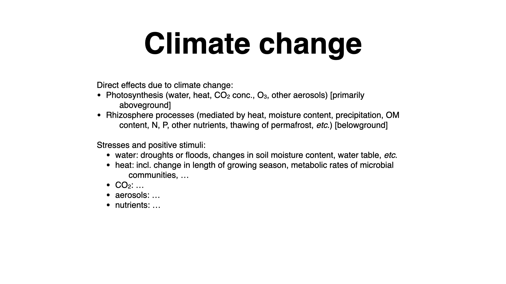

Plant stress matters because plant productivity matters. When environmental conditions move outside the range a plant can tolerate, photosynthesis, growth, reproduction, and survival begin to fail. That has consequences not only for the individual plant, but for ecosystems, agriculture, and the carbon cycle.

Photosynthesis is sensitive to many variables: light, temperature, water supply, CO~2~, nutrient availability, and atmospheric chemistry. Below ground, roots and rhizosphere processes are also shaped by moisture, oxygen, soil structure, and nutrient supply. Stress emerges when those conditions shift far enough that normal function can no longer be maintained.

When we talk about photosynthesis, it is important to remember it does not only apply to terrestrial plants — it also occurs in oceanic or aquatic organisms. Many such organisms, like algae and all seaweeds, do not have roots or a rhizosphere. Even though they may have structures resembling roots, they are anatomically different. Still, photosynthesis is the primary physiological process that underpins both plant and algae function in their environments.

Stress, in this context, means that environmental conditions have moved beyond a plant's normal tolerance range. We therefore need to think not only about optimum conditions, but about the full response curve from favourable to harmful.

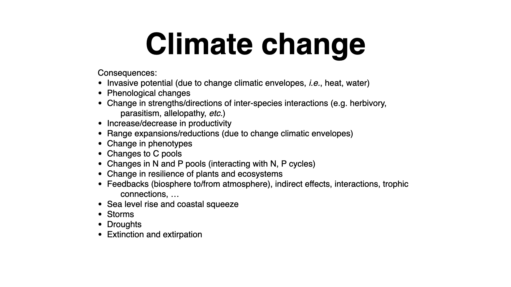

So, what is the practical significance of all of this? Why should we care? Well, plant stress affects many things relevant to people and ecosystems:

-   **Invasive Potential:** Some plants become more invasive under stressed or adverse conditions. When natural biota are stressed, ecosystems become more susceptible to invasion by species previously absent — these are often "weeds." A weed is, essentially, a plant growing rapidly in an environment where it is unwanted, not only in gardens but also in natural or disturbed environments.
-   **Phenological Changes:** Stress can alter the timing of biological events. For instance, with warming climates, it may seem as if summers are beginning earlier — plants flower earlier, bees and other insects react earlier, and so on. This lengthening of the growing season influences the timing of various biological processes.
-   **Interspecific Interactions:** Stress can change the strength and direction of interactions between species — such as herbivory, parasitism, or allelopathy. Stressed plants may be more vulnerable to herbivores, for example.
-   **Productivity:** Plant stress can increase or decrease productivity, which directly impacts people, especially via agriculture. For instance, increased environmental stress can lead to incomplete or poorly developed crops — like underdeveloped corn cobs due to drought or heat stress.
-   **Range Shifts:** Stress alters the zones where specific species can survive and thrive; as optimal envelopes shift, so do the ranges where species are comfortable.
-   **Phenotype Changes:** The outward appearance or form of plants can evolve in response to environmental change.
-   **Biogeochemical Cycles:** Environmental stress can alter carbon pools — as we discussed yesterday, with thawing permafrost releasing previously locked carbon and nitrogen into the atmosphere, leading to feedback loops that influence global warming further.
-   **Resilience:** All these changes can reduce the resilience of ecosystems, create feedback loops, escalate vulnerability to storms and droughts, and in severe cases, drive species to local extinction (extirpation), or even outright extinction.

## Productivity and People

This is where plant stress becomes socially important. Human societies depend heavily on productive plants through agriculture. When stress increases, yields often fall, and the people hit first are usually those who rely most directly on crops and local food production.

Even where direct food insecurity is buffered, plant stress still carries economic costs. Crop failure is the extreme case; partial yield loss is often the more common one.

## Broader Impacts

There are also broader social and economic effects. Drier agricultural regions, severe hail, heat waves, and other extremes all feed into plant performance, crop reliability, and human responses to environmental instability.

## Plant Responses to Stress

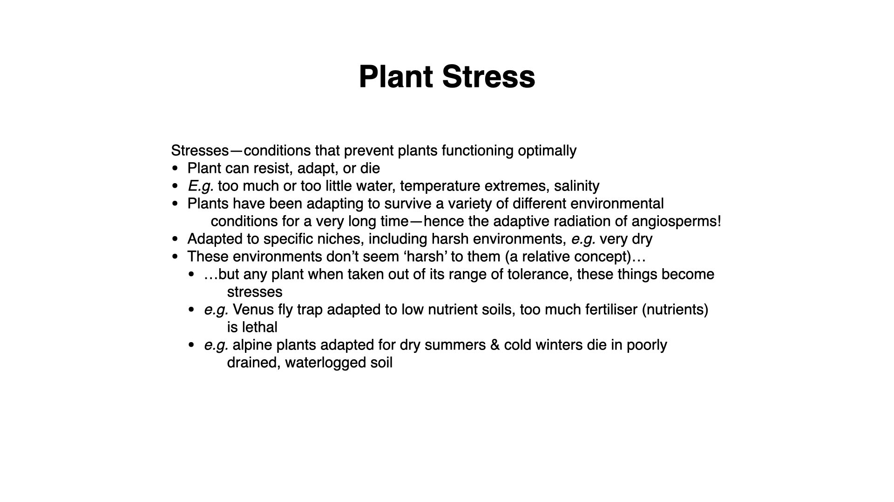

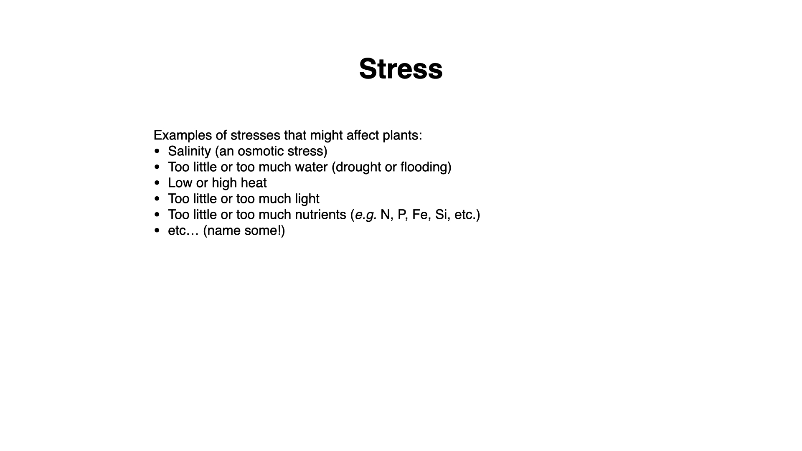

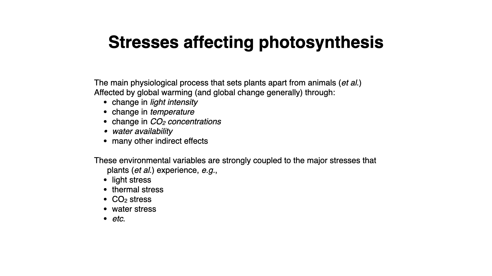

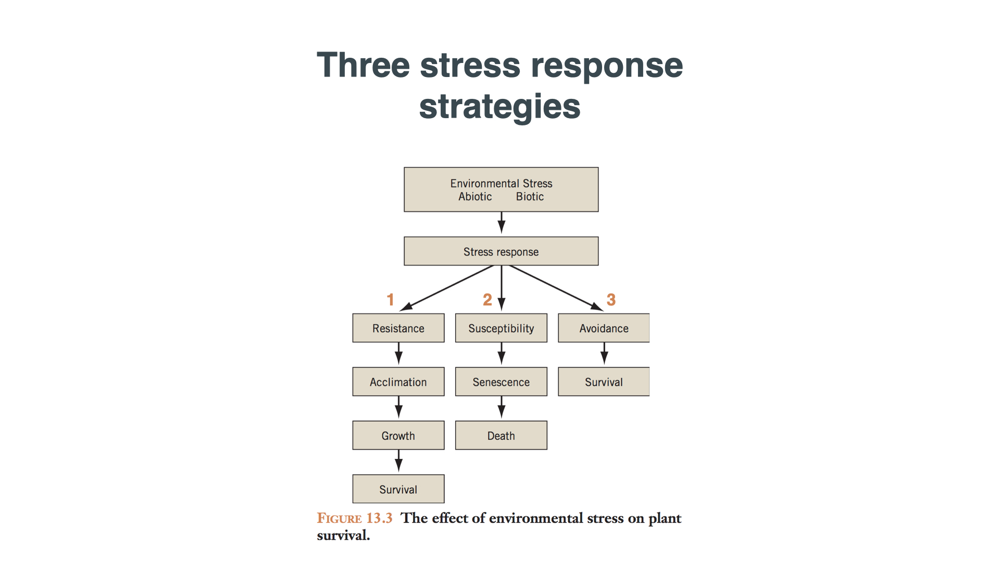

So, what do plants do when confronted by stress? There are three general strategies:

1.  **Resist the stress:** Acclimatise or otherwise develop responses that allow survival and growth.
2.  **Adapt and thrive:** Use evolutionary adaptations that confer long-term tolerance.
3.  **Die:** Simply be unable to cope, leading to death — a fate for species with narrow environmental tolerance ("stenothermal" for temperature tolerance, for example).

Plant stresses include:

-   **Abiotic:** Salinity, drought, heat extremes, light extremes, nutrients, etc.
-   **Biotic:** Pathogens, herbivores, competing species, etc.

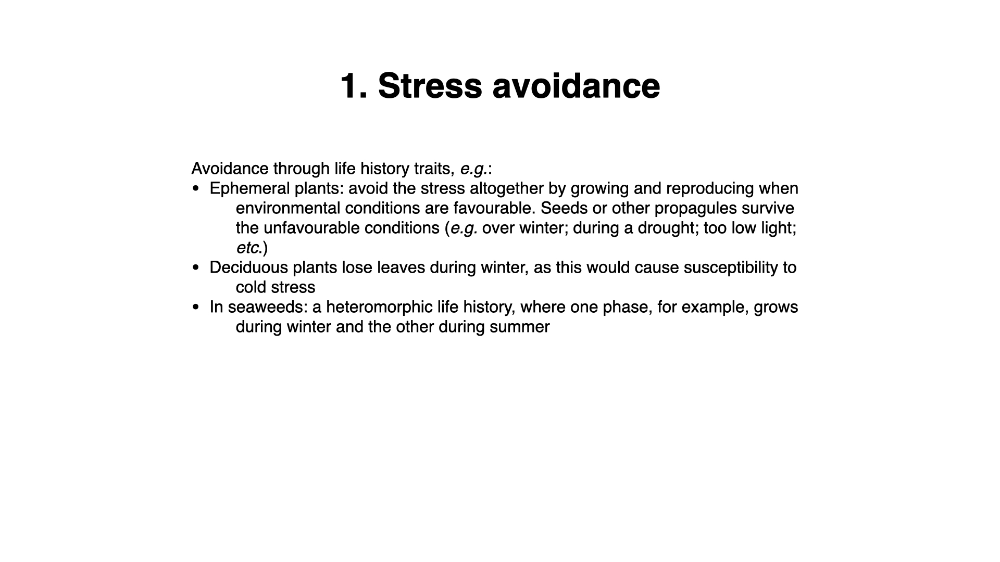

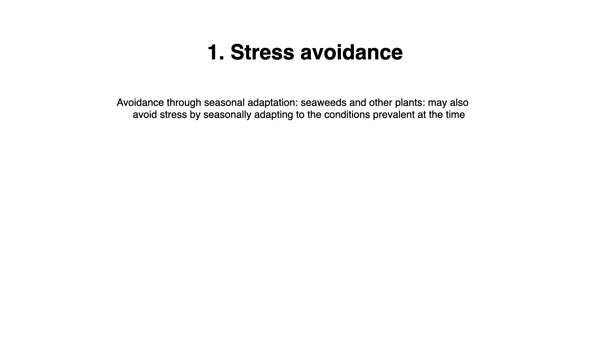

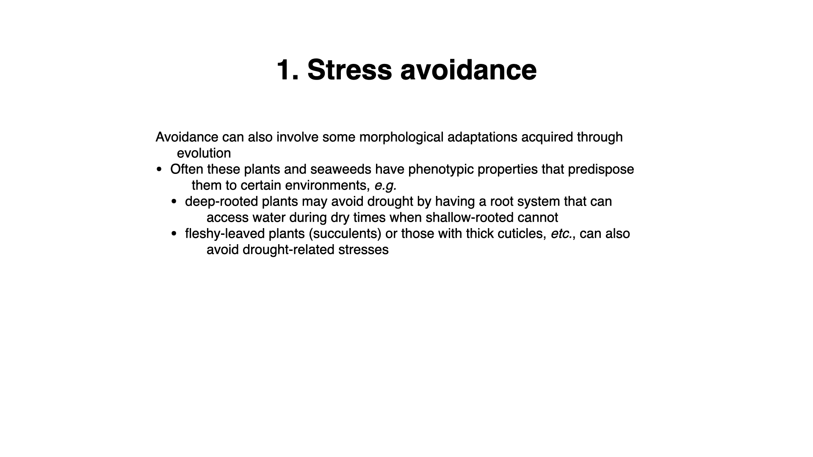

**Avoidance** refers to plants preventing stress from impacting them, often via life-history strategies or adaptations:

-   **Ephemerals:** Grow and reproduce rapidly only when conditions are optimal (e.g., spring flowers after seasonal rains).
-   **Deciduousness:** Drop leaves to avoid freeze damage (common in boreal forests).
-   **Seaweeds with Alternation of Generations:** Present as large fleshy organisms during favourable seasons and tough, small forms during stressful periods.
-   **Deep-rooted plants:** Access deep water during droughts.
-   **Succulents:** Store water during dry seasons, use CAM metabolism to reduce water loss.

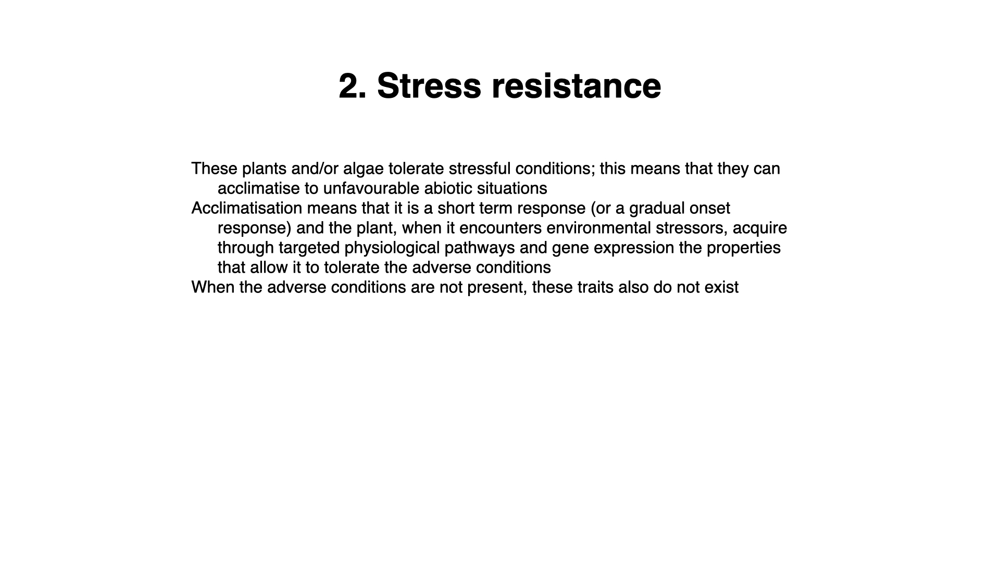

**Resistance** is a short-term response — plants acclimatise through physiological changes, often triggered by gene expression changes that allow short-term survival under stress. Once conditions normalise, the plant resumes normal function.

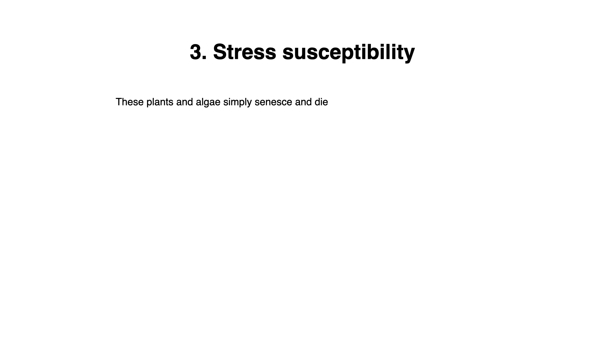

**Susceptibility** occurs in plants with very narrow tolerance ranges. These "specialist" species often reside in environments that are stable, but when stress exceeds their adaptation, they senesce and die.

Plants may evolve a wide ("eurythermal") vs. narrow ("stenothermal") tolerance range, depending on their resistance or avoidance mechanisms.

## Conclusion

This lecture provides the overview. The rest of the module covers the mechanisms of how light, nutrients, temperature, and other factors shape plant function, and where stress enters those processes.
