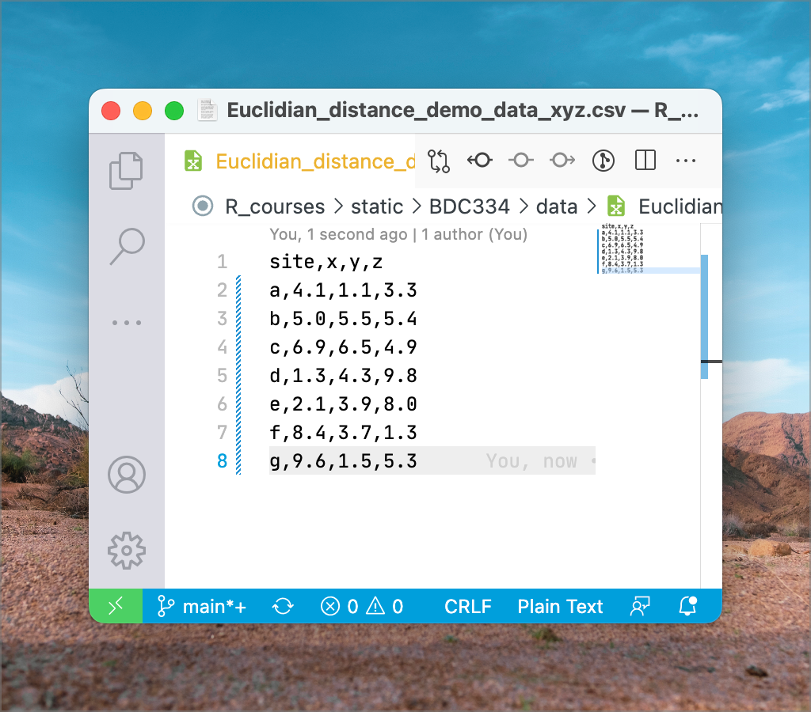

> *"A scientific man ought to have no wishes, no affections, -- a mere
> heart of stone."*
>
> --- Charles Darwin

::: callout-tip
## Download the Doubs River data

-   The environmental data [`DoubsEnv.csv`](../data/DoubsEnv.csv)

-   The species data [`DoubsSpe.csv`](../data/DoubsSpe.csv)

-   The spatial data [`DoubsSpa.csv`](../data/DoubsSpa.csv)

-   Example xyz data [`Euclidian_distance_demo_data_xyz.csv`](../data/Euclidian_distance_demo_data_xyz.csv)
:::


## About Macroecology

**This is a course about community ecology across different spatial and
temporal scales.** Community ecology underpins the vast fields of
biodiversity and biogeography and concerns spatial scales from squares
of meters to all of Earth. We can look at historical, contemporary, and
future processes that have been implicated in shaping the distribution
of life on our planet.

Ecologists tend to analyse how multiple environmental factors act as
drivers that influence the distribution of tens or hundreds of species.
These data tend to often be messy and statistical considerations need to
be understood within the context of the data available to us.

**Macroecology** is an all-encompassing view of ecology which seeks to
find the geographical patterns and processes in biodiversity across all
spatial scales, from local to global, across time scales from years to
millennia, and across all taxonomic hierarchies (from genetic
variability within species, up to major higher level taxa, such as
families and orders). It attempts to arrive a unifying theory for
ecology across all of these scales---e.g. one that can explain all
patterns in structure and functioning from microbes to blue whales. Most
importantly, perhaps, is that it attempts to offer mechanistic
explanations for these patterns. At the heart of all explanation is also
deep insights stemming from understanding evolution (facilitated by the
growth of phylogenetic datasets---see below). This is a modern
development of ecology, whereas up to 20 years ago the focus has been
mostly on populations (the dynamics of individuals of one species
interacting among each other and with their environment) and communities
(collections of multiple populations, and how they interact with each
other and their environment, and how this affects the structure and
dynamics of ecosystems).

On a basic data analytical level, population ecology, community ecology,
and macroecology all share the same approach as far as the underlying
data are concerned. We start with data representing the species and the
associated environmental conditions at a selection of sites (called
**species tables** and **environmental tables**). The species tables are
then converted to **dissimilarity matrices** and the environmental
tables to **distance matrices**. From here basic analyses can offer
insights into how biodiversity is structured, e.g. **species-abundance
distributions**, **occupancy-abundance curves**, **species-area
curves**, **distance decay curves**, and **gradient analyses** (as seen
in Shade et al. 2018). In the Labs we will explore some of these
properties.

## Ecological data

### Properties of ecological datasets

Ecological data capture properties of the environment and properties
about communities. They are typically stored as separate datasets but
they analysed together.

These data sets are usually arrange in a **matrix**, which---in the case
of community composition---has **species (or higher level taxa whose
resolution depends on the research question at hand) arranged down
columns** and **samples (typically the sites, stations, transects, time,
plots, etc.) along rows**. We call this a **sites × species table**. In
the case of environmental data it will of course be a **sites ×
environment table**. The term 'sample' denote the basic unit of
observation. Samples may be quadrats, transects, stations, sites, traps,
seine net tows, trawls, grids cells on a map, etc. It is important to be
clear and unambiguous about the basic unit of the samples.

### The Doubs River data

A very clear example of environmental and species datasets is the Doubs
River dataset. Please refer to [David Zelený's website for an
explanation](https://www.davidzeleny.net/anadat-r/doku.php/en:data:doubs)
of these data. The primary publication outlining this study is
@verneaux1973cours and an example analysis is provided by
@borcard2011numerical. These data demonstrate nicely how one of the
basic drivers of biodiversity patterning---gradients---can be seen
operating on in a real world case study. It offers neat insight also
into the properties of species and environmental tables and the
dissimilarity and distance matrices derived from them.

### Looking at the files' content

These data are made available in CSV format but we can open and view it
in MS Excel. 'CSV' means *comma separated value*. It is a plain text
file that can be edited in any text editor (such as Notepad on MS
Windows, or VS Code, VIM, emacs, etc. on all platforms). @fig-csv-file shows
what a CSV files looks like in a plain text editor, VS Code, on my
computer. Once imported it will look similar to the one seen in
@fig-doubs-env.

{#fig-csv-file}

CSV is a common format used in the scientific disciplines as it is
compatible with many software. Globally, scientists use a period '.' as
decimal point separator. You can see this in the file above. Commas are
used exclusively as field separators (you'll see separate columns once
opened in MS Excel).

::: callout-note
## Note about CSV files and MS Excel

CSV files create a bit of a problem for South Africans, who are
indoctrinated from a young age to use commas as decimal point
separators---this is to conform with the regional (South African)
expectation that dictates commas be used as decimals. So, when you
import a CSV file for the first time you'll likely see gibberish because
your computer will probably be set up to honour the regional (locale)
expectation of commas as decimal points (and 'R' for currency, metric
units of measurements, etc.). So, you need to know how to fix this to
prevent upsetting me (it is a pet peeve and frustrates me endlessly) and
yourselves.

To fix this annoyance is not too tricky as is demonstrated
[here](https://www.avantixlearning.ca/microsoft-excel/how-to-change-commas-to-decimal-points-and-vice-versa-in-excel/).
Follow the instruction under '**Changing commas to decimals and vice
versa by changing Excel Options**'. Better still, change the global
system settings as explained elsewhere in the same article. Do this
before importing the CSV file.
:::

After importing the Doubs River data we see something that resembles the
next two figures. First, in `DoubsSpe.csv`, we see the table (or
spreadsheet) view of the species data. The species codes for 27 species
of fish appear as column headers (not all species' data are visible as
the data are truncated to the right) and in rows 2 through 31 (30 rows)
are each of the samples---in this case, there is one sample per site
down the length of the river (@fig-doubs-spp).

{#fig-doubs-spp}

`DoubsEnv.csv` contains the environmental data as seen in the next
figure. The names of the 11 environmental variables appear as column
headers and there are 30 rows, one for each of the samples---the samples
match that of the species data (@fig-doubs-env).

{#fig-doubs-env}

Species data may be recorded as various kinds of measurements, such as
presence/absence data, biomass, frequency, or abundance.
'Presence/absence' of species simply tells us the the species is there
or is not there. It is binary. 'Abundance' generally refers to the
number of individuals per unit of area or volume, or to percent cover.
'Biomass' refers to the mass of the species per unit of area or volume.
The type of measure will depend on the taxa and the questions under
consideration. The important thing to note is that all species have to
be homogeneous in terms of the metric used (i.e. all of it as
presence/absence, or abundance, or biomass, not mixtures of them). The
matrix's constituent row vectors are considered the species composition
for the corresponding sample (i.e. a row runs across multiple columns,
and this tells us that the sample is comprised of all the species whose
names are given by the column titles---note that in the case of the data
in above figures, it is often the case that there are 0s, meaning that
not all species are present at some sites). Species composition is
frequently expressed in terms of relative abundance; i.e. constrained to
a constant total such as 1 or 100%, or biomass, in which case the upper
limit might be arbitrary.

The environmental data may be heterogeneous, i.e. the units of measure
may differ among the variables. For example, pH has no units,
concentration of some nutrient has a unit of (typically) μM, elevation
may be in meters, etc. Because these units differ so much, and because
they therefore have different magnitudes and ranges, we may need to
standardise them. To standardise the data we subtract the mean of each
column from each data point in the column, and then divide each of the
resultant values by the standard deviation of the columns.

::: callout-important
## Lab 1

1.  Standardise the Doubs River environmental data in MS Excel.
:::

### Properties of species datasets

Many community data matrices share some general characteristics:

-   Most species occur only infrequently. The majority of species might
    typically be represented at only a **few locations** (where they
    might be quite abundant). Or some species are simply **rare** in the
    sampled region (i.e. when they are present, they are present at a
    very low abundance). This results in **sparse matrices**, as we see
    in the figures above, where the bulk of the entries consists of
    zeros.

-   Ecologists tend to sample a multitude of factors that they think
    influence species composition, so the matching environmental data
    set will also have multiple (10s) of columns that will be assessed
    in various hypotheses about the drivers of species patterning across
    the landscape. For example, fynbos biomass may be influenced by the
    fire regime, elevation, aspect, soil moisture, soil chemistry,
    edaphic features, etc. These datasets are called
    **multi-dimensional** matrices, with the 'dimensions' referring the
    the many species or environmental variables.

-   Even though we may capture a multitude of information about many
    environmental factors, **the number of important ones is generally
    quite low**---i.e. a few factors can explain the majority of the
    explainable variation, and it is our intention to find out which of
    them is most important.

-   Much of the signal may be spurious, i.e. the matrices have **high
    noise**. Variability is a general characteristic of the data, and
    this may result in false patterns emerging. This is so because our
    sampling may capture a huge amount of stochasticity (processes that
    are entirely non-deterministic), which may mask the real pattern of
    interest. Imaginative and creative sampling may reveal some of the
    patterns we are after, but this requires long years of experience
    and is not something that can easily be taught as part of our
    module.

-   There is a huge amount of **collinearity**. Basically, what this
    means is that although it is often the case that many explanatory
    variables are able to explain patterning, only a few of them act in
    a way that implies causation. Collinearity is something we will
    return to later on.

## Ecological gradients

Although there are many ways in which species can respond to their
environment, one of the most striking responses can be seen along
environmental gradients. We will explore this concept next as we discuss
coenoclines and unimodal species distribution models.

### Coenoclines, coenoplanes, and coenospaces

A **coenocline** is a graphical display of *all species* response curves
(see definition, below) *simultaneously* along one environmental
gradient. It aids our understanding of the species response curve if we
imagine the gradient operating in only one geographical direction. The
**coenoplane** concept extends the coenocline to cover two gradients.
Again, our visual representation can be facilitated if the two gradients
are visualised orthogonal (in this case, at right angles) to each other
(e.g. east--west and north--south) and they do not interact. A
**coenospace** complicates the model substantially, as it can allow for
an unspecified number of gradients to operate simultaneously on multiple
species at once, and it will probably also capture interactions of
environmental drivers on the species.

```{r}
#| fig-cap: "A coenocline."
#| label: fig-coenocline
#| warning: false
#| dpi: 300
#| fig-width: 7
#| fig-height: 4

library(coenocliner)
set.seed(2)
M <- 20                                    # number of species
ming <- 3.5                                # gradient minimum...
maxg <- 7                                  # ...and maximum
locs <- seq(ming, maxg, length = 100)      # gradient locations
opt  <- runif(M, min = ming, max = maxg)   # species optima
tol  <- rep(0.25, M)                       # species tolerances
h    <- ceiling(rlnorm(M, meanlog = 3))    # max abundances
pars <- cbind(opt = opt, tol = tol, h = h) # put in a matrix

mu <- coenocline(locs, responseModel = "gaussian", params = pars,
                 expectation = TRUE)

matplot(locs, mu, lty = "solid", type = "l", xlab = "pH", ylab = "Abundance")
```

Above is an example of a coenocline using simulated species data. It
demonstrates an important idea: that of unimodal species distributions
(@fig-coenocline).

```{r}
#| fig-cap: "A smoothed coenoplane."
#| label: fig-coenoplane-smooth
#| dpi: 300
#| fig-width: 7
#| fig-height: 7

set.seed(10)
N <- 30                                       # number of samples
M <- 20                                       # number of species
## First gradient
ming1 <- 3.5                                  # 1st gradient minimum...
maxg1 <- 7                                    # ...and maximum
loc1 <- seq(ming1, maxg1, length = N)         # 1st gradient locations
opt1 <- runif(M, min = ming1, max = maxg1)    # species optima
tol1 <- rep(0.5, M)                           # species tolerances
h    <- ceiling(rlnorm(M, meanlog = 3))       # max abundances
par1 <- cbind(opt = opt1, tol = tol1, h = h)  # put in a matrix
## Second gradient
ming2 <- 1                                    # 2nd gradient minimum...
maxg2 <- 100                                  # ...and maximum
loc2 <- seq(ming2, maxg2, length = N)         # 2nd gradient locations
opt2 <- runif(M, min = ming2, max = maxg2)    # species optima
tol2 <- ceiling(runif(M, min = 5, max = 50))  # species tolerances
par2 <- cbind(opt = opt2, tol = tol2)         # put in a matrix
## Last steps...
pars <- list(px = par1, py = par2)            # put parameters into a list
locs <- expand.grid(x = loc1, y = loc2)       # put gradient locations together

mu2d <- coenocline(locs, responseModel = "gaussian",
                   params = pars, extraParams = list(corr = 0.5),
                   expectation = TRUE)

layout(matrix(1:4, ncol = 2))
op <- par(mar = rep(1, 4))
for (i in c(2,8,13,19)) {
    persp(loc1, loc2, matrix(mu2d[, i], ncol = length(loc2)),
          ticktype = "detailed", zlab = "Abundance",
          theta = 45, phi = 30)
}
```

```{r}
#| echo: false
par(op)
layout(1)
```

```{r}
#| fig-cap: "A 'raw' coenoplane."
#| label: fig-coenoplane-raw
#| dpi: 300
#| fig-width: 7
#| fig-height: 7

sim2d <- coenocline(locs, responseModel = "gaussian",
                    params = pars, extraParams = list(corr = 0.5),
                    countModel = "negbin", countParams = list(alpha = 1))

layout(matrix(1:4, ncol = 2))
op <- par(mar = rep(1, 4))
for (i in c(2,8,13,19)) {
  persp(loc1, loc2, matrix(sim2d[, i], ncol = length(loc2)),
        ticktype = "detailed", zlab = "Abundance",
        theta = 45, phi = 30)
}
```

```{r}
#| echo: false
par(op)
layout(1)
```

A coenoplane is demonstrated above (@fig-coenoplane-smooth). We see
idealised surfaces (smooth models) and the 'raw' species counts are
obscured. Plotting the actual count data looks more messy
(@fig-coenoplane-raw).

#### Species response curves

Plotting the abundance of a species as a function of position along a
gradient is called a **species response curve**. If a long enough
gradient is sampled, a species typically has a *unimodal* response (one
peak *resembling* a Gaussian distribution) to the gradient. Although the
idealised Gaussian response is desired (for statistical purposes,
largely), in nature the curve might deviate quite noticeably from what's
considered ideal. It is probable that a perfect normal species
distribution along a gradient can only be expected when the gradient is
perfectly linear in magnitude (seldom true in nature), operates along
only one geographical direction (unlikely), and that all other
potentially additive environmental influences are constant across the
ecological (coeno-) space (also not a realistic expectation).

#### Unimodal species response

The **unimodal** model is an idealised species response curve
(visualised as a coenocline) where a species has only one mode of
abundance. The unimodal model offers a convenient heuristic tool for
understanding how species can become structured along environmental
gradients. In this type of species response curve the species has one
optimal environmental condition where it is most abundant (fewest
ecophysiological and ecological stressors). If any aspect of the
environment is suboptimal (greater or lesser than the optimum), the
species will perform more poorly and it will have a lower abundance.

## Exploring data

### In the beginning

At the start of the analysis, before we go deeper into seeing the
patterns in the data, we need to explore the data and compute the
various synthetic descriptors. This might involve calculating means and
standard deviations for some of the variables we feel are most
important. So, we say that we produce univariate summaries, and if there
is a need. Be guided by the research questions as to what is required.
Typically, I don't like to produce too many detailed inferential
statistics of the univariate data (there are special statistical
techniques available that allow us to do so more efficiently and
effectively, but we will get to it in the Honours Module [Quantitative
Ecology](/quantecol/)), choosing in stead to see which relationships and
patterns emerge from the exploratory summary plots before testing their
statistical significance using multivariate approaches. But that is me.
Sometimes, some hypotheses call for a few univariate inferential
analyses (again, this is the topic of an Honours module on
[Biostatistics](/workshops/biostats/)).

::: callout-important
## Lab 1 (continue)

2.  Create an $x-y$ plot of the geographical coordinates in
    `DoubsSpa.csv`.

3.  Using some graphs that plot the trends of the Doubs River
    environmental variables along the length of the river, describe the
    patterns in some of the environmental variables and offer
    explanations for how they might be responsible for affecting species
    distributions down the length of the Doubs River. Which three
    variable do you think will be be able to explain the trends in the
    species data?
:::

## Pair-wise matrices

Although we typically start our forays into data exploration using sites
× species and sites × environment tables, the formal statistical
analyses usually require 'pairwise association matrices.' Such matrices
are symmetrical (or lower triangle) square matrices (i.e. $n \times n$).
These matrices tell us about how related any sample is with any other
sample in our pool of samples (i.e. relatedness among rows with respect
to whatever populates the columns, be they species information of
environmental information).

Let us consider various kinds of distance matrices under the headings
**Distances**, **Correlations**, **Associations**, **Similarities**, and
**Dissimilarities**.

### Distances

A frequently used **distance metric** is Euclidian **distance**.
Euclidian distance is the 'ordinary straight-line' distance between two
points in Euclidian space. Working with geographical coordinates over
small areas of Earth's surface, Euclidian distance is very similar (i.e.
almost directly proportional) to the actual geographical distance, so
the concept is quite intuitive to understand. In its simplest form it is
a planar Cartesian area, which you know of as a graph with $x$- and
$y$-axes). So, in 2D and 3D space it gives distances in Cartesian units
between points on plane $x$, $y$ or in volume $x$, $y$, $z$; a linear
relationship exists between the units in the physical realm and the
units in Euclidian space. The implication is that on a map or on a
graph, short distances between pairs of points indicate that there are
also a short geographic distances between these points on Earth.

Euclidian distance is calculated using the Pythagorean theorem and it is
typically applied to standardised environmental data (not species data):

$$d(a,b) = \sqrt{(a_x - b_x)^2 + (a_y - b_y)^2 + (a_z - b_z)^2} $$

In the above equation, this 'distance' is calculated between a pair of
sites, ***a*** and ***b***, whose locations are marked by the
coordinates $x$, $y$, and $z$---i.e. this is an example of 3-dimensional
data (a space or volume, as opposed to 2D data situated on a $x$, $y$
place). We might also call each coordinate a 'variable' such as
temperature, depth, or light intensity (sometimes also called
'dimensions' of environmental space).

$$d(a,b) = \sqrt{(a_{temp} - b_{temp})^2 + (a_{depth} - b_{depth})^2 + (a_{light} - b_{light})^2} $$

In the example dataset downloaded earlier
(`Euclidian_distance_demo_data_xyz.csv`) and calculate the distance
between every pair of sites named ***a*** to ***g***.

{#fig-data-xyz}

The 'raw' data representing $x$, $y$ and $z$ dimensions can be viewed in
MS Excel as we see in @fig-data-xyz.

{#fig-data-env}

We can substitute $x$, $y$ and $z$ for environmental 'dimensions' and we
have a set of data that resembles what we see in @fig-data-env. Regardless
of whether we have $x$, $y$ and $z$ or environmental dimensions, the
application of the Theorem of Pythagoras is the same.

{#fig-euclidian-env}

@fig-euclidian-env shows how we may calculate Euclidian distance in MS Excel
using some built-in functions. You'd have to do this for every pair of
sites in ordert o produce the pairwise matrix. As a minimum, calculate
the bottom left triangle. For completeness, also calculate the diagonal,
which in this instance will be all zeros.

### Correlations

We use correlations to establish the extent to which environmental
variables relate to one another across the sample sites. Note,
therefore, that correlations performed to a sites × variable table are
done between columns (variables), not rows as in the Euclidian distance
calculation, which compares the rows (sites). We do not need to
standardise as one would do for the calculation of Euclidian distances
(but it will do no harm if you do). Correlation coefficients (so called
$r$-values) vary in magnitude from -1 (a perfect inverse relationship)
through 0 (no relationship whatsoever) to 1 (a perfect positive linear
relationship).

{#fig-correlation-env}

The resultant pairwise correlation matrix shows the names of the
environmental variables as both column and row names. Contrast this with
what is presented as row and column names in the distance matrix
(@fig-correlation-env).

### Associations, similarities, and dissimilarities

Thus far we have worked with environmental data. Associations,
similarities, and dissimilarities extend the pair-wise matrix idea to
species data. We will discuss and calculate these matrices in Lab 3.

That's it for this week, Folks! I'll leave you with some lovely
exercises to take you through the rest of the week.

::: callout-important
## Lab 1 (continue)

4.  Using the Doubs River environmental data, calculate the lower left
    triangle (including the diagonal) distance matrix for *every pair*
    of sites in Sites 1, 3, 5, ..., 29 (i.e. using only every second
    site). Explain any patterns or trends in this resultant distance
    matrix in terms of how similar/different sites are relative to each
    other. Which of the graphs you came up with in Task 3 (if any) do
    you think are most responsible for the patterns seen in the distance
    matrix?

5.  Using the same sites as above (Task 4), calculate a pairwise
    correlation matrix (lower left and including the diagonal) for the
    Doubs River environmental data. Explain any patterns or trends in
    this resultant correlation matrix and offer mechanistic explanations
    for why these correlations might exist.

6.  Discuss in detail the properties of distance and correlation
    matrices.

7.  If you found this exercise annoying, explain why. What could be done
    to ease your experience of the calculations? Or if you loved it,
    state why.
:::

::: callout-important
## Submission instructions

The Lab 1 assignment on Ecological Data was discussed on Monday 1 August
and is due at **07:00 on Monday 8 August 2022**.

Provide a **neat and thoroughly annotated** MS Excel spreadsheet which
outlines the graphs and all calculations and which displays the
resultant distance matrix. Use separate tabs for the different
questions. Written answers must be typed in an MS Word document. Please
make sure you follow the formatting specifications *precisely* as shown
in the file [**BDC334 Example essay
format.docx**](../docs/BDC334_Example_essay_format.docx) that was
circulated at the beginning of the module. Feel free to use the file as
a template.

Please label the MS Excel and MS Word files as follows:

-   `BDC334_<first_name>_<last_name>_Lab_1.xlsx`, and

-   `BDC334_<first_name>_<last_name>_Lab_1.docx`

(the `<` and `>` must be omitted as they are used in the example as
field indicators only).

Submit your appropriately named spreadsheet and MS Word documents on
iKamva when ready.

Failing to follow these instructions carefully, precisely, and
thoroughly will cause you to lose marks, which could cause a significant
drop in your score as formatting counts for 15% of the final mark (out
of 100%).
:::

<!-- Two samples with similar species composition are ecologically similar, while two samples that share few species are ecologically distant. In Figure 4.1, below, the data displayed in Figure 2.1 have been converted into a dissimilarity distance matrix of dimension $30 \times 27$. The are a few things of interest in this matrix: -->

<!-- * The distance matrix is square and therefore symmetrical. In other words, there are as many rows as there are columns, and this number corresponds to the number of samples in our sites × species matrix. -->

<!-- * The cells of the diagonal running from top-left to bottom-right contain zeros, showing rather obviously that there is no difference between a sample and the sample itself.  -->

<!-- * The 'upper triangle' above the diagonal is an inversion of the 'lower triangle' below the diagonal; because they are identical in terms of the pairwise relationships that they encode, distance matrices are sometimes represented simply by the lower triangular matrix. -->

<!-- * These matrices contain ecological information. For example, between samples (here each of 58 × 50-km long coastal sections) that are geographically close together, the dissimilarity will is generally low (i.e. the samples are similar in their species composition), while the further sites are removed from each other, the greater the dissimilarity will be. (*Note: not all samples are not always related to each other as a function of distance --- this is a characteristic of the data used for this particular example analysis, so be aware of the context when interpreting distance matrices.*) -->

<!-- * All information about the particular species present within each sample are now gone since that information has been collapsed to a dissimilarity measure. -->

## References

::: {#refs}
:::
