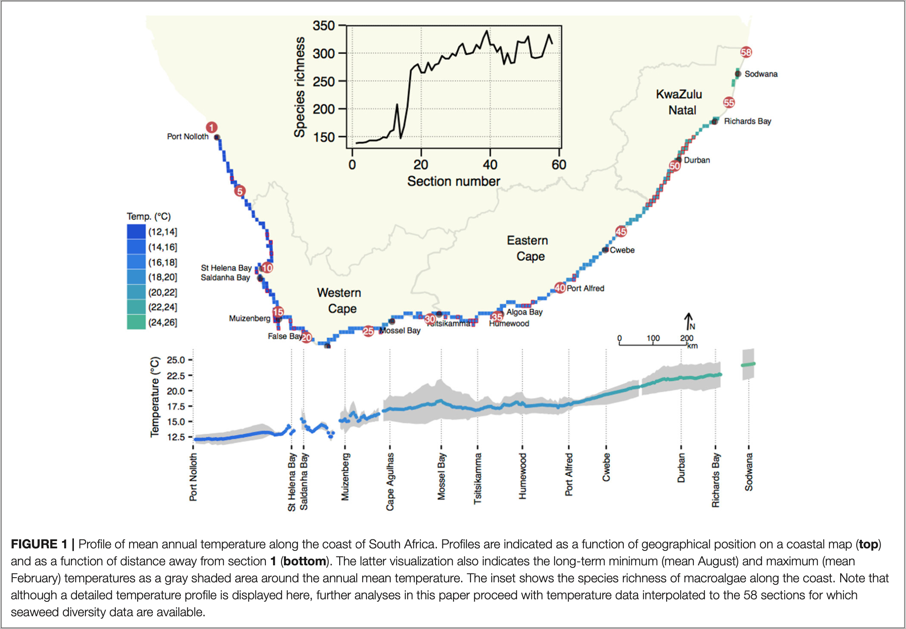

> ***Biodiversity** The variability among living organisms from all
> sources including,* inter alia*, terrestrial, marine and other aquatic
> ecosystems and the ecological complexes of which they are part; this
> includes diversity within species, between species and of ecosystems.*
>
> --- Convention on Biological Diversity

::: callout-tip
## Download the data for this Lab

-   The seaweed species data [`SeaweedSpp.csv`](../data/seaweed/SeaweedSpp.csv)

-   The seaweed environmental data [`SeaweedEnv.csv`](../data/seaweed/SeaweedEnv.csv)

-   The seaweed coastal sections [`SeaweedSites.csv`](../data/seaweed/SeaweedSites.csv)

-   The fictitious light data [`light_levels.csv`](../data/light_levels.csv)
:::

# Lab 3

## Species data

When ecologists talk about species diversity, they typically consider the characteristics of biological communities in a specific habitat, ecological community, or ecosystem. Species diversity considers three important concepts about how species are distributed in space: their **richness**, **abundance**, and **evenness**. Each f these can me expressed as biodiversity metrics that allow us to compare communities among space and time.

When ecologists talk about 'biodiversity' they might not necessarily be
interested in *all* the plants and animals and things that are neither
plant nor animal that occur at a particular place. Some ecologists are
interested in ants and moths. Others might find fishes more insightful.
Some even like marine mammals! I prefer seaweeds. So, the analysis of
biodiversity data might often be constrained to some higher-level taxon,
such as all angiosperms in a landscape, or reptiles, etc. (but all
species are sampled in the higher-level taxon). Some ecological
questions benefit from comparisons of diversity assessments among
selected taxa (avifauna vs. small mammals, for example), as this focus
might address some particular ecological hypothesis---the bird vs. small
mammal comparison might reveal something about how barriers such as
streams and rivers structure biodiversity patterns. In our examples we
will use such focused datasets.

Here we look at the various measures of biodiversity, viz. $\alpha$-, $\gamma$- and
$\beta$-diversity. Deeper analysis is and compulsory reading is provided by
David Zelený on his [Analysis of community data in
R](https://www.davidzeleny.net/anadat-r/doku.php/en:diversity_analysis)
website.

<!--- # Topic 2: Measures of biodiversity --->

## Three measures of biodiversity

Three measures of biodiversity were coined by @whittaker1972evolution, and the concepts were 'modernised' by
@jurasinski2009inventory. They
represent the measurement of biodiversity *across different spatial
scales*. $\alpha$- and $\gamma$-diversity simply express the total number of species
in an area. The first, $\alpha$-diversity, is a representation of the number of
species at the small (local) scale, such as for example within a quadrat, transect,
plot, or trawl. Multiples of these are nested within a larger region (or
ecosystem, etc.) and serve as replicates, and it is the complete number
of species across all of these replicates that indicates the diversity
at a larger scale---this is called $\gamma$-diversity. $\beta$-diversity refers to
the change in species composition among samples (sites).

By now you will have received a brief [Introduction to
R](/bdc334/chapters/02-r_rstudio/) and we can proceed with looking at
some of the measures of biodiversity. We will start by using data on the
seaweeds of South Africa to demonstrate some ideas around diversity
measures. The **vegan**^[I am by no means an advocate for veganism.] (for *vegetation analysis*) package [@oksanen2022vegan] offers [various
functions](../docs/Oksanen_diversity-vegan.pdf) to calculate diversity
indices. I will demonstrate some of these functions, below.

## The South African seaweed data

For this example we will use the seaweed data of @smit2017seaweeds.
Please make sure that you read this paper. An additional file describing the
background to the data is available [here](../docs/Smit_the_seaweed_data.pdf) (@fig-seaweed-sections).

{#fig-seaweed-sections fig-align="center"}

One of the datasets, $Y$ (in the file `SeaweedSpp.csv`),
comprises updated distribution records of 847 macroalgal species within each of
58 × 50 km-long sections of the South African coast [@bolton2002seaweed].
This represents *ca*. 90% of the known seaweed flora
of South Africa, but excludes some very small and/or very rare species
for which data are insufficient. The data are from verifiable literature
sources and John Bolton and Rob Anderson's own collections, assembled
from information collected by teams of phycologists over three decades [@bolton1986marine; @stegenga1997seaweeds; @bolton2002seaweed; @de2005guide]. Another file, $E$ (in `env.csv`), is a dataset of *in situ*
coastal seawater temperatures derived from daily
measurements over up to 40 years [@smit2013coastal].

### Setting up the analysis environment

This is **R**, so first I need to find, install and load various
packages. Some of the packages will be available on CRAN and can be
accessed and installed in the usual way, but others will have to be
downloaded from [R
Forge](https://r-forge.r-project.org/R/?group_id=195).

```{r}
library(tidyverse)
library(vegan)
library(betapart)
library(BiodiversityR) # this package may at times be problematic to install
library(gridExtra)
library(grid)
library(gridBase)
```

### A look at the data

Let's load the data and see how it is structured:

```{r}
spp <- read.csv('../data/seaweed/SeaweedSpp.csv')
spp <- dplyr::select(spp, -1)

# Lets look at the data:
dim(spp)
```

We see that our dataset has 58 rows and 847 columns. What is in the
columns and rows? Start with the first 5 rows and 5 columns:

```{r}
spp[1:5, 1:5]
```

Now the last 5 rows and 5 columns:

```{r}
spp[(nrow(spp) - 5):nrow(spp), (ncol(spp) - 5):ncol(spp)]
```

So, each of the rows corresponds to a site (i.e. each of the coastal
sections), and the columns each contain a species. The species are
arranged alphabetically, and they are indicated by a six-letter code.

### Alpha diversity

We can represent $\alpha$-diversity in three ways:

1.  as species richness, $S$;

2.  as a univariate diversity index, such as the $\alpha$ parameter of
    [Fisher's
    log-series](04-biodiversity.html#species-abundance-distribution),
    Shannon diversity, $H'$, or Simpson's diversity, $\lambda$;
    
3.  Species evenness, e.g. Pielou’s evenness, $J$; or    

4.  as a pairwise dissimilarity index, e.g. Bray-Curtis, Jaccard, or Sørensen
    dissimilarities---see @koleff2003measuring for many more; also see `?vegdist`. However, it makes more sense to discuss pairwise dissimilarities wuth $\beta$-diversity.

We will work through each in turn.

#### Species richness, $S$

First, species richness, which is denoted by the symbol $S$. In the seaweed biodiversity data---because
we view each coastal section as the local scale (the smallest unit of
sampling)---I simply count the number of species within each of the
sections.

The preferred option for calculating species richness is the
`specnumber()` function in **vegan**:

```{r}
specnumber(spp, MARGIN = 1)
```

The data output is easier to understand if we display it as a `tibble()`:

```{r}
# Use 'MARGIN = 1' to calculate the number of species within each row (site)
spp_richness <- tibble(section = 1:58,
                       richness = specnumber(spp, MARGIN = 1))
head(spp_richness)
```

The `diversityresult()` function in the **BiodiversityR** package can do
the same (sometimes this package is difficult to install due to various
software dependencies that might be required for the package to load
properly---don't be sad if this method does not work):

```{r, eval=FALSE}
spp_richness <- diversityresult(spp, index = 'richness',
                                method = 'each site')
# spp_richness
```

Now we make a plot seen in @fig-species-richness:

```{r}
#| fig-cap: "The seaweed species richness, $S$, within each of the coastal sections along the shore of South Africa."
#| label: fig-species-richness
ggplot(data = spp_richness, (aes(x = 1:58, y = richness))) +
  geom_line() +
  xlab("Coastal section, west to east") +
  ylab("Species richness") +
  theme_linedraw()
```

In other instances, it makes more sense to calculate the mean species
richness of all the sampling units (e.g. quadrats) taken inside the
ecosystem of interest. You will have to decide based on your own data.

The mean species richness is:

```{r}
round(mean(spp_richness$richness), 0)
```


#### Univariate diversity indices

The second way in which we can express $\alpha$-diversity is to use one of the
univariate diversity indices such as Fisher's $\alpha$, Shannon's $H'$
or Simpson's $\lambda$.

The choice of which of the indices to use should be informed by the
extent to which one wants to emphasise richness or evenness. Species
richness, $S$, does not consider evenness at all as it is all about
richness (obviously). Simpson's $\lambda$ emphasises evenness a lot more.
Shannon's $H'$ is somewhere in the middle.

**Simpson's $\lambda$**, or simply the Simpson index, is calculated as:

$$\displaystyle \lambda = \sum_{i=1}^{S} p_{i}^{2}$$ where $S$ is the
species richness and $p_{i}$ is the relative abundance of the $i$th
species.

**Shannon's $H'$** is sometimes called Shannon's diversity, the
Shannon-Wiener index, the Shannon-Weaver index, or the Shannon entropy.
It is calculated as:

$$H' = -\sum_{i=1}^{S} p_{i} \ln p_{i}$$ where $p_{i}$ is the proportion of individuals belonging to the $i$th species, and $S$ is the species richness.

**Fisher's $\alpha$** estimates the $\alpha$ parameter of [Fisher's
logarithmic
series](04-biodiversity.html#species-abundance-distribution)
(see `fisherfit()`). The estimation is possible only for actual counts
(i.e. integers) of individuals, so it will not work for percent cover,
biomass, and other measures that can be expresses by real numbers.

We cannot calculate any of these for the seaweed data because in order
to do so we require abundance data---the seaweed data are
presence-absence only. Let's load a fictitious dataset of the diversity
of three different communities of plants, with each community
corresponding to a different light environment (dim, mid, and high
light):

```{r}
light <- read.csv("../data/light_levels.csv")
light
```

We can see above that in stead of having data with 1s and 0s for
presence-absence, here we have some values that indicate the relative
amounts of each of the species in the three light environments. We
calculate species richness (as before), and also the Shannon and Simpson
indices using **vegan**'s `diversity()` function:

```{r}
light_div <- tibble(
  site = c("low_light", "mid_light", "high_light"),
  richness = specnumber(light[, 2:7], MARGIN = 1),
  shannon = round(diversity(light[, 2:7], MARGIN = 1, index = "shannon"), 2),
  simpson = round(diversity(light[, 2:7], MARGIN = 1, index = "simpson"), 2)
)
light_div
```

<!-- Hill numbers, $q$, (Hill, 1973) summarise $S$, Shannon's $H'$ and Simpson's $\lambda$. Higher $q$ puts less weight on rare species and weighs abundant ones more. Hill numbers can be used to draw diversity profiles, which allow for an elegant comparison of diversity among communities considering both richness and evenness. -->

<!-- ```{r fig.height=3, fig.width=5} -->

<!-- data(BCI) -->

<!-- i <- sample(nrow(BCI), 12) -->

<!-- mod <- renyi(BCI[i,]) -->

<!-- plot(mod) -->

<!-- mod <- renyiaccum(BCI[i,]) -->

<!-- plot(mod, as.table=TRUE, col = c(1, 2, 2)) -->

<!-- persp(mod) -->

<!-- ``` -->

#### Species evenness

Evenness refers to the shape of a [species abundance
distribution](04-biodiversity.html#species-abundance-distribution).

One index for evenness is Pielou's evenness, $J$:

$$J = \frac{H^{\prime}} {log(S)}$$

where $H'$ is Shannon's diversity index, and $S$ the number of species
(i.e. $S$).

To calculate Pielou's evenness index for the `light` data, we can do
this:

```{r}
H <- diversity(light[, 2:7], MARGIN = 1, index = "shannon")

J <- H/log(specnumber(light[, 2:7]))
round(J, 2)
```

#### Dissimilarity indices

In this section we will cover the dissimilarity indices, which are
special cases of diversity indices that use pairwise comparisons between
sampling units, habitats, or ecosystems. Both $\alpha$- and $\beta$-diversity can be
expressed as dissimilarity indices, but let deal with $\alpha$-diversity first.

Species dissimilarities result in pairwise matrices that are similar to
the pairwise correlation or Euclidian distance matrices that we have
seen in [Lab 1](01-introduction.qmd). In [Lab
2a](03-env_dist.qmd) you will have also learned how to
calculate these ecological distances in R.

These dissimilarity indices are multivariate and compare between sites,
sections, plots, etc., and must therefore not be confused with the
univariate diversity indices.

Recall from the lecture slides the Bray-Curtis and Jaccard dissimilarity
indices for abundance data, and the Sørensen dissimilarity index for
presence-absence data. The seaweed dataset is a presence-absence
dataset, so we will use the Sørensen index. The interpretation of the
resulting square (number of rows = number of columns) dissimilarity
matrices is the same regardless of whether it is calculated for an
abundance dataset or a presence-absence dataset. The values range from 0
to 1, with 0 meaning that the pair of sites being compared is identical
(i.e. 0 dissimilarity) and 1 means the pair of sites is completely
different (no species in common, hence 1 dissimilarity). In the square
dissimilarity matrix the diagonal is 0, which essentially (and
obviously) means that any site is identical to itself. Elsewhere the
values will range from 0 to 1. Since this is a pairwise calculation
(each site compared to every other site), our seaweed dataset will
contain (58 × (58 - 1))/2 = 1653 values, each one ranging from 0 to 1.

The first step involves the species table, $Y$. First we compute the
Sørensen dissimilarity index, $\beta_{\text{sør}}$, to compare the
dissimilarity of all pairs of coastal sections using on presence-absence
data. The dissimilarity in species composition between two sections is
calculated from three parameters, *viz*., *b* and *c*, which represent
the number of species unique to each of two sites, and *a*, the number
of species in common between them. It is given by:

$$\beta_\text{sør}=\frac{b+c}{2a+b+c}$$

The **vegan** function `vegdist()` provides access to the dissimilarity
indices. We calculate the Sørensen dissimilarity index:

```{r}
sor <- vegdist(spp, binary = TRUE) # makes the lower triangle matrix
sor_df <- round(as.matrix(sor), 4)
dim(sor_df)
sor_df[1:10, 1:10] # the first 10 rows and columns
```

What we see above is a square dissimilarity matrix. The most
important characteristics of the matrix are:

i.  whereas the raw species data, $Y$, is rectangular (number rows ≠
    number columns), the dissimilarity matrix is square (number rows =
    number columns);

ii. the diagonal is filled with 0;

iii. the matrix is symmetrical---it is comprised of symetrical upper and
     lower triangles.

::: callout-important
## Lab 3

With reference to dissimilarity matrices produced from species data using any of the dissimilarity indices available in `vegdist()`, please answer these questions:

1. Why is the matrix square, and what determines the
number of rows/columns?

2. What is the meaning of the diagonal?

3. What is the meaning of the non-diagonal elements?

4. Referring now to the seaweed species data specifically, take the data in row or column 1 and create a line graph that shows these values as a function of section number.

5. Provide a mechanistic (ecological) explanation for why this figure takes the shape that it does. Which community assembly process does this hint at?
:::

### Gamma diversity

Staying with the seaweed data, $Y$, lets now look at
$\gamma$-diversity---this would simply be the total number of species
along the South African coastline in all 58 coastal sections. Since each
column represents one species, and the dataset contains data collected
at each of the 58 sites (the number of rows), we can simply do:

```{r}
# the number of columns gives the total number of species in this example:
ncol(spp)
```

We can also use:

```{r, eval=TRUE}
diversityresult(spp, index = 'richness', method = 'pooled')
```

<!-- ```{r} -->

<!-- specpool() -->

<!-- ``` -->

::: callout-important
## Lab 3 (continue)

6. Why is there a difference between the two?

7. Which is correct?
:::

Think before you calculate $\gamma$-diversity for your own data as it might not
be as simple as here!

### Beta-diversity

#### Whittaker's concept of $\beta$-diversity

The first measure of $\beta$-diversity comes from @whittaker1960vegetation and is called *true
$\beta$-diversity*. This is simply dividing the $\gamma$-diversity for the region by
the $\alpha$-diversity for a specific coastal section. We can calculate it all
at once for the whole dataset and make a graph (@fig-true-beta):

```{r}
#| fig-cap: "Whittaker’s true β-diversity shown in the seaweed data."
#| label: fig-true-beta
true_beta <- data.frame(
  beta = specnumber(spp, MARGIN = 1) / ncol(spp),
  section_no = c(1:58)
)
# true_beta
ggplot(data = true_beta, (aes(x = section_no, y = beta))) +
  geom_line() + xlab("Coastal section, west to east") +
  ylab("True beta-diversity") +
  theme_linedraw()
```

The second measure of $\beta$-diversity is *absolute species turnover*, and to
calculate this we simply subtract $\alpha$-diversity for each section from the
region's $\gamma$-diversity (@fig-abs-beta):

```{r}
#| fig-cap: "Whittaker’s absolute species turnover shown in action in the seaweed data."
#| label: fig-abs-beta
abs_beta <- data.frame(
  beta = ncol(spp) - specnumber(spp, MARGIN = 1),
  section_no = c(1:58)
)
# abs_beta
ggplot(data = abs_beta, (aes(x = section_no, y = beta))) +
  geom_line() + xlab("Coastal section, west to east") +
  ylab("Absolute beta-diversity") +
  theme_linedraw()
```

#### Contemporary definitions $\beta$-diversity

Contemporary views of $\beta$-diversity are available by @baselga2010partitioning and @anderson2011navigating. Nowadays we see $\beta$-diversity is
a concept that describes how species assemblages (communities) measured
within the ecosystem of interest vary from place to place, e.g. between
the various transects or quadrats used to sample the ecosystem.
$\beta$-diversity results from habitat heterogeneity (along gradients, or
randomly). We have already seen two concepts of $\beta$-diversity, viz. true
$\beta$-diversity and absolute species turnover---both of these rely on
knowledge of species richness at local (a measure of $\alpha$-diversity) and
regional ($\gamma$-diversity) scales. Much more insight into **species assembly
processes** can be extracted, however, when we view $\beta$-diversity as a
dissimilarity index. In this view, we will see that there are two
processes by which $\beta$-diversity might be affected (i.e. in which the
patterning of communities over landscapes might arise). These offer
glimpses into mechanistic influences about how ecosystems are
structured.

**Process 1:** If a region is comprised of the species A, B, C, ..., M
(i.e. $\gamma$-diversity is 13), a subset of the regional flora as captured by
one quadrat might be species **A**, **D**, E, whereas in another quadrat
it might be species **A**, **D**, F. In this instance, the $\alpha$-diversity
is 3 in both instances, and heterogeneity (and hence $\beta$-diversity)
results from the fact that the first quadrat has species E but the other
has species F. In other words, here we have the same number of species
in both quadrats, but only two of the species are the same. The process
responsible for this form of $\beta$-diversity is species **turnover**,
$\beta_\text{sim}$. Turnover refers to processes that cause communities
to differ due to species being lost and/or gained from section to
section, i.e. the species composition changes between sections without
corresponding changes in $\alpha$-diversity.

**Process 2:** Consider again species A, B, C, ..., M. Now we have the
first quadrat with species **A**, **B**, C, D, **G**, H ($\alpha$-diversity is
6) and the second quadrat has a subset of this, e.g. only species **A**,
**B**, **G** ($\alpha$-diversity 3). Here, $\beta$-diversity comes from the fact that
even if the two places share the same species, the number of species can
still differ among the quadrats (i.e. from place to place) due to one
quadrat capturing only a subset of species present in the other. This
form of $\beta$-diversity is called **nestedness-resultant** $\beta$-diversity,
$\beta_\text{sne}$, and it refers to processes that cause species to be
gained or lost, and the community with the lowest $\alpha$-diversity is a
subset of the richer community.

The above two examples show that $\beta$-diversity is coupled not only with
the identity of the species in the quadrats, but also $\alpha$-diversity---with
species richness in particular.

We express $\beta$-diversity as nestedness-resultant, $\beta_\text{sne}$, and
turnover, $\beta_\text{sim}$, components so as to be able to distinguish
between these two processes. It allows us to make inferences about the
two possible drivers of $\beta$-diversity. Turnover refers to processes that
cause communities to differ due to species being lost and/or gained from
section to section, i.e. the species composition changes between
sections without corresponding changes in $\alpha$-diversity. The
nestedness-resultant component implies processes that cause species to
be gained or lost without replacement, and the community with the lowest
$\alpha$-diversity is a subset of the richer community.

How do we calculate the turnover and nestedness-resultant components of
$\beta$-diversity? The **betapart** package [@baselga2022betapart] comes to the
rescue. We decompose the dissimilarity into the $\beta_\text{sim}$ and
$\beta_\text{sne}$ components [@baselga2010partitioning] using the `betapart.core()`
and `betapart.pair()` functions. The outcomes of this partitioning
calculation are placed into the matrices $Y1$ and $Y2$. These data can
then be analysed further---e.g. we can apply a principal components
analysis (PCA) or another multivariate analysis on $Y$ to find the major
patterns in the community data---we will do this in a later section.

```{r}
# Decompose total Sørensen dissimilarity into turnover and nestedness-resultant
# components:
Y.core <- betapart.core(spp)
Y.pair <- beta.pair(Y.core, index.family = "sor")

# Let Y1 be the turnover component (beta-sim):
Y1 <- round(as.matrix(Y.pair$beta.sim), 3)

# Let Y2 be the nestedness-resultant component (beta-sne):
Y2 <- round(as.matrix(Y.pair$beta.sne), 3)
```

A portion of the turnover component matrix:
```{r}
Y1[1:10, 1:10]
```

A portion of the nestedness-resultant matrix:
```{r}
Y2[1:10, 1:10]
```

A portion of the nestedness-resultant matrix reformatted as a `tibble()`^[Note that the rows are no longer numbered in the tibble view, but it can easily be recreated by `seq(1:58)`.]:
```{r}
Y2_tib <- as_tibble(Y2)
head(Y2_tib)
```


::: callout-important
## Lab 3 (continue)

8. Plot species turnover as a function of Section number,
and provide a mechanistic explanation for the pattern observed.

9. Based on an assessment of literature on the topic,
provide a discussion of nestedness-resultant $\beta$-diversity. Use either a
marine or terrestrial example to explain this mode of structuring biodiversity (i.e. assembly of species into a community).
:::

:::{.callout-important}
## Submission instructions

The Lab 3 assignment on Species Data was discussed on Monday 15 August
and is due at **07:00 on Monday 22 August 2022**.

Provide a **neat and thoroughly annotated** R file which can recreate all the
graphs and all calculations. Written answers must be typed in the same file as comments.

Please label the R file as follows:

-   `BDC334_<first_name>_<last_name>_Lab_3.R`

(the `<` and `>` must be omitted as they are used in the example as
field indicators only).

Submit your appropriately named R documents on iKamva when ready.

Failing to follow these instructions carefully, precisely, and
thoroughly will cause you to lose marks, which could cause a significant
drop in your score as formatting counts for 15% of the final mark (out
of 100%).
:::

# Lab 4

## Other macroecological patterns

Univariate diversity measures such as Simpson and Shannon diversity have already been prepared from species tables, and we have also calculated measures of $\beta$-diversity that looked at pairwise comparisons and offered insoght into community structure across a landscape.

Lets extend the view to ecological patterns and the ecological processes that structure the communities---sometimes we will see reference to 'community or species assembly processes' to offer mechanistic views on how species come to be arranged into communities (the afore-mentioned turnover and nestedness-resultant $\beta$-diversity are examples of other assembly processes). Let's develop views that are based on all the information contained in the species tables, i.e. abundance, the number of sites, and the diversity of the biota. This deeper view is not necessarily captured if we limit our toolkit to the various univariate and pairwise descriptors of biodiversity.

<!-- You will already be familiar with the paper by @shade2018macroecology. Several kinds of ecological patterns are mentioned in the paper, and they can be derived from a species table with abundance data (but *not* presence-absence data!) such as this mites dataset used extensively in the Numerical Ecology with R book: -->

<!-- ```{r} -->
<!-- library(tidyverse) -->
<!-- library(vegan) -->

<!-- data(mite) # data contained within vegan -->

<!-- # make a head-tail function -->
<!-- ht <- function(d) rbind(head(d, 7), tail(d, 7)) -->

<!-- # Lets look at a portion of the data: -->
<!-- ht(mite[, 1:7]) -->
<!-- ``` -->

You will already be familiar with the paper by @shade2018macroecology. Several kinds of ecological patterns are mentioned in the paper, and they can be derived from a species table with abundance data (but *not* presence-absence data!). Note that Figure 1 in @shade2018macroecology starts with a species table where the species are arranged down the rows and the sites along the variables (columns). I, and also the **vegan** package, require that the **species are along the variables and the sites down the rows**. This is the convention that will be used throughout this module.

The patterns that can be derived from such a table include:

* species-abundance distribution;
* occupancy-abundance curves;
* species-area curves;
* distance-decay curves;
* rarefaction curves;
* elevation gradients.

We will calculate each for the Barro Colorado Island Tree Counts data that come with **vegan**.

```{r}
library(tidyverse)
library(vegan)

data(BCI) # data contained within vegan

# make a head-tail function
ht <- function(d) rbind(head(d, 7), tail(d, 7))

# Lets look at a portion of the data:
ht(BCI)
# ?BCI # see the help file for a description of the data
```

### Species-abundance distribution

The species abundance distribution (SAD) is a fundamental pattern in ecology. Typical communities have a few species that are very abundant, whereas most of them are quite rare; indeed---this is perhaps a universal law in ecology. SAD represents this relationship graphically by plotting the abundance rank on the $x$-axis and the number of species (or some other taxonomic level) along $y$, as was first done by @fisher1943relation. He then fitted the data by log series that ideally capture situations where most of the species are quite rare with only a few very abundant ones---called **Fisher's log series distribution**---and is implemented in **vegan** by the `fisherfit()` function (@fig-fishers-log):

```{r}
#| fig-cap: "Fisher's log series distribution calculated for the Barro Colorado Island Tree Counts data."
#| label: fig-fishers-log
#| fig-width: 6
#| fig-height: 4

# take one random sample of a row (site):
k <- sample(nrow(BCI), 1)
fish <- fisherfit(BCI[k,])
fish
plot(fish)
```

@preston1948commonness showed that when data from a thoroughly sampled population are transformed into octaves along the $x$-axis (number of species binned into intervals of 1, 2, 4, 8, 16, 32 etc.), the SAD that results is approximated by a symmetric Gaussian distribution. This is because more thorough sampling makes species that occur with a high frequency more common and those that occur only once or are very rare become either less common will remain completely absent. This SAD is called **Preston's log-normal distribution**. In the **vegan** package there is an updated version of Preston's approach with a mathematical improvement to better handle ties. It is called `prestondistr()` (@fig-preston):

```{r}
#| fig-cap: "Preston's log-normal distribution demonstrated for the BCI data."
#| label: fig-preston
#| fig-width: 6
#| fig-height: 4

pres <- prestondistr(BCI[k,])
pres
plot(pres)
```

@whittaker1965dominance introduced **rank abundance distribution curves** (sometimes called a dominance-diversity curves or Whittaker plots). Here the $x$-axis has species ranked according to their relative abundance, with the most abundant species at the left and rarest at the right. The $y$-axis represents relative species abundances (sometimes log-transformed). The shape of the profile as---influenced by the steepness and the length of the tail---indicates the relative proportion of abundant and scarce species in the community. In **vegan** we can accomplish fitting this type of SAD with the `radfit()` function. The default plot is somewhat more complicated as it shows broken-stick, preemption, log-Normal, Zipf and Zipf-Mandelbrot models fitted to the ranked species abundance data (@fig-rad):

```{r}
#| fig-cap: "Whittaker's rank abundance distribution curves demonstrated for the BCI data."
#| label: fig-rad
#| fig-width: 6
#| fig-height: 4

rad <- radfit(BCI[k,])
rad
plot(rad)
```

We can also fit the rank abundance distribution curves to several sites at once (previously we have done so on only one site) (@fig-rad2):

```{r}
#| fig-cap: "Rank abundance distribution curves fitted to several sites."
#| label: fig-rad2
#| fig-width: 6
#| fig-height: 4

m <- sample(nrow(BCI), 6)
rad2 <- radfit(BCI[m, ])
rad2
plot(rad2)
```

Above, we see that the model selected for capturing the shape of the SAD is the Mandelbrot, and it is plotted individually for each of the randomly selected sites. Model selection works through Akaike’s or Schwartz’s Bayesian information criteria (AIC or BIC; AIC is the default---select the model with the lowest AIC).

[**BiodiversityR**](https://github.com/cran/BiodiversityR) (and [here](http://apps.worldagroforestry.org/downloads/Publications/PDFS/b13695.pdf) and [here](https://rpubs.com/Roeland-KINDT)) also offers options for rank abundance distribution curves; see `rankabundance()` (@fig-rac):

```{r}
#| fig-cap: "Rank-abundance curves for the BCI data."
#| label: fig-rac
#| fig-width: 6
#| fig-height: 4

library(BiodiversityR)
rankabund <- rankabundance(BCI)
rankabunplot(rankabund, cex = 0.8, pch = 0.8, col = "salmon")
```

Refer to the help files for the respective functions to see their differences.

### Occupancy-abundance curves

Occupancy-abundance relationships are used to infer niche specialisation patterns in the sampling region. The hypothesis (almost a theory) is that species that tend to have high local abundance within one site also tend to occupy many sites (@fig-occupancy).

```{r}
#| fig-cap: "Occupancy-abundance relationships seen in the BCI data."
#| label: fig-occupancy
#| fig-width: 6
#| fig-height: 6

library(ggpubr)
BCI_OA <- data.frame(occ = colSums(BCI),
                     ab = apply(BCI, MARGIN = 2, mean))

plt1 <- ggplot(BCI_OA, aes(x = ab, y = occ)) +
  geom_point() +
  scale_x_log10() +
  scale_y_log10() +
  labs(title = "Barro Colorado Island Tree Counts",
     x = "Log (abundance)", y = "Log (occupancy)") +
  theme_linedraw()

plt2 <- ggplot(BCI_OA, aes(x = log(ab))) +
  geom_histogram(col = "black", fill = "turquoise", bins = 15) +
  labs(title = "Barro Colorado Island Tree Counts",
     x = "Log (abundance)") +
  theme_linedraw()

plt3 <- ggplot(BCI_OA, aes(x = log(occ))) +
  geom_histogram(col = "black", fill = "salmon", bins = 15) +
  labs(title = "Barro Colorado Island Tree Counts",
     x = "Log (occupancy)") +
  theme_linedraw()

ggarrange(plt1, plt2, plt3, nrow = 3)
```

### Species-area (accumulation) and rarefaction curves

Species accumulation curves and rarefaction curves both serve the same purpose, that is, to try and estimate the number of unseen species. Within an ecosystem type, one would expect that more and more species would be added (accumulates) as the number of sampled sites increases. This continues to a point where no more new species are added as the number of sampled sites continues to increase (i.e. the curve plateaus). Species accumulation curves, as the name suggests, accomplishes this by adding (accumulation or collecting) more and more sites and counting the average number of species along $y$ each time a new site is added. See Roeland Kindt's description of [how species accumulation curves work](http://apps.worldagroforestry.org/downloads/Publications/PDFS/b13695.pdf) (on p. 41). In the community matrix (the sites × species table), we can do this by successively adding more rows to the curve (seen along the $x$-axis). The `specaccum()` function has many different ways of adding the new sites to the curve, but the default 'exact' seems to be a sensible choice. **BiodiversityR** has the `accumresult()` function that does nearly the same. Let's demonstrate using **vegan**'s function (@fig-accum, @fig-accum2, and @fig-accum3):

```{r}
#| fig-cap: "Species-area accumulation curves seen in the BCI data."
#| label: fig-accum
#| fig-width: 6
#| fig-height: 4

sp1 <- specaccum(BCI)
sp2 <- specaccum(BCI, "random")

# par(mfrow = c(2,2), mar = c(4,2,2,1))
# par(mfrow = c(1,2))
plot(sp1, ci.type = "polygon", col = "blue", lwd = 2, ci.lty = 0,
     ci.col = "lightblue", main = "Default: exact",
     ylab = "No. of species")
```

```{r}
#| fig-cap: "Fit Arrhenius models to all random accumulations"
#| label: fig-accum2
#| fig-width: 6
#| fig-height: 4

mods <- fitspecaccum(sp2, "arrh")
plot(mods, col = "hotpink", ylab = "No. of species")
boxplot(sp2, col = "yellow", border = "blue", lty = 1, cex = 0.3, add = TRUE)
sapply(mods$models, AIC)
```

```{r}
#| fig-cap: "A species accumulation curve."
#| label: fig-accum3
#| fig-width: 6
#| fig-height: 4

accum <- accumresult(BCI, method = "exact", permutations = 100)
accumplot(accum)
```

Rarefaction is a statistical technique used by ecologists to assess species richness (represented as *S*, or diversity indices such as Shannon diversity, $H'$, or Simpson's diversity, $\lambda$) from data on species samples, such as that which we may find in site × species tables. Rarefaction can be used to determine whether a habitat, community, or ecosystem has been sufficiently sampled to fully capture the full complement of species present.

Rarefaction curves may seem similar to species accumulation curves, but there is a difference as I will note below. Species richness, *S*, accumulates with sample size *or* with the number of individuals sampled (across all species). The first way that rarefaction curves are presented is to show species richness as a function of number of individuals sampled. Here the principle demonstrated is that when only a few individuals are sampled, those individuals may belong to only a few species; however, when more individuals are present more species will be represented. The second approach to rarefaction is to plot the number of samples along $x$ and the species richness along the $y$-axis (as in SADs too). So, rarefaction shows how richness accumulates with the number of individuals counted or with the number of samples taken. 

But what really distinguishes rarefaction curves from SADs is that rarefaction randomly re-samples the pool of $n$ samples (that is equal or less than the total community size) a number of times and plots the average number of species found in each resample (1,2, ..., $n$) as a function of individuals or samples. The `rarecurve()` function draws a rarefaction curve for each row of the species data table. All these plots are made with base R graphics, but it will be a trivial exercise to reproduce them with **ggplot2**.

:::{.callout-note}
**iNEXT**

We can also use the [**iNEXT**](https://github.com/JohnsonHsieh/iNEXT) package for rarefaction curves. From the package's [Introduction Vignette](https://cran.r-project.org/web/packages/iNEXT/vignettes/Introduction.html):
 
iNEXT focuses on three measures of Hill numbers of order q: species richness (q = 0), Shannon diversity (q = 1, the exponential of Shannon entropy) and Simpson diversity (q = 2, the inverse of Simpson concentration). For each diversity measure, iNEXT uses the observed sample of abundance or incidence data (called the “reference sample”) to compute diversity estimates and the associated 95% confidence intervals for the following two types of rarefaction and extrapolation (R/E):
 
1. Sample‐size‐based R/E sampling curves: iNEXT computes diversity estimates for rarefied and extrapolated samples up to an appropriate size. This type of sampling curve plots the diversity estimates with respect to sample size.

2. Coverage‐based R/E sampling curves: iNEXT computes diversity estimates for rarefied and extrapolated samples with sample completeness (as measured by sample coverage) up to an appropriate coverage. This type of sampling curve plots the diversity estimates with respect to sample coverage.

iNEXT also plots the above two types of sampling curves and a sample completeness curve. The sample completeness curve provides a bridge between these two types of curves.

For information about Hill numbers see David Zelený's [Analysis of community data in R](https://www.davidzeleny.net/anadat-r/doku.php/en:diversity_analysis) and Jari Oksanen's coverage of [diversity measures in **vegan**](https://cran.r-project.org/web/packages/vegan/vignettes/diversity-vegan.pdf).

There are four datasets distributed with iNEXT and numerous examples are provided in the [Introduction Vignette](https://cran.r-project.org/web/packages/iNEXT/vignettes/Introduction.html). iNEXT has an 'odd' data format that might seem foreign to **vegan** users. To use iNEXT with dataset suitable for analysis in vegan, we first need to convert BCI data to a species × site matrix (@fig-iNEXT):

```{r}
#| fig-cap: "Demonstration of iNEXT capabilities."
#| label: fig-iNEXT
#| fig-width: 6
#| fig-height: 4

library(iNEXT)

# transpose the BCI data: 
BCI_t <- list(BCI = t(BCI))
str(BCI_t)

BCI_out <- iNEXT(BCI_t, q = c(0, 1, 2), datatype = "incidence_raw")
ggiNEXT(BCI_out, type = 1, color.var = "order")
```

The warning is produced because the function expects incidence data (presence-absence), but I'm feeding it abundance (count) data. Nothing serious, as the function converts the abundance data to incidences.
:::

### Distance-decay curves

The principles of distance decay relationships are clearly captured in analyses of  [$\beta$-diversity](04-biodiversity.html#contemporary-definitions-%CE%B2-diversity)---see specifically **turnover**, $\beta_\text{sim}$. Distance decay is the primary explanation for the spatial pattern of $\beta$-diversity along the South African coast in @smit2017seaweeds. A deeper dive into distance decay calculation can be seen in [Deep Dive into Gradients](../BCB743/03-deep_dive.qmd).

### Eelevation and other gradients

Elevation gradients and other gradients such as change in species composition with depth in the ocean are specific cases of distance decay and the same principles apply in these cases.

:::{.callout-important}
## Submission instructions

The Lab 3 assignment on Species Data was discussed on Monday 22 August
and is due at **07:00 on Monday 29 August 2022**.

Provide a **neat and thoroughly annotated** R file which can recreate all the
graphs and all calculations. Written answers must be typed in the same file as comments.

Please label the R file as follows:

-   `BDC334_<first_name>_<last_name>_Lab_4.R`

(the `<` and `>` must be omitted as they are used in the example as
field indicators only).

Submit your appropriately named R documents on iKamva when ready.

Failing to follow these instructions carefully, precisely, and
thoroughly will cause you to lose marks, which could cause a significant
drop in your score as formatting counts for 15% of the final mark (out
of 100%).
:::

#     References

::: {#refs}
:::
