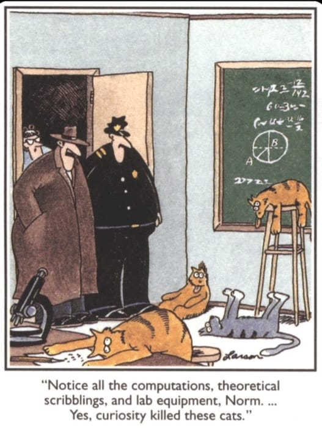

{#cats fig-align="center"}

**Welcome to Term 3 of BDC334 Biogeography and Global Ecology. This page provides the syllabus and teaching policies for the module, and it serves is a starting point for the Lab theory, instruction, and data.**

# Syllabus, overview, and expectations

## Syllabus

These links point to online resources such as datasets and R scripts in
support of the video and PDF lecture material. It is essential that you
work through these examples and workflows.

::: callout-note
## Labs

**To jump directly to the Lab (Prac) content, follow the links on the left. Otherwise, access it from the table below.**

The table provides access to web pages and PDF slides; video recordings of lectures can be found on iKamva.
:::

| Wk  | Type           | Topic                                                                        | PDFs etc.                                                                                             | Class date            | Exercise due      |
|-----|----------------|------------------------------------------------------------------------------|-------------------------------------------------------------------------------------------------------|-----------------------|-------------------|
| W1  | L              | **Introduction**                                                             | [slides](../slides/BCB743_01_intro.pdf)                                                               | 25-29 Jul                |                   |
|     | L              | Keith et al 2012                                                             | [reading](../docs/Keith_et_al_2012.pdf)                                                               |                       |                   |
|     | L              | Shade et al 2018                                                             | [reading](../docs/Shade_et_al_2018.pdf)                                                               |                       |                   |
|     | L              | BDC334_Intro_Day_1_Module_Info_720p30.mp4                                    | iKamva                                                                                                |                       |                   |
|     | L              | BDC334_Intro_Day_1_Pracs_Tests_720p30.mp4                                    | iKamva                                                                                                |                       |                   |
|     | L              | BDC334_Intro_Day_1_Topic_1a_720p30.mp4                                       | iKamva                                                                                                |                       |                   |
|     | L              | BDC334_Intro_Day_1_Topic_1b_720p30.mp4                                       | iKamva                                                                                                |                       |                   |
|     | L              | BDC334_Intro_Day_1_Topic_1c_720p30.mp4                                       | iKamva                                                                                                |                       |                   |
| W2  | L              | **Gradients and community structure**                                        |                                                                                                       | 1-5 Aug               |                   | 
|     | L              | Nekola and White 1999                                                        | [reading](../docs/Nekola_and_White_1999.pdf)                                                          |                       |                   |
|     | L              | Smit et al 2017.pdf                                                          | [reading](../docs/Smit_et_al_2017.pdf)                                                                |                       |                   |
|     | L              | Tittensor et al 2010.pdf                                                     | [reading](../docs/Tittensor_et_al_2010.pdf)                                                           |                       |                   |
|     | L              | BDC334_Lecture_2a_720p30.mp4                                                    | iKamva                                                                                                |                       |                   |
|     | L              | BDC334_Lecture_2b_720p30.mp4                                                    | iKamva                                                                                                |                       |                   |
|     | L              | BDC334_Lecture_2c_720p30.mp4                                                    | iKamva                                                                                                |                       |                   |
|     | L              | BDC334_Lecture_2d_720p30.mp4                                                    | iKamva                                                                                                |                       |                   |
|     | P1             | [Ecological data](01-introduction.qmd)                                       | [slides](../slides/BDC334_2_gradients.pdf)                                                            | 1 Aug                 | 8 Aug 2022        |
|     | P1             |                                                                              | [slides](../slides/BCB743_04_environmental_distance.pdf)                                              | 1 Aug                 | 8 Aug 2022        |
| W3  | L              | **Impacts on biodiversity**                                                  |                                                                                                       | 8-12 Aug              |                   | 
|     | L              | Tilman et al 2017                                                            | [reading](../docs/Tilman_et_al_2017.pdf)                                                              |                       |                   |
|     | L              | Maxwell et al 2016                                                           | [reading](../docs/Maxwell_et_al_2016.pdf)                                                             |                       |                   |
|     | L              | Chapin III et al 2000                                                        | [reading](../docs/Chapin_III_et_al_2000.pdf)                                                          |                       |                   |
|     | L              | BDC334_Lecture_3a_1080p30.mp4                                                   | iKamva                                                                                                |                       |                   |
|     | L              | BDC334_Lecture_3b_1080p30.mp4                                                   | iKamva                                                                                                |                       |                   |
|     | L              | BDC334_Lecture_3c_1080p30.mp4                                                   | iKamva                                                                                                |                       |                   |
|     | P2             | [R and RStudio](02a-r_rstudio.qmd)                                           |                                                                                                       | 8 Aug                 | 15 Aug 2022       |
|     | P2             | [Environmental distance](02b-env_dist.qmd)                                   |                                                                                                       | 8 Aug                 | 15 Aug 2022       |
| W4  | L              | **Nature’s contribution to people**                                          |                                                                                                       | 15-19 Aug             |                   | 
|     | L              | Costanza et al 1997                                                          | [reading](../docs/Costanza_et_al_1997.pdf)                                                            |                       |                   |
|     | L              | Costanza et al 2014                                                          | [reading](../docs/Costanza_et_al_2014.pdf)                                                            |                       |                   |
|     | L              | Burger et al 2012                                                            | [reading](../docs/Burger_et_al_2012.pdf)                                                              |                       |                   |
|     | L              | BDC334_Topic_4a_Assignment_1_1080p30.mp4                                     | iKamva                                                                                                |                       |                   |
|     | L              | BDC334_Topic_4b_Assignment_1_1080p30.mp4                                     | iKamva                                                                                                |                       |                   |
|     | L              | BDC334_Topic_4c_Assignment_1_1080p30.mp4                                     | iKamva                                                                                                |                       |                   |
|     | P3             | [Quantifying biodiversity](03-04-biodiversity.qmd)                           | [slides](../slides/BDC334_5_structure.pdf)                                                            | 15 Aug                | 22 Aug            |
| W5  | L              | **Unified accounting: patterns in diversity over space and time**            | [reading](../docs/Shade_et_al_2018.pdf)                                                               | 22-26 Aug             |                   | 
|     | L              | BDC334_Topic_5a_1080p30.mp4                                                  | iKamva                                                                                                |                       |                   |
|     | L              | BDC334_Topic_5b_1080p30.mp4                                                  | iKamva                                                                                                |                       |                   |
|     | P4             | [Biodiversity structure](03-04-biodiversity.qmd)                             | [slides](../slides/BDC334_5_structure.pdf)                                                            | 22 Aug                | 29 Aug            |
| W6  | L              | **Revision**                                                                 |                                                                                                       | 29 Aug to 2 Sep       |                   | 
| W7  |  FIN           | Wiki Essay due                                                               |                                                                                                       |                       | 5 Sep             | 

## Term 3 theory overview

- Ecology and macroecology
    - revisit concepts of ecology
    - biodiversity
    - from ecology to macroecology 
    - questions that macroecologists ask, incl., body size, determinants of geographical boundaries, diversity vs. latitude, etc.
    - theories biodiversity structuring, incl., neutral, niche, metabolic, etc. (?)
    - gradients in diversity
    - macroecology: generalisations across marine and terrestrial realms
- Exploration of seleced marine and terrestrial ecosystems
- Overview of anthropogenic and natural impacts on ecosystem integrity
- Planetary boundaries (own revision)
- Ecosystem goods and services
- Valuation of biodiversity (mostly self-study) using reading provided and also your own research. We examine the TEEB and IPBES approaches.

# Timetable
## Lectures

- Monday 	       3rd period 	Lecture Halls C C6
- Tuesday        2nd period 	Prefabs OM
- Wednesday 	   1st period 	Lecture Halls C C6

You are provided with reading material (lecture slides, PDFs for reading) and pre-recorded video lectures that you are expected to consume prior to the Discussion classes on Wednesdays. The once-a-week face-to-face sessions are important for discussing the work you covered the previous two days, and it also gives you an opportunity to be like real students, attending real lectures, for real, in person. The Discussion session are for free talk and bouncing of ideas. We can talk about anything related to the topic of biodiversity, but will try and focus on the issues at hand.

Typically, we will meet once-a-week, on Wednesdays, in person on campus. The rest of the time we will proceed with pre-recorded lecture material from wherever in the world you choose to be. 

**However, the first Monday of Term 3 we will all meet in person on campus in the lecture venue (again on the first Wednesday of Term 3).** You can then meet me for the first time (even if you saw me online last year) and I will give an outline of the my portion of the course. Prof Boatwright will take over in Term 4.

## Labs
- Monday 	Periods 6-8 	CLC lab in Life Sciences Building (Starts 1 August)

Lab 1 starts in the second week of the module in Term 3. Labs are compulsory and failing to attend will result in a penalty of 20% taken from your mark for the week.

Please ensure that you read through each Lab (accessible in the sidebar) before the start of our face-to-face session in the Life Science Computer Lab at 13:10 on Mondays.

You have until the following Monday 07:00 to complete and submit all the material.

# Course resources on iKamva

All the lecture material for this module is on iKamva. You will find there the following under Course Resources:

- **Assignment 1**---This is the first assignment as the name helpfully suggests. We will meet in the Practical Venue the following Monday, 1 August, to talk about it. It will involve some R coding and data analysis.
- **Interactive Sessions**---These are screen recordings that belong with previous years’ teaching where I address some questions the class had. They might be interesting or helpful.
- **PDF_Reading**---The bulk of the ’teaching’ will happen in the form of reading material. In other words, learning will happen because you read the papers and understand them. My job will be to facilitate understanding, not to convey the content, which you can access yourselves by reading. Yes, reading is an important life skill.
- **Slides**---Some meagre slides to accompany your learning process... for what it’s worth.
- **Video**---These are the actual video of me talking. I might record more as we work through the course.

# Computer access

You are encouraged to provide your own laptops and to install the
necessary software before the module starts. Limited support can be
provided if required. There are also computers with R and RStudio (and
the necessary add-on libraries) available in the 5th floor lab in the
BCB Department.

# Attendance
## Labs

These Labs are hands on. They can only deliver acceptable outcomes if
you attend all Lab sessions. The schedule is set and cannot be changed.
Sometimes an occasional absence cannot be avoided, but you need to
provide evidence (affidavit, doctor's note, or death certificate) for
why you did not attend in order to avoid a non-attendance penalty.
Please be curtuous and notify myself or the tutor in advance of any
absence. If you work with a partner in class, notify them too. Keep up
with the reading assignments while you are away and we will all work
with you to get you back up to speed on what you miss. If you do miss a
class, however, the assignments must still be submitted on time (also
see [Late submission of CA](BDC334_index.html#late-submission-of-ca)).

Since you may decide to work in collaboration with a peer on tasks and
assignments, please keep this person informed at all times in case some
emergency makes you unavailable for a period of time. Someone might
depend on your input and contributions---do not leave someone in the
lurch so that they cannot complete a task in your absence.

## General considerations
The schedule is set and cannot be changed. Sometimes an occasional absence cannot be avoided. Please be courteous and notify myself or the tutor in advance of any absence. If you work with a partner in class, notify them too. Keep up with the reading assignments while you are away and we will all work with you to get you back up to speed on what you miss. If you do miss a class, however, the assignments must still be submitted on time (also see ‘Late submissions’ below).

Since you may decide to work in collaboration with a peer on tasks and assignments, please keep this person informed at all times in case some emergency makes you unavailable for a period of time. Someone might depend on your input and contributions—do not leave someone in the lurch so that they cannot complete a task in your absence.

# Assessment
The syllabus for Term 3 is comprised of the following mark-carrying components for Continuous Assessment (CA):

- Assignment 1 (integrative of al Labs) — [20%]
- Wiki Essay — [20%]
- Quizzes [10%]
- Test 1 — [15%]
- Test 2 — [15%]

The CA and an exam will provide a final mark for the module. The weighting of the CA and the exam is 0.6 and 0.4, respectively. 

The two class tests will take place in NLB4.92 (open book, incl. long-form essays, calculations, etc.). The dates are:

- Thursday 18 August
- Thursday 1 September

# Wiki essay
The wiki essays will cover the following topics (of your choice):

- Terrestrial gradients in Southern Africa 
- Marine gradients along Southern Africa 
- Non-market value of Southern African terrestrial ecosystems 
- Non-market value of Southern Africa marine ecosystems
- Ecological goods and services of Southern African marine ecosystems 
- Ecological goods and services of Southern African terrestrial ecosystems 
- Market value of South African terrestrial biodiversity 
- Market value of South African marine biodiversity
- Critical review of The Economics of Ecosystems and Biodiversity (TEEB) framework
- Critical review of The Intergovernmental Science-Policy Platform on Biodiversity and Ecosystem Services (IPBES) framework
- Political ecology—A South African perspective 
- The role of biodiversity in meeting the UN Sustainable Development Goals
- The role of ocean current in structuring South African terrestrial biodiversity patterns
- A review of extreme weather phenomena in South Africa—Evidence for increases in their impact and frequency
- The prevalence of environmentally-linked diseases across South Africa—Demographic patterns and geography
- Projections of climate change across South Africa—Biodiversity responses
- Projections of climate change across South Africa—Socio-economic responses 
- South Africa’s position with regards to the global climate change agenda 
- South Africa’s progress in terms of meeting the UN Sustainable Development Goals
- Major threats to South African biodiversity
- South Africa’s environmental agenda

# Late submission of CA

Late assignments will be penalised 10% per day late and will not be
accepted more than 48 hours late, unless evidence such as a doctor's
note, a death certificate, or another documented emergency can be
provided. If you know in advance that a submission will be late, please
discuss this and seek prior approval. This policy is based on the idea
that in order to learn how to translate your human thoughts into
computer language (coding) you should be working with them at multiple
times each week---ideally daily. Time has been allocated in class for
working on assignments and students are expected to continue to work on
the assignments outside of class. Successfully completing (and passing)
this module requires that you finish assignments based on what we have
covered in class by the following class period. Work diligently from the
onset so that even if something unexpected happens at the last minute
you should already be close to done. This approach also allows rapid
feedback to be provided to you, which can only be accomplished by
returning assignments quickly and punctually.

# Support
It’s expected that some tricky aspects of the module will take time to master, and the best way to master problematic material is to practice, practice some more, and then to ask questions. Trying for 10 minutes and then giving up is not good enough. I’ll be more sympathetic to your cause if you can demonstrate having tried for a full day before giving up and asking me. When you ask questions about some challenge, this is the way to do it—explain to me your numerous attempts at trying to solve the problem, and explain how these various attempts have failed. I will not help you if you have not tried to help yourself first (maybe with advice from friends). There will be time in class to do this, typically before we embark on a new topic.

Should you require more time with me, find out when I am ‘free’ and set an appointment by sending me a calendar invitation. I am happy to have a personal meeting with you via Zoom, but I prefer face-to-face in my office.
Communication

*Ad-hoc* communication is encouraged. Please subscribe to the BDC334 WhatsApp group at the following link to talk to me and the rest of the class:

...xyz...

