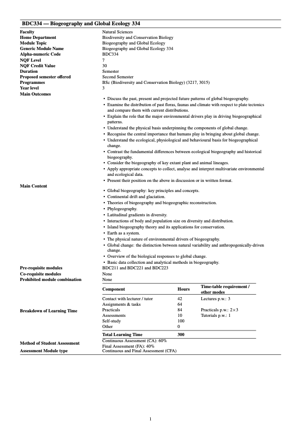

> "*Knowledge is not a resource we simply stumble upon. It’s not something that we pluck out of the air. Knowledge is created. It is coaxed into existence by thoughtful, creative people. It is not a free good. It comes only to the prepared mind.*"
>
> --- Frank H. T. Rhodes, Speed Bumps on the Road Ahead, Trusteeship, May/June 1999

::: {.my-highlight}
Welcome to Term 3 of BDC334 Biogeography & Global Ecology. This page provides the syllabus and teaching policies for the module, and it serves is a starting point for the theory, instruction, and access to the data you'll use in the module's Labs.
:::

## Module Descriptor

This is the Faculty Handbook entry for the module:


<!-- {width=900} -->

## Timetable

My part of the BDC334 module runs in Term 3, from Wednesday, 19 August to Thursday, 1 October 2026.

### Lecture timetable

| Day       | Periods                   | Location            | Notes                                      |
|-----------|---------------------------|---------------------|--------------------------------------------|
| Monday    | 3rd period (10:20--11:05) | 5th Floor BCB Dept. | Lecture from 24 August                     |
| Tuesday   | 2nd period (09:25--10:10) | 5th Floor BCB Dept. | Lecture from 25 August                     |
| Wednesday | 1st period (08:30--09:15) | 5th Floor BCB Dept. | Lecture on 19 August; thereafter by request |

[Below](@sec-syllabus), you are provided with reading material (lecture slides and PDFs) that you are expected to work through before the relevant class. The face-to-face sessions are essential for discussing this material and asking questions. We can talk about anything related to the topic of biodiversity but will try to focus on the issues at hand.

After the opening lecture on Wednesday, 19 August, lectures will ordinarily take place on Mondays and Tuesdays. All subsequent Wednesday lecture periods during Term 3 will be available on request only.

[We will all meet in person on campus for the first lecture on Wednesday, 19 August.]{.my-highlight} I will give an outline of my portion of the module. Prof Boatwright will take over in Term 4.

### Labs

| Day                     | Periods             | Location           | Notes                                      |
|-------------------------|---------------------|--------------------|--------------------------------------------|
| Thursday, 20 August     | Periods 6-8         | 5th Floor BCB Dept | Lab 0: lecture on AI; nothing to submit    |
| Mondays from 24 August  | Periods 6-8         | 5th Floor BCB Dept | Lab 1 and all subsequent Lab sessions      |

The first Lab session, Lab 0, takes place on Thursday, 20 August during Periods 6-8 (starting at 13:30). It will be a lecture on AI and has no submission. Lab 1 takes place on Monday, 24 August, and the remaining Lab sessions take place on successive Mondays during Periods 6-8 in the 5th-floor computer lab in the Biodiversity and Conservation Biology Department.

Labs are compulsory, and failing to attend will result in a penalty of 20% taken from your mark for the week.

Please ensure that you read through each Lab (accessible in the sidebar) before the start of the session. Each Lab submission is due at 08:00 on the following Monday, giving you approximately one week to complete the work. Lab 0 has no submission.

### Class tests

There will be two class tests:

- Thursday, 10 September 2026, 13:30--15:30
- Thursday, 1 October 2026, 13:30--15:30

## Instructor and Lab Assistant

Term 3 of BDC334 is taught by me, Professor AJ Smit. You may find me in Office 4.103 in the BCB Department (4th floor). You'll receive an introductory email from me, and you are welcome to contact me at that email address with questions or concerns. Please also use the WhatsApp group set up for this module to ask questions and share information.

The Lab Assistant for Term 3 is Ms. Siphe Kumalo. She will be available in the Lab during the Lab periods to assist you with any questions you may have.

## Syllabus, Overview, and Expectations

### Syllabus {#sec-syllabus}

These links point to online resources such as publications, lecture slides, example workflows, datasets, and R scripts. Various PDFs for reading can also be found on iKamva. It is essential that you work through these examples and workflows.

For best results, use the [BDC334 Lecture Transcript](BDC334-Lecture-Transcripts.qmd), which integrates most of the materials linked to in the table below.

| Wk | Type  | Topic                                                                                   | Additional Reading                                 | Class/Lab       | Exercise Due       |
|----|-------|-----------------------------------------------------------------------------------------|----------------------------------------------------|-----------------|--------------------|
| W1 | L     | **[Lecture 1. Introductory Lecture](Lec-01-introduction.qmd)**                          |                                                    | Wed 19 Aug      |                    |
|    | P0    | **Lab 0. Lecture on AI**                                                                |                                                    | Thu 20 Aug      | No submission      |
| W2 | L     | **[Lecture 2. Overview of Ecosystems](Lec-02-ecosystems.qmd)**                          | Lecture Transcript; PDF Slides on iKamva           | Mon 24 Aug      |                    |
|    | L     | Keith et al. (2012)                                                                     | [Reading](../docs/Keith_et_al_2012.pdf)            |                 |                    |
|    | P1    | **[Lab 1. Ecological Data](Lab-01-introduction.qmd)**                                   | Lecture Transcript; PDF Slides on iKamva           | Mon 24 Aug      | Mon 31 Aug, 08:00  |
|    | L     | **[Lecture 3. Ecological Gradients](Lec-03-gradients.qmd)**                             | Lecture Transcript; PDF Slides on iKamva           | Tue 25 Aug      |                    |
|    | L     | Nekola and White (1999)                                                                 | [Reading](../docs/Nekola_and_White_1999.pdf)       |                 |                    |
|    | L     | Smit et al. (2017)                                                                      | [Reading](../docs/Smit_et_al_2017.pdf)             |                 |                    |
| W3 | L     | **[Lecture 4. Biodiversity Concepts](Lec-04-biodiversity.qmd)**                         | Lecture Transcript; PDF Slides on iKamva           | Mon 31 Aug      |                    |
|    | L     | Tittensor et al. (2010)                                                                 | [Reading](../docs/Tittensor_et_al_2010.pdf)        |                 |                    |
|    | P2a   | **[Lab 2a. R & RStudio](Lab-02a-r_rstudio.qmd)**                                        |                                                    | Mon 31 Aug      | Mon 7 Sep, 08:00   |
|    | L     | **[Lecture 5. Biodiversity Concepts (continued)](Lec-04-biodiversity.qmd)**              | Lecture Transcript; PDF Slides on iKamva           | Tue 1 Sep       |                    |
| W4 | L     | **[Lecture 6. Unified Ecology](Lec-06-unified-ecology.qmd)**                            | Lecture Transcript; PDF Slides on iKamva           | Mon 7 Sep       |                    |
|    | L     | Shade et al. (2018)                                                                     | [Reading](../docs/Shade_et_al_2018.pdf)            |                 |                    |
|    | P2b   | **[Lab 2b. Environmental Distance](Lab-02b-env_dist.qmd)**                              |                                                    | Mon 7 Sep       | Mon 14 Sep, 08:00  |
|    | L     | **Lecture 7. Impacts on Biodiversity**                                                  |                                                    | Tue 8 Sep       |                    |
|    | L     | Chapin III et al. (2000)                                                                | [Reading](../docs/Chapin_III_et_al_2000.pdf)       |                 |                    |
|    | L     | Maxwell et al. (2016)                                                                   | [Reading](../docs/Maxwell_et_al_2016.pdf)          |                 |                    |
|    | L     | Tilman et al. (2017)                                                                    | [Reading](../docs/Tilman_et_al_2017.pdf)           |                 |                    |
|    | T1    | [Class Test 1]{.my-highlight}                                                           |                                                    | Thu 10 Sep, 13:30--15:30 |          |
| W5 | L     | **Lecture 8. Nature’s Contribution to People**                                          |                                                    | Mon 14 Sep      |                    |
|    | L     | Richardson et al. (2023)                                                                | [Reading](../docs/Richardson_et_al_2023.pdf)       |                 |                    |
|    | L     | Costanza et al. (1997)                                                                  | [Reading](../docs/Costanza_et_al_1997.pdf)         |                 |                    |
|    | L     | Costanza et al. (2014)                                                                  | [Reading](../docs/Costanza_et_al_2014.pdf)         |                 |                    |
|    | L     | Burger et al. (2012)                                                                    | [Reading](../docs/Burger_et_al_2012.pdf)           |                 |                    |
|    | P3    | **[Lab 3. Quantifying Biodiversity](Lab-03-biodiversity.qmd)**                          | Lecture Transcript; PDF Slides on iKamva           | Mon 14 Sep      | Mon 21 Sep, 08:00  |
| W6 | L     | **Revision**                                                                            |                                                    | 21-25 Sep       |                    |
|    | P4    | **[Lab 4. Species Distribution Patterns](Lab-04-biodiversity.qmd)**                     | [Slides](../slides/BDC334_5_structure.pdf)         | Mon 21 Sep      | Mon 28 Sep, 08:00  |
| W7 | L     | **Revision**                                                                            |                                                    | 28 Sep-1 Oct    |                    |
|    | P5    | [Worksheet Completion (Prac Assessment)]{.my-highlight}                                 | [Assessment](assessments/Prac_assessment_2025.qmd) | Mon 28 Sep      | To be confirmed    |
|    | T2    | [Class Test 2]{.my-highlight}                                                           |                                                    | Thu 1 Oct, 13:30--15:30 |           |

### Reading in support of the syllabus
In the table above, there are links to several key papers to read in preparation for each week's theory. You must read these papers.

I cite many other references in each chapter. These serve several functions in that they:

* add additional theory relevant to some ecological concepts;
* provide background to some of the datasets used in my examples;
* discuss derivations of some equations used to calculate diversity concepts;
* provide example walkthroughs of some of the computational aspects of the methods covered in the Labs;
* collectively supplement the discussion about these concepts covered in the lectures.

Actively engaging with these reading materials will make the difference between a 60% average mark for the module and a mark in excess of 80%.

## Graduate Attributes

The [**graduate attributes**](../pages/graduate_attributes.qmd) resulting from completion of this modules alignment with the expectations of the workspace across diverse organisations and institutions where graduates typically find employment.

## Module Resources on iKamva

All the lecture material for this module is on iKamva. You will find there the following under Module Resources:

- **Interactive Sessions**---These are screen recordings belonging to previous years’ teaching where I address some class questions. They might be interesting or helpful.
- **PDF_Reading**---The bulk of the learning in this module will come from reading the assigned papers carefully. My role is to help you interpret and connect them, not to replace them.
- **Slides**---Some meagre slides to accompany your learning process... for what it’s worth.

## Computer Access

You are encouraged to provide your own laptops and install the necessary software before the module starts. Limited support can be provided if required. There are also computers with R and RStudio (and the essential add-on libraries) available in the 5th-floor lab in the BCB Department.

## Attendance
### Labs

These Labs are hands-on. They can only deliver acceptable outcomes if you attend all Lab sessions. Sometimes an occasional absence cannot be avoided. Still, you need to provide evidence (affidavit, doctor's note, or death certificate) for why you did not attend to avoid a non-attendance penalty. Please be courteous and notify the tutor or me before any absence. If you work with a partner in class, inform them too. Keep up with the reading assignments while you are away, and we will all work with you to get you back up to speed on what you miss. If you do miss a class, however, the assignments must still be submitted on time (also see [Late submission of CA](BDC334_syllabus.html#late-submission-of-ca)).

Since you may decide to work in collaboration with a peer on tasks and assignments, please keep this person informed at all times in case some emergency makes you unavailable for some time. Someone might depend on your input and contributions---do not leave someone in the lurch so that they cannot complete a task in your absence.

### General considerations
The schedule is set and will not be changed. Sometimes an occasional absence cannot be avoided. Please be courteous and notify the tutor or me before any absence. If you work with a partner in class, inform them too. Keep up with the reading assignments while you are away, and we will all work with you to get you back up to speed on what you miss. However, if you miss a class, the assignments must still be submitted on time (also see ‘Late submissions’ below).

Since you may decide to work in collaboration with a peer on tasks and assignments, please keep this person informed at all times in case some emergency makes you unavailable for some time. Someone might depend on your input and contributions—do not leave someone in the lurch so they cannot complete a task in your absence.

## Assessment {#sec-policy}
The syllabus for Term 3 is comprised of the following mark-carrying components for Continuous Assessment (CA):

- **Assignment:** 30%
- **Practical:** 25%
- **Test:** 30%
- **Quiz:** 15%

The CA and an exam will provide a final mark for the module. The weighting of the CA and the exam is 0.6 and 0.4, respectively. Class Test 1 takes place on Thursday, 10 September 2026, and Class Test 2 takes place on Thursday, 1 October 2026. Both tests run from 13:30 to 15:30.

## Late Submission of CA
Late assignments will be penalised 10% per day late. They will not be accepted more than 48 hours late unless evidence such as a doctor's note, a death certificate or another documented emergency can be provided. If you know a submission will be late, please discuss this and seek prior approval. Class time is allocated to work on assignments, and students are expected to continue working on the projects outside class. Successfully completing (and passing) this module requires that you finish tasks based on what we have covered in the module by the following class period. Work diligently from the onset so that even if something unexpected happens at the last minute, you should already be close to done. This approach also allows rapid feedback to be provided to you, which can only be accomplished by returning assignments quickly and punctually.

## Support
It’s expected that some tricky aspects of the module will take time to master, and the best way to master problematic material is to practice, practice some more, and then ask questions. Trying for 10 minutes and then giving up is not good enough. I’ll be more sympathetic to your cause if you can demonstrate having tried for a full day before giving up and asking me. When you ask questions about some challenges, this is the way to do it—explain to me your numerous attempts to solve the problem and how these various attempts have failed. I will not help you if you have not tried to help yourself first (maybe with advice from friends). There will be a time in class to do this, typically before we embark on a new topic.

Should you require more time with me, find out when I am ‘free’ and set an appointment by sending me a calendar invitation. I am happy to have a personal meeting with you via Zoom, but I prefer face-to-face in my office.

## Communication

*Ad-hoc* communication is encouraged. Subscribe to the [BDC334 WhatsApp group](https://chat.whatsapp.com/JCR8DHKVY880KxXJ5E0zKO) to openly discuss module content.

## Advice for Success
Your success on this module depends very much on you and the effort you put into it. The module has been organised so that the burden of learning is on you, mainly by reading scientific publications on the week's lecture topics. Your TAs and I will help you by providing you with materials and answering questions, and setting a pace, but for this to work you must do the following:

* Complete all the preparation work before class. This includes reading and working through the lecture slides.
* Ask questions. Engage with your peers and me. In a class or away from it. Use the WhatsApp group set up for this module and the comments section on the website. Surround yourself with people who are brighter than you, and make your conversations about ideas, not people and things. If you get a question wrong on an assessment, ask why. If you're not sure about the Lab assignments, ask. If you hear something on the news that sounds related to what we discussed, raise it as a topic for discussion in class. If the reading is confusing, ask.
* Do all assignments and Labs, attend, and don't be late. The earlier you start, the better. You should ask yourself how these exercises relate to earlier material and imagine how they might be changed (to make questions for an exam, for example.) It's not enough to just mechanically plough through the exercises.
* To learn how to translate your human thoughts into computer language (coding), you should work with computer and R multiple times each week---ideally daily. 
* Don't procrastinate. If something is confusing to you in Week 2, Week 3 will become more confusing, Week 4 even worse, and eventually, you won't know where to begin asking questions. Don't end a week with unanswered questions. But if you fall behind and don't know where to start asking, come to my office, and let me help you identify a good (re)starting point.
