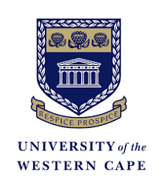
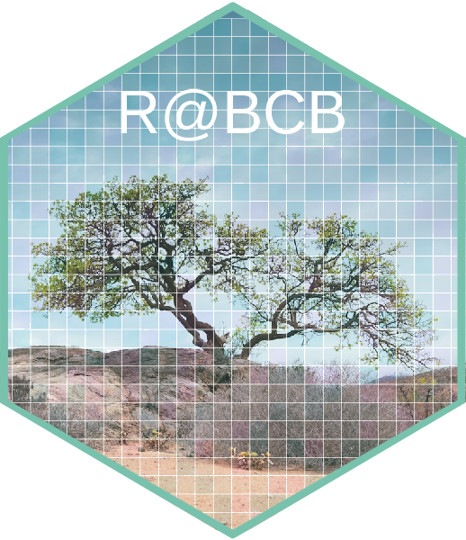

::: {.column-margin}
{height=120px}
:::

::: {.tb-hero}
{.tb-logo}

::: {.tb-hero-text}
[University of the Western Cape · Biodiversity & Conservation Biology]{.tb-eyebrow}

# The Tangled Bank {.tb-hero-title}

[Teaching material by Professor [AJ Smit](https://www.uwc.ac.za/study/all-areas-of-study/departments/department-of-biodiversity-and-conservation-biology/people), all built around [R](https://cran.r-project.org/) and real ecological and Earth-system data.]{.tb-lede}
:::
:::

  <a class="tb-card" href="BDC223/BDC223_index.qmd">
    BDC223 · Undergraduate
    Plant Ecophysiology
    How plants sense and respond to light, carbon, nutrients, and stress.
    Enter course →
  </a>
  <a class="tb-card" href="BDC334/BDC334_index.qmd">
    BDC334 · Undergraduate
    Biogeography &amp; Global Ecology
    Gradients, biodiversity, and the processes that arrange life across the planet.
    Enter course →
  </a>
  <a class="tb-card" href="BCB744/BCB744_index.qmd">
    BCB744 · Honours core
    Intro to R &amp; Biostatistics
    From first principles in R to inference, regression, and reproducible analysis.
    Enter course →
  </a>
  <a class="tb-card" href="BCB743/BCB743_index.qmd">
    BCB743 · Honours elective
    Quantitative Ecology
    Correlation, ordination, and the multivariate analysis of community data.
    Enter course →
  </a>

Alongside the taught modules there are vignettes collecting R techniques gathered over the years, including worked examples for analysing oceanographic and Earth-system datasets.

::: {.tb-banner-figure}

:::

::: {.tb-epigraph}
"It is interesting to contemplate **a tangled bank**, clothed with many plants of many kinds, with birds singing on the bushes, with various insects flitting about, and with worms crawling through the damp earth, and to reflect that these elaborately constructed forms, so different from each other, and dependent upon each other in so complex a manner, have all been produced by laws acting around us. These laws, taken in the largest sense, being Growth with reproduction; Inheritance which is almost implied by reproduction; Variability from the indirect and direct action of the conditions of life, and from use and disuse; a Ratio of Increase so high as to lead to a Struggle for Life, and as a consequence to Natural Selection, entailing Divergence of Character and the Extinction of less improved forms. Thus, from the war of nature, from famine and death, the most exalted object which we are capable of conceiving, namely, the production of the higher animals, directly follows."

[Charles Darwin, *On the Origin of Species*, 1859]{.tb-epigraph-cite}
:::
